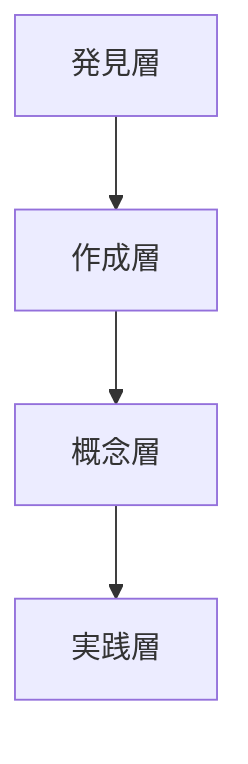

# 図表ディレクトリ

このディレクトリには、チュートリアルで使用する図表データを格納します。

## 図表一覧（予定）

| 図表名 | 説明 | 使用セクション |
|-------|------|--------------|
| 4-layer-structure.png | 4層構造の全体図 | 0-1 |
| skill-creator-flow.png | Skill Creator の対話フロー | 1-1 |
| gstack-layers.png | GStack のレイヤー構成 | 3-2 |
| problem-skill-matrix.png | 問題×スキル解決マトリックス | 3-4 |
| pipeline-patterns.png | パイプライン基本パターン | 5-1 |
| evaluation-cycle.png | 評価改善サイクル | 5-3 |

## 作成方法

各図表は以下のツールで作成予定です：

- **Mermaid**: Markdown 内のコードブロックで記述
- **draw.io**: 複雑な図表
- **Excalidraw**: ラフな概念図

### Mermaid 記述例

## ファイル形式

- PNG: 最終的な埋め込み用
- SVG: 編集可能なベクター形式
- ソースファイル: draw.io (.drawio) または Excalidraw (.excalidraw)
