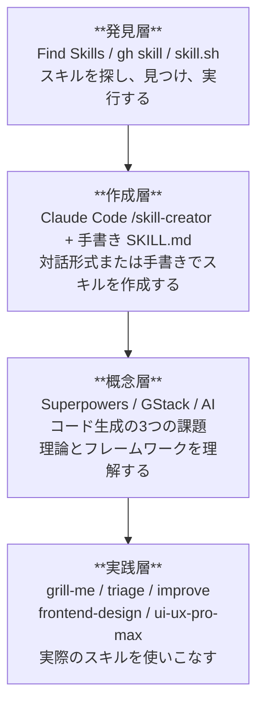

# Agent Skills エコシステムの全体像

> **学習時間**: 10分 | **難易度**: ⭐

## 概要

このチュートリアルは、**Agent Skills オープンスタンダード**（`agentskills.io`）に基づくスキル開発を学ぶ学習教材です。**Claude Code**（Anthropic）と **GitHub Copilot**（GitHub/Microsoft）の両方で使えるスキルを、実践的に習得します。

### 学習目標

- Agent Skills エコシステムの全体像を理解する
- 4層構造の各層の役割を説明できる
- Claude Code と GitHub Copilot のスキル対応の違いを説明できる
- このチュートリアルの学習の流れを把握する

## 4層構造

この教材は以下の4層で構成されています：

### 発見層（Find Skills / gh skill / skill.sh）

GitHub エコシステム上で公開されているスキルを検索・発見するための機能です。GitHub.com 上の Find Skills 機能、`gh skill` CLI コマンド、そして skill.sh を使って、必要なスキルを素早く見つけることができます。

### 作成層（Claude Code /skill-creator + 手書き SKILL.md）

スキルを作成する方法は2つあります：

1. **Claude Code の `/skill-creator`**: 対話形式でスキルを生成。ベストプラクティスに従った SKILL.md を自動生成し、テスト・評価・改善のサイクルを提供します。
2. **手書き SKILL.md**: テキストエディタで直接 SKILL.md を作成。両プラットフォームで共通のフォーマットです。

### 概念層（Superpowers / GStack / フロントエンド開発の3つの課題）

スキルを効果的に活用するための理論的基盤です。ここでいう「フロントエンド開発の3つの課題」は、AIコード生成を使ってフロントエンド開発を進める際によく起きる3つの典型的な課題を指します。具体的には、理解のずれ・実行失敗・構造の問題です。

- **Superpowers**: Jesse Vincent 氏開発のコーディングエージェント向けプラグイン。開発プロセス全体の方法論を提供
- **GStack**: Generative AI Stack におけるスキルの位置づけ
- **フロントエンド開発の3つの課題**: AIコード生成における具体的な課題認識。後の章では「理解のずれ」「実行失敗」「構造の問題」として解説します

### 実践層（8つの実践スキル）

この教材のメインコンテンツです。フロントエンド開発に特化した8つの実践スキルを学びます：

| スキル          | カテゴリ         | 用途           |
| --------------- | ---------------- | -------------- |
| grill-me        | 品質検証         | コードレビュー |
| triage          | 優先順位付け     | Issue分析      |
| improve         | リファクタリング | コード改善     |
| frontend-design | アーキテクチャ   | 設計支援       |
| ui-ux-pro-max   | デザイン改善     | UI/UX最適化    |

## 2つのプラットフォーム比較

| 観点                           | Claude Code (Anthropic)                   | GitHub Copilot (GitHub)               |
| ------------------------------ | ----------------------------------------- | ------------------------------------- |
| **スキル配置場所**       | `.claude/skills/<name>/SKILL.md`        | `.github/skills/<name>/SKILL.md`    |
| **個人用スキル**         | `~/.claude/skills/<name>/SKILL.md`      | `~/.copilot/skills/<name>/SKILL.md`（要確認）|
| **対話生成**             | `/skill-creator`（バンドルスキル）      | なし（手書きが基本）                  |
| **CLI検索**              | なし（手動配置）                          | `gh skill` コマンド                 |
| **バンドルスキル**       | `/code-review`, `/debug`, `/run` 等 | なし                                  |
| **動的コンテキスト注入** | `!` コマンド構文で対応                  | なし                                  |
| **サブエージェント実行** | 対応                                      | 対応（一部）                          |

## 学習の流れ

各 Part は基本的に独立していますが、Part 5（実践スキル）を最大限活用するには Part 2（スキル作成入門）を先に学ぶことを推奨します。

## 既存リポジトリとの差別化

| 観点               | github-copilot-skills-tutorial | 本教材                                                    |
| ------------------ | ------------------------------ | --------------------------------------------------------- |
| フォーカス         | Agent Skills 全般              | **クロスプラットフォーム**（Claude Code + Copilot） |
| スキル生成         | SKILL.md/JSONを手書き          | **Claude Code `/skill-creator`** + 手書き         |
| サンプルスキル     | 汎用的                         | **フロントエンド特化**                              |
| 問題認識           | なし                           | **フロントエンド開発の3つの課題** からスタート |
| 概念フレームワーク | なし                           | **Superpowers / GStack** を解説                     |

## 次のステップ

→ [1-2: 環境セットアップ](02-environment-setup.md) に進む
