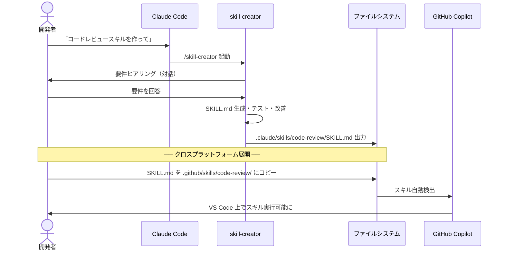

# 1-2: skill-creator で最初のスキルを作る

> **学習時間**: 20分 | **難易度**: ⭐⭐

## 概要

このハンズオンでは、Claude Code にバンドルされている **skill-creator** スキルを使って、実際にスキルを作成します。skill-creator は [anthropics/skills](https://github.com/anthropics/skills/tree/main/skills/skill-creator) リポジトリで公開されている本格的なスキル開発フレームワークです。

## ハンズオン: コードレビュースキルを作成する

### ステップ1: Claude Code を起動

```bash
# プロジェクトのルートで Claude Code を起動
cd your-project
claude
```

### ステップ2: skill-creator を呼び出す

Claude Code セッション内で以下のように入力します：

```
/skill-creator
```

または自然言語で直接依頼します：

```
コードレビュースキルを作成して
```

### ステップ3: skill-creator との対話

skill-creator が以下のような質問をしてくるので、順に回答します：

```
Claude: どんなスキルを作りましょうか？
以下の点を教えてください：
1. このスキルに何をさせたいですか？
2. どのようなタイミングで発動すべきですか？
3. 出力形式の希望はありますか？
4. テストケースは必要ですか？
```

**あなたの回答例**:
```
1. コードを可読性・パフォーマンス・セキュリティの3観点でレビューするスキル
2. プルリクエストのレビュー時や「このコードをレビューして」と言われたとき
3. JSON形式で、全体スコアと各観点のスコア、問題リストを含めて
4. はい、テストケースもお願いします
```

### ステップ4: SKILL.md の生成

skill-creator が SKILL.md のドラフトを生成します：

```
Claude: SKILL.md のドラフトを作成しました。
以下が生成された内容です：

---
name: code-review
description: コードを可読性・パフォーマンス・セキュリティの3観点でレビューし、JSON形式で結果を返します。プルリクエストのレビュー時や「コードをレビューして」という依頼があった場合に発動します。
---

# Code Review

## 概要
このスキルはコードを3つの観点でレビューし、JSON形式で結果を返します。

## 手順
1. レビュー対象のコードを分析する
2. 以下の観点で評価する：
   - 可読性: 命名、コメント、コード構造
   - パフォーマンス: 不要な処理、メモ化の機会
   - セキュリティ: インジェクション、認証の抜け
3. 各問題に重要度（critical/major/minor）を付ける
4. JSON形式で結果を出力する

## 出力形式
```json
{
  "summary": {
    "total_issues": 5,
    "overall_score": 72
  },
  "categories": {
    "readability": { "score": 80, "issues": [] },
    "performance": { "score": 65, "issues": [] },
    "security": { "score": 90, "issues": [] }
  }
}
```

この内容でよろしいですか？修正があれば教えてください。
```

### ステップ5: テストケースの実行

SKILL.md に問題がなければ、skill-creator がテストケースを生成し、並列実行します：

```
Claude: 以下の3つのテストケースを実行します：
1. シンプルな関数のレビュー
2. Reactコンポーネントのレビュー
3. セキュリティ問題を含むコードのレビュー

with-skill と baseline（スキルなし）の両方を同時に実行します...
```

実行が完了すると、評価ビューアがブラウザで開き、結果を確認できます：

```
Claude: 結果をブラウザで開きました。
「Outputs」タブで各テストケースの出力を確認できます。
「Benchmark」タブで定量的な比較結果を確認できます。
確認が終わったら教えてください。
```

### ステップ6: フィードバックと反復改善

結果を確認し、改善点があれば伝えます：

```
あなた: セキュリティの観点がもう少し詳細だと良いです。
具体的な脆弱性パターン（XSS, CSRF, SQLインジェクション）を
チェックするようにしてください。
```

skill-creator が SKILL.md を改善し、再度テストを実行します：

```
Claude: SKILL.md を更新しました。セキュリティ観点に
具体的な脆弱性パターンを追加しました。
再度テストを実行します...
```

このループを、満足する結果が得られるまで繰り返します。

### ステップ7: Description の最適化（オプション）

スキルが完成したら、Description の最適化を依頼できます：

```
あなた: description を最適化して
```

skill-creator が20個のトリガーテストクエリ（発動すべきケース8-10個 + 発動すべきでないケース8-10個）を生成し、自動最適化を実行します。

### ステップ8: パッケージング

最終的に、スキルを `.skill` ファイルとしてパッケージ化できます：

```
あなた: パッケージ化して
```

```bash
# skill-creator が以下のコマンドを実行
python -m scripts.package_skill .claude/skills/code-review/
# → code-review.skill が生成される
```

## skill-creator の活用範囲

| 目的 | 使うコマンド |
|------|------------|
| コードレビュースキルを作成する | `/skill-creator` |
| Issue分析スキルを作成する | `/skill-creator` |
| 既存のスキルを改善する | `/skill-creator` |
| スキルのトリガー精度を最適化する | `/skill-creator` |

## よくある失敗と対策

| 失敗パターン | 原因 | 対策 |
|------------|------|------|
| skill-creator が反応しない | Claude Code のバージョンが古い | `claude --version` で確認、最新にアップデート |
| テストケースが多すぎる | 最初から多くのケースを指定 | 2-3個から始めて、後で追加 |
| 評価ビューアが開かない | ブラウザがない環境 | `--static` フラグでHTMLファイル出力を依頼 |
| スキルが複雑すぎる | 一度に多くの機能を要求 | シンプルに作ってから段階的に拡張 |

### ステップ9: 生成したスキルを GitHub Copilot でも使う

skill-creator で生成した SKILL.md は **Agent Skills オープンスタンダード**に準拠しているため、そのまま GitHub Copilot でも使用できます。以下の手順でコピーするだけです：

```bash
# 1. Claude Code 用に生成されたスキルを確認
ls .claude/skills/code-review/SKILL.md

# 2. GitHub Copilot 用のディレクトリを作成
mkdir -p .github/skills/code-review/

# 3. SKILL.md をコピー
cp .claude/skills/code-review/SKILL.md .github/skills/code-review/SKILL.md
```

以下のシーケンス図が、Claude Code での対話生成から GitHub Copilot での利用までの全体像を示しています：



> **💡 ポイント**: skill-creator は Claude Code 専用のツールですが、**生成された SKILL.md は両プラットフォームで互換性があります**。Claude Code の対話生成力を活かしてスキルを作り、生成物を GitHub Copilot にコピーするのが最も効率的なワークフローです。

## 次のステップ

→ [1-3: SKILL.md のカスタマイズと最適化](03-skillmd-customization.md)


