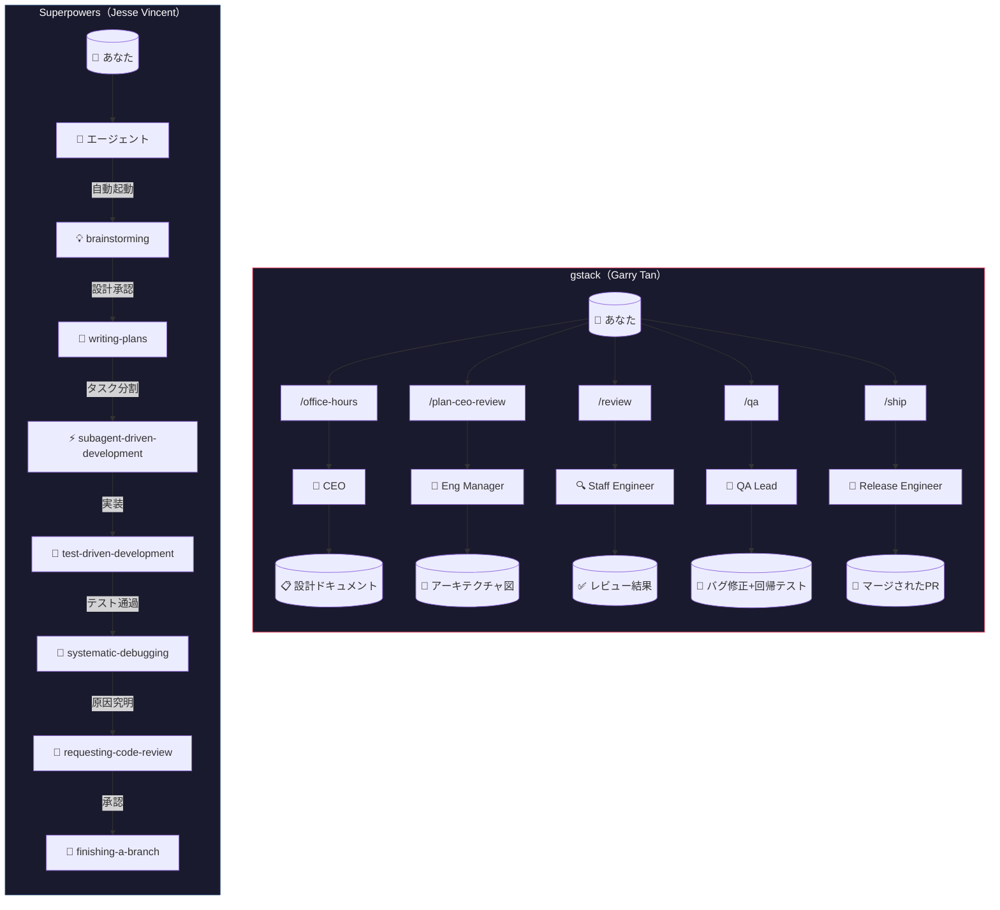
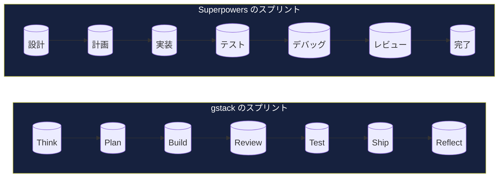
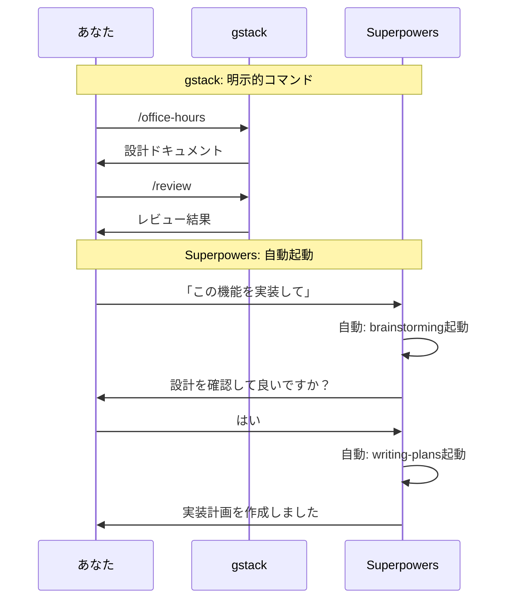

# 3-2: gstack — Garry Tan の Claude Code スキルセット

> **学習時間**: 15分 | **難易度**: ⭐⭐

## 概要

**gstack** は、Y Combinator の President & CEO である **Garry Tan** が開発した、Claude Code 向けの**オープンソーススキルセット**です。

- **リポジトリ**: [github.com/garrytan/gstack](https://github.com/garrytan/gstack)
- **ライセンス**: MIT
- **スター数**: 109,000+（2026年6月時点）
- **構成**: 23の専門家ロールスキル + 8のパワーツール

gstack は Claude Code を「1人のコーディングアシスタント」から「**仮想的なエンジニアリングチーム**」に変えます。CEO、エンジニアリングマネージャー、デザイナー、QAリード、セキュリティオフィサー、リリースエンジニア — それぞれの役割をスキルとして定義し、スラッシュコマンドで呼び出せるようにしたものです。

> 「私は2013年12月以来、おそらく一行もコードをタイプしていない。これは極めて大きな変化だ」 — Andrej Karpathy（OpenAI共同創業者）

## 背景：単一AIアシスタント問題

従来のAIコーディングツールには「**単一AIアシスタント問題**」がありました。1つのAIエージェントに全てを任せると：

| 問題 | 内容 |
|------|------|
| **役割の混在** | CEOの判断、エンジニアの実装、QAの検証を同じAIがやる |
| **コンテキストの欠落** | 設計の意図を確認せずにコードを書き始める |
| **品質のばらつき** | コードレビューやセキュリティ監査が行われない |
| **属人性** | 個人のプロンプト術に依存し、チームで共有できない |

gstack はこの問題を**役割分担**で解決します。各スキルが特定の役割（CEO、EM、QA、Release Manager など）を担い、スプリントの流れに沿って連携します。

## Garry Tan の実績

Garry Tan は YC の CEO としてフルタイムで働きながら、gstack を使って以下の成果を上げています：

| 指標 | 数値 |
|------|------|
| **期間** | 60日間 |
| **出荷したプロダクションサービス** | 3 |
| **出荷した機能** | 40+ |
| **論理コード生産量（2013年比）** | **810倍** |
| **2026年の貢献数** | 1,237（2026年4月時点） |
| **総コード行数** | 600K+ 行 |
| **テストカバレッジ向上** | 35% |

> 「LOC（コード行数）批判は、AIで行数が水増しされるという点では間違っていない。しかし、インフレ調整後の生産性が落ちているという点では間違っている。私は**大幅に**生産性が上がっている。」 — Garry Tan

## スプリントの流れ

gstack はスプリントの流れに沿って設計されています：

```
Think → Plan → Build → Review → Test → Ship → Reflect
```

各スキルは前のスキルの出力を次のスキルが読み取る形で連携します。`/office-hours` が設計ドキュメントを書き、`/plan-ceo-review` がそれを読み、`/review` がバグを検出し、`/ship` が修正を確認します。

## 全スキル一覧（概要）

gstack は **23の専門家ロールスキル + 8のパワーツール** で構成されています。スプリントの流れに沿って以下のフェーズに分類されます：

| フェーズ | 主要スキル | 役割 |
|---------|-----------|------|
| **Think** | `/office-hours` | YC オフィスアワー — 6つの強制質問でプロダクトを再定義 |
| **Plan** | `/plan-ceo-review`, `/plan-eng-review`, `/plan-design-review`, `/autoplan` | CEO/EM/デザイナーによる多層レビュー |
| **Build** | `/design-shotgun`, `/design-html`, `/spec` | モックアップ生成→本番HTML変換 |
| **Review** | `/review`, `/investigate`, `/codex` | スタッフエンジニアレビュー、デバッグ、セカンドオピニオン |
| **Test** | `/qa`, `/browse`, `/benchmark`, `/cso` | 実ブラウザQA、パフォーマンス計測、セキュリティ監査 |
| **Ship** | `/ship`, `/land-and-deploy`, `/canary` | マージ→デプロイ→本番監視 |
| **Reflect** | `/retro`, `/learn`, `/document-release` | 振り返り、ナレッジ蓄積、ドキュメント更新 |

**パワーツール**: `/careful`（破壊的コマンド警告）, `/freeze`（編集ロック）, `/guard`（両方）, `/pair-agent`（マルチエージェント連携）

**iOS スキル**（v1.43.0.0+）: `/ios-qa`, `/ios-fix`, `/ios-design-review`, `/ios-clean`

> 各スキルの詳細は [github.com/garrytan/gstack](https://github.com/garrytan/gstack) を参照してください。

## 主要スキルの詳細

### `/office-hours` — YC オフィスアワー

gstack のエントリーポイント。コードを書く前に「何を作るべきか」を問い直します。

```
あなた: 毎日のカレンダーブリーフィングアプリを作りたい
Claude: 「『毎日のブリーフィングアプリ』と言いましたが、
        実際にあなたが説明したのはパーソナルチーフオブスタッフAIです」
        [5つの隠れた要件を抽出]
        [4つの前提にチャレンジ]
        [3つの実装アプローチを工数見積もり付きで提案]
        → 設計ドキュメントを自動生成
```

### `/plan-ceo-review` — CEO レビュー

プロダクトの視点から計画をレビュー。4つのモードがあります：

| モード | 説明 |
|--------|------|
| **Expansion** | 「もっと大きく考えよう」— リクエストの裏にある10xプロダクトを探す |
| **Selective Expansion** | 特定の部分だけ拡張 |
| **Hold Scope** | 現状のスコープを維持 |
| **Reduction** | 「これは本当に必要か？」— 削れるものを特定 |

### `/review` — コードレビュー

CIでは見つからない本番環境で壊れるバグを発見します。自動修正可能な問題は自動で修正し、判断が必要なものはフラグを立てます。

### `/qa` — QA テスト

実際のブラウザを起動してアプリをテストします。バグを見つけると：
1. アトミックコミットで修正
2. 回帰テストを自動生成
3. 修正を再検証

### `/careful` / `/freeze` / `/guard` — セーフティ

| コマンド | 機能 |
|---------|------|
| `be careful` | 破壊的コマンドの前に警告 |
| `/freeze` | 編集を1ディレクトリに制限 |
| `/guard` | 両方を同時有効化 |

### `/design-shotgun` → `/design-html` — デザインパイプライン

```
あなたのアイデア
    ↓
/design-shotgun: 4-6種類のモックアップを生成 → ブラウザで比較
    ↓ フィードバック
/design-shotgun: 改善版を再生成（味覚記憶が学習）
    ↓ 承認
/design-html: 本番品質のHTMLに変換（Pretextレイアウト）
```

## インストール方法

### 30秒クイックスタート

Claude Code を開いて以下のコマンドを実行するだけです：

```bash
git clone --single-branch --depth 1 \
  https://github.com/garrytan/gstack.git \
  ~/.claude/skills/gstack \
  && cd ~/.claude/skills/gstack \
  && ./setup
```

**必要条件**: Claude Code, Git, Bun v1.0+, Node.js（Windowsのみ）

### チームモード（推奨）

リポジトリ内で以下のコマンドを実行すると、チーム全員が自動的にgstackを使えるようになります：

```bash
(cd ~/.claude/skills/gstack && ./setup --team) \
  && ~/.claude/skills/gstack/bin/gstack-team-init required \
  && git add .claude/ CLAUDE.md \
  && git commit -m "require gstack for AI-assisted work"
```

### VS Code での利用について

gstack は **Claude Code（ターミナル上のCLI）** を主ターゲットとして設計されています。VS Code 上の環境では、以下のように**使える場所と使えない場所**があります：

```
┌─────────────────────────────────────────────────┐
│                  VS Code                         │
│                                                  │
│  ┌───────────────────┐  ┌───────────────────┐   │
│  │ チャット画面       │  │ 統合ターミナル     │   │
│  │ (Ctrl+I)          │  │                    │   │
│  │                   │  │  $ claude          │   │
│  │  ❌ gstack非対応   │  │  ───────────────  │   │
│  │                   │  │  Claude Code起動    │   │
│  │  @skill-name      │  │  ↓                 │   │
│  │  (Copilot Skills) │  │  /office-hours ✅  │   │
│  │  は使える          │  │  /plan-ceo ✅     │   │
│  └───────────────────┘  │  /review ✅        │   │
│                          │  /qa ✅            │   │
│                          │  /ship ✅          │   │
│                          └───────────────────┘   │
│                                                  │
│  ┌───────────────────┐  ┌───────────────────┐   │
│  │ エージェントモード  │  │ サイドパネル      │   │
│  │ (Ctrl+Shift+I)    │  │ (@Copilot)        │   │
│  │  ❌ gstack非対応   │  │  ❌ gstack非対応   │   │
│  └───────────────────┘  └───────────────────┘   │
└─────────────────────────────────────────────────┘
```

| 環境 | gstack の対応 |
|------|-------------|
| **VS Code 統合ターミナル + Claude Code CLI** | ✅ 対応。ターミナル上で `claude` を起動して使用 |
| **VS Code 統合ターミナル + Cursor CLI** | ✅ 対応。`--host cursor` でインストール |
| **VS Code 統合ターミナル + Codex CLI** | ✅ 対応。`--host codex` でインストール |
| **VS Code Copilot チャット**（`Ctrl+I`） | ❌ 非対応。プラグイン機構がない |
| **VS Code Copilot エージェントモード**（`Ctrl+Shift+I`） | ❌ 非対応 |
| **VS Code サイドパネル**（`@Copilot`） | ❌ 非対応 |

> 💡 **ポイント**: VS Code 上で gstack を使うには、**統合ターミナル**（`` Ctrl+` ``）で Claude Code や Codex CLI を起動し、そのセッション内で gstack のスラッシュコマンドを使用します。VS Code のチャット画面では動作しませんが、ターミナル上の CLI エージェントであれば問題なく利用できます。

### マルチエージェント対応

gstack は Claude Code だけでなく、10種類のAIコーディングエージェントに対応しています：

| エージェント | フラグ |
|------------|--------|
| OpenAI Codex CLI | `--host codex` |
| OpenCode | `--host opencode` |
| Cursor | `--host cursor` |
| Factory Droid | `--host factory` |
| Slate | `--host slate` |
| Kiro | `--host kiro` |
| Hermes | `--host hermes` |
| GBrain (mod) | `--host gbrain` |

## Superpowers との比較

gstack と Superpowers（3-1で学んだJesse Vincentの開発方法論）は、どちらも「スキルによってAIエージェントを強化する」という点で共通しますが、アプローチが異なります。

### アプローチの違い（概念図）



### スプリントの流れの比較



### 起動方式の違い



### 比較表

| 観点 | gstack（Garry Tan） | Superpowers（Jesse Vincent） |
|------|-------------------|------------------------------|
| **目的** | 個人がチームのように出荷する | 開発プロセス全体の方法論を注入する |
| **提供形態** | OSSスキルセット（git clone） | Claude Plugin Marketplace |
| **起動方法** | **明示的**（スラッシュコマンド） | **自動的**（状況に応じて自律起動） |
| **役割モデル** | CEO/EM/QA/Release Managerなど**役割ベース** | brainstorming/writing-plansなど**プロセスベース** |
| **スキル数** | 23 specialists + 8 power tools | 15スキル |
| **カバー範囲** | 設計→実装→レビュー→QA→セキュリティ→デプロイ→振り返り | 設計→実装→テスト→デバッグ→レビュー→Git運用 |
| **特徴** | 役割分担による品質担保、実ブラウザQA、セキュリティ監査 | HARD-GATEによる強制、サブエージェント駆動、TDD強制 |
| **対応エージェント** | Claude Code含む10種類 | Claude Code含む8種類 |
| **ライセンス** | MIT | MIT |

両者は排他的ではなく、**併用も可能**です。Superpowers の「考えてから書く」プロセス設計思想は、gstack の各スキル定義にも応用できます。

## gstack が示すスキル設計の教訓

### 1. 役割分担の重要性

1つのAIに全てを任せるのではなく、**役割ごとにスキルを分離**することで、各タスクに最適なプロンプトとコンテキストを提供できます。

### 2. スプリントの流れに沿った設計

Think → Plan → Build → Review → Test → Ship → Reflect という自然な開発フローに沿ってスキルを配置することで、**何をすべきかが明確**になります。

### 3. 防護機構の組み込み

`/careful`（破壊的コマンドの警告）、`/freeze`（編集範囲の制限）、`/guard`（両方）といった**セーフティネット**を標準装備することで、AIの暴走を防ぎます。

### 4. 実環境での検証

`/browse` や `/qa` による**実際のブラウザ操作**での検証は、AIが生成したコードが実際に動くことを保証します。

### 5. オープンソースによる進化

MITライセンスで公開され、誰でもフォークして自分用にカスタマイズできます。コミュニティによる改善が継続的に行われています。

## 次のステップ

→ [3-3a: frontend-design — フロントエンド設計支援スキル](03-3a-frontend-design.md)
→ [3-3b: ui-ux-pro-max — UI/UX最適化スキル](03-3b-ui-ux-pro-max.md)
