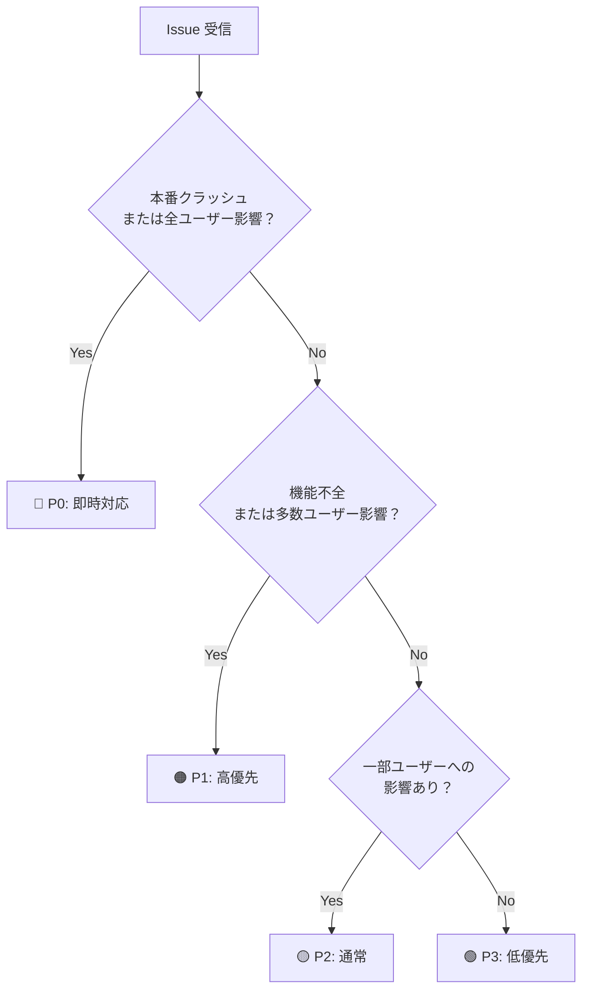

# 4-2: triage — Issue 分析スキル（Matt Pocock）

> **学習時間**: 25分 | **難易度**: ⭐⭐⭐ | **カテゴリ**: 優先順位付け

## このスキルについて

**triage** は Matt Pocock 氏が公開する Issue 分析スキルです。GitHub Issue の内容を解析し、優先度（P0〜P3）の判定、カテゴリ分類、影響範囲の特定、対応推奨事項を自動生成します。

- **出典**: [mattpocock/skills — triage](https://github.com/mattpocock/skills/blob/main/skills/productivity/triage/SKILL.md)
- **用途**: 新規 Issue の自動トリアージ、バックログ整理、スプリント計画の最適化

## こんな状況に刺さる

> 以下のどれかに当てはまったら、このスキルがあなたの問題を解決します。

- **OSSメンテナとして**、週に数十件届くIssueを優先度なしで処理しており、緊急バグへの対応が遅れがちなとき
- **チームリードとして**、スプリント計画でバックログのIssueに優先順位をつける判断基準が属人化しているとき
- **QAエンジニアとして**、バグ報告のIssueに再現手順・環境情報が不足していて毎回追記依頼が必要なとき

## なぜこのスキルが必要か

「このバグ、どれくらい急いで直すべきか」を毎回手作業で判断していませんか？担当者によって優先度の解釈が変わると、対応漏れや重複が起きます。triage は P0〜P3 の判定基準を SKILL.md に明文化し、担当者の経験に依存しない一貫したトリアージを実現します。


## Phase A: SKILL.md を読む

[出典の SKILL.md](https://github.com/mattpocock/skills/blob/main/skills/productivity/triage/SKILL.md) をブラウザで開き、以下の観点で読みます。

### 構造の解析

| 要素 | 確認すること |
|------|------------|
| 優先度（P0〜P3）の定義 | 各レベルの判定基準がどう記述されているか |
| 必須 vs オプション入力 | `issue_title`/`issue_body` と `labels`/`project_context` の使い分け |
| `recommendation` フィールド | 推奨アクション・担当チーム・次のステップの構造 |



### 設計上の注目ポイント

**1. 優先度判定の客観化**
P0〜P3 の基準を SKILL.md に明文化することで、担当者の経験・勘に依存しない判定が可能になる。

**2. `project_context` による柔軟性**
プロジェクト固有の文脈（例: BtoB SaaS では全ユーザー影響は即 P0）を注入できる設計。スキル本体は汎用に保たれている。

**3. 不足情報の自動検出**
再現手順・影響範囲・環境情報が欠けている場合に指摘するロジックが含まれる。

## Phase B: インストールして動かす

### セットアップ

```bash
mkdir -p .claude/skills/triage/
# SKILL.md を GitHub から取得して配置
# 出典: https://github.com/mattpocock/skills/blob/main/skills/productivity/triage/SKILL.md
```

### テスト実行

以下のプロンプトで動作を確認します：

```
/triage
タイトル: 「ログインページで500エラーが発生する」
本文: 本番環境でログインページにアクセスすると Internal Server Error が発生します。
エラーログには「TypeError: Cannot read properties of null」と記録されています。
再現率は100%で、全ユーザーに影響します。
```

**期待される出力のポイント**:

| 項目 | 期待値 |
|------|--------|
| 優先度 | P0（本番クラッシュ・全ユーザー影響） |
| カテゴリ | bug / authentication |
| 影響範囲 | 全ユーザー、severity: high |
| 推奨 | 即時対応、ホットフィックス |

## Phase C: 解析と実行結果の照合

1. P0 判定の根拠として SKILL.md のどの基準が使われたか？
2. `project_context: "BtoC サービス、DAU 10万人"` を追加すると出力はどう変わるか？
3. 情報が少ない Issue（「ログインが遅い」のみ）を入れると、不足情報として何が指摘されるか？

## 設計の意図

### なぜ優先度を4段階にするのか

P0〜P3 の4段階（即時対応・高優先・通常・低優先の4つの対応レベル）にしている。2段階（緊急/通常）では「高優先だが今夜でなくていい」を表現できず、5段階以上では判定基準の境界が曖昧になりやすい。

### なぜ project_context をオプション入力にするのか

スキル本体は汎用ロジックとして保ち、プロジェクト固有の文脈を外から注入するコンテキスト注入パターン（スキルのロジックと文脈を分離し、文脈を呼び出し側から渡す設計方法）を採用している。必須にするとインストール直後に動かず採用率が下がる。

**代替案との比較**:
- `project_context` を必須にする: 精度は上がるが、未入力でエラーになるためハードルが高い
- スキルをプロジェクトごとに複製する: カスタマイズ性は高いが、バグ修正のたびに全コピーを更新する必要がある

### なぜ不足情報の自動検出を含めるのか

再現手順・影響範囲・環境情報が欠けている Issue は精度の高いトリアージができない。不足情報を指摘するロジックを組み込むことで、スキルが「回答者」ではなく「対話のパートナー」として機能し、Issue 報告品質の底上げにも繋がる。

## この SKILL.md から学べる設計パターン

1. **コンテキスト注入による汎用性** — スキル本体は汎用ロジックとして保ち、`project_context` で個別の文脈を外から注入する設計は、1つのスキルを複数プロジェクトで再利用可能にする。スキルを「ロジック」と「文脈」に分離する考え方。
2. **必須/オプション入力の分離** — `issue_title`/`issue_body` を必須、`labels`/`project_context` をオプションにすることで、最低限の情報でも動作しつつ詳細情報があれば精度が上がる。スキルの「エントリーハードル」を下げながら品質も上げる設計。
3. **不足情報の自動検出** — 入力が不十分なときに「何が足りないか」を返す設計は、ユーザーとのやり取りを通じてより良い出力を引き出す。スキルを「完成品」でなく「対話のパートナー」として設計するパターン。

## カスタマイズのヒント

**優先度基準をプロジェクト仕様に合わせる**
P0/P1 の境界線はプロジェクトによって異なります。SKILL.md の判定基準をチームの SLA に合わせて書き換えると、自動トリアージの精度が上がります。

**GitHub Actions との連携**
出力の `category` を GitHub Actions で受け取り、ラベルを自動付与する自動化も可能です。

## この設計を変えるとき

- **優先度段階を変えるとき**: SLA（Service Level Agreement: サービスレベル合意書。応答時間などの品質基準を定めた契約）に「P0 は 30 分以内」などの明示的な基準がある場合、SKILL.md の判定ロジックに SLA の基準を直接転記してよい。段階数も変えてよい。
- **project_context を必須にするとき**: 単一プロジェクト専用スキルとして使う場合、`project_context` をフロントマターに固定値で書き込んでよい。入力漏れを防げる。
- **自動化パイプラインに組み込むとき**: GitHub Actions からトリガーする場合、出力フォーマットを JSON に固定し `recommendation` フィールドのみを取り出すよう SKILL.md を調整してよい。

## 次のステップ

→ [4-3: improve — コード改善スキル](03-improve.md)
→ [4-9: 問題 × スキル解決マッピング](09-problem-skill-mapping.md)
