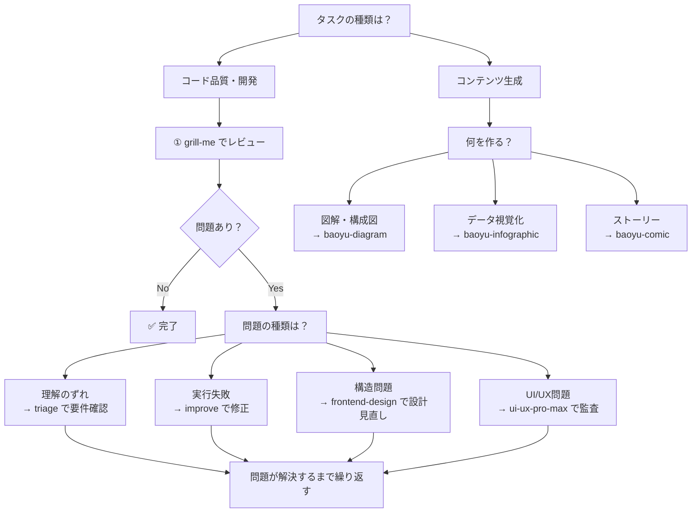

# 5-7: 問題 × スキル解決マッピング

> **学習時間**: 15分 | **難易度**: ⭐⭐

## 概要

生成AIコード生成・コンテンツ生成の問題を、このチュートリアルで学ぶスキルでどのように解決するかを整理します。問題とスキルの対応関係を理解することで、適切なスキルを適切な場面で使えるようになります。

## なぜ「問題 × スキル」のマッピングが必要か

スキルを個別に学んだだけでは、実際の場面でどれを使うべきか迷います。「このコードが遅い → どのスキルを使う？」という判断を即座にできるようになることが、スキルを「知っている」から「使える」への移行です。

## このドキュメントで扱うスキル

各スキルの概要を先に把握しておくと、マッピングの意図が理解しやすくなります。

| スキル | カテゴリ | 概要 | 詳細 |
|-------|---------|------|------|
| **grill-me** | 品質検証 | コードを「可読性・パフォーマンス・セキュリティ・保守性」の4軸でレビューする | [5-1](01-grill-me.md) |
| **triage** | 優先順位付け | GitHub Issue を解析し、優先度（P0〜P3）の判定・カテゴリ分類・対応推奨事項を自動生成する | [5-2](02-triage-issue-analysis.md) |
| **improve** | リファクタリング | コードのパフォーマンス最適化・リファクタリング・モダナイゼーションの改善提案を行う | [5-3](03-improve.md) |
| **frontend-design** | 設計支援 | フロントエンドのコンポーネント分割・状態管理・データフローをガイドする | [4-4](../04-frameworks/04-frontend-design.md) |
| **ui-ux-pro-max** | UI/UX監査 | アクセシビリティ・視認性・操作性を多角的に監査する | [4-5](../04-frameworks/05-ui-ux-pro-max.md) |
| **baoyu-diagram** | 図解生成 | アーキテクチャ図・フロー図をSVGで生成する | [5-4](04-baoyu-diagram.md) |
| **baoyu-infographic** | 視覚化 | データや概念を21レイアウト×17スタイルのインフォグラフィックで整理する | [5-5](05-baoyu-infographic.md) |
| **baoyu-comic** | コンテンツ制作 | 技術概念をコミック形式でわかりやすく伝える | [5-6](06-baoyu-comic.md) |

## 問題 × スキル解決マトリックス

| 問題 | 該当スキル | 解決アプローチ |
|------|-----------|--------------|
| 理解のずれ | **grill-me**, **triage** | コードレビューで意図との一致を確認、Issue分析で要件を明確化 |
| 実行失敗 | **grill-me**, **improve** | コードレビューでバグを発見、改善提案で修正 |
| 構造の問題 | **frontend-design**, **improve** | 設計支援でアーキテクチャを改善、リファクタリング提案 |
| UI/UX品質 | **ui-ux-pro-max** | アクセシビリティ・視認性・操作性を総合的に監査 |
| ビジュアルコンテンツ生成 | **baoyu-diagram**, **baoyu-infographic**, **baoyu-comic** | 図解・インフォグラフィック・コミックで概念を視覚的に表現 |

## 詳細マッピング

### 問題1: 理解のずれ → grill-me + triage

```
問題: AIが生成したコードが意図とずれている
    ↓
grill-me: コードレビューで意図との一致を確認
  - 可読性レビューで命名やコメントをチェック
  - 仕様とコードの乖離を検出
    ↓
triage: Issue 分析で要件を明確化
  - Issue の内容を分析して要件を整理
  - 不足している情報を特定
```

### 問題2: 実行失敗 → grill-me + improve

```
問題: AIが生成したコードが実行時にエラー
    ↓
grill-me: コードレビューで潜在的なバグを発見
  - セキュリティレビューで脆弱性をチェック
  - パフォーマンスレビューで非効率を検出
    ↓
improve: 改善提案でコードを修正
  - エラーハンドリングの追加
  - エッジケースへの対応
```

### 問題3: 構造の問題 → frontend-design + improve

```
問題: 長期的に保守困難なコード
    ↓
frontend-design: アーキテクチャ設計を支援
  - 適切なコンポーネント分割
  - 状態管理戦略の設計
  - データフローの最適化
    ↓
improve: リファクタリングを提案
  - コードのモジュール化
  - 設計パターンの適用
```

### 問題4: UI/UX品質 → ui-ux-pro-max

```
問題: 動くが使いにくいUIになっている
    ↓
ui-ux-pro-max: UI/UX を多角的に監査
  - アクセシビリティ（WCAG準拠）チェック
  - 視認性・コントラスト比の検証
  - 操作フローの改善提案
```

### 問題5: ビジュアルコンテンツ生成 → baoyu スキル群

```
問題: 概念をテキストだけで説明しにくい／デザインスキルがない
    ↓
baoyu-diagram: アーキテクチャ図・フロー図を SVG で生成
  - ダークモード対応のデザインシステム
  - 5種類の図タイプ（フロー・シーケンス・ER・クラス・マインドマップ）
    ↓
baoyu-infographic: データや概念を視覚的に整理
  - 21レイアウト × 17スタイルから最適な構成を選択
  - 比較・プロセス・ランキングなどの情報構造に対応
    ↓
baoyu-comic: ストーリー形式でわかりやすく伝える
  - 5アートスタイル × 7トーンで雰囲気を設定
  - 技術概念の学習コンテンツに有効
```

## スキル選択フローチャート



## 予防的活用

問題が発生する前にスキルを使うことで、予防的な品質向上が可能です：

| フェーズ | 使用スキル | 目的 |
|---------|-----------|------|
| 設計段階 | frontend-design | 適切なアーキテクチャを設計 |
| 実装段階 | grill-me | コード品質をリアルタイムにチェック |
| テスト段階 | improve | パフォーマンス問題を事前に発見 |
| レビュー段階 | grill-me + ui-ux-pro-max | 総合的な品質レビュー |
| 運用段階 | triage | Issue を効率的に管理 |
| コンテンツ段階 | baoyu-diagram / baoyu-infographic / baoyu-comic | 説明資料・学習コンテンツを視覚化 |

## 実践的な活用例

### シナリオ1: 新機能の開発

```
1. frontend-design で設計
   「商品検索機能のコンポーネント設計をして」

2. 生成されたコードを grill-me でレビュー
   「このコードをレビューして」

3. 問題があれば improve で改善
   「パフォーマンスを改善する提案をして」

4. UIを ui-ux-pro-max で監査
   「このUIコンポーネントのアクセシビリティをチェックして」

5. 運用開始後、triage で Issue 管理
   「このIssueの優先度を判定して」
```

### シナリオ2: 技術説明資料の作成

```
1. baoyu-diagram でアーキテクチャ図を生成
   「マイクロサービス構成を図解して」

2. baoyu-infographic でデータを視覚化
   「パフォーマンス改善の比較をインフォグラフィックにして」

3. baoyu-comic で学習コンテンツを作成
   「非同期処理の概念をコミック形式で説明して」
```

## Part 5 で学んだ設計パターン総括

各スキルから共通して引き出せる設計の視点をまとめます：

| 設計パターン | 学べるスキル | 内容 |
|------------|------------|------|
| **重大度の明示** | grill-me | 問題の存在だけでなく「どれくらい深刻か」を出力に含める |
| **コンテキスト注入** | triage | スキル本体は汎用に保ち、文脈は外から注入する |
| **難易度×効果分類** | improve | 提案を列挙するだけでなく優先順位まで出力する |
| **LLM の得意技で出力** | baoyu-diagram | 画像 API でなくコード生成で図を作るアプローチ |
| **自動推薦ロジック** | baoyu-infographic | ユーザーに全選択肢を委ねず、入力から最適案を提案する |
| **プリセット設計** | baoyu-comic | 頻出ユースケースを事前設定として提供するエントリーポイント |

これらのパターンは、自分のスキルを設計するときにそのまま応用できます。

## 次のステップ

Part 5 の学習が完了しました。Part 6（コンテンツ生成）に進みましょう：

→ [Part 6: baoyu-skills エコシステム入門](../06-content-creation/01-baoyu-ecosystem.md)
