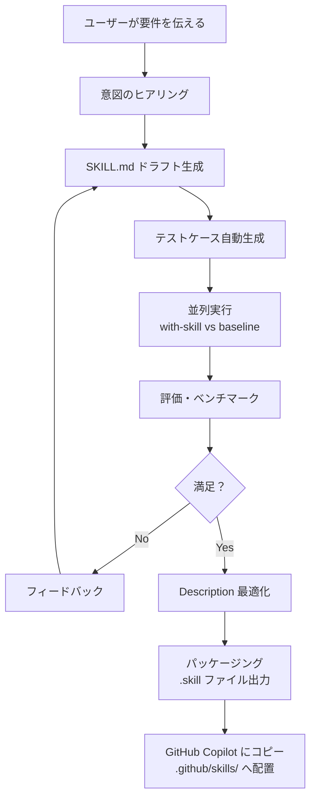
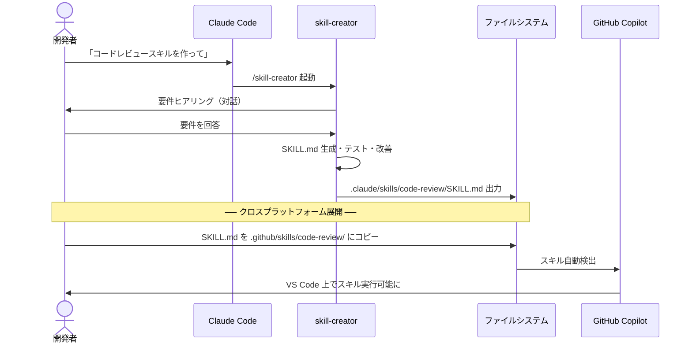

# 6-4: skill-creator 徹底解説 — 対話生成の仕組みと活用ノウハウ

> **学習時間**: 20分 | **難易度**: ⭐⭐⭐

## 概要

Claude Code にバンドルされている **skill-creator** は、単なる SKILL.md 生成ツールではなく、**スキル開発のライフサイクル全体をカバーする本格的なフレームワーク**です。このセクションでは、skill-creator の内部動作、効果的な使い方、そして生成したスキルを GitHub Copilot でも活用する方法を詳しく解説します。

## skill-creator とは

skill-creator は [anthropics/skills](https://github.com/anthropics/skills/tree/main/skills/skill-creator) リポジトリで公開されている Claude Code 用のバンドルスキルです。以下の URL でソースコードを確認できます：

- **公式リポジトリ**: https://github.com/anthropics/skills/tree/main/skills/skill-creator
- **Claude Code ドキュメント**: https://code.claude.com/docs/en/skills

### なぜ skill-creator が重要なのか

スキルを「手書き」する場合、以下の課題があります：

| 課題 | 手書きの場合 | skill-creator の場合 |
|------|-------------|---------------------|
| 要件の整理 | 自分で考える必要がある | 対話で引き出してくれる |
| SKILL.md のフォーマット | 自分で調べて記述 | ベストプラクティスに従って自動生成 |
| テスト | 手動でテスト | 自動生成・並列実行 |
| 品質評価 | 主観的評価 | 定量的アサーション + 定性的レビュー |
| 改善サイクル | 手動で修正 | フィードバックベースの反復改善 |
| トリガー精度 | 手動調整 | 自動最適化 |

## skill-creator の内部プロセス詳細

### フェーズ1: 意図のヒアリング

skill-creator はユーザーとの対話を通じて、以下の情報を引き出します：

```
Claude: どんなスキルを作りましょうか？
以下の点を教えてください：
1. このスキルに何をさせたいですか？
2. どのようなタイミングで発動すべきですか？
3. 出力形式の希望はありますか？
4. テストケースは必要ですか？
```

**効果的な回答のコツ**:

```markdown
# ❌ 曖昧な回答（スキルの質が低下）
コードをレビューするスキル

# ✅ 具体的な回答（高品質なスキルが生成される）
1. コードを可読性・パフォーマンス・セキュリティの3観点でレビューするスキル
2. プルリクエストのレビュー時や「このコードをレビューして」と言われたとき
3. JSON形式で、全体スコアと各観点のスコア、問題リストを含めて
4. はい、テストケースもお願いします
```

### フェーズ2: SKILL.md の生成

skill-creator は Agent Skills オープンスタンダードに従った SKILL.md を生成します。生成される SKILL.md は以下の構造を持ちます：

```markdown
---
name: code-review
description: コードを可読性・パフォーマンス・セキュリティの3観点でレビューし、JSON形式で結果を返します。プルリクエストのレビュー時や「コードをレビューして」という依頼があった場合に発動します。
---

# Code Review

## 概要
このスキルはコードを3つの観点でレビューし、JSON形式で結果を返します。

## 手順
1. レビュー対象のコードを分析する
2. 以下の観点で評価する：
   - 可読性: 命名、コメント、コード構造
   - パフォーマンス: 不要な処理、メモ化の機会
   - セキュリティ: インジェクション、認証の抜け
3. 各問題に重要度（critical/major/minor）を付ける
4. JSON形式で結果を出力する

## 出力形式
```json
{
  "summary": {
    "total_issues": 5,
    "overall_score": 72
  },
  "categories": {
    "readability": { "score": 80, "issues": [] },
    "performance": { "score": 65, "issues": [] },
    "security": { "score": 90, "issues": [] }
  }
}
```
```

### フェーズ3: テストケースの自動生成

skill-creator は 2〜3 個の現実的なテストプロンプトを自動生成します。テストケースは以下のように設計されます：

| テストケース | 目的 | 例 |
|------------|------|-----|
| 正常系1 | 基本的な機能の確認 | シンプルな関数のレビュー |
| 正常系2 | 異なるパターンの確認 | Reactコンポーネントのレビュー |
| エッジケース | 境界条件の確認 | セキュリティ問題を含むコードのレビュー |

### フェーズ4: 並列実行（with-skill vs baseline）

ここが skill-creator の最も強力な機能の一つです。**スキルあり（with-skill）とスキルなし（baseline）の両方を同時に実行**し、比較評価を行います：

```
Claude: 以下の3つのテストケースを実行します：
1. シンプルな関数のレビュー
2. Reactコンポーネントのレビュー
3. セキュリティ問題を含むコードのレビュー

with-skill と baseline（スキルなし）の両方を同時に実行します...
```

これにより、「スキルを使うことで本当に品質が向上しているか」を定量的に評価できます。

### フェーズ5: 評価とベンチマーク

実行結果はブラウザベースの評価ビューアで確認できます：

```
Claude: 結果をブラウザで開きました。
「Outputs」タブで各テストケースの出力を確認できます。
「Benchmark」タブで定量的な比較結果を確認できます。
```

評価ビューアでは以下の情報が確認できます：

- **Outputs タブ**: 各テストケースの実際の出力
- **Benchmark タブ**: with-skill と baseline の比較スコア
- **アサーション結果**: 定義されたアサーションの合格/不合格

### フェーズ6: 反復改善

評価結果に基づいて、ユーザーがフィードバックを提供し、skill-creator が SKILL.md を改善します：

```
あなた: セキュリティの観点がもう少し詳細だと良いです。
具体的な脆弱性パターン（XSS, CSRF, SQLインジェクション）を
チェックするようにしてください。

Claude: SKILL.md を更新しました。セキュリティ観点に
具体的な脆弱性パターンを追加しました。
再度テストを実行します...
```

このフィードバックループを繰り返すことで、スキルの品質を段階的に向上させます。

### フェーズ7: Description 最適化

スキルの自動読み込み精度を向上させるため、description の最適化を自動実行します：

```
あなた: description を最適化して
```

skill-creator は以下のプロセスで最適化を実行します：

1. **20個のトリガーテストクエリを生成**
   - 発動すべきケース: 8〜10個
   - 発動すべきでないケース: 8〜10個
2. **各クエリに対して description のマッチ精度をテスト**
3. **最も精度の高い description に自動更新**

### フェーズ8: パッケージング

完成したスキルを `.skill` ファイルとしてパッケージ化できます：

```
あなた: パッケージ化して
```

```bash
# skill-creator が以下のコマンドを実行
python -m scripts.package_skill .claude/skills/code-review/
# → code-review.skill が生成される
```

`.skill` ファイルはスキルの配布用フォーマットで、チームメンバーやコミュニティと共有する際に便利です。

## skill-creator の全体フロー



## 生成したスキルを GitHub Copilot でも使う

skill-creator は Claude Code 専用のツールですが、**生成された SKILL.md は Agent Skills オープンスタンダードに準拠している**ため、そのまま GitHub Copilot でも使用できます。

```bash
# 1. Claude Code でスキルを生成
claude
# /skill-creator を実行し、対話形式でスキルを作成

# 2. 生成された SKILL.md を確認
ls .claude/skills/code-review/SKILL.md

# 3. GitHub Copilot 用にコピー
mkdir -p .github/skills/code-review/
cp .claude/skills/code-review/SKILL.md .github/skills/code-review/SKILL.md
```



## 効果的な使い方のノウハウ

### 1. 最初はシンプルに

最初から完璧なスキルを作ろうとせず、最小限の機能から始めましょう：

```
# 最初の依頼（シンプル）
コードレビュースキルを作成して

# 改善のフィードバック（段階的に拡張）
セキュリティ観点にXSSとCSRFのチェックを追加して
パフォーマンス観点にメモ化の提案を追加して
出力に全体スコアを含めて
```

### 2. テストケースは現実的なものを

テストケースは実際の開発で遭遇するシナリオを選びましょう：

| 良いテストケース | 悪いテストケース |
|----------------|----------------|
| 実際のプロジェクトのコード | Hello World |
| 複数の言語・フレームワーク | 単一の簡単な例 |
| エッジケースを含む | 正常系のみ |

### 3. description 最適化は必ず実行する

スキルの自動読み込み精度を最大化するため、必ず description 最適化を実行しましょう：

```
あなた: description を最適化して
```

### 4. 反復改善を恐れない

1回の生成で完璧なスキルはできません。3〜5回の改善ループを想定しましょう：

```
1回目: 基本機能の実装
2回目: 観点の追加・調整
3回目: 出力形式の改善
4回目: description 最適化
5回目: 最終確認
```

### 5. クロスプラットフォームを意識する

GitHub Copilot でも使う場合は、Claude Code 固有の機能に依存しない SKILL.md を心がけましょう：

| 機能 | Claude Code | GitHub Copilot |
|------|-------------|----------------|
| 動的コンテキスト注入 (`!`) | ✅ | ❌ |
| 呼び出し制御 (`invoke`) | ✅ | ❌ |
| ツール事前承認 | ✅ | ❌ |

## トラブルシューティング

| 問題 | 原因 | 対策 |
|------|------|------|
| skill-creator が反応しない | Claude Code のバージョンが古い | `claude --version` で確認、最新にアップデート |
| テストケースが多すぎる | 最初から多くのケースを指定 | 2-3個から始めて、後で追加 |
| 評価ビューアが開かない | ブラウザがない環境 | `--static` フラグでHTMLファイル出力を依頼 |
| スキルが複雑すぎる | 一度に多くの機能を要求 | シンプルに作ってから段階的に拡張 |
| GitHub Copilot でスキルが認識されない | パスが間違っている | `.github/skills/<name>/SKILL.md` のパスを確認 |

## まとめ

skill-creator は以下の理由から、スキル開発において非常に強力なツールです：

1. **対話形式**で要件を引き出し、ベストプラクティスに従った SKILL.md を自動生成
2. **テスト・評価・改善のサイクル**を自動化し、高品質なスキルを効率的に開発
3. **Description 最適化**により、スキルの自動読み込み精度を最大化
4. 生成された SKILL.md は **Agent Skills オープンスタンダード準拠**のため、GitHub Copilot でもそのまま使用可能

## 次のステップ

→ [6-1: 複数スキルの連携パイプライン](01-pipeline-integration.md)
