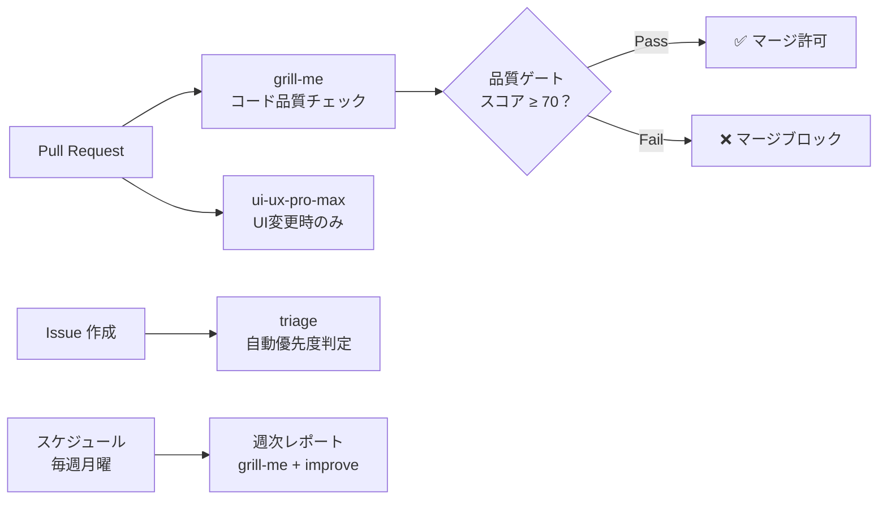

# 実プロジェクトへの組み込み

> **学習時間**: 15分 | **難易度**: ⭐⭐⭐

## 概要

作成したスキルを実際のプロジェクトに組み込み、CI/CD パイプラインと連携する方法を学びます。品質ゲートとしてスキルを活用し、コード品質を自動的に維持する仕組みを構築します。

## CI/CD パイプラインへの統合



### GitHub Actions との連携

```yaml
# .github/workflows/skill-review.yml
name: Skill Code Review

on:
  pull_request:
    types: [opened, synchronize]

jobs:
  review:
    runs-on: ubuntu-latest
    steps:
      - uses: actions/checkout@v4
      
      - name: Run grill-me review
        uses: github/copilot-skills-action@v1
        with:
          skill: grill-me
          files: "src/**/*.{ts,tsx}"
          
      - name: Check quality gate
        run: |
          # 品質スコアが70未満の場合は失敗
          if [ "$SCORE" -lt 70 ]; then
            echo "Quality gate failed: score $SCORE < 70"
            exit 1
          fi
```

### 品質ゲートの設定例

```yaml
# .github/skills-config/quality-gates.yml
quality_gates:
  - skill: grill-me
    threshold: 70  # 全体スコアの最低値
    categories:
      security: 80     # セキュリティは80以上必須
      performance: 60  # パフォーマンスは60以上
      
  - skill: ui-ux-pro-max
    threshold: 60
    categories:
      accessibility: 70  # アクセシビリティは70以上必須
```

## 実践的な統合例

### 例1: PR 作成時の自動レビュー

```yaml
name: PR Quality Check

on:
  pull_request:
    paths:
      - 'src/**/*.tsx'
      - 'src/**/*.ts'

jobs:
  quality-check:
    runs-on: ubuntu-latest
    steps:
      - uses: actions/checkout@v4
      
      - name: Code Review
        run: |
          # 変更ファイルを抽出
          FILES=$(git diff --name-only origin/main...HEAD)
          
          # grill-me でレビュー
          for file in $FILES; do
            gh copilot run grill-me \
              --param code="$(cat $file)" \
              --param language="typescript" \
              --param framework="react"
          done
          
      - name: UI/UX Audit
        run: |
          # UIコンポーネントの変更を監査
          UI_FILES=$(echo "$FILES" | grep -E '\.(tsx|jsx)$')
          for file in $UI_FILES; do
            gh copilot run ui-ux-pro-max \
              --param component_code="$(cat $file)" \
              --param framework="react"
          done
```

### 例2: 定期的なコード品質レポート

```yaml
name: Weekly Quality Report

on:
  schedule:
    - cron: '0 9 * * 1'  # 毎週月曜日

jobs:
  quality-report:
    runs-on: ubuntu-latest
    steps:
      - uses: actions/checkout@v4
      
      - name: Generate Quality Report
        run: |
          # 全ソースコードを分析
          gh copilot run grill-me \
            --param code="$(cat src/**/*.ts)" \
            --param max_issues=100
          
      - name: Create Issue
        uses: actions/github-script@v7
        with:
          script: |
            github.rest.issues.create({
              owner: context.repo.owner,
              repo: context.repo.repo,
              title: '週次コード品質レポート',
              body: reportBody
            })
```

## 統合パターン一覧

| パターン | トリガー | 使用スキル | 目的 |
|---------|---------|-----------|------|
| PRレビュー | pull_request | grill-me | コード品質の自動チェック |
| UI監査 | pull_request (UI変更時) | ui-ux-pro-max | UI/UX品質の維持 |
| Issueトリアージ | issues | triage | Issue管理の効率化 |
| 週次レポート | schedule | grill-me + improve | 品質傾向の把握 |
| リリース前チェック | release | 全スキル | リリース品質の保証 |

## 品質ゲートの設計指針

### 1. 段階的な導入
最初は緩めの閾値から始め、チームの成熟度に応じて厳しくします。

### 2. ブロッカーと警告の区別
- **ブロッカー**: マージをブロック（セキュリティ問題など）
- **警告**: 通知のみ（スタイルの改善提案など）

### 3. 人間の判断を残す
自動チェックは補助であり、最終判断は人間が行います。

## 次のステップ

→ [7-3: スキル評価と改善サイクル](03-evaluation-cycle.md)
