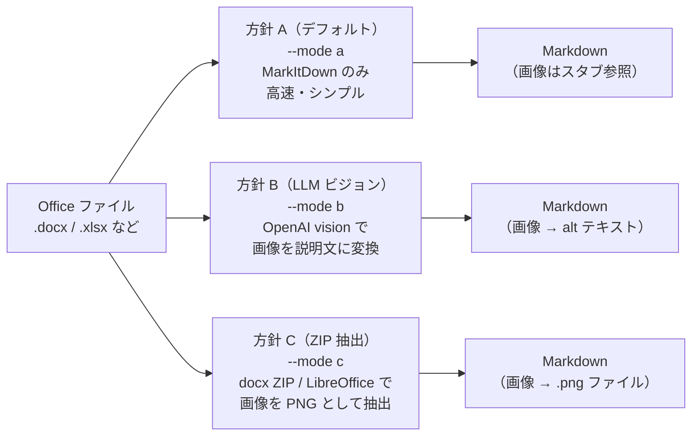
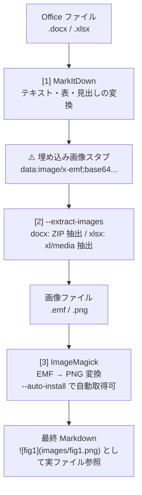

# 7-2: Office → Markdown 変換スキル（MarkItDown）

> **学習時間**: 30分 | **難易度**: ⭐⭐

## 概要

Word・Excel・PowerPoint・PDF などの Office ファイルを Markdown に変換するスキルを作成します。

### なぜこのスキルが必要か

実務では、仕様書・設計書・議事録などを Word/Excel 形式で受け取ることが多くあります。しかし AI エージェント（GitHub Copilot・Claude Code）はテキストベースの Markdown を最も効率よく処理できます。

[品質改善 施策検討](01-quality-improvement-plan.md) はその典型的なユースケースを示しています：

> 「Word/Excel 形式の受領仕様（IF 仕様を含む）は受領原本を正本として扱う。受領仕様は、AI Agent Skill を活用して Markdown へ変換し、要約・比較・レビュー補助などの内部活用に用いる。」
>
> — 品質改善 施策検討, 3.1 仕様書運用方針

このスキルを使うと、エージェントが Office ファイルを受け取った時点で自動的に Markdown に変換し、後続の処理（要約・比較・レビュー）にそのまま渡せるようになります。

## MarkItDown とは

**MarkItDown** は Microsoft が開発・公開している OSS の Python パッケージです。

- **リポジトリ**: [github.com/microsoft/markitdown](https://github.com/microsoft/markitdown)
- **対応形式**: Word (.docx), Excel (.xlsx), PowerPoint (.pptx), PDF, HTML, CSV, JSON, XML, EPUB, 画像（OCR）など
- **特徴**: 表・見出し・リストなど文書構造を保持したまま Markdown に変換する

### 環境のセットアップ

```bash
cd samples/document-workflow/office-to-markdown

# 仮想環境を作成して開発用依存を入れる
uv venv
uv sync --group dev
```

以後のコマンドはすべて `uv run python ...` 経由で実行します。方針 B（LLM ビジョン）を使う場合は、追加で `uv sync --extra mode-b` を実行します。

> **💡 注意**: `onnxruntime`（依存パッケージ）は Python 3.14 未対応です。Python 3.12 または 3.13 を使用してください。

### 基本的な使い方

```bash
# Word → Markdown
markitdown 仕様書.docx -o 仕様書.md

# Excel → Markdown（各シートが表として出力される）
markitdown データ一覧.xlsx -o データ一覧.md

# PDF → Markdown
markitdown 報告書.pdf -o 報告書.md
```

## スキルの実装

`samples/document-workflow/office-to-markdown/` に完全な実装があります。サンプルは `uv` 管理を前提にしており、変換前に `markitdown` / `openai` / `LibreOffice` の有無を確認し、グラフ・画像の処理方針を必ず確認したうえで、変換後は `check_output.py` で検証します。

### ファイル構成

```
samples/document-workflow/office-to-markdown/
├── SKILL.md          # スキル定義（エージェントへの指示）
├── pyproject.toml    # 依存関係（uv で管理）
├── .venv/            # 仮想環境（uv venv で生成）
├── scripts/
│   ├── office2md.py      # 変換スクリプト（メイン）
│   └── check_output.py   # 変換後の自動検証スクリプト
└── tests/
    └── test_check_output.py   # ユニットテスト（35件）
```

### 環境のセットアップ

```bash
cd samples/document-workflow/office-to-markdown

# Python 3.12 で仮想環境を作成
uv venv --python 3.12

# 依存関係をインストール
uv sync --group dev
```

### 3つの変換方針

スクリプトは `--mode` オプションで3つの方針を切り替えられます。



| 方針 | コマンド | 特徴 |
|------|---------|------|
| **A（デフォルト）** | `--mode a` | MarkItDown のみ。高速・シンプル。画像はスタブ参照 |
| **B（LLM ビジョン）** | `--mode b` | OpenAI vision でグラフを説明文に変換。API キー必要 |
| **C（ZIP 抽出）** | `--mode c` | docx ZIP / LibreOffice で画像を PNG として抽出 |

### 基本的な使い方

```bash
# 方針 A（テキスト・表のみ）
uv run python scripts/office2md.py 仕様書.docx -o 仕様書.md

# 方針 A + 埋め込み画像の自動抽出
uv run python scripts/office2md.py 仕様書.docx -o 仕様書.md --extract-images

# 方針 A + 画像抽出 + ImageMagick の自動インストール
uv run python scripts/office2md.py 仕様書.docx -o 仕様書.md --extract-images --auto-install

# 方針 B（LLM ビジョン）※ OPENAI_API_KEY 環境変数が必要
uv run python scripts/office2md.py 仕様書.docx -o 仕様書.md --mode b
```

### 変換後の自動検証

`check_output.py` は変換結果を自動的に検証し、問題を報告します。

```bash
uv run python scripts/check_output.py 仕様書.docx 仕様書.md
```

**チェック項目:**

| チェック | 内容 |
|---------|------|
| 文字数チェック | 元ファイルサイズと変換後文字数の比率で欠落を検出 |
| 見出し構造チェック | H1/H2/H3 の存在を確認 |
| テーブルチェック | Markdown テーブルの存在を確認 |
| 画像プレースホルダー | `` などの空参照を検出 |
| 埋め込み画像チェック | base64 埋め込みが残っていれば `--extract-images` を提案 |
| 識別子チェック | IF-001 等のパターン欠落を検出（IF 仕様書用） |
| 構造比較（.docx） | python-docx で見出し数・テーブル数を原本と比較 |

**出力例:**

```
============================================================
変換後チェックレポート
============================================================

✅ PASS  文字数チェック
   文字数は妥当です (元: 88,953 bytes, 出力: 84,007 文字)

✅ PASS  テーブルチェック
   テーブルを 2 件検出しました。

✅ PASS  埋め込み画像チェック
   base64 埋め込み画像はありません。

------------------------------------------------------------
結果: FAIL=0件  WARN=1件  PASS=5件
```

## 実習: サンプルファイルを変換してみる

### Word 文書の変換（sample2020.docx）

```bash
cd samples/document-workflow/office-to-markdown

uv run python scripts/office2md.py \
  "../../docs/sample2020.docx" \
  -o "../../docs/sample2020.md" \
  --mode a \
  --extract-images \
  --images-dir "../../docs/sample2020_images"
```

**実行結果のポイント:**
- EMF 形式の埋め込み図（fig1）が docx ZIP から自動抽出される
- ImageMagick がインストール済みなら EMF → PNG に自動変換
- `--auto-install` を付けると ImageMagick を winget で自動インストール

### Excel ファイルの変換（Financial Sample.xlsx）

```bash
uv run python scripts/office2md.py \
  "../../docs/Financial Sample.xlsx" \
  -o "../../docs/Financial Sample.md" \
  --mode a \
  --extract-images \
  --images-dir "../../docs/Financial Sample_images"
```

**実行結果のポイント:**
- シートのデータが Markdown テーブルとして出力される
- `xl/media/` に埋め込まれた画像（PNG/JPEG 等）を自動抽出し、Markdown 末尾に追記
- 画像ディレクトリ名のスペースはアンダースコアに自動置換（`Financial_Sample_images`）
- Markdown 内のパスは `\`（Windows）または `/`（macOS/Linux）でOS 対応

### 検証の実行

```bash
uv run python scripts/check_output.py \
  "../../docs/Financial Sample.xlsx" \
  "../../docs/Financial Sample.md"
```

## 限界: グラフ・画像の処理

| コンテンツ | 方針 A | 方針 B | 方針 C / `--extract-images` |
|-----------|--------|--------|---------------------------|
| テキスト・見出し | ✅ | ✅ | ✅ |
| 表（テーブル） | ✅ | ✅ | ✅ |
| Word 埋め込み画像（PNG/JPEG） | ⚠️ スタブ | ✅ 説明文 | ✅ PNG ファイルとして抽出 |
| Word 埋め込みグラフ（EMF） | ⚠️ スタブ | ✅ 説明文 | ✅ PNG に変換（ImageMagick 必要）|
| Excel シートデータ | ✅ テーブル | ✅ テーブル | ✅ テーブル |
| Excel 埋め込み画像 | ❌ 無視 | ❌ 無視 | ✅ `xl/media/` から抽出 |
| Excel グラフ | ❌ 無視 | ❌ 無視 | ⚠️ LibreOffice 必要 |

> **💡 EMF について**: MarkItDown が docx のグラフ画像に対して出力するのは実際の base64 データではなく `data:image/x-emf;base64...)` という短縮形スタブです。`--extract-images` はこのスタブを検出し、元の docx ZIP から実ファイルを抽出してマッピングします。

### LLM ビジョンで alt テキストを生成する（方針 B）

MarkItDown は OpenAI の vision モデルと連携させると、画像を「読んで説明文を生成」できます。出力は**テキストの説明文**であり、PNG ファイルは生成されません。

```python
from markitdown import MarkItDown
from openai import OpenAI

client = OpenAI()  # OPENAI_API_KEY 環境変数から自動取得
md = MarkItDown(llm_client=client, llm_model="gpt-4o")
result = md.convert("仕様書.docx")
# → 画像が「この図は〇〇工程のフローを示している」のような説明文に変換される
```

## 発展: グラフを PNG として保持するパイプライン



### 実務での割り切り方

グラフ・画像が重要な文書の場合、完全自動化にこだわらず以下の運用が現実的です：

1. **受領原本（Office ファイル）を正本として保持**し、Markdown はテキスト処理専用と割り切る
2. **重要なグラフだけ手動でスクリーンショット**して `assets/` に保存し `` として追記
3. **グラフが多い文書はスキップ**し、PDF のまま添付資料として参照する

## テストケース

| # | 入力 | 期待される結果 |
|---|------|--------------|
| 1 | 見出し付きの .docx | H1/H2/H3 が # / ## / ### に変換される |
| 2 | 表を含む .xlsx | Markdown テーブル形式で出力される |
| 3 | 複数シートの .xlsx | シートごとにセクションが分かれる |
| 4 | 画像付き .docx + `--extract-images` | ZIP から画像を抽出し PNG に変換 |
| 5 | 画像付き .xlsx + `--extract-images` | `xl/media/` から画像を抽出し末尾に追記 |
| 6 | 存在しないファイル | エラーメッセージとファイルパスの確認を促す |
| 7 | Python 3.14 以上 | `onnxruntime` 非対応のためエラー（3.12/3.13 を使用） |

## 実務上の注意点

- **受領原本の保全**: 変換元の Office ファイルは編集せず原本として保管する
- **PYTHONUTF8**: Windows で実行する際は `$env:PYTHONUTF8 = "1"` を設定する（絵文字の文字化け防止）
- **パス区切り**: Windows では Markdown の画像パスに `\` を使用（スクリプトが自動対応）
- **スペースを含むファイル名**: 画像ディレクトリ名のスペースは自動でアンダースコアに置換される

## 次のステップ

→ [7-2: Markdown → Office 変換スキル（Pandoc）](03-markdown-to-office.md)
