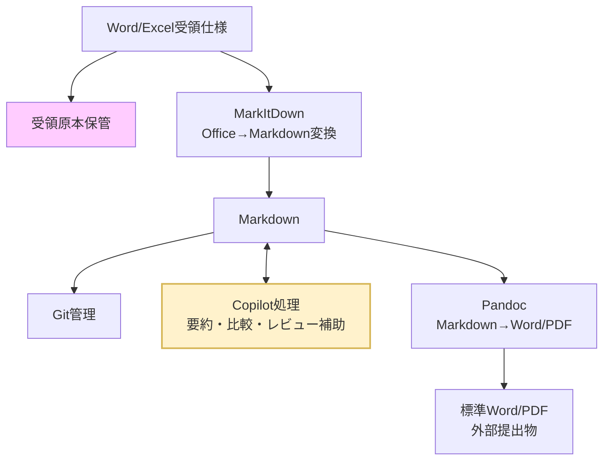
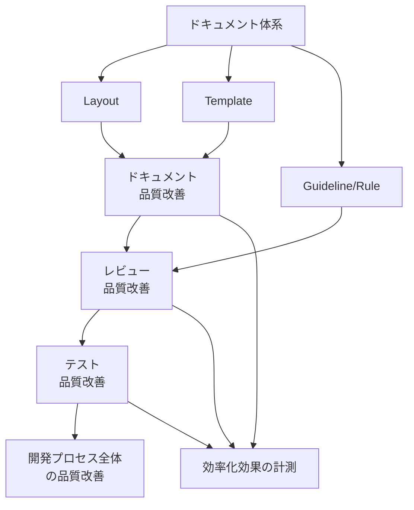
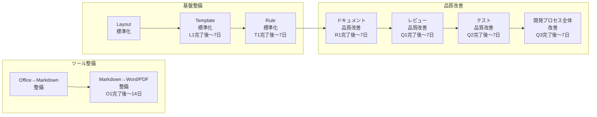

# 8-1: サンプル文書 — 品質改善 施策検討

> **種別**: 参考資料 | **役割**: Part 8 のユースケース背景 / 変換サンプル入力

## このファイルの位置づけ

このドキュメントは、Part 8「ドキュメントワークフロー自動化」の**ユースケース背景**として用意された実務文書のサンプルです。

以下の2つの役割を持ちます。

| 役割 | 使われ方 |
|------|---------|
| **ユースケース背景** | なぜ Office ↔ Markdown 変換が必要かを示す実例として、[8-2](02-office-to-markdown.md) / [8-3](03-markdown-to-office.md) で引用 |
| **変換サンプル** | Pandoc による Markdown → Word 変換の入力ファイルとして [8-3](03-markdown-to-office.md) の実習で使用 |

---

## 品質改善 施策検討

### 1. 背景

品質改善施策の進め方について、実施順序と前提を整理する。
効率化の観点も並行して検討し、品質と効率化を両立させる施策体系を構築する。

### 2. 現時点の方針案

- 品質改善はドキュメント体系を基盤として進める。
- ドキュメント体系は以下の3要素で構成する。
  - Layout: フォルダ・ファイルの配置
  - Template: 各文書の雛形
  - Guideline/Rule: 記述と運用の基準
- 優先順位は以下の順で進める。
  1. Layout
  2. Template
  3. Rule
- 上記に先行する前提整備として、変換ツールの整備を先行実施する。
  1. Office→Markdown 変換（MarkItDown）
  2. Markdown→Word/PDF 変換（Pandoc）
- 品質改善全体の施策順は以下が妥当。
  1. ドキュメント品質改善
  2. レビュー品質改善
  3. テスト品質改善
  4. 開発プロセス全体の品質改善
- 各施策に対し、**効率化の効果**を補足的に測定・記録する（Copilot 活用による作業工数削減の可視化）。

### 3. 進め方の意図

- 先に配置と正本を固定することで、参照先の揺れを防ぐ。
- 次に雛形を固定し、文書の粒度と抜け漏れを抑える。
- 最後に運用ルールを明文化し、レビュー/テスト/開発プロセスに横展開する。
- 各施策の完了基準として、**品質指標の改善**と**効率化指標の削減**の両方を定義する。

### 3.1 仕様書運用方針（Copilot 活用前提）

- Word/Excel 形式の受領仕様（IF 仕様を含む）は受領原本を正本として扱う。
- 受領仕様は、AI Agent Skill を活用して Markdown へ変換し、要約・比較・レビュー補助などの内部活用に用いる。
- 内部で新規作成する仕様・手順文書は Markdown を正本として管理する。
- 外部提出時は、提出先要件に応じて受領正本または Markdown 由来の提出物を使い分ける。
- 受領正本と Markdown 変換物で差異が出た場合は、受領正本を優先し、Markdown 側を更新する。
- 上記運用の前提として、以下のツール整備を必須とする。
  1. Word/Excel 形式→Markdown 形式の変換機能
  2. Markdown 形式→Word/Excel 形式の変換機能

#### ツール・データフロー概要

### 3.2 方針のメリット

- **正本の信頼性維持**: 受領仕様を正本として保持することで、対外契約・合意の根拠を維持できる。
- **活用性の向上**: 受領仕様を Markdown 化することで、検索・比較・要約・レビュー補助に活用しやすくなる。
- **Copilot 活用の最大化**: 要約、比較、レビュー補助、観点抽出を同一形式で実行できる。
- **提出作業の標準化**: 提出フォーマット変換を定型化し、体裁調整の手戻りを減らす。
- **監査性の向上**: 受領原本、変換結果、レビュー記録、提出物の対応関係を残しやすい。

### 3.3 実務ルール（最小運用）

1. **原本保全**: 受領した Word/Excel は編集せず保管し、受領仕様正本として明示する。
2. **正本定義**: 受領仕様は受領原本を正本とし、内部作成文書は Markdown を正本とする。
3. **変換手順**: 受領仕様の Office→Markdown 変換時は実行ログを保存する。
4. **変換後レビュー**: 見出し階層、表崩れ、IF 項目欠落、版数・改訂履歴を確認する。
5. **差異解消**: 受領正本と Markdown 変換物の差異は、受領正本を基準に Markdown を修正する。
6. **提出物生成**: 外部提出用 Word/Excel は提出要件に合わせ、受領正本または Markdown 由来の成果物を選定する。
7. **識別子運用**: IF 仕様の項目 ID（例: IF-001）を Markdown 上で維持し、受領物・提出物と突合可能にする。
8. **月次棚卸し**: 変換失敗事例とレビュー指摘を月次で集計し、ルールを更新する。
9. **ツール整備**: Office→Markdown、Markdown→Office の両変換ツールを整備し、担当者・実行手順・障害時の代替手順を定義する。

### 4. 関係図

### 5. 実施順序

### 6. 各タスクの実施内容

#### 6.1 ドキュメント品質改善

**目的**: 正本と参照先を固定し、情報探索コストを下げながらドキュメント品質を高める。

**実施内容**:
- 正本ドキュメントの確定（重複文書の統合、参照元の一本化）
- 章立て・粒度の標準化（Template 適用）
- 主要文書の更新責任者の明確化

**指標**:

| 指標 | Before | After 目標 | 計測方法 |
|------|--------|-----------|---------|
| ドキュメント抜け漏れ件数 | 人手レビューで計上 | Copilot レビュー後の残存件数を削減 | レビュー時の指摘件数を記録 |
| 情報探索時間 | TBD | Before 比 30% 削減 | 作業ログから参照先調査時間を抽出 |
| テンプレート作成時間 | TBD | Before 比 40% 削減 | Copilot 活用前後の作業時間を比較 |

#### 6.2 レビュー品質改善

**目的**: レビュー観点の抜け漏れを減らし、検出率を上げながらレビュー準備工数を削減する。

**実施内容**:
- レビュー観点チェックリストの整備
- 変更種別ごとのレビュー必須項目の定義
- 指摘分類（仕様/実装/テスト/ドキュメント）の統一

**指標**:

| 指標 | Before | After 目標 | 計測方法 |
|------|--------|-----------|---------|
| レビュー検出漏れ件数 | TBD | Before 比削減 | 後工程での「レビュー見落とし」タグで計上 |
| レビュー所要時間 | TBD | Before 比 20% 削減 | 作業ログからレビュー時間を抽出 |

#### 6.3 テスト品質改善

**目的**: 重要機能の回帰防止とテスト設計の再現性向上を図る。

**実施内容**:
- リスクベースで対象機能を優先付け
- テスト観点・ケースの標準フォーマット化
- 不具合起点の回帰テスト追加運用

**指標**:

| 指標 | Before | After 目標 | 計測方法 |
|------|--------|-----------|---------|
| テストケース作成時間 | TBD | Before 比 30% 削減 | 作業ログから計測 |
| Copilot 補助後の観点追加数 | — | 人手比 20% 以上 | Copilot 出力と人手結果を照合 |

#### 6.4 開発プロセス全体の品質改善

**目的**: 施策を単発で終わらせず、継続改善サイクルを定着させる。

**実施内容**:
- KPI/Exit Criteria の定義と可視化
- 定例での課題棚卸しと優先度見直し
- 改善施策の実施結果レビュー（継続/中止/再設計の判断）

### 7. 未確定事項

- 初期適用範囲（全体一括 / パイロット対象）
- 各段階の完了条件（KPI・Exit Criteria）
- 推進体制（オーナー・レビュー責任者）

---

## 次のステップ

→ [8-2: Office → Markdown 変換スキル（MarkItDown）](02-office-to-markdown.md)
