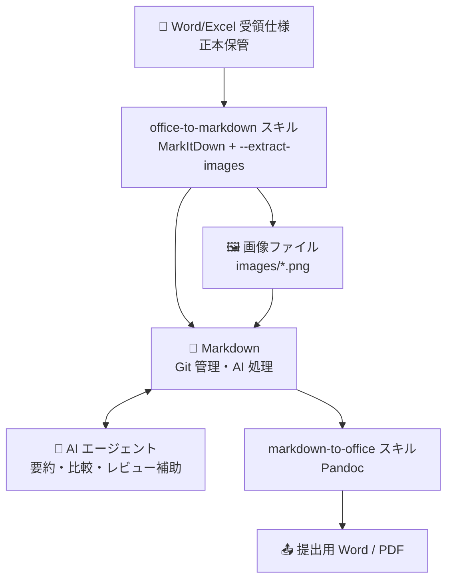

# Markdown → Office 変換スキル（Pandoc）

> **学習時間**: 30分 | **難易度**: ⭐⭐

## 概要

Markdown ファイルを Word (.docx) または PDF に変換するスキルを作成します。社内で Markdown を正本として管理している文書を、外部提出用の Office 形式に変換する際に使います。

### なぜこのスキルが必要か

[品質改善 施策検討](01-quality-improvement-plan.md) で定義されたワークフローでは、社内文書の正本を Markdown で管理しながら、外部提出時だけ Word/PDF に変換します：

```
内部作成 Markdown（正本）
    ↓ Pandoc
標準 Word/PDF（外部提出用）
```

前章（7-1）の `office-to-markdown` スキルと組み合わせると、受領した Word を Markdown に変換して AI 処理し、結果を再度 Word に戻す完全な双方向ワークフローが完成します。

## Pandoc とは

**Pandoc** はほぼあらゆる文書形式を相互変換できる OSS のユニバーサルドキュメントコンバーターです。

- **公式サイト**: [pandoc.org](https://pandoc.org)
- **主な変換先**: Word (.docx), PDF, HTML, LaTeX, EPUB など
- **特徴**: Word のスタイルテンプレート（`.docx`）を参照して体裁を統一できる

### インストール

```bash
# Windows
winget install JohnMacFarlane.Pandoc

# macOS
brew install pandoc

# Linux (Debian/Ubuntu)
sudo apt-get install pandoc
```

PDF 出力には PDF エンジンが必要です（weasyprint 推奨）：

```bash
pip install weasyprint
```

### 基本的な使い方

```bash
# Markdown → Word
pandoc 文書.md -o 文書.docx

# Markdown → PDF
pandoc 文書.md -o 文書.pdf --pdf-engine=weasyprint

# 社内テンプレートを使って体裁を統一
pandoc 文書.md --reference-doc=company-template.docx -o 文書_提出用.docx
```

## スキルの実装

`samples/document-workflow/markdown-to-office/SKILL.md` に完全な定義があります。

### スキルの呼び出し方

GitHub Copilot の場合：

```
@markdown-to-office
ファイル: docs/08-document-workflow/01-quality-improvement-plan.md
出力形式: docx
テンプレート: templates/company-template.docx
```

Claude Code の場合：

```
/markdown-to-office ファイル=01-quality-improvement-plan.md 形式=docx
```

### スキルが行うこと

0. ツールの存在確認（pandoc / weasyprint / wkhtmltopdf）
   - Pandoc 未インストールの場合はユーザー確認後にインストール
   - PDF エンジン（weasyprint / wkhtmltopdf）がなければ docx への代替を提案
1. 出力形式（docx / pdf）とテンプレートの有無を確認（DECISION-GATE）
2. Markdown の要素（見出し・表・コードブロック）を事前に確認
3. Pandoc コマンドを実行
4. 変換後にレビューチェックリストを確認（HARD-GATE）
   - 見出しスタイルの適用状況
   - 表の描画確認
   - コードブロックの可読性確認
5. 結果をユーザーに報告

## 実習: 01-quality-improvement-plan.md を Word に変換する

### ステップ 1: Pandoc のインストール確認

```bash
pandoc --version
```

### ステップ 2: サンプルファイルを変換

```bash
cd docs/08-document-workflow
pandoc 01-quality-improvement-plan.md -o quality-improvement-plan.docx
```

### ステップ 3: テンプレートを使って体裁を統一する

```bash
# Pandoc のデフォルトテンプレートを取得
pandoc -o company-template.docx --print-default-data-file reference.docx
```

`company-template.docx` を Word で開き、フォント・スタイル・ヘッダー/フッターを会社規定に合わせて編集します。以後は `--reference-doc=company-template.docx` を指定するだけで体裁が統一されます。

```bash
pandoc 01-quality-improvement-plan.md \
  --reference-doc=../../templates/company-template.docx \
  -o quality-improvement-plan-final.docx
```

## テストケース

| # | 入力 | 期待される結果 |
|---|------|--------------|
| 1 | 見出し付きの .md | H1/H2/H3 が Word の見出しスタイルに変換される |
| 2 | 表を含む .md | Word のテーブルとして描画される |
| 3 | テンプレート指定あり | テンプレートのスタイルが適用される |
| 4 | 存在しないファイル | エラーメッセージとファイルパスの確認を促す |
| 5 | Pandoc 未インストール | インストール手順を提案する |

## 変換フロー全体像（7-2 との組み合わせ）

前章（7-2）と合わせると、ドキュメントの変換フロー全体が完成します：



これは [品質改善 施策検討](01-quality-improvement-plan.md) のセクション 3.1「ツール・データフロー概要」で定義されたワークフローそのものです。

## 実務上の注意点

- **スペースを含むファイル名**: コマンドライン引数は必ずクォートで囲む（例: `"My Document.md"`）
- **PDF エンジン**: `weasyprint` の他に `xelatex`（日本語対応に `\usepackage{luatexja}` が必要）も使用可能
- **画像パス**: Pandoc は Markdown ファイルの相対パスで画像を解決するため、変換時のカレントディレクトリに注意

## 次のステップ

- [Part 7-1: パイプライン連携](../07-advanced/01-pipeline-integration.md) でこの2つのスキルをパイプラインに組み込む方法を学ぶ
