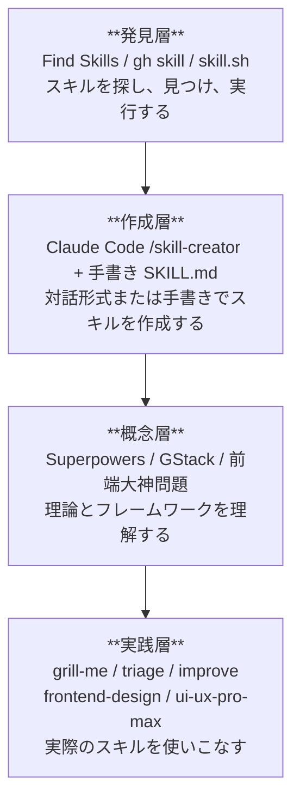
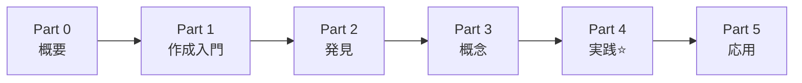
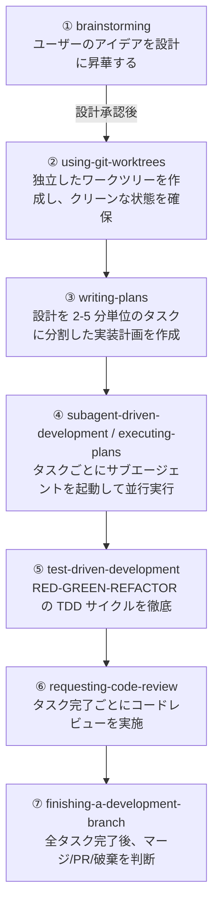
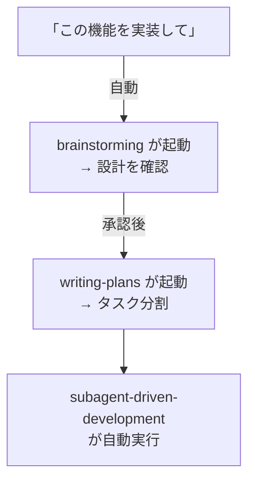
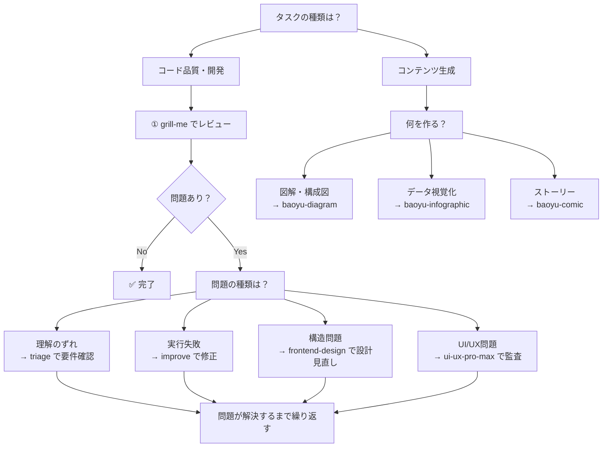
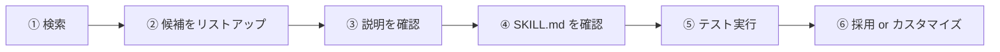
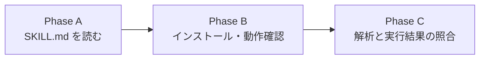
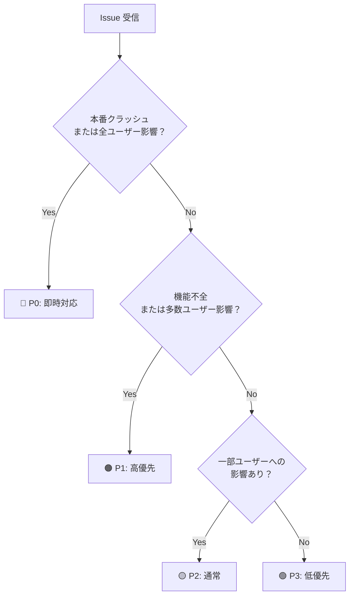
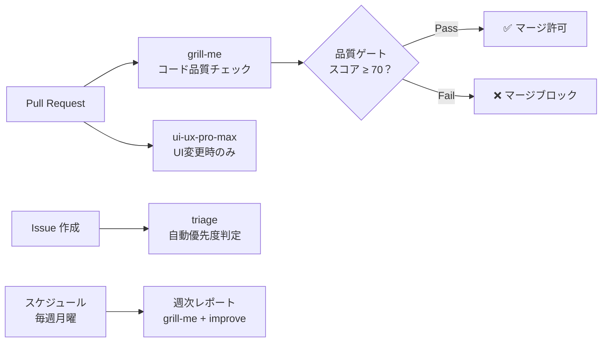

# Mermaid 図解改善 Implementation Plan

> **For agentic workers:** REQUIRED SUB-SKILL: Use superpowers:subagent-driven-development (recommended) or superpowers:executing-plans to implement this plan task-by-task. Steps use checkbox (`- [ ]`) syntax for tracking.

**Goal:** docs/ 以下の教材ファイル 9 本に対し、バグ修正・テキスト→Mermaid 変換・新規図追加の計 11 改善を行い、視覚的な学習体験を向上させる。

**Architecture:** フェーズ1（バグ修正）→ フェーズ2（テキスト変換 7 か所）→ フェーズ3（新規追加 3 か所）の順に 1 ファイル 1 タスクで進める。各タスクはファイルレベルで独立しており、並列実行も可能。

**Tech Stack:** Markdown / Mermaid（flowchart LR, flowchart TD, graph TB）/ Git

## Global Constraints

- 既存のテキスト情報を削除・変更しない。Mermaid への変換は等価な置き換えのみ
- Mermaid ブロックは ` ```mermaid ` で開始し ` ``` ` で必ず閉じる
- 改善対象外の行・セクションは一切変更しない
- コミットは 1 タスク 1 コミット。メッセージは `docs: <ファイル名> Mermaid 改善`

---

## ファイルマップ

| タスク | ファイル | 変更種別 |
|--------|---------|---------|
| Task 1 | `docs/01-skill-creation/01-what-are-agent-skills.md` | バグ修正 |
| Task 2 | `docs/00-fundamentals/01-ecosystem-overview.md` | テキスト変換 × 2 |
| Task 3 | `docs/03-frameworks/01-superpowers.md` | テキスト変換 × 2 |
| Task 4 | `docs/03-frameworks/02-gstack-overview.md` | テキスト変換 × 1 |
| Task 5 | `docs/04-skills-in-practice/09-problem-skill-mapping.md` | テキスト変換 × 1 |
| Task 6 | `docs/02-discovery/01-find-skills.md` | テキスト変換 × 1 |
| Task 7 | `docs/04-skills-in-practice/01-grill-me.md` | 新規追加 |
| Task 8 | `docs/04-skills-in-practice/02-triage-issue-analysis.md` | 新規追加 |
| Task 9 | `docs/06-advanced/02-ci-cd-integration.md` | 新規追加 |

---

## Task 1: バグ修正 — Mermaid ブロック未閉鎖

**Files:**
- Modify: `docs/01-skill-creation/01-what-are-agent-skills.md:25-28`

**問題:** L17 の ` ```mermaid ` ブロックに閉じ ` ``` ` がなく、`style` 宣言 2 行と後続テキストがブロック外に漏れてレンダリングが壊れている。

- [ ] **Step 1: 現状確認**

ファイルの L15〜32 を読み、`style COPILOT` の後に閉じ ` ``` ` がないことを目視確認する。

- [ ] **Step 2: 閉じ ` ``` ` を追加**

以下の old_string → new_string で Edit を実行する:

old_string（完全一致が必要）:
```
    style COPILOT fill:#2DA44E,color:#fff,stroke:#333


**使い方**:
```

new_string:
```
    style COPILOT fill:#2DA44E,color:#fff,stroke:#333
```

**使い方**:
```

- [ ] **Step 3: 結果確認**

修正後 L17〜30 を再読し、`flowchart LR` ブロックが ` ```mermaid ` … ` ``` ` で正しく閉じられており、`**使い方**:` がブロック外の通常テキストになっていることを確認する。

- [ ] **Step 4: コミット**

```bash
git add docs/01-skill-creation/01-what-are-agent-skills.md
git commit -m "fix: 01-what-are-agent-skills Mermaidブロックの閉じ ``` を追加"
```

---

## Task 2: テキスト変換 — ecosystem-overview（4 層構造 + 学習パス）

**Files:**
- Modify: `docs/00-fundamentals/01-ecosystem-overview.md:20-40, 87-91`

### 変換1: 4 層アーキテクチャ ASCII アート → `graph TB`

- [ ] **Step 1: 4 層 ASCII ブロックを Mermaid に置換**

old_string:
````
```
┌─────────────────────────────────────────┐
│           発見層                         │
│   Find Skills / gh skill / skill.sh     │
│   スキルを探し、見つけ、実行する           │
├─────────────────────────────────────────┤
│           作成層                         │
│   Claude Code /skill-creator            │
│   + 手書き SKILL.md                     │
│   対話形式または手書きでスキルを作成する    │
├─────────────────────────────────────────┤
│           概念層                         │
│   Superpowers / GStack / 前端大神問題    │
│   理論とフレームワークを理解する           │
├─────────────────────────────────────────┤
│           実践層                         │
│   grill-me / triage / improve           │
│   frontend-design / ui-ux-pro-max       │
│   実際のスキルを使いこなす               │
└─────────────────────────────────────────┘
```
````

new_string:
````

````

### 変換2: 学習パス テキスト → `flowchart LR`

- [ ] **Step 2: 学習パスを Mermaid に置換**

old_string:
````
```
Part 0 ─→ Part 1 ─→ Part 2 ─→ Part 3 ─→ Part 4 ─→ Part 5
概要     作成入門   発見      概念      実践⭐    応用
```
````

new_string:
````

````

- [ ] **Step 3: 結果確認**

ファイル内に ` ```mermaid ` が 2 つあること、`graph TB` と `flowchart LR` がそれぞれ含まれることを確認する。

- [ ] **Step 4: コミット**

```bash
git add docs/00-fundamentals/01-ecosystem-overview.md
git commit -m "docs: 01-ecosystem-overview 4層構造と学習パスをMermaidに変換"
```

---

## Task 3: テキスト変換 — superpowers（基本ワークフロー + 自動起動フロー）

**Files:**
- Modify: `docs/03-frameworks/01-superpowers.md:259-281, 343-353`

### 変換1: 基本ワークフロー（7 ステップ）→ `flowchart TD`

- [ ] **Step 1: 番号付きテキストワークフローを Mermaid に置換**

old_string:
````
```
① brainstorming
   ユーザーのアイデアを設計に昇華する
   ↓ 設計承認後
② using-git-worktrees
   独立したワークツリーを作成し、クリーンな状態を確保
   ↓
③ writing-plans
   設計を 2-5 分単位のタスクに分割した実装計画を作成
   ↓
④ subagent-driven-development / executing-plans
   タスクごとにサブエージェントを起動して並行実行
   ↓
⑤ test-driven-development
   RED-GREEN-REFACTOR の TDD サイクルを徹底
   ↓
⑥ requesting-code-review
   タスク完了ごとにコードレビューを実施
   ↓
⑦ finishing-a-development-branch
   全タスク完了後、マージ/PR/破棄を判断
```
````

new_string:
````

````

### 変換2: 自動起動フロー → `flowchart TD`

- [ ] **Step 2: 自動起動フローを Mermaid に置換**

old_string:
````
```
「この機能を実装して」
    ↓ 自動
brainstorming が起動 → 設計を確認
    ↓ 承認後
writing-plans が起動 → タスク分割
    ↓
subagent-driven-development が自動実行
```
````

new_string:
````

````

- [ ] **Step 3: 結果確認**

ファイル内に ` ```mermaid ` が 2 つ（`flowchart TD` が 2 つ）あることを確認する。

- [ ] **Step 4: コミット**

```bash
git add docs/03-frameworks/01-superpowers.md
git commit -m "docs: 01-superpowers 基本ワークフローと自動起動フローをMermaidに変換"
```

---

## Task 4: テキスト変換 — gstack スプリントフロー

**Files:**
- Modify: `docs/03-frameworks/02-gstack-overview.md:134-136`

- [ ] **Step 1: スプリントフロー テキストを Mermaid に置換**

old_string:
````
```
Think → Plan → Build → Review → Test → Ship → Reflect
```
````

new_string:
````

````

- [ ] **Step 2: 結果確認**

置換後のブロックが `flowchart LR` で 7 ノードを含むことを確認する。

- [ ] **Step 3: コミット**

```bash
git add docs/03-frameworks/02-gstack-overview.md
git commit -m "docs: 02-gstack-overview スプリントフローをMermaidに変換"
```

---

## Task 5: テキスト変換 — スキル選択フローチャート

**Files:**
- Modify: `docs/04-skills-in-practice/09-problem-skill-mapping.md:112-133`

- [ ] **Step 1: ASCII フローチャートを Mermaid に置換**

対象セクション「## スキル選択フローチャート」直下のコードブロック全体を置換する。

old_string:
````
```
タスクの種類は？
         ↓
  ┌──────┴──────┐
コード品質・開発  コンテンツ生成
  ↓                  ↓
① grill-me でレビュー    何を作る？
  ↓                  ↓
問題あり？        ├─ 図解・構成図 → baoyu-diagram
  ↓ Yes          ├─ データ視覚化 → baoyu-infographic
  ↓              └─ ストーリー   → baoyu-comic
問題の種類は？
  ↓
  ├─ 理解のずれ → triage で要件確認
  ├─ 実行失敗   → improve で修正
  ├─ 構造問題   → frontend-design で設計見直し
  └─ UI/UX問題  → ui-ux-pro-max で監査

問題が解決するまで繰り返す
```
````

new_string:
````

````

- [ ] **Step 2: 結果確認**

`flowchart TD` ブロックが存在し、`CODE`・`CONTENT`・`KIND`・`WHAT` ノードが含まれることを確認する。

- [ ] **Step 3: コミット**

```bash
git add docs/04-skills-in-practice/09-problem-skill-mapping.md
git commit -m "docs: 09-problem-skill-mapping スキル選択フローをMermaidに変換"
```

---

## Task 6: テキスト変換 — Find Skills 選定フロー

**Files:**
- Modify: `docs/02-discovery/01-find-skills.md:49-53`

- [ ] **Step 1: 選定フロー テキストを Mermaid に置換**

old_string:
````
```
① 検索 ─→ ② 候補をリストアップ ─→ ③ 説明を確認
                                        ↓
⑥ 採用 or カスタマイズ ←── ⑤ テスト実行 ←── ④ SKILL.md を確認
```
````

new_string:
````

````

- [ ] **Step 2: 結果確認**

`flowchart LR` ブロックに S1〜S6 の 6 ノードが含まれることを確認する。

- [ ] **Step 3: コミット**

```bash
git add docs/02-discovery/01-find-skills.md
git commit -m "docs: 01-find-skills 選定フローをMermaidに変換"
```

---

## Task 7: 新規追加 — grill-me Phase A→B→C フロー

**Files:**
- Modify: `docs/04-skills-in-practice/01-grill-me.md`

配置場所: `## Phase A: SKILL.md を読む` の直前（`---` 区切り線の後）

- [ ] **Step 1: Phase フロー図を挿入**

old_string（`## Phase A` の直前の区切り線）:
```
---

## Phase A: SKILL.md を読む
```

new_string:
````
---



## Phase A: SKILL.md を読む
````

- [ ] **Step 2: 結果確認**

`flowchart LR` ブロックに Phase A・B・C の 3 ノードが含まれることを確認する。

- [ ] **Step 3: コミット**

```bash
git add docs/04-skills-in-practice/01-grill-me.md
git commit -m "docs: 01-grill-me Phase A→B→C フロー図を追加"
```

---

## Task 8: 新規追加 — triage P0〜P3 判定ロジック

**Files:**
- Modify: `docs/04-skills-in-practice/02-triage-issue-analysis.md`

配置場所: `### 設計上の注目ポイント` の直前

- [ ] **Step 1: P0〜P3 判定ツリーを挿入**

old_string:
```
### 設計上の注目ポイント

**1. 優先度判定の客観化**
```

new_string:
````


### 設計上の注目ポイント

**1. 優先度判定の客観化**
````

- [ ] **Step 2: 結果確認**

`flowchart TD` ブロックに Q1・Q2・Q3 の分岐と P0〜P3 の 4 ノードが含まれることを確認する。

- [ ] **Step 3: コミット**

```bash
git add docs/04-skills-in-practice/02-triage-issue-analysis.md
git commit -m "docs: 02-triage P0〜P3 判定ロジック図を追加"
```

---

## Task 9: 新規追加 — CI/CD パイプライン統合図

**Files:**
- Modify: `docs/06-advanced/02-ci-cd-integration.md`

配置場所: `## CI/CD パイプラインへの統合` の直後、`### GitHub Actions との連携` の前

- [ ] **Step 1: パイプライン統合図を挿入**

old_string:
```
## CI/CD パイプラインへの統合

### GitHub Actions との連携
```

new_string:
````
## CI/CD パイプラインへの統合



### GitHub Actions との連携
````

- [ ] **Step 2: 結果確認**

`flowchart LR` ブロックに `PR`・`IS`・`SC`・`QG` ノードが含まれることを確認する。

- [ ] **Step 3: コミット**

```bash
git add docs/06-advanced/02-ci-cd-integration.md
git commit -m "docs: 02-ci-cd-integration パイプライン統合図を追加"
```

---

## Self-Review チェックリスト

- [x] **Spec coverage**: 設計書の全 11 改善（バグ 1 + 変換 7 + 新規 3）に対してタスクが存在する
- [x] **Placeholder scan**: "TBD"・"TODO"・"fill in" なし。全ステップに完全な内容を記載
- [x] **一貫性**: Mermaid 構文（ノード名・矢印・ブロック境界）はタスク間で独立しており競合なし
- [x] **情報量の保全**: 各 old_string の内容が new_string の Mermaid ノードに完全に移植されている
