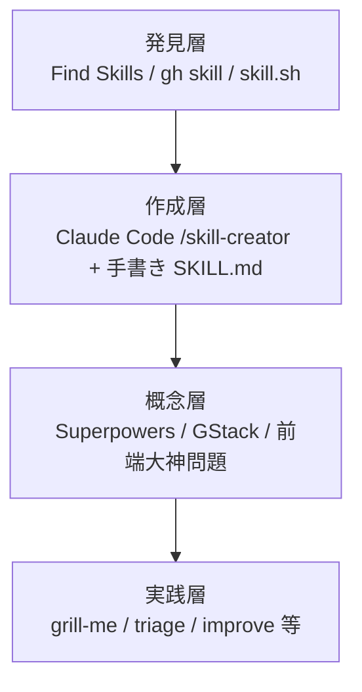
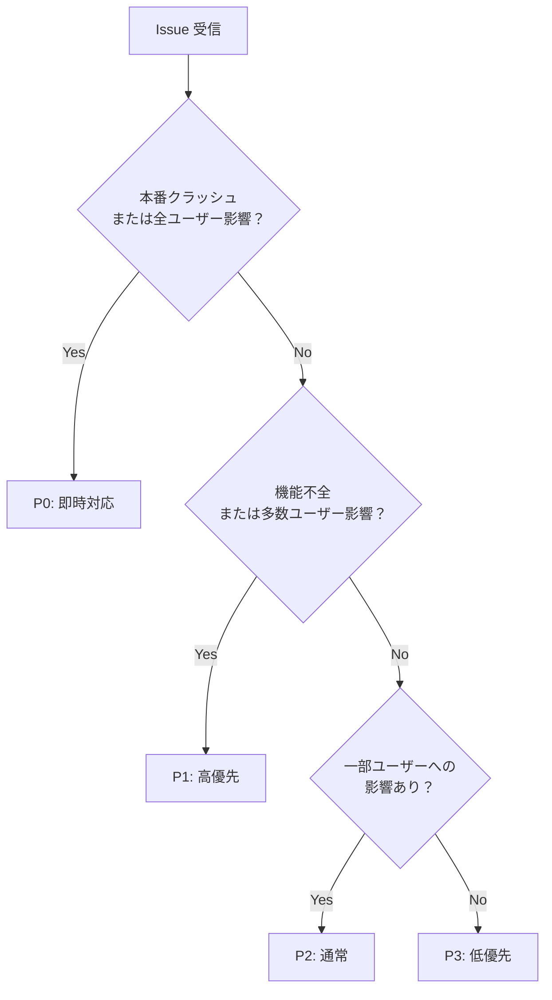
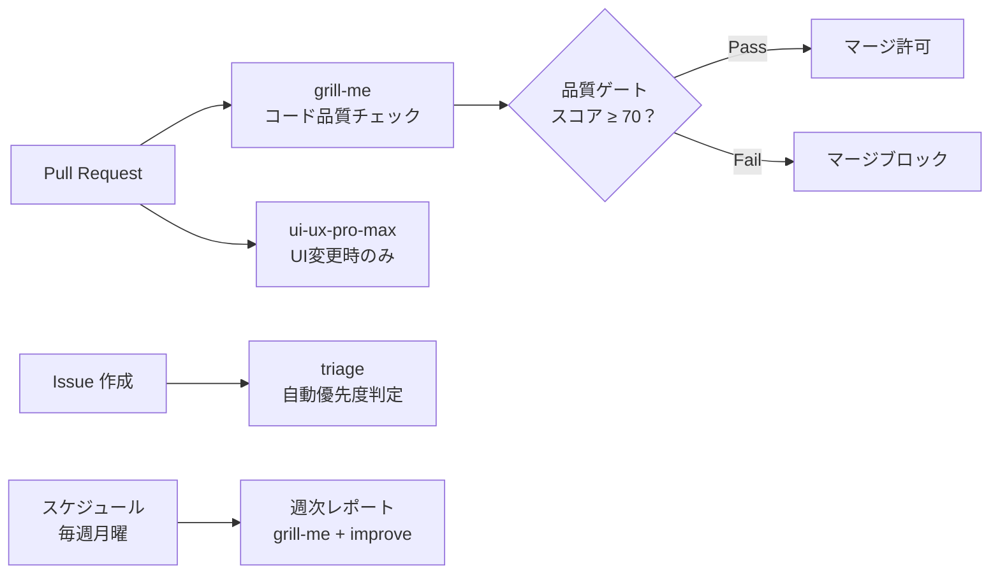

# Mermaid 図解改善設計書

**日付**: 2026-06-20  
**対象**: `docs/` 以下の全教材ファイル  
**目的**: テキスト/ASCII図を Mermaid に変換・バグ修正・新規追加で教材の視覚的品質を向上させる

---

## 実装フェーズ

案A（優先度順バッチ処理）で進める：
1. **フェーズ1**: バグ修正（1か所）
2. **フェーズ2**: テキスト → Mermaid 変換（7か所）
3. **フェーズ3**: 新規 Mermaid 追加（3か所）

---

## フェーズ1: バグ修正

### 対象ファイル
`docs/01-skill-creation/01-what-are-agent-skills.md`

### 問題
L17 の Mermaid コードブロック（`flowchart LR`）の閉じ ` ``` ` が欠落している。
`style CC fill:...` と `style COPILOT fill:...` の2行がブロック外に漏れており、レンダリングが壊れている。

### 修正内容
- `style COPILOT fill:#2DA44E,color:#fff,stroke:#333` の直後に ` ``` ` を追加
- これにより Mermaid ブロックが正しく閉じられ、style 宣言も有効になる

---

## フェーズ2: テキスト → Mermaid 変換

### 2-1. `docs/00-fundamentals/01-ecosystem-overview.md` — 4層アーキテクチャ

**対象**: L21〜40（ASCII アート4層スタック）  
**変換後**:


### 2-2. `docs/00-fundamentals/01-ecosystem-overview.md` — 学習パス

**対象**: L88〜91（`Part 0 ─→ Part 1 ─→ ...` テキスト）  
**変換後**: `flowchart LR` で Part 0〜5 を順にノード化

### 2-3. `docs/03-frameworks/01-superpowers.md` — 基本ワークフロー

**対象**: L261〜281（番号付き7ステップ、矢印テキスト）  
**変換後**: `flowchart TD` で①〜⑦を順にノード化し、依存関係を矢印で表現

### 2-4. `docs/03-frameworks/01-superpowers.md` — 自動起動フロー

**対象**: L345〜353（テキストフロー）  
**変換後**: `flowchart TD` に変換。ユーザー入力 → brainstorming → writing-plans → subagent-driven-development の流れを表現

### 2-5. `docs/03-frameworks/02-gstack-overview.md` — スプリントフロー

**対象**: L135（`Think → Plan → Build → Review → Test → Ship → Reflect`）  
**変換後**: `flowchart LR` で7フェーズをノード化し、各フェーズに代表スキル名を付記

### 2-6. `docs/04-skills-in-practice/09-problem-skill-mapping.md` — スキル選択フロー

**対象**: L114〜132（ASCII フローチャート）  
**変換後**: `flowchart TD` で分岐（コード品質/コンテンツ生成）を条件ノードで表現

### 2-7. `docs/02-discovery/01-find-skills.md` — 選定フロー

**対象**: L50〜52（`① 検索 ─→ ② 候補リストアップ ─→ ...` テキスト）  
**変換後**: `flowchart LR` で①〜⑥の6ステップをノード化

---

## フェーズ3: 新規 Mermaid 追加

### 3-1. `docs/04-skills-in-practice/01-grill-me.md` — Phase A→B→C 学習フロー

**配置場所**: 「## Phase A」の直前（概要セクション末尾）  
**追加内容**:


### 3-2. `docs/04-skills-in-practice/02-triage-issue-analysis.md` — P0〜P3 判定ロジック

**配置場所**: 「### 設計上の注目ポイント」の前  
**追加内容**:


### 3-3. `docs/06-advanced/02-ci-cd-integration.md` — CI/CD パイプライン統合図

**配置場所**: 「## CI/CD パイプラインへの統合」の冒頭（YAML コードの前）  
**追加内容**:


---

## 変換方針（共通）

- **情報量は変えない**: 既存テキストの内容をそのまま Mermaid に移す。情報の追加・削除はしない
- **スタイルは既存ファイルに合わせる**: 既存の Mermaid（`flowchart LR`/`graph TB`）のスタイルを踏襲
- **既存コードブロックとの区別**: Mermaid ブロックは `\`\`\`mermaid` で明示。bash/yaml などのコードブロックと混同しない
