# Agent Skills in Practice


> スキルを作り、見つけ、活用する — Claude Code と GitHub Copilot で始める実践ガイド

この教材は、Agent Skills オープンスタンダード（`agentskills.io`）に基づき、Claude Code の `/skill-creator` と GitHub Copilot Agent Skills の両方でスキルを開発・活用する方法を学べる実践ガイドです。

```
Author      : 杜 文吉
Organization: Duwenji Lab
Version     : 0.2.0
Updated     : 2026-06
Standard    : agentskills.io
```

---

## 本書の構成

| Part | タイトル | 学習時間 |
|------|---------|---------|
| Part 1 | 概要と環境準備 | 20分 |
| Part 2 | スキル作成入門 | 60分 |
| Part 3 | スキル発見と共有 | 60分 |
| Part 4 | フレームワーク：Superpowers と設計スキル | 40分 |
| Part 5 | 実践スキル実装編 | 180分 |
| Part 6 | コンテンツ生成スキル実践 | 90分 |
| Part 7 | 発展・応用 | 65分 |
| Part 8 | ドキュメントワークフロー自動化 | 60分 |
| **合計** | | **9時間** |

---

> **Note:** 本書は実践チュートリアルです。各 Part を順番に進めることで、スキル開発の基礎から応用まで体系的に学べます。

# 1. 概要と環境準備

## 1.1 1-1: Agent Skills エコシステムの全体像

> **学習時間**: 10分 | **難易度**: ⭐

### 1.1.1 概要

このチュートリアルは、**Agent Skills オープンスタンダード**（`agentskills.io`）に基づくスキル開発を学ぶ学習教材です。**Claude Code**（Anthropic）と **GitHub Copilot**（GitHub/Microsoft）の両方で使えるスキルを、実践的に習得します。

#### 1.1.1.1 学習目標

- Agent Skills エコシステムの全体像を理解する
- 4層構造の各層の役割を説明できる
- Claude Code と GitHub Copilot のスキル対応の違いを説明できる
- このチュートリアルの学習の流れを把握する

### 1.1.2 4層構造

この教材は以下の4層で構成されています：

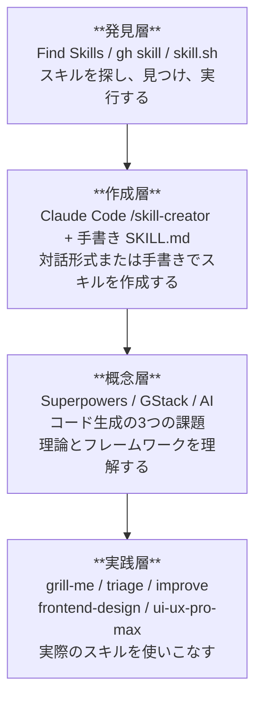

#### 1.1.2.1 発見層（Find Skills / gh skill / skill.sh）

GitHub エコシステム上で公開されているスキルを検索・発見するための機能です。GitHub.com 上の Find Skills 機能、`gh skill` CLI コマンド、そして skill.sh を使って、必要なスキルを素早く見つけることができます。

#### 1.1.2.2 作成層（Claude Code /skill-creator + 手書き SKILL.md）

スキルを作成する方法は2つあります：

1. **Claude Code の `/skill-creator`**: 対話形式でスキルを生成。ベストプラクティスに従った SKILL.md を自動生成し、テスト・評価・改善のサイクルを提供します。
2. **手書き SKILL.md**: テキストエディタで直接 SKILL.md を作成。両プラットフォームで共通のフォーマットです。

#### 1.1.2.3 概念層（Superpowers / GStack / フロントエンド開発の3つの課題）

スキルを効果的に活用するための理論的基盤です。ここでいう「フロントエンド開発の3つの課題」は、AIコード生成を使ってフロントエンド開発を進める際によく起きる3つの典型的な課題を指します。具体的には、理解のずれ・実行失敗・構造の問題です。

- **Superpowers**: Jesse Vincent 氏開発のコーディングエージェント向けプラグイン。開発プロセス全体の方法論を提供
- **GStack**: Generative AI Stack におけるスキルの位置づけ
- **フロントエンド開発の3つの課題**: AIコード生成における具体的な課題認識。後の章では「理解のずれ」「実行失敗」「構造の問題」として解説します

#### 1.1.2.4 実践層（8つの実践スキル）

この教材のメインコンテンツです。フロントエンド開発に特化した8つの実践スキルを学びます：

| スキル          | カテゴリ         | 用途           |
| --------------- | ---------------- | -------------- |
| grill-me        | 品質検証         | コードレビュー |
| triage          | 優先順位付け     | Issue分析      |
| improve         | リファクタリング | コード改善     |
| frontend-design | アーキテクチャ   | 設計支援       |
| ui-ux-pro-max   | デザイン改善     | UI/UX最適化    |

### 1.1.3 2つのプラットフォーム比較

| 観点                           | Claude Code (Anthropic)                   | GitHub Copilot (GitHub)               |
| ------------------------------ | ----------------------------------------- | ------------------------------------- |
| **スキル配置場所**       | `.claude/skills/<name>/SKILL.md`        | `.github/skills/<name>/SKILL.md`    |
| **個人用スキル**         | `~/.claude/skills/<name>/SKILL.md`      | `~/.copilot/skills/<name>/SKILL.md`（要確認）|
| **対話生成**             | `/skill-creator`（バンドルスキル）      | なし（手書きが基本）                  |
| **CLI検索**              | なし（手動配置）                          | `gh skill` コマンド                 |
| **バンドルスキル**       | `/code-review`, `/debug`, `/run` 等 | なし                                  |
| **動的コンテキスト注入** | `!` コマンド構文で対応                  | なし                                  |
| **サブエージェント実行** | 対応                                      | 対応（一部）                          |

### 1.1.4 学習の流れ


各 Part は基本的に独立していますが、Part 5（実践スキル）を最大限活用するには Part 2（スキル作成入門）を先に学ぶことを推奨します。

### 1.1.5 既存リポジトリとの差別化

| 観点               | github-copilot-skills-tutorial | 本教材                                                    |
| ------------------ | ------------------------------ | --------------------------------------------------------- |
| フォーカス         | Agent Skills 全般              | **クロスプラットフォーム**（Claude Code + Copilot） |
| スキル生成         | SKILL.md/JSONを手書き          | **Claude Code `/skill-creator`** + 手書き         |
| サンプルスキル     | 汎用的                         | **フロントエンド特化**                              |
| 問題認識           | なし                           | **フロントエンド開発の3つの課題** からスタート |
| 概念フレームワーク | なし                           | **Superpowers / GStack** を解説                     |

### 1.1.6 次のステップ

→ [1-2: 環境セットアップ](02-environment-setup.md) に進む

## 1.2 1-2: 環境セットアップ

> **学習時間**: 10分 | **難易度**: ⭐

### 1.2.1 前提条件

- **Claude Code ユーザー**: Anthropic アカウント + Claude Code がインストール済み
- **GitHub Copilot ユーザー**: GitHub アカウント（Copilot サブスクリプション付き）
- テキストエディタ（VS Code 推奨）
- （オプション）GitHub CLI（gh）がインストールされた環境

### 1.2.2 ステップ1: Claude Code のセットアップ

#### 1.2.2.1 Claude Code のインストール

```bash
# npm 経由でインストール（公式・推奨）
npm install -g @anthropic-ai/claude-code
```

> **注意**: Homebrew での `brew install claude-code` は公式サポート外です。npm を使ってください。

#### 1.2.2.2 スキルディレクトリの確認

Claude Code は自動的に以下のディレクトリからスキルを読み込みます：

| 種類 | パス | 適用範囲 |
|------|------|---------|
| 個人用 | `~/.claude/skills/<name>/SKILL.md` | 全プロジェクト |
| プロジェクト用 | `.claude/skills/<name>/SKILL.md` | そのプロジェクトのみ |

#### 1.2.2.3 動作確認

```bash
# Claude Code を起動
claude

# セッション内でバンドルスキルを確認
/help
```

### 1.2.3 ステップ2: GitHub Copilot のセットアップ

#### 1.2.3.1 スキルディレクトリの準備

GitHub Copilot では、リポジトリの `.github/skills/` ディレクトリにスキルを配置します：

```bash
# リポジトリのルートで実行
mkdir -p .github/skills/
```

#### 1.2.3.2 ディレクトリ構成例

```
.github/skills/
├── grill-me/
│   └── SKILL.md
├── triage/
│   └── SKILL.md
├── improve/
│   └── SKILL.md
├── frontend-design/
│   └── SKILL.md
└── ui-ux-pro-max/
    └── SKILL.md
```

#### 1.2.3.3 GitHub Copilot CLI の確認

```bash
# GitHub CLI がインストールされているか確認
gh --version

# GitHub アカウントにログイン（未ログインの場合）
gh auth login

# Copilot 拡張の確認（GitHub CLI v2.40+ で利用可能）
gh copilot --help
```

> **注意**: `gh skill` というコマンドは存在しません。GitHub CLI の Copilot 機能は `gh copilot` サブコマンドで提供されます。スキルファイルの管理は `.github/skills/` ディレクトリへの手動配置が基本です。

### 1.2.4 ステップ3: 両方の環境で使える共通スキルを作成する

このチュートリアルのサンプルスキルは、**Claude Code と GitHub Copilot の両方で動作する**ように設計されています。SKILL.md のフォーマットは Agent Skills オープンスタンダードに準拠しており、配置場所を変えるだけで両方のプラットフォームで使用できます。

#### 1.2.4.1 Claude Code で使う場合

```bash
# プロジェクト用（anthropics/skills の grill-me を例に）
mkdir -p .claude/skills/grill-me/
curl -o .claude/skills/grill-me/SKILL.md \
  https://raw.githubusercontent.com/anthropics/skills/main/skills/grill-me/SKILL.md
```

#### 1.2.4.2 GitHub Copilot で使う場合

```bash
mkdir -p .github/skills/grill-me/
curl -o .github/skills/grill-me/SKILL.md \
  https://raw.githubusercontent.com/anthropics/skills/main/skills/grill-me/SKILL.md
```

> **ヒント**: スキルファイルのパスはリポジトリ構造によって異なります。取得前に [anthropics/skills](https://github.com/anthropics/skills) でディレクトリ構造を確認してください。

### 1.2.5 トラブルシューティング

| 問題 | 原因 | 解決策 |
|------|------|--------|
| Claude Code が起動しない | インストール未完了 | `npm install -g @anthropic-ai/claude-code` を再実行 |
| スキルが認識されない | パスが間違っている | `.claude/skills/<name>/SKILL.md` のパスを確認 |
| Copilot がスキルを実行しない | スキル名が間違っている | `.github/skills/` のディレクトリ名とスキル名を確認 |
| `gh copilot` が使えない | GitHub CLI 未インストール・古いバージョン | `gh --version` で確認し、v2.40 以上にアップデート |

### 1.2.6 参考リンク

- [Claude Code ドキュメント](https://docs.anthropic.com/en/docs/claude-code/)
- [GitHub Copilot Agent Skills ドキュメント](https://docs.github.com/en/copilot/concepts/agents/about-agent-skills)
- [anthropics/skills（公式スキルリポジトリ）](https://github.com/anthropics/skills)
- [awesome-copilot（コミュニティスキル集）](https://github.com/github/awesome-copilot)

### 1.2.7 次のステップ

環境が整いました！次のセクションに進みましょう：

→ [2-1: Agent Skills とは](../02-skill-creation/01-what-are-agent-skills.md)

# 2. スキル作成入門

## 2.1 2-1: Agent Skills とは

> **学習時間**: 15分 | **難易度**: ⭐⭐

### 2.1.1 概要

**Agent Skills** は、AI エージェント（Claude Code、GitHub Copilot など）に特定のタスクを実行させるための指示書です。SKILL.md というファイルに手順やルールを記述し、エージェントが自動的に読み込んで実行します。

Agent Skills は **Agent Skills オープンスタンダード**（[agentskills.io](https://agentskills.io)）に基づく共通フォーマットで、複数の AI ツール間でスキルを共有できます。

### 2.1.2 こんな状況に刺さる

> 以下のどれかに当てはまったら、この章があなたの問題を解決します。

- **繰り返し作業を自動化したい開発者として**、Claude Codeに毎回同じ長いプロンプトを入力しており、「一度設定すれば動く仕組み」が欲しいとき
- **チームにAIツールを導入しようとしているリードとして**、Claude CodeとGitHub Copilotを統一した方法で管理したいが、やり方が分からないとき

### 2.1.3 スキルを作成する2つのアプローチ

#### 2.1.3.1 アプローチ1: skill-creator スキルによる対話生成（Claude Code）

Claude Code には **skill-creator** というバンドルスキルが標準搭載されています（[anthropics/skills](https://github.com/anthropics/skills/tree/main/skills/skill-creator)）。これはスキル作成のための本格的なフレームワークで、以下のプロセスを自動化します：


**使い方**:
```bash
# Claude Code を起動
claude

# セッション内で skill-creator を呼び出す
/skill-creator

# または自然言語で依頼
コードレビュースキルを作成して
```

skill-creator スキルは以下のような対話を開始します：

```
Claude: どんなスキルを作りましょうか？
以下の点を教えてください：
1. このスキルに何をさせたいですか？
2. どのようなタイミングで発動すべきですか？
3. 出力形式の希望はありますか？
4. テストケースは必要ですか？
```

##### 2.1.3.1.1 skill-creator の内部プロセス

skill-creator は単なる SKILL.md 生成ツールではなく、**スキル開発のライフサイクル全体**をカバーします：

| フェーズ | 内容 |
|---------|------|
| **1. 意図のヒアリング** | ユーザーの要件を対話で引き出す |
| **2. SKILL.md 作成** | ベストプラクティスに従った SKILL.md を生成 |
| **3. テストケース作成** | 2-3個の現実的なテストプロンプトを生成 |
| **4. 並列実行** | with-skill / baseline の両方を同時実行 |
| **5. 評価** | 定量的アサーション + 定性的レビュー |
| **6. 反復改善** | フィードバックに基づいてスキルを改善 |
| **7. Description最適化** | トリガー精度を自動最適化 |
| **8. パッケージング** | `.skill` ファイルとして出力 |

> **💡 補足**: skill-creator は Claude Code 専用のツールですが、**生成された SKILL.md は Agent Skills オープンスタンダードに準拠しているため、そのまま GitHub Copilot でも使用できます**。詳細は [2-2: skill-creator で最初のスキルを作る](02-skill-creator-hands-on.md) で学びます。

#### 2.1.3.2 アプローチ2: 手書き SKILL.md

テキストエディタで直接 SKILL.md を作成する方法です。両プラットフォーム（Claude Code / GitHub Copilot）で共通のフォーマットです。

```bash
# スキルディレクトリを作成
mkdir -p .claude/skills/my-skill/

# SKILL.md を作成
touch .claude/skills/my-skill/SKILL.md
```

### 2.1.4 2つのアプローチの比較

| 観点 | skill-creator（対話生成） | 手書き SKILL.md |
|------|--------------------------|----------------|
| 作成方法 | Claude Code に対話で指示 | テキストエディタで直接記述 |
| 学習曲線 | ほぼゼロ | YAML/Markdown の知識が必要 |
| テスト自動化 | 自動生成・並列実行 | 手動テスト |
| 評価・ベンチマーク | 内蔵（定量的+定性的） | なし |
| 反復改善 | 構造化されたループ | 手動 |
| Description最適化 | 自動（トリガー精度向上） | 手動調整 |
| 対応プラットフォーム | Claude Code のみ | Claude Code + GitHub Copilot |
| 適した用途 | 本格的なスキル開発 | シンプルなスキル、クロスプラットフォーム |

### 2.1.5 SKILL.md の基本構造

SKILL.md は YAML フロントマターと Markdown 本文の2部構成です：

```markdown

# スキル名

## 概要
このスキルが何をするかの説明。

## 手順
1. ステップ1
2. ステップ2
3. ステップ3

## 注意事項
- 注意点1
- 注意点2
```

#### 2.1.5.1 フロントマターの役割

`name` と `description` フィールドは特に重要です：

- **`name`**: スキルの識別子。ディレクトリ名と一致させる
- **`description`**: エージェントが「今の会話に関連するスキルかどうか」を判断するための説明文。具体的かつ検索性の高い記述が推奨される

#### 2.1.5.2 スキルのディレクトリ構造

```
my-skill/
├── SKILL.md           # メインの指示（必須）
├── scripts/           # 実行可能コード（任意）
├── references/        # 参照ドキュメント（任意）
└── assets/            # 出力用テンプレート等（任意）
```

### 2.1.6 設計の意図

#### 2.1.6.1 なぜ YAML フロントマターと Markdown 本文に分けるのか

2部構成（YAML メタデータと Markdown 本文を `---` で分けた構造）にしている理由: エージェントは `description` フィールドだけを読んで「このスキルを今読むべきか」を判断する。本文全体を読み込むのは確定してから行うため、2部に分けることでトークン（AI が一度に処理する文字・単語の単位。処理コストの基準になる）消費を抑えられる。

**代替案との比較**:
- メタデータを本文末尾に置く: 判定に必要な情報を最後まで読まないといけない
- JSON 形式のみ: 人間が読み書きしにくく、Markdown エディタでの編集体験が悪い

#### 2.1.6.2 なぜ description を name と別フィールドにするのか

`name`（スキルの識別子: ユーザーが `/スキル名` で呼び出すときに使う）と `description`（自動発動の判定基準: エージェントが「今の会話に関連するか」を判断するための説明文）は役割が異なる。同一フィールドにまとめると、名前が短いスキル（例: `review`）の自動発動精度が下がる。

### 2.1.7 スキルの配置場所

| 種類 | Claude Code | GitHub Copilot | 適用範囲 |
|------|-------------|----------------|---------|
| 個人用 | `~/.claude/skills/<name>/SKILL.md` | `~/.copilot/skills/<name>/SKILL.md`（要確認）| 全プロジェクト |
| プロジェクト用 | `.claude/skills/<name>/SKILL.md` | `.github/skills/<name>/SKILL.md` | そのプロジェクトのみ |
| プラグイン | `<plugin>/skills/<name>/SKILL.md` | なし | プラグイン有効時 |

### 2.1.8 スキルが使われるタイミング

スキルは以下の2つの方法で使われます：

1. **自動読み込み**: 会話の内容がスキルの `description` にマッチした場合、エージェントが自動的にスキルを読み込む
2. **明示的な呼び出し**: `/スキル名` で直接スキルを実行

### 2.1.9 この設計を変えるとき

- **プラットフォーム固有機能を使うとき**: `!` 構文（動的コンテキスト注入）など Claude Code 専用機能を使う場合、クロスプラットフォーム互換性が失われる。SKILL.md の冒頭に「Claude Code 専用」と明記してよい。
- **description を長くするとき**: 詳細な発動条件を書くほど自動読み込みの精度は上がるが、150 文字を超えると逆効果になることがある。`/skill-creator` の Description 最適化機能で適切な長さを確認してよい。

### 2.1.10 次のステップ

→ [2-2: skill-creator で最初のスキルを作る](02-skill-creator-hands-on.md)

## 2.2 2-2: skill-creator で最初のスキルを作る

> **学習時間**: 20分 | **難易度**: ⭐⭐

### 2.2.1 概要

このハンズオンでは、Claude Code にバンドルされている **skill-creator** スキルを使って、実際にスキルを作成します。skill-creator は [anthropics/skills](https://github.com/anthropics/skills/tree/main/skills/skill-creator) リポジトリで公開されている本格的なスキル開発フレームワークです。

### 2.2.2 ハンズオン: コードレビュースキルを作成する

#### 2.2.2.1 ステップ1: Claude Code を起動

```bash
# プロジェクトのルートで Claude Code を起動
cd your-project
claude
```

#### 2.2.2.2 ステップ2: skill-creator を呼び出す

Claude Code セッション内で以下のように入力します：

```
/skill-creator
```

または自然言語で直接依頼します：

```
コードレビュースキルを作成して
```

#### 2.2.2.3 ステップ3: skill-creator との対話

skill-creator が以下のような質問をしてくるので、順に回答します：

```
Claude: どんなスキルを作りましょうか？
以下の点を教えてください：
1. このスキルに何をさせたいですか？
2. どのようなタイミングで発動すべきですか？
3. 出力形式の希望はありますか？
4. テストケースは必要ですか？
```

**あなたの回答例**:
```
1. コードを可読性・パフォーマンス・セキュリティの3観点でレビューするスキル
2. プルリクエストのレビュー時や「このコードをレビューして」と言われたとき
3. JSON形式で、全体スコアと各観点のスコア、問題リストを含めて
4. はい、テストケースもお願いします
```

#### 2.2.2.4 ステップ4: SKILL.md の生成

skill-creator が SKILL.md のドラフトを生成します：

```
Claude: SKILL.md のドラフトを作成しました。
以下が生成された内容です：


# Code Review

## 概要
このスキルはコードを3つの観点でレビューし、JSON形式で結果を返します。

## 手順
1. レビュー対象のコードを分析する
2. 以下の観点で評価する：
   - 可読性: 命名、コメント、コード構造
   - パフォーマンス: 不要な処理、メモ化の機会
   - セキュリティ: インジェクション、認証の抜け
3. 各問題に重要度（critical/major/minor）を付ける
4. JSON形式で結果を出力する

## 出力形式
```json
{
  "summary": {
    "total_issues": 5,
    "overall_score": 72
  },
  "categories": {
    "readability": { "score": 80, "issues": [] },
    "performance": { "score": 65, "issues": [] },
    "security": { "score": 90, "issues": [] }
  }
}
```

この内容でよろしいですか？修正があれば教えてください。
```

#### 2.2.2.5 ステップ5: テストケースの実行

SKILL.md に問題がなければ、skill-creator がテストケースを生成し、並列実行します：

```
Claude: 以下の3つのテストケースを実行します：
1. シンプルな関数のレビュー
2. Reactコンポーネントのレビュー
3. セキュリティ問題を含むコードのレビュー

with-skill と baseline（スキルなし）の両方を同時に実行します...
```

実行が完了すると、評価結果がセッション内に表示されます：

```
Claude: テスト結果をまとめました。
「with-skill（スキルあり）」と「baseline（スキルなし）」の出力を比較できます。
確認が終わったら教えてください。
```

> **注意**: ブラウザベースの評価ビューアは skill-creator のバージョンによって利用できない場合があります。最新の動作は実際に `/skill-creator` を実行して確認してください。

#### 2.2.2.6 ステップ6: フィードバックと反復改善

結果を確認し、改善点があれば伝えます：

```
あなた: セキュリティの観点がもう少し詳細だと良いです。
具体的な脆弱性パターン（XSS, CSRF, SQLインジェクション）を
チェックするようにしてください。
```

skill-creator が SKILL.md を改善し、再度テストを実行します：

```
Claude: SKILL.md を更新しました。セキュリティ観点に
具体的な脆弱性パターンを追加しました。
再度テストを実行します...
```

このループを、満足する結果が得られるまで繰り返します。

#### 2.2.2.7 ステップ7: Description の最適化（オプション）

スキルが完成したら、Description の最適化を依頼できます：

```
あなた: description を最適化して
```

skill-creator が20個のトリガーテストクエリ（発動すべきケース8-10個 + 発動すべきでないケース8-10個）を生成し、自動最適化を実行します。

#### 2.2.2.8 ステップ8: スキルの確認と配布

完成したスキルを確認し、必要に応じて GitHub Copilot 用にコピーします：

```bash
# 生成されたスキルを確認
cat .claude/skills/code-review/SKILL.md

# GitHub Copilot 用にコピー
mkdir -p .github/skills/code-review/
cp .claude/skills/code-review/SKILL.md .github/skills/code-review/SKILL.md
```

> **補足**: skill-creator のバージョンによっては `.skill` ファイルへのパッケージング機能が提供される場合があります。実際の動作は `/skill-creator` を実行して確認してください。

### 2.2.3 skill-creator の活用範囲

| 目的 | 使うコマンド |
|------|------------|
| コードレビュースキルを作成する | `/skill-creator` |
| Issue分析スキルを作成する | `/skill-creator` |
| 既存のスキルを改善する | `/skill-creator` |
| スキルのトリガー精度を最適化する | `/skill-creator` |

### 2.2.4 よくある失敗と対策

| 失敗パターン | 原因 | 対策 |
|------------|------|------|
| skill-creator が反応しない | Claude Code のバージョンが古い | `claude --version` で確認、最新にアップデート |
| テストケースが多すぎる | 最初から多くのケースを指定 | 2-3個から始めて、後で追加 |
| 評価結果が見づらい | 出力が長い | 「比較表形式でまとめて」とセッション内で依頼 |
| スキルが複雑すぎる | 一度に多くの機能を要求 | シンプルに作ってから段階的に拡張 |

#### 2.2.4.1 ステップ9: 生成したスキルを GitHub Copilot でも使う

skill-creator で生成した SKILL.md は **Agent Skills オープンスタンダード**に準拠しているため、そのまま GitHub Copilot でも使用できます。以下の手順でコピーするだけです：

```bash
# 1. Claude Code 用に生成されたスキルを確認
ls .claude/skills/code-review/SKILL.md

# 2. GitHub Copilot 用のディレクトリを作成
mkdir -p .github/skills/code-review/

# 3. SKILL.md をコピー
cp .claude/skills/code-review/SKILL.md .github/skills/code-review/SKILL.md
```

以下のシーケンス図が、Claude Code での対話生成から GitHub Copilot での利用までの全体像を示しています：

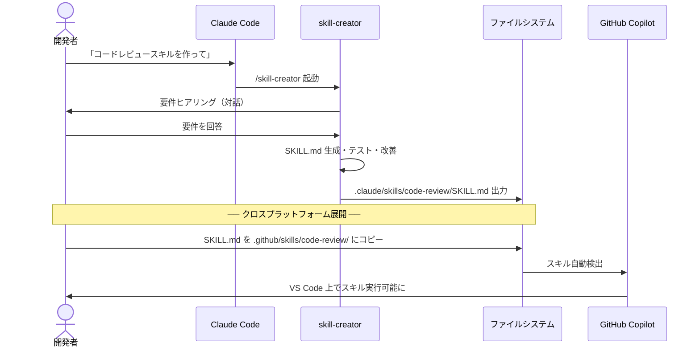

> **💡 ポイント**: skill-creator は Claude Code 専用のツールですが、**生成された SKILL.md は両プラットフォームで互換性があります**。Claude Code の対話生成力を活かしてスキルを作り、生成物を GitHub Copilot にコピーするのが最も効率的なワークフローです。

### 2.2.5 次のステップ

→ [2-3: SKILL.md のカスタマイズと最適化](03-skillmd-customization.md)


## 2.3 2-3: SKILL.md のカスタマイズと最適化

> **学習時間**: 15分 | **難易度**: ⭐⭐

### 2.3.1 概要

Claude Code の `/skill-creator` で生成した SKILL.md は、そのまま使用することも、手動で編集してカスタマイズすることもできます。このセクションでは、SKILL.md の構造を理解し、効果的にカスタマイズする方法を学びます。

### 2.3.2 SKILL.md の詳細構造

SKILL.md は YAML フロントマターと Markdown 本文の2部構成です：

```markdown

# スキル名

## 概要
このスキルが何をするかの説明。

## 手順
1. ステップ1
2. ステップ2
3. ステップ3

## 注意事項
- 注意点1
- 注意点2
```

#### 2.3.2.1 フロントマターの詳細

| フィールド | 必須 | 説明 |
|-----------|------|------|
| `description` | 推奨 | スキルの説明。エージェントが自動読み込みの判断に使用 |
| `name` | 任意 | 表示名（指定しない場合はディレクトリ名） |
| `tags` | 任意 | 検索用タグの配列 |

#### 2.3.2.2 description の書き方

`description` はスキルの自動読み込みに直接影響します：

```yaml
# ❌ 悪い例（曖昧すぎる）
description: コードを分析します

# ✅ 良い例（具体的）
description: コードを可読性・パフォーマンス・セキュリティの3観点でレビューし、JSON形式で結果を返します

# ✅ さらに良い例（利用シーンが明確）
description: プルリクエストのコード変更をレビューし、可読性・パフォーマンス・セキュリティの観点から問題を検出します
```

### 2.3.3 カスタマイズの実践

#### 2.3.3.1 1. 動的コンテキスト注入（Claude Code のみ）

Claude Code では、`!` 構文を使って動的にコンテキストを注入できます：

```markdown

# Summarize Changes

## コンテキスト
現在の変更内容：
!`git diff HEAD`

## 手順
1. 上記の差分を分析する
2. 以下の観点でリスクを評価する：
   - セキュリティへの影響
   - パフォーマンスへの影響
   - 後方互換性
3. 結果を Markdown 形式で出力する
```

`!` 構文を使うと、Claude Code が SKILL.md を読み込む前にコマンドを実行し、その出力をインライン展開します。これにより、常に最新のコンテキストでスキルが動作します。

#### 2.3.3.2 2. サポートファイルの追加

スキルディレクトリには SKILL.md 以外のファイルも配置できます：

```
my-skill/
├── SKILL.md           # メインの指示（必須）
├── instructions.md    # 追加の指示（任意）
├── template.md        # 出力テンプレート（任意）
├── examples/          # 使用例（任意）
│   ├── example1.js
│   └── example2.js
└── config.json        # 設定ファイル（任意）
```

#### 2.3.3.3 3. 呼び出し制御の設定

フロントマターで、誰がスキルを呼び出せるかを制御できます：

```yaml
```

| 値 | 動作 |
|----|------|
| `user` | ユーザーが `/スキル名` で明示的に呼び出した場合のみ実行 |
| `auto` | Claude が自動的に判断して実行（ユーザーは直接呼び出せない） |
| `both` | 両方可能（デフォルト） |

#### 2.3.3.4 4. ツールの事前承認

Claude Code では、スキルが使用するツールを事前承認できます：

```yaml
---
description: ファイルを読み書きするスキル
approved_tools:
  - Read
  - Write
  - Edit
---
```

事前承認されたツールは、実行時にユーザーの確認を求められません。

### 2.3.4 プラットフォーム間の互換性

| 機能 | Claude Code | GitHub Copilot |
|------|-------------|----------------|
| 基本 SKILL.md | ✅ 対応 | ✅ 対応 |
| description | ✅ 対応 | ✅ 対応 |
| 動的コンテキスト注入 (`!`) | ✅ 対応 | ❌ 非対応 |
| 呼び出し制御 (`invoke`) | ✅ 対応 | ❌ 非対応 |
| ツール事前承認 | ✅ 対応 | ❌ 非対応 |
| サポートファイル | ✅ 対応 | ✅ 対応 |

クロスプラットフォームで使う場合は、Claude Code 固有の機能（動的コンテキスト注入、呼び出し制御など）に依存しない SKILL.md を書きましょう。

### 2.3.5 カスタマイズのベストプラクティス

#### 2.3.5.1 ✅ 推奨

- **具体的な description を書く**: 自動読み込みの精度が向上
- **シンプルに始める**: 最小限の手順からスタート
- **段階的に拡張**: 必要に応じて機能を追加
- **使用例を含める**: 利用者が使い方を理解しやすい

#### 2.3.5.2 ❌ 非推奨

- **過度に複雑な手順**: シンプルさを保つ
- **曖昧な表現**: 「適切に」「必要に応じて」などの不明確な表現
- **プラットフォーム固有機能への過度な依存**: クロスプラットフォーム互換性を考慮

### 2.3.6 次のステップ

→ [2-4: スキル作成のベストプラクティス](04-best-practices.md)

## 2.4 2-4: スキル作成のベストプラクティス

> **学習時間**: 10分 | **難易度**: ⭐⭐

### 2.4.1 概要

効果的なスキルを作成するためのベストプラクティスを紹介します。プロンプト設計から反復改善サイクル、品質評価までをカバーします。

### 2.4.2 こんな状況に刺さる

> 以下のどれかに当てはまったら、この章があなたの問題を解決します。

- **スキルを自作したことがある開発者として**、作ったスキルが期待通りに自動発動せず、なぜ発動しないのか分からないとき
- **チームのスキルを管理しているリードとして**、スキルが増えてきたが品質のばらつきが出始め、レビュー基準を作りたいとき
- **スキルをOSSで公開しようとしている開発者として**、他の人が安心して使えるスキルの設計指針が知りたいとき

### 2.4.3 効果的な SKILL.md の設計

#### 2.4.3.1 基本の型

```markdown

# [スキル名]

## 概要
このスキルが何をするか、どのような場面で使うかを簡潔に説明。

## 手順
1. ステップ1
2. ステップ2
3. ステップ3

## 出力形式
期待される出力の説明。

## 注意事項
- 注意点1
- 注意点2
```

#### 2.4.3.2 良い SKILL.md と悪い SKILL.md

```markdown
# ✅ 良い例

# Code Review

## 手順
1. 変更されたコードを分析する
2. 以下の観点で評価する：
   - 可読性: 命名、コメント、コード構造
   - パフォーマンス: 不要な処理、メモ化の機会
   - セキュリティ: インジェクション、認証の抜け
3. 各問題に重要度（critical/major/minor）を付ける
4. JSON形式で結果を出力する
```

```markdown
# ❌ 悪い例

# Code Review

コードをレビューして結果を返してください。
適切に判断して出力してください。
```

### 2.4.4 反復改善サイクル

スキルは一度作って終わりではなく、使うたびに改善していくものです：

```
① 初期作成 ─→ ② テスト実行 ─→ ③ 結果確認 ─→ ④ 改善
    ↑                                            │
    └────────────────────────────────────────────┘
```

#### 2.4.4.1 改善のパターン

**手順の追加**
```markdown
# 改善前
## 手順
1. コードを分析する

# 改善後
## 手順
1. コードを分析する
2. 可読性・パフォーマンス・セキュリティの3観点で評価する
3. 各問題に重要度を付ける
```

**description の最適化**
```yaml
# 改善前（自動読み込みされにくい）
description: コードレビュー

# 改善後（自動読み込みされやすい）
description: プルリクエストのコード変更をレビューし、可読性・パフォーマンス・セキュリティの観点から問題を検出します
```

### 2.4.5 設計の意図

#### 2.4.5.1 なぜ単一責任の原則をスキルに適用するのか

単一責任の原則（1 つのモジュールが 1 つの関心事だけを担う設計原則）をスキルに適用する理由: 「コードレビュー＋テスト生成＋ドキュメント作成」を 1 スキルにまとめると、`description` が長くなり自動発動の精度が下がる。また、一部の機能だけ使いたい場合に分割できない。

**代替案との比較**:
- 多機能スキル: セットアップが 1 回で済むが、不要な機能が常に実行される
- 機能ごとに独立したスキル（推奨）: `description` が短く精度が上がり、組み合わせが自由になる

#### 2.4.5.2 なぜ description の最適化を反復サイクルに組み込むのか

スキルを一度作って `description` を固定する設計では、実際の使用パターンと自動発動条件がずれていく。反復改善サイクル（作成→テスト→確認→改善のループ）の中に `description` の見直しを組み込むことで、トリガー精度（`description` がスキル自動読み込みを正確に判断できる度合い）を継続的に保てる。

### 2.4.6 スキル品質評価チェックリスト

#### 2.4.6.1 基本品質チェック

- [ ] スキルの目的が明確か
- [ ] description が具体的で検索性が高いか
- [ ] 手順が具体的で実行可能か
- [ ] 出力形式が明確に指定されているか
- [ ] 使用例が記載されているか

#### 2.4.6.2 実用品質チェック

- [ ] 実際のユースケースで期待通り動作するか
- [ ] エッジケースで適切に動作するか
- [ ] 出力結果が一貫しているか
- [ ] 他のスキルと組み合わせて使えるか
- [ ] クロスプラットフォームで動作するか

### 2.4.7 スキル設計の原則

#### 2.4.7.1 1. 単一責任の原則
1つのスキルは1つのことを得意とするように設計します。

```
✅ 良い: 「コードレビュースキル」
❌ 悪い: 「コードレビュー + テスト生成 + ドキュメント作成スキル」
```

#### 2.4.7.2 2. 明確な契約
入力と出力の契約を明確に定義します。利用者が「何を渡せば、何が返ってくるか」を一目で理解できるように。

#### 2.4.7.3 3. エラーに強い設計
空入力、不正な入力、予期しない入力に対して適切に振る舞うようにします。

#### 2.4.7.4 4. 段階的拡張
シンプルに作ってから、必要に応じて機能を追加します。最初から完璧を目指さない。

#### 2.4.7.5 5. プラットフォーム互換性
可能な限り、Claude Code と GitHub Copilot の両方で動作するように設計します。プラットフォーム固有の機能（動的コンテキスト注入など）は、どうしても必要な場合のみ使用します。

### 2.4.8 この設計を変えるとき

- **複合スキルを作るとき**: 「設計→実装→テスト」を一貫して行うスキルが必要な場合、単一責任を意図的に緩めてよい。ただしその場合は `invoke: user` に設定して手動呼び出し専用にし、自動発動を無効にすること。
- **クロスプラットフォームを諦めるとき**: `!` 構文や `approved_tools` など Claude Code 固有機能を使う場合、GitHub Copilot での動作が保証されなくなる。SKILL.md の冒頭に「Claude Code 専用」と明記すること。

### 2.4.9 次のステップ

Part 2 の学習が完了しました。次の Part に進みましょう：

→ [Part 3: スキル発見と共有](../03-discovery/01-find-skills.md)

# 3. スキル発見と共有

## 3.1 3-1: Find Skills でスキルを探す

> **学習時間**: 15分 | **難易度**: ⭐⭐

> 💡 **環境セットアップは不要です** — Find Skills は GitHub.com 上の機能のため、ブラウザと GitHub アカウント（Copilot サブスクリプション付き）があればすぐに使えます。見つけたスキルをインポートして使う場合は、事前に [1-2: 環境セットアップ](../01-fundamentals/02-environment-setup.md) を済ませておくとスムーズです。

### 3.1.1 概要

**Find Skills** は、GitHub.com 上で公開されているスキルを検索・発見するための機能です。他の開発者が作成したスキルを探したり、自分のスキルを公開して共有したりできます。

### 3.1.2 Find Skills の使い方

#### 3.1.2.1 GitHub.com での検索

1. [GitHub.com](https://github.com) にログイン
2. Copilot Editor を開く（GitHub.com 上のチャットインターフェース）
3. チャット入力欄に以下のように入力してスキルを検索：

> `@copilot コードレビューのスキルを探して`

または、より具体的に：

> `@copilot Reactのアクセシビリティチェックスキルを探して`

#### 3.1.2.2 検索結果の見方

Find Skills は以下の情報を表示します：

- スキル名と説明
- タグ（カテゴリ）
- 作者（公開元）
- 評価・使用統計
- 最終更新日

### 3.1.3 スキルの選び方

#### 3.1.3.1 評価基準

| 基準 | 確認ポイント |
|------|------------|
| 目的の一致 | 自分のユースケースに合致しているか |
| 品質 | 説明が明確で、使用例が充実しているか |
| メンテナンス | 最終更新日が新しいか |
| 人気 | 使用されている実績があるか |
| 互換性 | 自分の技術スタックと合っているか |

#### 3.1.3.2 選定フロー


### 3.1.4 スキルのインポート方法

見つけたスキルを自分のリポジトリに取り込むには：

#### 3.1.4.1 方法1: 手動コピー

1. スキルの SKILL.md の内容をコピー
2. 自分のリポジトリの `.github/skills/<スキル名>/SKILL.md` にペースト
3. 必要に応じてカスタマイズ

#### 3.1.4.2 方法2: GitHub のフォーク

1. スキルが含まれるリポジトリをフォーク
2. 必要なスキルのみを自分のリポジトリにコピー

#### 3.1.4.3 方法3: submodule として追加

```bash
git submodule add https://github.com/username/skills-repo.git .github/skills/
```

### 3.1.5 スキルの公開

自分のスキルを公開するには：

1. スキルを `.github/skills/` に配置したリポジトリを作成
2. リポジトリを公開（Public）
3. Find Skills が自動的にインデックス

#### 3.1.5.1 公開のベストプラクティス

- **明確な説明**: スキルの目的と使い方を簡潔に
- **適切なタグ**: 検索されやすいタグを設定
- **使用例**: 具体的な使用例を複数記載
- **バージョン管理**: CHANGELOG で更新履歴を管理

### 3.1.6 次のステップ

→ [3-2: gh コマンドによるスキル検索](02-skill-sh-cli.md)

## 3.2 3-2: gh コマンドによるスキル検索

> **学習時間**: 10分 | **難易度**: ⭐⭐

### 3.2.1 概要

GitHub CLI（`gh`）を使って、GitHub 上で公開されているスキルを検索・取得する方法を学びます。`gh` は GitHub が公式に提供する CLI ツールで、リポジトリ検索からファイル取得まで一貫して対応できます。

### 3.2.2 前提条件

- GitHub CLI（gh v2.40 以上）がインストールされている
- `gh auth login` でログイン済み
- Copilot サブスクリプションが有効

### 3.2.3 インストール確認

```bash
# バージョン確認（v2.40 以上を推奨）
gh --version

# 未インストール・古いバージョンの場合
# macOS
brew install gh

# Windows
winget install GitHub.cli

# Ubuntu / Debian
sudo apt install gh

# ログイン
gh auth login
```

### 3.2.4 スキルの検索

#### 3.2.4.1 トピック検索でスキルを探す

```bash
# "agent-skills" トピックで公開スキルを検索
gh search repos --topic agent-skills --limit 20

# "copilot-skills" トピックでも検索
gh search repos --topic copilot-skills --limit 20

# キーワードを絞り込む
gh search repos --topic agent-skills frontend --limit 10
```

#### 3.2.4.2 著名なスキルリポジトリを確認する

```bash
# Anthropic 公式スキル（skill-creator, grill-me など）
gh repo view anthropics/skills

# コミュニティスキル集
gh repo view github/awesome-copilot --readme
```

### 3.2.5 スキルの取得

#### 3.2.5.1 方法1: リポジトリをクローンして必要スキルをコピー

```bash
# 公式リポジトリをクローン
gh repo clone anthropics/skills /tmp/anthropic-skills

# 必要なスキルを Claude Code 用にコピー
mkdir -p .claude/skills/grill-me/
cp /tmp/anthropic-skills/skills/grill-me/SKILL.md .claude/skills/grill-me/SKILL.md

# GitHub Copilot 用にもコピー
mkdir -p .github/skills/grill-me/
cp .claude/skills/grill-me/SKILL.md .github/skills/grill-me/SKILL.md
```

#### 3.2.5.2 方法2: GitHub API 経由で直接取得（Linux / macOS）

```bash
# gh api でファイルの内容を取得し、base64 デコードして保存
mkdir -p .claude/skills/grill-me/
gh api repos/anthropics/skills/contents/skills/grill-me/SKILL.md \
  --jq '.content' | base64 -d > .claude/skills/grill-me/SKILL.md
```

#### 3.2.5.3 方法3: curl で直接ダウンロード

```bash
mkdir -p .claude/skills/grill-me/
curl -o .claude/skills/grill-me/SKILL.md \
  https://raw.githubusercontent.com/anthropics/skills/main/skills/grill-me/SKILL.md
```

> **パス確認**: `raw.githubusercontent.com` の URL はリポジトリのディレクトリ構造に依存します。取得前にブラウザまたは `gh repo view` でパスを確認してください。

### 3.2.6 一括取得の実践例

```bash
# 複数スキルをまとめてインストール
gh repo clone anthropics/skills /tmp/anthropic-skills

for skill in grill-me triage improve; do
  mkdir -p ".claude/skills/$skill"
  cp "/tmp/anthropic-skills/skills/$skill/SKILL.md" ".claude/skills/$skill/SKILL.md" \
    && echo "✅ $skill インストール完了" \
    || echo "❌ $skill が見つかりません（パスを確認）"
done
```

### 3.2.7 主なコマンド一覧

| コマンド | 説明 | 使用例 |
|---------|------|--------|
| `gh search repos` | リポジトリをキーワード/トピックで検索 | `gh search repos --topic agent-skills` |
| `gh repo view` | リポジトリの詳細・README を表示 | `gh repo view anthropics/skills` |
| `gh repo clone` | リポジトリをクローン | `gh repo clone anthropics/skills` |
| `gh api` | GitHub API 経由でファイルを取得 | `gh api repos/owner/repo/contents/path` |
| `gh auth login` | GitHub アカウントにログイン | `gh auth login` |

### 3.2.8 トラブルシューティング

| 問題 | 原因 | 解決策 |
|------|------|--------|
| `gh` が見つからない | GitHub CLI 未インストール | `winget install GitHub.cli` または `brew install gh` |
| 認証エラー | ログインしていない | `gh auth login` を実行 |
| 検索結果が少ない | トピック未設定のリポジトリが多い | `--topic` なしのキーワード検索も試す |
| `base64 -d` が使えない | Windows 環境 | 方法1（クローン）または方法3（curl）を使う |
| コピー先パスが違う | リポジトリ構造が変わった | `gh repo view` でディレクトリ構造を確認 |

### 3.2.9 次のステップ

→ [3-3: スキルの共有とチーム展開](03-sharing-team-deployment.md)

## 3.3 3-3: スキルの共有とチーム展開

> **学習時間**: 15分 | **難易度**: ⭐⭐

### 3.3.1 概要

作成したスキルをチームで共有・展開する方法を学びます。Personal Skills、shared-copilot-skills、Git submodule の3つの戦略を状況に応じて使い分けることで、効率的なスキル管理が可能になります。

### 3.3.2 3つの共有戦略

| 戦略 | 適用範囲 | 難易度 | 推奨シーン |
|------|---------|--------|-----------|
| Personal Skills | 個人 | ⭐ | 個人利用、実験 |
| shared-copilot-skills | チーム | ⭐⭐ | チーム内共有 |
| Git submodule | 組織全体 | ⭐⭐⭐ | 組織全体での標準化 |

### 3.3.3 戦略1: Personal Skills

個人の開発環境でスキルを管理する最もシンプルな方法です。

#### 3.3.3.1 設定方法

```bash
# Windows
mkdir -p %USERPROFILE%\.copilot\skills\
copy SKILL.md %USERPROFILE%\.copilot\skills\my-skill\

# macOS / Linux
mkdir -p ~/.copilot/skills/
cp SKILL.md ~/.copilot/skills/my-skill/
```

#### 3.3.3.2 メリット・デメリット

- ✅ 設定が最も簡単
- ✅ 個人の実験に最適
- ❌ チーム共有不可
- ❌ バックアップが必要

### 3.3.4 戦略2: shared-copilot-skills

チームで共有するスキルリポジトリを作成し、全メンバーが参照できるようにします。

#### 3.3.4.1 リポジトリ構成例

```
shared-copilot-skills/
├── README.md
├── skills/
│   ├── grill-me/
│   │   └── SKILL.md
│   ├── triage/
│   │   └── SKILL.md
│   └── improve/
│       └── SKILL.md
└── CONTRIBUTING.md
```

#### 3.3.4.2 セットアップ手順

1. 共有リポジトリを作成
2. スキルを `skills/` ディレクトリに配置
3. チームメンバーにリポジトリのアクセス権を付与
4. 各メンバーが Personal Skills として参照設定

#### 3.3.4.3 運用ルール例

```markdown
## スキル追加フロー
1. Issue でスキル提案
2. チームレビュー
3. PR 作成
4. 承認後マージ
5. チームメンバーに通知

## バージョン管理
- スキルは Semantic Versioning に従う
- CHANGELOG に変更履歴を記載
- 破壊的変更はメジャーバージョンアップ
```

### 3.3.5 戦略3: Git submodule

組織全体でスキルを標準化する場合に有効です。

#### 3.3.5.1 セットアップ

```bash
# スキルリポジトリを submodule として追加
git submodule add https://github.com/org/shared-copilot-skills.git .github/skills/

# 特定のバージョンで固定
cd .github/skills/
git checkout v1.2.0
cd ../..

# 変更をコミット
git add .gitmodules .github/skills/
git commit -m "Add shared skills submodule (v1.2.0)"
```

#### 3.3.5.2 更新手順

```bash
# 最新版に更新
git submodule update --remote .github/skills/

# 特定のバージョンに更新
cd .github/skills/
git fetch --tags
git checkout v2.0.0
cd ../..
git add .github/skills/
git commit -m "Update shared skills to v2.0.0"
```

### 3.3.6 戦略の選び方

```
個人で使いたい？
├── Yes → Personal Skills
└── No → チームで使いたい？
         ├── 小規模チーム（〜10人）→ shared-copilot-skills
         └── 大規模組織 → Git submodule
```

### 3.3.7 次のステップ

→ [Part 4: 概念フレームワーク](../04-frameworks/01-superpowers.md)

## 3.4 3-4: baoyu-skills で学ぶ実践的スキル発見

> **学習時間**: 15分 | **難易度**: ⭐⭐

### 3.4.1 概要

ここまで Find Skills や skill.sh の使い方を学びました。このセクションでは、**実際に GitHub 上で公開されている人気スキルリポジトリ**を題材に、スキル発見の実践練習を行います。

題材とするのは **JimLiu/baoyu-skills**（21,000+ Stars）です。このリポジトリは21のスキルを3カテゴリで提供しており、スキル発見・評価・選択の良い教材となります。

### 3.4.2 baoyu-skills とは

**baoyu-skills** は、Jim Liu 氏が開発した AI エージェント（Claude Code, Codex 等）向けのスキル集です。

| 項目 | 内容 |
|------|------|
| **リポジトリ** | [github.com/JimLiu/baoyu-skills](https://github.com/JimLiu/baoyu-skills) |
| **スター数** | 21,000+ |
| **スキル数** | 21 |
| **言語** | TypeScript（Bun ランタイム） |
| **ライセンス** | MIT-0 |
| **インストール** | `npx skills add jimliu/baoyu-skills` |

#### 3.4.2.1 3つのカテゴリ

baoyu-skills は以下の3カテゴリで構成されています：

| カテゴリ | 説明 | スキル数 |
|---------|------|---------|
| **Content Skills** | コンテンツ生成・公開（画像、スライド、漫画、図表、SNS投稿） | 7 |
| **AI Generation Skills** | AI 生成バックエンド（画像生成、Web経由生成） | 3 |
| **Utility Skills** | コンテンツ処理（変換、圧縮、翻訳、公開） | 11+ |

### 3.4.3 実践: baoyu-skills を探索する

#### 3.4.3.1 ステップ1: リポジトリを調査する

まずはリポジトリの全体像を把握しましょう。GitHub 上で以下の情報を確認します：

1. **README.md** — リポジトリの説明、インストール方法、全スキル一覧
2. **スキル構成** — `skills/` ディレクトリに各スキルが配置されている
3. **スキル定義** — 各スキルフォルダ内の `SKILL.md` がスキルの実体

```bash
# GitHub CLI でリポジトリ情報を確認
gh repo view JimLiu/baoyu-skills

# スキル一覧を取得
gh api repos/JimLiu/baoyu-skills/contents/skills --jq '.[].name'
```

#### 3.4.3.2 ステップ2: スキルを評価する

スキルを選ぶ際の評価基準を、baoyu-skills を例に確認します：

| 評価基準 | baoyu-skills での確認ポイント |
|---------|---------------------------|
| **目的の一致** | 自分のユースケースに合うカテゴリがあるか |
| **品質** | 各スキルの説明が明確で、使用例が充実しているか |
| **メンテナンス** | 最終更新日が新しいか、CHANGELOG が整備されているか |
| **人気** | 21,000+ Stars は信頼性の指標 |
| **互換性** | Claude Code / Codex / Cursor など複数エージェント対応 |

#### 3.4.3.3 ステップ3: スキルをインストールする

baoyu-skills は複数の方法でインストールできます：

```bash
# 方法1: npx skills add（推奨）
npx skills add jimliu/baoyu-skills

# 方法2: Claude Code プラグインとして
# Claude Code セッション内で以下を実行
/plugin marketplace add JimLiu/baoyu-skills
/plugin install baoyu-skills@baoyu-skills

# 方法3: エージェントに直接依頼
# 「Please install Skills from github.com/JimLiu/baoyu-skills」
```

#### 3.4.3.4 ステップ4: スキルを選定する

21ものスキルがある場合、**全てをインストールする必要はありません**。必要なスキルだけを選びましょう。

**ユースケース別おすすめスキル**:

| 目的 | おすすめスキル |
|------|--------------|
| 技術記事に図解を入れたい | baoyu-diagram, baoyu-infographic |
| ブログのカバー画像を作りたい | baoyu-cover-image |
| プレゼン資料を作りたい | baoyu-slide-deck |
| 知識を漫画で伝えたい | baoyu-comic |
| SNS 投稿用画像を作りたい | baoyu-xhs-images |
| 記事を翻訳したい | baoyu-translate |
| Markdown を HTML に変換したい | baoyu-markdown-to-html |

### 3.4.4 baoyu-skills の設計パターン

baoyu-skills の各スキルは、以下の共通パターンで設計されています。これはスキル開発の参考にもなります：

```
skills/baoyu-<name>/
├── SKILL.md          # スキル定義（YAML front matter + 説明）
├── scripts/          # 実行スクリプト（TypeScript / Bun）
├── references/       # 参考資料
└── prompts/          # プロンプトテンプレート
```

#### 3.4.4.1 SKILL.md の構造例

baoyu-skills の SKILL.md は以下のような frontmatter 構造です：

```yaml
---
name: baoyu-diagram
description: Generates publication-ready SVG diagrams from source material. Use when user asks to create diagrams, flowcharts, architecture diagrams, or visual explanations.
version: 1.0.0
metadata:
  openclaw:
    homepage: https://github.com/JimLiu/baoyu-skills#baoyu-diagram
    requires:
      anyBins:
        - bun
        - npx
---
```

**各フィールドのルール**:
- `name`: 64文字以内、小文字英数字とハイフンのみ、`baoyu-` プレフィックス必須
- `description`: 1024文字以内、三人称で記述（"Generates..." / "Use when..."）
- `version`: semver 形式
- `metadata.openclaw.requires.anyBins`: スクリプト実行に必要なランタイム

### 3.4.5 学びのポイント

baoyu-skills を題材にすることで、以下のスキル発見の実践が身につきます：

1. **README の読み解き方** — リポジトリの説明から必要なスキルを見極める
2. **スキルの評価基準** — Stars 数だけでなく、メンテナンス状況や品質も確認する
3. **部分的な導入** — 全てをインストールせず、必要なスキルだけを選ぶ判断力
4. **設計パターンの学習** — 優れたスキルリポジトリから設計パターンを学ぶ

### 3.4.6 次のステップ

→ [Part 4: 概念フレームワークと課題認識](../04-frameworks/01-superpowers-overview.md)

---

> **💡 参考リンク**: [JimLiu/baoyu-skills](https://github.com/JimLiu/baoyu-skills) | [npx skills](https://www.npmjs.com/package/skills)

# 4. 概念フレームワークと課題認識

## 4.1 4-1: Superpowers — コーディングエージェントの開発方法論

> **学習時間**: 20分 | **難易度**: ⭐⭐

### 4.1.1 エージェントが「暴走」したことはないですか？

Claude Code や GitHub Copilot を使い始めて、こんな経験をしたことはないでしょうか。

---

**シーン1：仕様を聞かずに実装が始まった**

> 「ユーザー認証機能を追加して」

そう頼んだら、エージェントはすぐにコードを書き始めました。
30分後、できあがったのは「メールアドレス＋パスワード認証」。
でも欲しかったのは「GitHub OAuth」でした。

---

**シーン2：「完了」と言ったのに動かなかった**

> 「テストを追加して」

エージェントは「テストを追加しました！」と報告。
実行してみると、テストが存在しないファイルを参照していてエラー。
「完了」は嘘でした。

---

**シーン3：バグを直したら別の場所が壊れた**

> 「このバグを修正して」

エージェントは修正しました。でも原因を調べずに症状だけを隠したため、
同じバグが別の形で翌日また現れました。

---

これらは「エージェントが賢くない」のではありません。
**エージェントが「段取り」を知らずに動いているのが原因です。**

### 4.1.2 こんな状況に刺さる

> 以下のどれかに当てはまったら、Superpowers があなたの問題を解決します。

- **エージェントを使い始めた開発者として**、指示なしに実装が走り出してしまい、意図と違う成果物が完成するまで気づかないとき
- **チームにエージェントを導入しようとしているリードとして**、各メンバーがバラバラな方法でエージェントを使っており、品質にムラが出ているとき
- **大規模なリファクタリングを計画している開発者として**、エージェントに大きな変更を任せたいが途中で迷走しないか不安なとき

### 4.1.3 エージェントの標準動作は「即コード」

人間のエンジニアなら、機能追加を頼まれたとき自然にこうします：

1. 要件を確認する（何を作るのか、制約は何か）
2. 設計を考える（どう実装するか複数案を比較）
3. 計画を立てる（どの順番で、どのファイルを触るか）
4. 実装する
5. 動作確認する

ところがエージェントの標準動作は違います：

1. 指示を受ける
2. **即コードを書く** ← ここで①〜③がすっ飛ぶ

これは設計ではなく、**デフォルトの習慣**の問題です。
エージェントに「考えてから動く」という習慣を持たせる方法があります。
それが **Superpowers** です。

### 4.1.4 Superpowers — エージェントに「段取り」を教えるプラグイン

**Superpowers** は、Jesse Vincent 氏（Prime Radiant）が開発した
**コーディングエージェント向けの開発方法論プラグイン**です。

- **リポジトリ**: [github.com/obra/superpowers](https://github.com/obra/superpowers)

インストールするだけで、エージェントの動作が変わります：

| 標準のエージェント | Superpowers 導入後 |
|------------------|------------------|
| 指示を受けたら即コードを書く | まず要件と設計を確認する |
| 「完了」と言って動かないことがある | 検証を終えるまで完了と言えない |
| バグを症状だけ隠して終わる | 原因を究明してから直す |
| 大きな変更を一気に行う | 小さなタスクに分割して順番に進める |

> 公式 README より：「Superpowers is a complete software development methodology for your coding agents, built on top of a set of composable skills and some initial instructions that make sure your agent uses them.」

#### 4.1.4.1 仕組み：スキルという設計図

Superpowers は複数の**スキル**（作業手順の定義ファイル）で構成されています。エージェントは状況を判断し、適切なスキルを自動的に起動します。

#### 4.1.4.2 用語の説明

Superpowers を理解する上で重要な用語を説明します：

| 用語 | 説明 |
|------|------|
| **Plugin（プラグイン）** | エージェントに追加機能を提供する拡張モジュール。Superpowers 自体がプラグインとして提供され、インストールすることでエージェントに開発方法論を追加する。 |
| **Plugin Marketplace（プラグインマーケットプレイス）** | プラグインを配布・インストールするための公式ストア。Claude Code には Anthropic 公式のマーケットプレイスがあり、`/plugin install` コマンドでインストールできる。 |
| **Skill（スキル）** | エージェントに特定の手順・作業フローを覚えさせるための定義ファイル（SKILL.md）。Superpowers は複数のスキルを組み合わせて構成されている。 |
| **Subagent（サブエージェント）** | メインのエージェントから起動される子エージェント。独立したコンテキストを持ち、親セッションの履歴を継承せずにタスクを実行する。 |
| **HARD-GATE** | Superpowers のスキル内に定義された強制ゲート。特定の条件（例：設計承認）を満たすまで、次のアクション（例：コードを書く）を禁止する仕組み。 |
| **Worktree（git worktree）** | Git の機能で、同じリポジトリから独立した作業ディレクトリを複数作成できる。Superpowers はこれを利用して、クリーンな状態で開発を開始する。 |

### 4.1.5 対応エージェントとインストール方法

Superpowers は特定のエージェントに依存せず、複数のコーディングエージェントに対応しています：

| エージェント | インストール方法 |
|------------|----------------|
| **Claude Code** | `/plugin install superpowers@claude-plugins-official` |
| **Codex CLI** | `/plugins` → `superpowers` を検索 |
| **Codex App** | サイドバーの Plugins からインストール |
| **Factory Droid** | `droid plugin marketplace add https://github.com/obra/superpowers` |
| **Gemini CLI** | `gemini extensions install https://github.com/obra/superpowers` |
| **OpenCode** | `.opencode/INSTALL.md` の手順に従う |
| **Cursor** | `/add-plugin superpowers` |
| **GitHub Copilot CLI** | `copilot plugin install superpowers@superpowers-marketplace` |

### 4.1.6 実際の使い方

#### 4.1.6.1 Claude Code での使い方

Claude Code（ターミナル上の CLI エージェント）で Superpowers を使う手順です。

**1. インストール**

```bash
# Claude Code を起動
claude

# Claude Code のセッション内で以下のコマンドを実行
/plugin install superpowers@claude-plugins-official

# プラグインをリロード
/reload-plugins
```

インストール後、`~/.claude/settings.json` の `enabledPlugins` に自動追記されます：

```json
{
  "enabledPlugins": {
    "superpowers@claude-plugins-official": true
  }
}
```

**2. 基本的な使い方**

インストール後は特別な操作は不要です。普段通りに Claude Code に指示を出すだけで、Superpowers のスキルが自動的に起動します：

```bash
# 例1: 機能追加を依頼 → brainstorming が自動起動
claude "このプロジェクトにユーザー認証機能を追加して"

# 例2: バグ修正を依頼 → systematic-debugging が自動起動
claude "ログインボタンをクリックしても何も起きないバグを直して"

# 例3: 明示的にスキルを呼び出す場合
/brainstorming "検索機能の設計について相談したい"
```

#### 4.1.6.2 VS Code + GitHub Copilot での使い方

VS Code 上の GitHub Copilot で Superpowers を使う場合、対応しているのは **GitHub Copilot CLI**（ターミナル上の CLI モード）のみです。VS Code のチャット画面（`Ctrl+I` や `@Copilot`）では直接動作しません。

**1. GitHub Copilot CLI のインストール**

```bash
# GitHub Copilot CLI をインストール（VS Code とは別に CLI ツールが必要）
npm install -g @githubnext/github-copilot-cli

# 認証設定
github-copilot-cli auth
```

**2. Superpowers プラグインのインストール**

```bash
# GitHub Copilot CLI に Superpowers マーケットプレイスを登録
copilot plugin marketplace add obra/superpowers-marketplace

# Superpowers をインストール
copilot plugin install superpowers@superpowers-marketplace
```

**3. GitHub Copilot CLI で使用**

```bash
# GitHub Copilot CLI を起動
copilot

# 通常通り指示を出す（Superpowers が自動起動）
"このプロジェクトにテストを追加して"
```

**4. VS Code 上の GitHub Copilot との違い**

| 環境 | Superpowers の対応 |
|------|------------------|
| **GitHub Copilot CLI**（ターミナル） | ✅ 対応。プラグインとしてインストール可能 |
| **VS Code Copilot チャット**（`Ctrl+I`） | ❌ 非対応。プラグイン機構がない |
| **VS Code Copilot エージェントモード**（`Ctrl+Shift+I`） | ❌ 非対応。プラグイン機構がない |

> **💡 補足**: VS Code 上の GitHub Copilot では Superpowers プラグインは動作しませんが、本チュートリアルで学ぶ **Agent Skills（`.github/skills/` に配置する SKILL.md）** は VS Code 上でも `@skill-name` で呼び出せます。Superpowers の設計思想を参考に、Copilot 用のスキルを自作することが本チュートリアルの目的です。

#### 4.1.6.3 インストールの確認方法

Superpowers が正しくインストールされたか確認するには、以下のコマンドを実行します：

```bash
# Claude Code の場合
/plugin list
# → 一覧に superpowers@claude-plugins-official が表示されれば成功

# GitHub Copilot CLI の場合
copilot plugin list
# → 一覧に superpowers@superpowers-marketplace が表示されれば成功
```

### 4.1.7 同じ依頼で何が変わるのか

#### 4.1.7.1 Before：Superpowers なし

```
$ claude "TODOアプリにタグ付け機能を追加して"

Claude: わかりました。タグ付け機能を実装します。
[すぐにコードを書き始める]
... 30分後 ...
Claude: 実装が完了しました！
$ # → 動作確認なし。仕様の確認なし。設計の検討なし。
```

#### 4.1.7.2 After：Superpowers あり

```
$ claude "TODOアプリにタグ付け機能を追加して"

Claude: タグ付け機能について確認します。
        タグはユーザーが自由に入力できますか？
        それとも事前定義されたタグから選択しますか？

あなた: 自由入力でお願いします

Claude: ありがとうございます。3つの実装案を比較してみましょう...
        [設計の選択肢を提示]

あなた: 案2で進めてください

Claude: 実装計画を作成しました。以下の5タスクに分割します：
        1. データモデルの追加（Tag テーブル）
        2. API エンドポイントの実装
        ...
        [タスク1を実行 → 動作確認 → タスク2を実行...]

Claude: 全タスク完了しました。テストを実行して確認します...
        ✅ 全テスト通過を確認しました。
```

違いは「賢さ」ではなく「プロセスの有無」です。

### 4.1.8 基本ワークフロー

Superpowers は以下の一連の流れで動作します：

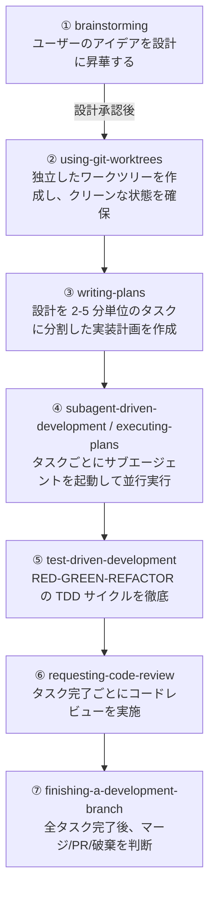

### 4.1.9 スキル一覧（リファレンス）

> 必要なときに参照してください。最初から全部覚える必要はありません。

#### 4.1.9.1 設計・計画

- **brainstorming** — 実装前に要件と設計を整理する。ソクラテス式の対話を通じてアイデアを洗練し、複数の実現方法を比較検討した上でユーザーの承認を得る。**HARD-GATE** により、設計承認なしに実装コードを書くことを禁止する。
- **writing-plans** — 合意した設計を 2-5 分単位の小さなタスクに分割。各タスクには変更ファイルのパス、コード内容、確認方法を含める。

#### 4.1.9.2 実装

- **executing-plans** — 実装計画をチェックポイントを挟みながらバッチ実行する。人間の確認を挟みながら進める。
- **subagent-driven-development** — タスクごとに**フレッシュなサブエージェント**を起動し、2段階レビュー（仕様準拠 → コード品質）を実施。サブエージェントは親セッションの履歴を継承せず、必要な情報だけを正確に注入する。これにより、エージェントが数時間単位で自律的に作業を継続できる。
- **dispatching-parallel-agents** — 複数のサブエージェントを並列で動作させる。

#### 4.1.9.3 テスト

- **test-driven-development** — RED（失敗テストを書く）→ GREEN（最小限のコードで通す）→ REFACTOR のサイクルを強制。テストより先に実装コードを書くことを禁止する。テストのアンチパターン集も含まれる。

#### 4.1.9.4 デバッグ

- **systematic-debugging** — バグ遭遇時に4フェーズで原因究明を進める：
  1. **根本原因の調査**: エラーメッセージの精読、再現条件の特定、最近の変更の確認
  2. **パターン分析**: 類似問題の有無、共通原因の確認
  3. **仮説の立案と検証**: 検証可能な仮説を立てて確認
  4. **修正の実装**: 根本原因に対する修正のみを行う

  **Core principle:** 「原因究明が終わるまで修正に手を出してはいけない。対症療法は失敗である。」

- **verification-before-completion** — 「完了した」と宣言する前に検証コマンドを実行し、証拠を示すまで完了宣言を禁止する。「主張するなら必ず証拠を示せ」。

#### 4.1.9.5 コードレビュー

- **requesting-code-review** — コードレビューを依頼する前のチェックリストを自動実行。Critical な問題は進行をブロックする。
- **receiving-code-review** — レビュー指摘への対応を整理する。

#### 4.1.9.6 Git 運用

- **using-git-worktrees** — 独立した git worktree を作成し、クリーンな状態で開発を開始。既存のブランチに影響を与えず、プロジェクトのセットアップとテストのベースライン確認を自動実行する。
- **finishing-a-development-branch** — 作業終了時にテストを検証し、マージ/PR化/ブランチ維持/破棄の判断を行い、worktree を後片付けする。

#### 4.1.9.7 メタ

- **writing-skills** — 独自スキルを正しく作るためのガイド。設計手順、記述方法、テスト手順を体系的に説明。
- **using-superpowers** — Superpowers 自体の使い方を学ぶチュートリアルスキル。

### 4.1.10 設計の意図

#### 4.1.10.1 なぜワークフローを7段階のスキルに分割するのか

7段階（brainstorming・worktree・計画・実装・テスト・レビュー・完了の一連のフロー）を 1 つのスキルにまとめず分割している理由: 各段階は独立して使える。「設計だけ Superpowers、実装は通常モード」という部分採用が可能で、チームへの段階的導入ができる。また各スキルのコンテキストが小さくなり、エージェントの推論精度が上がる。

**代替案との比較**:
- 1 つの大スキルで全段階をカバー: セットアップが楽だが、途中から参加したチームメンバーが学習しにくい
- スキルなしで自然言語プロンプトだけで制御: 毎回同じ指示を書く必要があり、指示のブレが生じる

#### 4.1.10.2 なぜ HARD-GATE を使うのか

HARD-GATE（特定の条件を満たすまで次のアクションを禁止する強制ゲート）を使う理由: 「設計なしに実装を始める」という最も多いエージェントの失敗パターンを、ルールではなく構造で防ぐ。エージェントが「うっかり」実装に移れないようにする。

**代替案との比較**:
- CLAUDE.md への指示のみ: エージェントが状況によって指示を無視することがある
- ユーザーが毎回口頭で制止する: 自動化の恩恵が薄れ、人的コストがかかる

### 4.1.11 哲学

Superpowers は以下の原則に基づいて設計されています：

| 原則 | 内容 |
|------|------|
| **Test-Driven Development** | 常にテストを先に書く |
| **Systematic over ad-hoc** | 当てずっぽうではなくプロセスに従う |
| **Complexity reduction** | シンプルさを最優先する |
| **Evidence over claims** | 完了を宣言する前に検証する |

### 4.1.12 自動起動の仕組み

Superpowers の最大の特徴は、スキルが**状況に応じて自動的に起動する**点です。

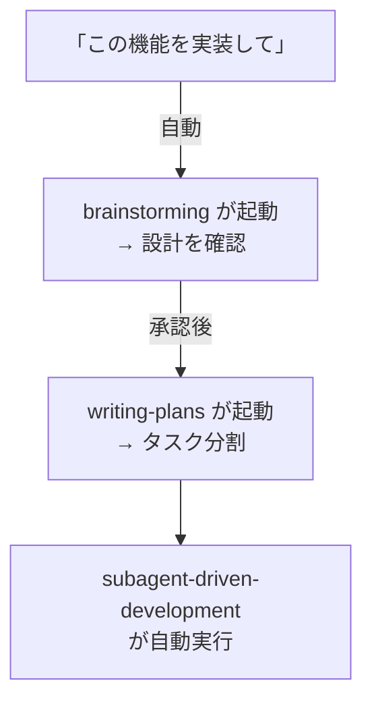

明示的に `/brainstorming` のようにスラッシュコマンドで呼び出すことも可能ですが、基本的にはエージェントが自律的に判断して適切なスキルを起動します。毎回指示しなくても、エージェントが段取りを踏んでくれる設計です。

### 4.1.13 GitHub Copilot Skills との関係

Superpowers の「スキル」は、GitHub Copilot の Agent Skills と概念的には似ていますが、以下の違いがあります：

| 観点 | Superpowers | GitHub Copilot Skills |
|------|------------|----------------------|
| **目的** | 開発プロセス全体の方法論 | 特定タスクの能力拡張 |
| **起動方法** | 状況に応じて**自動起動** | ユーザーが**明示的に呼び出す**（`@skill-name`） |
| **カバー範囲** | 設計→実装→テスト→デバッグ→レビュー→git運用 | コードレビュー、Issue分析、改善提案など |
| **設定場所** | プラグインとしてインストール | `.github/skills/` に SKILL.md を配置 |

両者は「スキルによってエージェントに能力を追加する」という点で共通しており、Superpowers の**設計原則（1スキル1能力、明確な入出力、段階的拡張、組み合わせ可能性）** は、GitHub Copilot のスキル開発にも応用できます。

### 4.1.14 このチュートリアルでの位置づけ

本チュートリアルは GitHub Copilot の Agent Skills に焦点を当てていますが、Superpowers は以下の点で参考になります：

1. **スキル設計のベストプラクティス** — 各スキルの SKILL.md は、高品質なスキル定義の実例として学びがある
2. **開発プロセスの自動化思想** — エージェントに「考えさせる」プロセス設計は、Copilot のスキル作成にも応用可能
3. **スキル間の連携パイプライン** — 複数スキルをチェーンさせる設計は、本チュートリアルの Part 6（パイプライン連携）の参考になる

> **📖 参考**: [obra/superpowers README](https://github.com/obra/superpowers) | [Release Announcement](https://blog.fsck.com/2025/10/09/superpowers/) | [Claude Plugin Marketplace](https://claude.com/plugins/superpowers)

### 4.1.15 この設計を変えるとき

- **ワークフローを短縮するとき**: 小規模な修正（1 ファイル・1 関数の変更）では brainstorming をスキップして writing-plans から始めてよい。ただし要件が曖昧な場合は省略しないこと。
- **HARD-GATE を緩めるとき**: 熟練した開発者だけのチームで設計合意が口頭で取れている場合、HARD-GATE の強制を外してもよい。ただしその場合でも「実装前に設計を言語化する」習慣は維持すること。

### 4.1.16 次のステップ

→ [4-2: gstack: Garry Tan の Claude Code スキルセット](02-gstack-overview.md)

## 4.2 4-2: gstack — Garry Tan の Claude Code スキルセット

> **学習時間**: 15分 | **難易度**: ⭐⭐

### 4.2.1 AIに「全部やって」と頼んでいませんか？

エージェントを使い始めると、こんな状況に気づきます。

---

**シーン1：AIが自分のコードを自分でレビューした**

> 「このコードをレビューして」

エージェントは丁寧にレビューしました。「問題ありません、よく書けています」。
でもそのコードを書いたのも同じAIです。
設計の意図も、妥協の経緯も、全部知っている「本人」が審査しています。

---

**シーン2：「なぜこうなったのか」が誰にもわからない**

> 「この機能を設計して、実装して」

AIは設計し、実装しました。でも1週間後に仕様が変わったとき、
「なぜこのアーキテクチャを選んだのか」を説明できるものが何もありませんでした。
設計者と実装者が同一人物だったからです。

---

**シーン3：QAもセキュリティも「自己申告」だった**

> 「テストして、問題なければリリースして」

AIは「テスト済み、問題なし」と報告しました。
でも本番環境に出すと、SQLインジェクションの脆弱性が見つかりました。
セキュリティの観点で見るAIと、コードを書いたAIが同じだったのです。

---

これは「AIが賢くない」のではありません。
**1人の人間に、設計者・実装者・QA・セキュリティ監査を同時に兼任させているのが問題です。**
人間のチームでは当然やる「役割分担」が、エージェントには存在しないのです。

### 4.2.2 gstack — AIエージェントを「仮想チーム」に変える

**gstack** は、Y Combinator の President & CEO **Garry Tan** が開発した
**Claude Code 向けのオープンソーススキルセット**です。

- **リポジトリ**: [github.com/garrytan/gstack](https://github.com/garrytan/gstack)
- **ライセンス**: MIT
- **スター数**: 109,000+（2026年6月時点）
- **構成**: 23の専門家ロールスキル + 8のパワーツール

gstack のアイデアはシンプルです。
1人のAIに全役割を任せるのではなく、**役割ごとに専門のスキルを用意する**。

```
/office-hours      → 今日のCEO役：「本当にそれを作るべきか？」
/plan-eng-review   → 今日のEM役：「技術的に実現可能か？」
/qa                → 今日のQAリード役：「本当に動いているか？」
/cso               → 今日のセキュリティ担当役：「脆弱性はないか？」
```

これにより Claude Code が「1人のアシスタント」から
「**CEO・エンジニアリングマネージャー・QAリード・セキュリティオフィサーを擁する仮想エンジニアリングチーム**」に変わります。

#### 4.2.2.1 Garry Tan の実績

Garry Tan は YC の CEO としてフルタイムで働きながら、gstack を使って60日間で以下の成果を上げています：

| 指標 | 数値 |
|------|------|
| **期間** | 60日間 |
| **出荷したプロダクションサービス** | 3 |
| **出荷した機能** | 40+ |
| **論理コード生産量（2013年比）** | **810倍** |
| **2026年の貢献数** | 1,237（2026年4月時点） |
| **総コード行数** | 600K+ 行 |
| **テストカバレッジ向上** | 35% |

> 「LOC（コード行数）批判は、AIで行数が水増しされるという点では間違っていない。しかし、インフレ調整後の生産性が落ちているという点では間違っている。私は**大幅に**生産性が上がっている。」 — Garry Tan

> 「私は2013年12月以来、おそらく一行もコードをタイプしていない。これは極めて大きな変化だ」 — Andrej Karpathy（OpenAI共同創業者）

### 4.2.3 同じ依頼で何が変わるのか

#### 4.2.3.1 Before：gstack なし

```
$ claude "毎日のカレンダーブリーフィングアプリを作りたい"

Claude: わかりました。実装します。
[設計の確認なし、代替案の提示なし、すぐに実装開始]
... 2時間後 ...
Claude: 実装が完了しました！
$ # → 「それはパーソナルチーフオブスタッフAIでは？」
  # → 「通知機能は？音声読み上げは？ユーザーが本当に欲しいものは？」
  # → 誰も聞かなかった。
```

#### 4.2.3.2 After：gstack あり

```
$ /office-hours
Claude（CEO役）: 「毎日のカレンダーブリーフィングアプリ」と言いましたが、
                 実際にあなたが説明したのは「パーソナルチーフオブスタッフAI」です。

                 6つの質問に答えてください：
                 1. 誰のためのツールですか？（あなた個人？チーム？）
                 2. 一番の「痛み」は何ですか？
                 ...
                 [隠れた要件を抽出、前提に挑戦、3つの実装アプローチを工数付きで提案]
                 → 設計ドキュメントを自動生成

$ /plan-eng-review
Claude（EM役）: 技術的な実現可能性を確認します。
               APIレート制限とコスト試算を見てください...

$ /qa
Claude（QAリード役）: 実際のブラウザでテストします。
                     バグを1件発見。アトミックコミットで修正します...

$ /ship
Claude（リリースエンジニア役）: 全チェックリストを確認。マージします。✅
```

役割が分かれると、**それぞれの専門家が本来の仕事をする**ようになります。

### 4.2.4 スプリントの流れ

gstack はスプリントの流れに沿って設計されています：


各スキルは前のスキルの出力を次のスキルが読み取る形で連携します。`/office-hours` が設計ドキュメントを書き、`/plan-ceo-review` がそれを読み、`/review` がバグを検出し、`/ship` が修正を確認します。

### 4.2.5 全スキル一覧（概要）

> 必要なときに参照してください。最初から全部覚える必要はありません。

gstack は **23の専門家ロールスキル + 8のパワーツール** で構成されています。スプリントの流れに沿って以下のフェーズに分類されます：

| フェーズ | 主要スキル | 役割 |
|---------|-----------|------|
| **Think** | `/office-hours` | YC オフィスアワー — 6つの強制質問でプロダクトを再定義 |
| **Plan** | `/plan-ceo-review`, `/plan-eng-review`, `/plan-design-review`, `/autoplan` | CEO/EM/デザイナーによる多層レビュー |
| **Build** | `/design-shotgun`, `/design-html`, `/spec` | モックアップ生成→本番HTML変換 |
| **Review** | `/review`, `/investigate`, `/codex` | スタッフエンジニアレビュー、デバッグ、セカンドオピニオン |
| **Test** | `/qa`, `/browse`, `/benchmark`, `/cso` | 実ブラウザQA、パフォーマンス計測、セキュリティ監査 |
| **Ship** | `/ship`, `/land-and-deploy`, `/canary` | マージ→デプロイ→本番監視 |
| **Reflect** | `/retro`, `/learn`, `/document-release` | 振り返り、ナレッジ蓄積、ドキュメント更新 |

**パワーツール**: `/careful`（破壊的コマンド警告）, `/freeze`（編集ロック）, `/guard`（両方）, `/pair-agent`（マルチエージェント連携）

**iOS スキル**（v1.43.0.0+）: `/ios-qa`, `/ios-fix`, `/ios-design-review`, `/ios-clean`

> 各スキルの詳細は [github.com/garrytan/gstack](https://github.com/garrytan/gstack) を参照してください。

### 4.2.6 主要スキルの詳細

#### 4.2.6.1 `/office-hours` — YC オフィスアワー

gstack のエントリーポイント。コードを書く前に「何を作るべきか」を問い直します。

```
あなた: 毎日のカレンダーブリーフィングアプリを作りたい
Claude: 「『毎日のブリーフィングアプリ』と言いましたが、
        実際にあなたが説明したのはパーソナルチーフオブスタッフAIです」
        [5つの隠れた要件を抽出]
        [4つの前提にチャレンジ]
        [3つの実装アプローチを工数見積もり付きで提案]
        → 設計ドキュメントを自動生成
```

#### 4.2.6.2 `/plan-ceo-review` — CEO レビュー

プロダクトの視点から計画をレビュー。4つのモードがあります：

| モード | 説明 |
|--------|------|
| **Expansion** | 「もっと大きく考えよう」— リクエストの裏にある10xプロダクトを探す |
| **Selective Expansion** | 特定の部分だけ拡張 |
| **Hold Scope** | 現状のスコープを維持 |
| **Reduction** | 「これは本当に必要か？」— 削れるものを特定 |

#### 4.2.6.3 `/review` — コードレビュー

CIでは見つからない本番環境で壊れるバグを発見します。自動修正可能な問題は自動で修正し、判断が必要なものはフラグを立てます。

#### 4.2.6.4 `/qa` — QA テスト

実際のブラウザを起動してアプリをテストします。バグを見つけると：
1. アトミックコミットで修正
2. 回帰テストを自動生成
3. 修正を再検証

#### 4.2.6.5 `/careful` / `/freeze` / `/guard` — セーフティ

| コマンド | 機能 |
|---------|------|
| `be careful` | 破壊的コマンドの前に警告 |
| `/freeze` | 編集を1ディレクトリに制限 |
| `/guard` | 両方を同時有効化 |

#### 4.2.6.6 `/design-shotgun` → `/design-html` — デザインパイプライン

```
あなたのアイデア
    ↓
/design-shotgun: 4-6種類のモックアップを生成 → ブラウザで比較
    ↓ フィードバック
/design-shotgun: 改善版を再生成（味覚記憶が学習）
    ↓ 承認
/design-html: 本番品質のHTMLに変換（Pretextレイアウト）
```

### 4.2.7 インストール方法

#### 4.2.7.1 30秒クイックスタート

Claude Code を開いて以下のコマンドを実行するだけです：

```bash
git clone --single-branch --depth 1 \
  https://github.com/garrytan/gstack.git \
  ~/.claude/skills/gstack \
  && cd ~/.claude/skills/gstack \
  && ./setup
```

**必要条件**: Claude Code, Git, Bun v1.0+, Node.js（Windowsのみ）

#### 4.2.7.2 チームモード（推奨）

リポジトリ内で以下のコマンドを実行すると、チーム全員が自動的にgstackを使えるようになります：

```bash
(cd ~/.claude/skills/gstack && ./setup --team) \
  && ~/.claude/skills/gstack/bin/gstack-team-init required \
  && git add .claude/ CLAUDE.md \
  && git commit -m "require gstack for AI-assisted work"
```

#### 4.2.7.3 VS Code での利用について

gstack は **Claude Code（ターミナル上のCLI）** を主ターゲットとして設計されています。VS Code 上の環境では、以下のように**使える場所と使えない場所**があります：

```
┌─────────────────────────────────────────────────┐
│                  VS Code                         │
│                                                  │
│  ┌───────────────────┐  ┌───────────────────┐   │
│  │ チャット画面       │  │ 統合ターミナル     │   │
│  │ (Ctrl+I)          │  │                    │   │
│  │                   │  │  $ claude          │   │
│  │  ❌ gstack非対応   │  │  ───────────────  │   │
│  │                   │  │  Claude Code起動    │   │
│  │  @skill-name      │  │  ↓                 │   │
│  │  (Copilot Skills) │  │  /office-hours ✅  │   │
│  │  は使える          │  │  /plan-ceo ✅     │   │
│  └───────────────────┘  │  /review ✅        │   │
│                          │  /qa ✅            │   │
│                          │  /ship ✅          │   │
│                          └───────────────────┘   │
│                                                  │
│  ┌───────────────────┐  ┌───────────────────┐   │
│  │ エージェントモード  │  │ サイドパネル      │   │
│  │ (Ctrl+Shift+I)    │  │ (@Copilot)        │   │
│  │  ❌ gstack非対応   │  │  ❌ gstack非対応   │   │
│  └───────────────────┘  └───────────────────┘   │
└─────────────────────────────────────────────────┘
```

| 環境 | gstack の対応 |
|------|-------------|
| **VS Code 統合ターミナル + Claude Code CLI** | ✅ 対応。ターミナル上で `claude` を起動して使用 |
| **VS Code 統合ターミナル + Cursor CLI** | ✅ 対応。`--host cursor` でインストール |
| **VS Code 統合ターミナル + Codex CLI** | ✅ 対応。`--host codex` でインストール |
| **VS Code Copilot チャット**（`Ctrl+I`） | ❌ 非対応。プラグイン機構がない |
| **VS Code Copilot エージェントモード**（`Ctrl+Shift+I`） | ❌ 非対応 |
| **VS Code サイドパネル**（`@Copilot`） | ❌ 非対応 |

> **💡 ポイント**: VS Code 上で gstack を使うには、**統合ターミナル**（`` Ctrl+` ``）で Claude Code や Codex CLI を起動し、そのセッション内で gstack のスラッシュコマンドを使用します。VS Code のチャット画面では動作しませんが、ターミナル上の CLI エージェントであれば問題なく利用できます。

#### 4.2.7.4 マルチエージェント対応

gstack は Claude Code だけでなく、10種類のAIコーディングエージェントに対応しています：

| エージェント | フラグ |
|------------|--------|
| OpenAI Codex CLI | `--host codex` |
| OpenCode | `--host opencode` |
| Cursor | `--host cursor` |
| Factory Droid | `--host factory` |
| Slate | `--host slate` |
| Kiro | `--host kiro` |
| Hermes | `--host hermes` |
| GBrain (mod) | `--host gbrain` |

### 4.2.8 Superpowers との比較

gstack と Superpowers（3-1で学んだJesse Vincentの開発方法論）は、どちらも「スキルによってAIエージェントを強化する」という点で共通しますが、アプローチが異なります。

#### 4.2.8.1 起動方式の違い

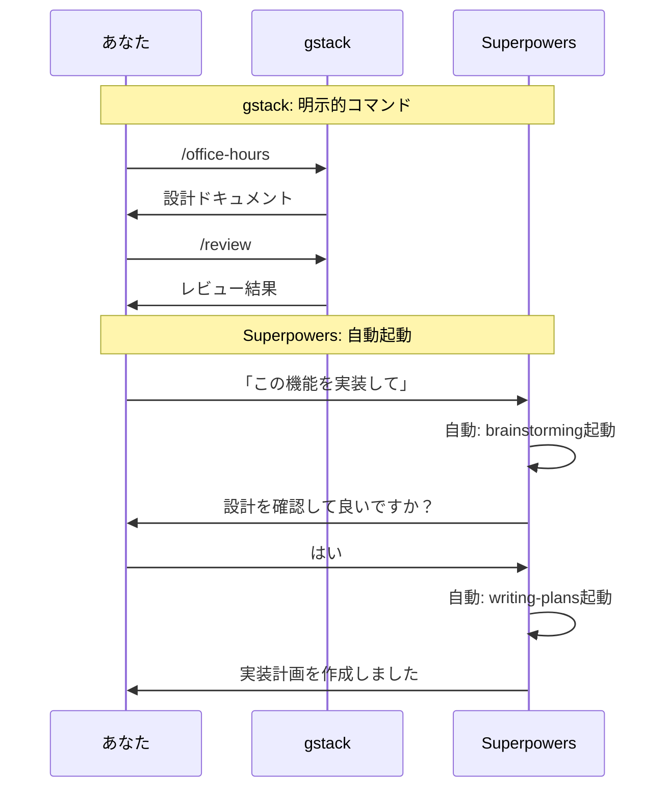

#### 4.2.8.2 比較表

| 観点 | gstack（Garry Tan） | Superpowers（Jesse Vincent） |
|------|-------------------|------------------------------|
| **目的** | 個人がチームのように出荷する | 開発プロセス全体の方法論を注入する |
| **提供形態** | OSSスキルセット（git clone） | Claude Plugin Marketplace |
| **起動方法** | **明示的**（スラッシュコマンド） | **自動的**（状況に応じて自律起動） |
| **役割モデル** | CEO/EM/QA/Release Managerなど**役割ベース** | brainstorming/writing-plansなど**プロセスベース** |
| **スキル数** | 23 specialists + 8 power tools | 15スキル |
| **カバー範囲** | 設計→実装→レビュー→QA→セキュリティ→デプロイ→振り返り | 設計→実装→テスト→デバッグ→レビュー→Git運用 |
| **特徴** | 役割分担による品質担保、実ブラウザQA、セキュリティ監査 | HARD-GATEによる強制、サブエージェント駆動、TDD強制 |
| **対応エージェント** | Claude Code含む10種類 | Claude Code含む8種類 |
| **ライセンス** | MIT | MIT |

両者は排他的ではなく、**併用も可能**です。Superpowers の「考えてから書く」プロセス設計思想は、gstack の各スキル定義にも応用できます。

### 4.2.9 gstack が示すスキル設計の教訓

#### 4.2.9.1 1. 役割分担の重要性

1つのAIに全てを任せるのではなく、**役割ごとにスキルを分離**することで、各タスクに最適なプロンプトとコンテキストを提供できます。

#### 4.2.9.2 2. スプリントの流れに沿った設計

Think → Plan → Build → Review → Test → Ship → Reflect という自然な開発フローに沿ってスキルを配置することで、**何をすべきかが明確**になります。

#### 4.2.9.3 3. 防護機構の組み込み

`/careful`（破壊的コマンドの警告）、`/freeze`（編集範囲の制限）、`/guard`（両方）といった**セーフティネット**を標準装備することで、AIの暴走を防ぎます。

#### 4.2.9.4 4. 実環境での検証

`/browse` や `/qa` による**実際のブラウザ操作**での検証は、AIが生成したコードが実際に動くことを保証します。

#### 4.2.9.5 5. オープンソースによる進化

MITライセンスで公開され、誰でもフォークして自分用にカスタマイズできます。コミュニティによる改善が継続的に行われています。

### 4.2.10 次のステップ

→ [4-3: AIコード生成の3つの課題](03-ai-code-challenges.md)
→ [4-4: frontend-design — フロントエンド設計支援スキル](04-frontend-design.md)
→ [4-5: ui-ux-pro-max — UI/UX最適化スキル](05-ui-ux-pro-max.md)

## 4.3 4-3: AIコード生成の3つの課題

> **学習時間**: 20分 | **難易度**: ⭐⭐

### 4.3.1 この章の目的

AIコード生成ツールを使い始めると、「なぜか思い通りに動かない」場面に繰り返しぶつかります。これらは偶発的なミスではなく、フロントエンド開発でよく見られる**構造的な3つの課題**から生じています。具体的には、理解のずれ・実行失敗・構造の問題です。課題を正確に認識することで、スキルを使った解決策が見えてきます。

### 4.3.2 課題1: 理解のずれ（Context Misalignment）

#### 4.3.2.1 何が起きるか

AIは与えられたプロンプトに対して「それらしい」コードを生成しますが、開発者が意図した設計思想やアーキテクチャの文脈を把握できていないことがあります。

**典型的なパターン：**
- コンポーネントの責務範囲を誤って解釈する
- 既存コードベースの命名規則や設計パターンを無視する
- 「汎用的に正しい」実装をするが、このプロジェクトでは不適切

#### 4.3.2.2 例

```
プロンプト: 「ユーザー一覧コンポーネントを作って」

AI出力: useEffect + useState で独自フェッチするコンポーネント
実際の期待: React Query + カスタムフックを使うプロジェクト規約があった
```

#### 4.3.2.3 スキルによる解決

**`frontend-design`** スキルは、コンポーネント設計の前にアーキテクチャ上の制約・規約・データフローを明示的に引き出すプロセスを提供します。「どう作るか」より先に「何を守るべきか」を確認します。

→ [4-4: frontend-design — フロントエンド設計支援スキル](04-frontend-design.md)

### 4.3.3 課題2: 実行失敗（Execution Failure）

#### 4.3.3.1 何が起きるか

生成されたコードが構文上は正しく見えても、実際に動かすとエラーになる、または意図しない動作をします。

**典型的なパターン：**
- 存在しないAPIやライブラリのメソッドを参照する（ハルシネーション）
- バージョン違いで動作しない（`useState` を古い書き方で生成するなど）
- エッジケース（空配列、null、非同期競合）が未考慮

#### 4.3.3.2 例

```
AI出力: Array.prototype.at(-1) を使ったコード
実際の環境: Node.js 14 で at() は未実装 → TypeError
```

#### 4.3.3.3 スキルによる解決

**`grill-me`** スキルは、生成コードを「可読性・パフォーマンス・セキュリティ・保守性」の4軸でレビューし、実行前に問題を検出します。AIが生成した後、人間がレビューする手間をスキルが補完します。

→ [5-1: grill-me — コードレビュースキル](../05-skills-in-practice/01-grill-me.md)

### 4.3.4 課題3: 構造の問題（Structural Degradation）

#### 4.3.4.1 何が起きるか

個別のコード片は動作するが、積み重ねると全体の構造が壊れていきます。AIは「局所最適」を得意とするため、グローバルな設計の一貫性を保つのが苦手です。

**典型的なパターン：**
- 似た処理が複数ファイルに散乱する（DRY違反）
- コンポーネントが肥大化し、責務が曖昧になる
- 状態管理が場当たり的になり、バグの温床になる

#### 4.3.4.2 例

```
1週間後の状態:
- UserCard.tsx が300行に膨らんでいる
- API呼び出しが3つのコンポーネントにそれぞれ書かれている
- propsのバケツリレーが5階層になっている
```

#### 4.3.4.3 スキルによる解決

**`improve`** スキルは既存コードの構造的な問題を診断し、リファクタリング方針を提案します。**`ui-ux-pro-max`** はUI層の設計品質を監査します。

→ [5-3: improve — コード改善スキル](../05-skills-in-practice/03-improve.md)  
→ [4-5: ui-ux-pro-max — UI/UX最適化スキル](05-ui-ux-pro-max.md)

### 4.3.5 3つの課題とスキルの対応関係

| 課題 | 根本原因 | 対応スキル |
|------|---------|-----------|
| 理解のずれ | 文脈・制約の共有不足 | `frontend-design` |
| 実行失敗 | ハルシネーション・環境依存 | `grill-me` |
| 構造の問題 | 局所最適の積み重ね | `improve` / `ui-ux-pro-max` |

詳細なマッピングは → [5-7: 問題 × スキル解決マッピング](../05-skills-in-practice/07-problem-skill-mapping.md) を参照してください。

### 4.3.6 まとめ

AIコード生成の課題は「AIが賢くないから」ではなく、**使い方の構造的なギャップ**から生じます。スキルはそのギャップを埋めるための「使い方の型」を提供します。

3つの課題を認識した上でスキルを活用することで、AIとの協働の質が根本的に変わります。

### 4.3.7 次のステップ

→ [5-7: 問題 × スキル解決マッピング](../05-skills-in-practice/07-problem-skill-mapping.md)
→ [4-4: frontend-design — フロントエンド設計支援スキル](04-frontend-design.md)

## 4.4 4-4: frontend-design — フロントエンド設計支援スキル（Anthropic 公式）

> **学習時間**: 15分 | **難易度**: ⭐⭐

### 4.4.1 Copilot だけで頼むと

```
あなた: 商品検索機能を作って。キーワード入力 → リアルタイム候補 → 結果一覧。
        React + TypeScript。

Copilot: わかりました。SearchComponent.tsx に実装します：

export const SearchComponent = () => {
  const [query, setQuery] = useState('')
  const [suggestions, setSuggestions] = useState([])
  const [results, setResults] = useState([])
  const [loading, setLoading] = useState(false)
  const [page, setCurrentPage] = useState(1)
  // ...（300行へ続く）
```

動く。でも誰も触りたくないコードが完成した。

### 4.4.2 @frontend-design を加えると

```
あなた: @frontend-design
要件: 商品検索機能。キーワード入力→候補表示→結果一覧。
技術スタック: React + TypeScript

Copilot: アーキテクチャを設計します。

コンポーネント構成:
  SearchContainer（状態管理）
    ├── SearchForm（入力UI）
    ├── SuggestionList（候補表示）
    └── SearchResults（結果一覧）

状態管理:
  Zustand: searchStore（query, results, loading）
  React Query: useSearchSuggestions / useSearchResults

データフロー:
  入力 → debounce(300ms) → API → 候補表示
      → 確定 → searchStore → 結果表示
```

コードの前に設計図が出てくる。

### 4.4.3 frontend-design とは

Anthropic 公式提供のフロントエンド設計支援スキルです。コンポーネント分割・状態管理・データフロー・レンダリング最適化の4観点から、要件に合ったアーキテクチャ設計案を提案します。

| 項目 | 内容 |
|------|------|
| **提供元** | Anthropic（公式） |
| **動作環境** | GitHub Copilot（VS Code チャット / エージェントモード） |
| **呼び出し方** | `@frontend-design` |
| **スキル種別** | アーキテクチャ設計支援 |
| **設計観点** | コンポーネント分割 / 状態管理 / データフロー / レンダリング最適化 |

> Copilot にプリインストール済みのため、Skill Creator で作成する必要はありません。

### 4.4.4 同じ依頼で何が変わるのか

| 観点 | Copilot 単体 | @frontend-design あり |
|------|-------------|----------------------|
| **コンポーネント** | 1ファイルに全機能 | Container/Presentational に分割 |
| **状態管理** | useState を羅列 | Zustand + React Query に最適化 |
| **データフロー** | 暗黙的・双方向 | 単方向フローを明示 |
| **最初の出力** | コード | 設計図 |
| **保守性** | 触るのが怖い | 誰でも変更できる |

### 4.4.5 4つの設計観点

必要なときに参照してください。最初から全部覚える必要はありません。

| 観点 | 説明 | 出力例 |
|------|------|--------|
| **コンポーネント分割** | 関心の分離に基づいた適切なコンポーネント構成 | Container/Presentational パターン、責務の明確化 |
| **状態管理戦略** | プロジェクト規模に適した状態管理の選定と設計 | Zustand + React Query、Store 設計、アクション定義 |
| **データフロー設計** | 単方向データフローを基本としたデータの流れの設計 | ユーザー入力 → Container → Custom Hook → API → Store → 再レンダリング |
| **レンダリング最適化** | パフォーマンスを考慮したレンダリング戦略 | React.memo、仮想スクロール、入力デバウンス |

### 4.4.6 入力パラメータ

| パラメータ | 型 | 必須 | 説明 |
|-----------|------|------|------|
| `requirements` | string | ✅ | 機能要件の説明 |
| `tech_stack` | string | ✅ | 技術スタック（React, Vue, TypeScript 等） |
| `current_architecture` | string | ❌ | 現在のアーキテクチャ説明 |
| `constraints` | string[] | ❌ | 制約条件（パフォーマンス目標、バンドルサイズ等） |
| `design_focus` | string | ❌ | 設計フォーカス（components / state / data-flow / rendering / all） |
| `include_diagram` | boolean | ❌ | コンポーネント図を含めるか（デフォルト: false） |

### 4.4.7 出力スキーマ

```json
{
  "architecture_overview": {
    "pattern": "Container/Presentational + Custom Hooks",
    "rationale": "関心の分離とテスト容易性を両立するため"
  },
  "component_tree": {
    "root": "App",
    "children": [
      {
        "name": "SearchContainer",
        "type": "container",
        "children": ["SearchForm", "SearchResults", "SearchPagination"],
        "responsibility": "検索状態の管理と子コンポーネントへのデータ受け渡し"
      }
    ]
  },
  "state_management": {
    "strategy": "Zustand + React Query",
    "stores": [
      {
        "name": "searchStore",
        "state": ["query", "filters", "results", "loading", "error"],
        "actions": ["search", "setFilters", "clearResults"]
      }
    ],
    "server_state": {
      "tool": "React Query",
      "queries": ["searchResults", "suggestions"],
      "mutations": ["saveSearch", "deleteSearch"]
    }
  },
  "data_flow": {
    "direction": "unidirectional",
    "description": "ユーザー入力 → Container → Custom Hook → API → Store → 再レンダリング"
  },
  "optimization_recommendations": [
    {
      "area": "rendering",
      "suggestion": "SearchResults に React.memo + virtual scrolling を適用",
      "expected_impact": "リストレンダリングのパフォーマンスが約5倍向上"
    }
  ]
}
```

### 4.4.8 使い方

#### 4.4.8.1 1. 呼び出し方

VS Code の Copilot チャット（エージェントモード）で以下のように入力するだけで利用できます：

```
@frontend-design 
要件: 商品検索機能。ユーザーがキーワードを入力すると、
リアルタイムで候補表示、確定後に検索結果一覧を表示。
フィルター（カテゴリ、価格帯）とページネーション付き。
技術スタック: React + TypeScript + Tailwind CSS
```

#### 4.4.8.2 2. 設計フォーカスの絞り込み

状況に応じて設計フォーカスを変更できます：

```
# 状態管理だけ知りたい場合
@frontend-design design_focus=state
要件: ...

# コンポーネント構成だけ知りたい場合
@frontend-design design_focus=components
要件: ...
```

### 4.4.9 設計の意図

#### 4.4.9.1 なぜコードより先にアーキテクチャを出力させるのか

通常のコード生成（要件→即コード）では、コンポーネントの責任範囲・状態の持ち場・データの流れが暗黙のままコードに埋め込まれる。一度コードが存在すると、設計の見直しはリファクタリングコストになる。アーキテクチャ（システムの構成要素と要素間の関係を定義した設計図）を先に出力させることで、コードを書く前に設計の問題を発見できる。

#### 4.4.9.2 なぜ観点を4つにするのか

コンポーネント分割・状態管理・データフロー・レンダリング最適化の4観点（UI の分割方法・データの置き場所・データの流れ・描画パフォーマンスの4つの設計軸）は、フロントエンドアーキテクチャの相互依存する4領域に対応している。コンポーネント構成を決めると状態の持ち場が絞られ、状態を決めるとデータフローが決まる順序関係があるため、この 4 つをセットで設計する。

**代替案との比較**:
- 観点をユーザーに選ばせる: 自由度が上がるが、相互依存を見落としやすい
- 2 観点に絞る（分割・状態のみ）: 素早く設計できるがレンダリング問題が後で表面化する

### 4.4.10 この設計を変えるとき

- **小規模プロジェクトで観点を絞るとき**: ページ数が 3 以下の小規模サイトでは「コンポーネント分割のみ」に絞ってよい。状態管理とデータフローが自明なため設計コストが見合わない。
- **フレームワークが設計を規定するとき**: Next.js の App Router・Remix など、フレームワークがルーティングとデータフェッチを規定している場合、データフロー観点の設計はフレームワークの規約に委ねて省略してよい。

### 4.4.11 次のステップ

→ [4-5: ui-ux-pro-max — UI/UX最適化スキル](05-ui-ux-pro-max.md) で、設計したUIの品質を監査する方法を学ぶ
→ [5-7: 問題 × スキル解決マッピング](../05-skills-in-practice/07-problem-skill-mapping.md) で、全スキルの関係性を整理する

## 4.5 4-5: ui-ux-pro-max — UI/UX最適化スキル（コミュニティ）

> **学習時間**: 15分 | **難易度**: ⭐⭐

### 4.5.1 AIが生成したUIに、見えない問題が潜んでいる

Copilot がロゴを実装した。

```

```

動く。表示される。でも alt 属性がない。
スクリーンリーダーは「image」と読み上げるだけだ。

---

デスクトップでは完璧に見える。
375px のスマートフォンで確認したら、
ナビゲーションが画面の右側に切れていた。

---

背景 #333 に白文字。おしゃれで読みやすい——
少なくとも自分には。
コントラスト比は 3.5:1。WCAG AA の基準は 4.5:1 だった。

---

Copilot はコードを書く。でも、誰かがこれを使えるか、は教えてくれない。

### 4.5.2 ui-ux-pro-max とは

コミュニティ（nextlevelbuilder）が開発した UI/UX 監査スキルです。アクセシビリティ・レスポンシブデザイン・ユーザビリティ・ビジュアルデザインの4観点でコンポーネントを診断し、重大度付きの改善提案を返します。

| 項目 | 内容 |
|------|------|
| **提供元** | nextlevelbuilder（コミュニティ） |
| **動作環境** | GitHub Copilot（VS Code チャット / エージェントモード） |
| **呼び出し方** | `@ui-ux-pro-max` |
| **スキル種別** | UI/UX 監査・改善提案 |
| **監査観点** | アクセシビリティ / レスポンシブデザイン / ユーザビリティ / ビジュアルデザイン |

### 4.5.3 同じコンポーネントで何が変わるのか

**Before — @ui-ux-pro-max なし**

```
あなた: Header コンポーネントを実装して。

Copilot: わかりました。

function Header() {
  return (
    <header style={{background: '#333', color: 'white'}}>
      
      <nav>
        <a href="/">Home</a>
        <a href="/about">About</a>
      </nav>
    </header>
  );
}
```

**After — @ui-ux-pro-max あり**

```
あなた: @ui-ux-pro-max
フレームワーク: React
[上記 Header コード]

Copilot: 監査結果（スコア: 65/100）

🔴 Critical × 2
  A11Y-1:  に alt 属性がない（WCAG 1.1.1）
  A11Y-2: コントラスト比 3.5:1（基準: 4.5:1）

🟡 Major × 1
  RSP-1: ナビが 375px でオーバーフロー

Quick Wins:
  alt="会社ロゴ" を追加（5分）
  ハンバーガーメニュー化（30分）
```

### 4.5.4 4つの監査観点

必要なときに参照してください。最初から全部覚える必要はありません。

| 観点 | 説明 | チェック内容 |
|------|------|-------------|
| **アクセシビリティ** | WCAG 2.1 に基づくアクセシビリティ監査 | alt属性、コントラスト比、キーボード操作、aria属性 |
| **レスポンシブデザイン** | 複数ビューポートでの表示品質確認 | レイアウト崩れ、ナビゲーション、タッチターゲットサイズ |
| **ユーザビリティ** | ユーザー体験の観点からの評価 | フィードバック不足、エラーハンドリング、直感性 |
| **ビジュアルデザイン** | 視覚的な品質と一貫性のチェック | タイポグラフィ、カラースキーム、スペーシング、一貫性 |

### 4.5.5 入力パラメータ

| パラメータ | 型 | 必須 | 説明 |
|-----------|------|------|------|
| `component_code` | string | ✅ | 監査対象のUIコンポーネントコード |
| `framework` | string | ✅ | 使用フレームワーク（React, Vue, Angular 等） |
| `audit_focus` | string[] | ❌ | 監査フォーカス（accessibility / responsive / usability / visual / all） |
| `wcag_level` | string | ❌ | WCAG準拠レベル（A / AA / AAA、デフォルト: AA） |
| `viewport_sizes` | string[] | ❌ | テストするビューポートサイズ一覧 |
| `include_remediation` | boolean | ❌ | 修正コード例を含めるか（デフォルト: true） |

### 4.5.6 出力スキーマ

```json
{
  "summary": {
    "total_issues": 8,
    "critical": 2,
    "major": 3,
    "minor": 3,
    "overall_ux_score": 65
  },
  "categories": {
    "accessibility": {
      "score": 45,
      "wcag_compliance": "AA",
      "issues": [
        {
          "id": "A11Y-1",
          "wcag_criteria": "1.1.1",
          "severity": "critical",
          "element": "",
          "message": "画像にalt属性がありません",
          "remediation": ""
        }
      ]
    },
    "responsive": {
      "score": 70,
      "issues": [
        {
          "id": "RSP-1",
          "severity": "major",
          "viewport": "375px",
          "message": "ナビゲーションメニューが画面からはみ出している",
          "remediation": "ハンバーガーメニューの導入を推奨"
        }
      ]
    },
    "usability": {
      "score": 75,
      "issues": []
    },
    "visual": {
      "score": 80,
      "issues": []
    }
  },
  "quick_wins": [
    "A11Y-1: alt属性の追加（5分）",
    "RSP-1: ハンバーガーメニュー化（30分）"
  ]
}
```

出力は各観点のスコア（0-100）と、発見された問題の一覧で構成されます。各問題には **severity（critical / major / minor）** と **remediation（修正例）** が含まれ、優先順位をつけて改善を進められます。

### 4.5.7 使い方

#### 4.5.7.1 1. 呼び出し方

VS Code の Copilot チャット（エージェントモード）で以下のように入力するだけで利用できます：


```
@ui-ux-pro-max 
フレームワーク: React

function Header() {
  return (
    <header style={{background: '#333', color: 'white'}}>
      
      <nav>
        <a href="/">Home</a>
        <a href="/about">About</a>
        <a href="/contact">Contact</a>
      </nav>
      <button onClick={() => alert('menu')}>☰</button>
    </header>
  );
}
```

#### 4.5.7.2 2. 監査レベルの変更


プロジェクトの要件に応じて監査レベルを変更できます：

```
# AAAレベルで厳格チェック
@ui-ux-pro-max wcag_level=AAA
[コード]

# レスポンシブだけチェック
@ui-ux-pro-max audit_focus=["responsive"]
[コード]
```

### 4.5.8 次のステップ

→ [5-7: 問題 × スキル解決マッピング](../05-skills-in-practice/07-problem-skill-mapping.md)

# 5. 実践スキル実装編

## 5.1 5-1: grill-me — コードレビュースキル（Matt Pocock）

> **学習時間**: 25分 | **難易度**: ⭐⭐⭐ | **カテゴリ**: 品質検証

### 5.1.1 このスキルについて

**grill-me** は Matt Pocock 氏が公開するコードレビュースキルです。コードの品質を「可読性」「パフォーマンス」「セキュリティ」「保守性」の4軸で徹底的にレビューし、重大度付きの改善提案を返します。

- **出典**: [mattpocock/skills — grill-me](https://github.com/mattpocock/skills/blob/main/skills/productivity/grill-me/SKILL.md)
- **用途**: PR レビュー前のセルフチェック、コード品質の統一基準、ジュニア開発者への教育

### 5.1.2 こんな状況に刺さる

> 以下のどれかに当てはまったら、このスキルがあなたの問題を解決します。

- **PRレビュアーとして**、「なんとなく気になる」という感覚を重大度付きの言葉にできず、指摘の根拠をうまく説明できないとき
- **チームリードとして**、コーディング規約はあるが「どの違反がブロッカーか」の基準がメンバーごとにバラバラなとき
- **ジュニア育成担当として**、フィードバックが厳しくなりすぎて心理的安全性を損ないたくないとき

### 5.1.3 なぜこのスキルが必要か

PR レビューで「なんとなく気になるけど、どう言えばいいか分からない」という場面はないですか？重大度の基準が暗黙知になっていると、指摘する側も受ける側も優先度の判断に迷い、対話が生産的になりません。grill-me は評価軸と重大度を SKILL.md で明文化し、レビューを「感覚」から「基準」へ変えます。


### 5.1.4 Phase A: SKILL.md を読む

[出典の SKILL.md](https://github.com/mattpocock/skills/blob/main/skills/productivity/grill-me/SKILL.md) をブラウザで開き、以下の観点で読みます。

#### 5.1.4.1 構造の解析

| 要素 | 確認すること |
|------|------------|
| フロントマター（`name`, `description`） | どういうトリガー文脈を想定しているか |
| 評価軸の定義 | 4軸がどう記述されているか、各軸の判断基準は何か |
| 出力形式 | スコア・重大度分類・改善提案の構造 |

#### 5.1.4.2 設計上の注目ポイント

**1. 評価軸の独立性**
各軸が互いに独立して定義されている。これにより `focus_areas` で特定軸だけを指定することが可能になっている。

**2. 重大度（Critical / Major / Minor）の明示**
「問題があるかどうか」だけでなく「どれくらい深刻か」を出力に含める設計。PR レビューでの優先度議論を数値化できる。

**3. `positive_feedback` フィールドの存在**
問題点だけでなく良い点も返すことで、レビューが一方的な指摘にならない構造。

### 5.1.5 Phase B: インストールして動かす

#### 5.1.5.1 セットアップ

```bash
# プロジェクトのスキルディレクトリを作成
mkdir -p .claude/skills/grill-me/

# SKILL.md を GitHub から取得して配置
# 出典: https://github.com/mattpocock/skills/blob/main/skills/productivity/grill-me/SKILL.md
```

または Claude Code Plugin Marketplace でインストール（利用可能な場合）。

#### 5.1.5.2 テスト実行

以下のプロンプトで動作を確認します：

```
/grill-me 以下のReactコンポーネントをレビューして：

function UserList() {
  const [users, setUsers] = useState([]);
  useEffect(() => {
    fetch('/api/users').then(r => r.json()).then(setUsers);
  });
  return <ul>{users.map(u => <li>{u.name}</li>)}</ul>;
}
```

**期待される出力のポイント**:

| 問題 | 分類 | 重大度 |
|------|------|--------|
| `useEffect` に依存配列がない（無限ループ） | パフォーマンス | Major |
| `<li>` に `key` がない | 保守性 | Minor |
| エラー状態・ローディング状態がない | 可読性 | Minor |

### 5.1.6 Phase C: 解析と実行結果の照合

実行結果を見ながら、SKILL.md の設計と照らし合わせる問いです：

1. 実際に返ってきた重大度分類は SKILL.md の基準と一致しているか？
2. `positive_feedback` はどのタイミングで返ってきたか？どのコードが評価されたか？
3. `focus_areas: ["security"]` に絞った場合、出力はどう変わるか？

### 5.1.7 設計の意図

#### 5.1.7.1 なぜ評価軸を4つにするのか

4軸（可読性・パフォーマンス・セキュリティ・保守性の4つの評価観点）を選んだ理由: 各軸が独立した関心事のため、`focus_areas`（評価対象を特定軸に絞り込むパラメータ）による選択的実行が成立する。

**代替案との比較**:
- 2軸（品質 / リスク）: シンプルだが「パフォーマンス問題だけ見たい」という絞り込みができない
- 6軸以上: `description`（スキルの自動発動トリガーとなる説明文）が長くなり、発動精度が下がる

#### 5.1.7.2 なぜ重大度を3段階にするのか

Critical / Major / Minor の3段階（止める・警告・参考の3つの対処レベル）にしている。2段階では警告の表現力がなく、4段階以上では受け取る側が優先判断に迷う。

#### 5.1.7.3 なぜ positive_feedback を含めるのか

問題点だけを返すレビューは、指摘する側と受ける側の非対称な関係を強化する。`positive_feedback`（良い点を明示するフィールド）を組み込むことで、レビューを「審判の判定」から「対話」に変える。

### 5.1.8 この SKILL.md から学べる設計パターン

自分のスキルを作るときに応用できる設計の視点：

1. **多軸評価の独立性** — 評価を複数の軸（可読性・パフォーマンス・セキュリティ・保守性）に分けることで、`focus_areas` による絞り込みが可能になる。軸を独立させて定義する設計が再利用性を高める。
2. **重大度の三段階** — 「問題あり/なし」ではなく Critical / Major / Minor を出力に含めると、受け取る側が次のアクションを自分で判断できる。スキルの出力を「判断の材料」として設計するパターン。
3. **ポジティブフィードバックの組み込み** — 指摘だけでなく `positive_feedback` も返す設計は、スキルの出力を一方的な批評でなく対話にする。自分のスキルに「良い点の明示」を加えると、使い続けたいと思われやすくなる。

### 5.1.9 カスタマイズのヒント

**観点を追加する**
SKILL.md に `accessibility`（WCAG 準拠チェック）軸を追加することで、フロントエンド特化のレビューが可能になります。

**重大度基準を調整する**
チームのコーディング規約に合わせて Critical の定義を変更すると、PR マージ判断の自動化に活用できます。

### 5.1.10 この設計を変えるとき

- **軸を増やすとき**: チームに WCAG（Web Content Accessibility Guidelines: Web アクセシビリティの国際基準）準拠が必須になった場合、`accessibility` 軸を追加してよい。ただし `description` も更新しないと自動発動の精度が落ちる。
- **重大度を変えるとき**: CI（Continuous Integration: コードを自動テスト・検証する仕組み）に組み込んで Critical のみ自動ブロックする運用なら、Critical の定義をチームのマージポリシーに合わせて再定義すること。
- **positive_feedback を外すとき**: 自動化パイプラインで機械処理する場合など出力をコンパクトにしたいときは除外してよい。ただし人間がレビュー結果を読むワークフローでは残すことを推奨する。

### 5.1.11 次のステップ

→ [5-2: triage — Issue 分析スキル](02-triage-issue-analysis.md)
→ [5-7: 問題 × スキル解決マッピング](07-problem-skill-mapping.md)

## 5.2 5-2: triage — Issue 分析スキル（Matt Pocock）

> **学習時間**: 25分 | **難易度**: ⭐⭐⭐ | **カテゴリ**: 優先順位付け

### 5.2.1 このスキルについて

**triage** は Matt Pocock 氏が公開する Issue 分析スキルです。GitHub Issue の内容を解析し、優先度（P0〜P3）の判定、カテゴリ分類、影響範囲の特定、対応推奨事項を自動生成します。

- **出典**: [mattpocock/skills — triage](https://github.com/mattpocock/skills/blob/main/skills/productivity/triage/SKILL.md)
- **用途**: 新規 Issue の自動トリアージ、バックログ整理、スプリント計画の最適化

### 5.2.2 こんな状況に刺さる

> 以下のどれかに当てはまったら、このスキルがあなたの問題を解決します。

- **OSSメンテナとして**、週に数十件届くIssueを優先度なしで処理しており、緊急バグへの対応が遅れがちなとき
- **チームリードとして**、スプリント計画でバックログのIssueに優先順位をつける判断基準が属人化しているとき
- **QAエンジニアとして**、バグ報告のIssueに再現手順・環境情報が不足していて毎回追記依頼が必要なとき

### 5.2.3 なぜこのスキルが必要か

「このバグ、どれくらい急いで直すべきか」を毎回手作業で判断していませんか？担当者によって優先度の解釈が変わると、対応漏れや重複が起きます。triage は P0〜P3 の判定基準を SKILL.md に明文化し、担当者の経験に依存しない一貫したトリアージを実現します。


### 5.2.4 Phase A: SKILL.md を読む

[出典の SKILL.md](https://github.com/mattpocock/skills/blob/main/skills/productivity/triage/SKILL.md) をブラウザで開き、以下の観点で読みます。

#### 5.2.4.1 構造の解析

| 要素 | 確認すること |
|------|------------|
| 優先度（P0〜P3）の定義 | 各レベルの判定基準がどう記述されているか |
| 必須 vs オプション入力 | `issue_title`/`issue_body` と `labels`/`project_context` の使い分け |
| `recommendation` フィールド | 推奨アクション・担当チーム・次のステップの構造 |

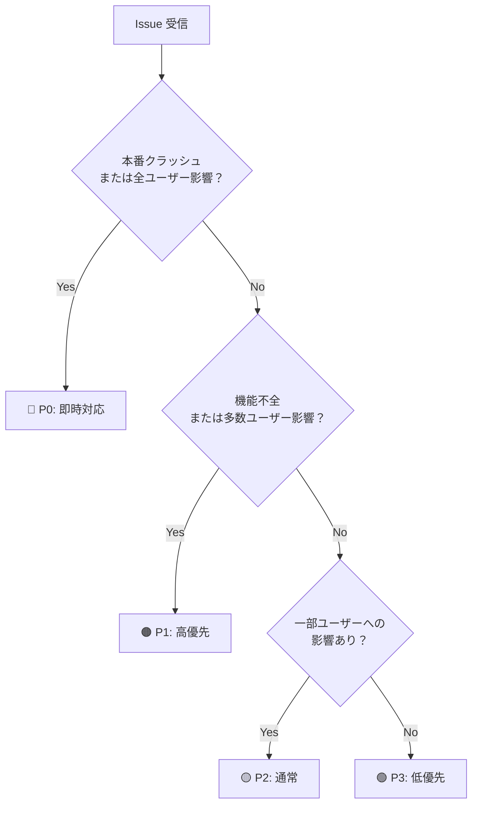

#### 5.2.4.2 設計上の注目ポイント

**1. 優先度判定の客観化**
P0〜P3 の基準を SKILL.md に明文化することで、担当者の経験・勘に依存しない判定が可能になる。

**2. `project_context` による柔軟性**
プロジェクト固有の文脈（例: BtoB SaaS では全ユーザー影響は即 P0）を注入できる設計。スキル本体は汎用に保たれている。

**3. 不足情報の自動検出**
再現手順・影響範囲・環境情報が欠けている場合に指摘するロジックが含まれる。

### 5.2.5 Phase B: インストールして動かす

#### 5.2.5.1 セットアップ

```bash
mkdir -p .claude/skills/triage/
# SKILL.md を GitHub から取得して配置
# 出典: https://github.com/mattpocock/skills/blob/main/skills/productivity/triage/SKILL.md
```

#### 5.2.5.2 テスト実行

以下のプロンプトで動作を確認します：

```
/triage
タイトル: 「ログインページで500エラーが発生する」
本文: 本番環境でログインページにアクセスすると Internal Server Error が発生します。
エラーログには「TypeError: Cannot read properties of null」と記録されています。
再現率は100%で、全ユーザーに影響します。
```

**期待される出力のポイント**:

| 項目 | 期待値 |
|------|--------|
| 優先度 | P0（本番クラッシュ・全ユーザー影響） |
| カテゴリ | bug / authentication |
| 影響範囲 | 全ユーザー、severity: high |
| 推奨 | 即時対応、ホットフィックス |

### 5.2.6 Phase C: 解析と実行結果の照合

1. P0 判定の根拠として SKILL.md のどの基準が使われたか？
2. `project_context: "BtoC サービス、DAU 10万人"` を追加すると出力はどう変わるか？
3. 情報が少ない Issue（「ログインが遅い」のみ）を入れると、不足情報として何が指摘されるか？

### 5.2.7 設計の意図

#### 5.2.7.1 なぜ優先度を4段階にするのか

P0〜P3 の4段階（即時対応・高優先・通常・低優先の4つの対応レベル）にしている。2段階（緊急/通常）では「高優先だが今夜でなくていい」を表現できず、5段階以上では判定基準の境界が曖昧になりやすい。

#### 5.2.7.2 なぜ project_context をオプション入力にするのか

スキル本体は汎用ロジックとして保ち、プロジェクト固有の文脈を外から注入するコンテキスト注入パターン（スキルのロジックと文脈を分離し、文脈を呼び出し側から渡す設計方法）を採用している。必須にするとインストール直後に動かず採用率が下がる。

**代替案との比較**:
- `project_context` を必須にする: 精度は上がるが、未入力でエラーになるためハードルが高い
- スキルをプロジェクトごとに複製する: カスタマイズ性は高いが、バグ修正のたびに全コピーを更新する必要がある

#### 5.2.7.3 なぜ不足情報の自動検出を含めるのか

再現手順・影響範囲・環境情報が欠けている Issue は精度の高いトリアージができない。不足情報を指摘するロジックを組み込むことで、スキルが「回答者」ではなく「対話のパートナー」として機能し、Issue 報告品質の底上げにも繋がる。

### 5.2.8 この SKILL.md から学べる設計パターン

1. **コンテキスト注入による汎用性** — スキル本体は汎用ロジックとして保ち、`project_context` で個別の文脈を外から注入する設計は、1つのスキルを複数プロジェクトで再利用可能にする。スキルを「ロジック」と「文脈」に分離する考え方。
2. **必須/オプション入力の分離** — `issue_title`/`issue_body` を必須、`labels`/`project_context` をオプションにすることで、最低限の情報でも動作しつつ詳細情報があれば精度が上がる。スキルの「エントリーハードル」を下げながら品質も上げる設計。
3. **不足情報の自動検出** — 入力が不十分なときに「何が足りないか」を返す設計は、ユーザーとのやり取りを通じてより良い出力を引き出す。スキルを「完成品」でなく「対話のパートナー」として設計するパターン。

### 5.2.9 カスタマイズのヒント

**優先度基準をプロジェクト仕様に合わせる**
P0/P1 の境界線はプロジェクトによって異なります。SKILL.md の判定基準をチームの SLA に合わせて書き換えると、自動トリアージの精度が上がります。

**GitHub Actions との連携**
出力の `category` を GitHub Actions で受け取り、ラベルを自動付与する自動化も可能です。

### 5.2.10 この設計を変えるとき

- **優先度段階を変えるとき**: SLA（Service Level Agreement: サービスレベル合意書。応答時間などの品質基準を定めた契約）に「P0 は 30 分以内」などの明示的な基準がある場合、SKILL.md の判定ロジックに SLA の基準を直接転記してよい。段階数も変えてよい。
- **project_context を必須にするとき**: 単一プロジェクト専用スキルとして使う場合、`project_context` をフロントマターに固定値で書き込んでよい。入力漏れを防げる。
- **自動化パイプラインに組み込むとき**: GitHub Actions からトリガーする場合、出力フォーマットを JSON に固定し `recommendation` フィールドのみを取り出すよう SKILL.md を調整してよい。

### 5.2.11 次のステップ

→ [5-3: improve — コード改善スキル](03-improve.md)
→ [5-7: 問題 × スキル解決マッピング](07-problem-skill-mapping.md)

## 5.3 5-3: improve — コード改善スキル（Matt Pocock）

> **学習時間**: 25分 | **難易度**: ⭐⭐⭐ | **カテゴリ**: リファクタリング

### 5.3.1 このスキルについて

**improve** は Matt Pocock 氏が公開するコード改善スキルです。既存コードを分析し、パフォーマンス最適化・リファクタリング・モダナイゼーションの3観点から、難易度と期待効果の評価付きで改善提案を返します。

- **出典**: [mattpocock/skills — improve](https://github.com/mattpocock/skills/blob/main/skills/productivity/improve/SKILL.md)
- **用途**: レガシーコードのモダナイゼーション、パフォーマンスボトルネックの特定、技術負債の返済計画

### 5.3.2 こんな状況に刺さる

> 以下のどれかに当てはまったら、このスキルがあなたの問題を解決します。

- **テックデット解消担当として**、「どこから手をつければ効果が大きいか」が分からず、リファクタリングをずっと先送りにしているとき
- **スプリント計画担当として**、改善案は山積みでも「このスプリントに収まるか」の工数感が掴めず優先度が決まらないとき
- **パフォーマンス改善担当として**、「なんか遅い」は分かるがボトルネックを特定するための最初のアクションが決まらないとき

### 5.3.3 なぜこのスキルが必要か

「このコード、なんか遅い気がするけど、どこから手をつければ？」—— 問題の特定から改善案の優先順位づけまで、手作業では時間がかかります。improve は「難易度×効果」マトリックスで改善案を整理し、今すぐ着手できる `quick_wins` から長期的な改善まで、具体的な実行計画として返します。


### 5.3.4 Phase A: SKILL.md を読む

[出典の SKILL.md](https://github.com/mattpocock/skills/blob/main/skills/productivity/improve/SKILL.md) をブラウザで開き、以下の観点で読みます。

#### 5.3.4.1 構造の解析

| 要素 | 確認すること |
|------|------------|
| 3つの改善観点の定義 | パフォーマンス・リファクタリング・モダナイゼーションがどう区別されているか |
| `difficulty` × `impact` の基準 | スコアリングのロジック |
| `quick_wins` と `long_term` の分類 | 何を基準に振り分けているか |
| `constraints` パラメータ | どのような制約を受け取れるか |

#### 5.3.4.2 設計上の注目ポイント

**1. 「難易度×効果」マトリックスによる優先順位付け**
改善案を列挙するだけでなく `quick_wins`（難易度低・効果高）と `long_term` に分類することで、実行計画が立てやすくなる。

**2. `constraints` による現実的な提案**
IE11 対応・bundle size 制限・移行途中のライブラリ制約など、プロジェクト固有の制約を受け取ることで「理想論」ではなく「実現可能な改善」を提案する設計。

**3. `improvement_type` で観点を絞れる設計**
全観点の分析は時間がかかるため、`refactoring` のみなど絞り込みができる。

### 5.3.5 Phase B: インストールして動かす

#### 5.3.5.1 セットアップ

```bash
mkdir -p .claude/skills/improve/
# SKILL.md を GitHub から取得して配置
# 出典: https://github.com/mattpocock/skills/blob/main/skills/productivity/improve/SKILL.md
```

#### 5.3.5.2 テスト実行

以下のプロンプトで動作を確認します：

```
/improve
言語: TypeScript/React

function SearchResults({ query, data }) {
  const [results, setResults] = useState([]);
  useEffect(() => {
    if (data) {
      const filtered = data.filter(item =>
        item.name.includes(query) || item.description.includes(query)
      );
      setResults(filtered);
    }
  }, [query, data]);
  return <div>{results.map(r => <SearchCard item={r} />)}</div>;
}
```

**期待される出力のポイント**:

| 提案 | 観点 | 分類 |
|------|------|------|
| `useMemo` でフィルタリングをメモ化 | パフォーマンス | quick_win |
| フィルタリングをカスタムフックに分離 | リファクタリング | long_term |
| `React.memo` で `SearchCard` をラップ | パフォーマンス | quick_win |

### 5.3.6 Phase C: 解析と実行結果の照合

1. `quick_wins` に分類された提案は SKILL.md の難易度基準と一致しているか？
2. `constraints: ["IE11対応"]` を追加すると、モダナイゼーション提案はどう変わるか？
3. `improvement_type: "performance"` のみにした場合、リファクタリング提案は除外されるか？

### 5.3.7 設計の意図

#### 5.3.7.1 なぜ「難易度×効果」マトリクスで分類するのか

難易度×効果マトリクス（改善案を「実装の難しさ」と「期待される効果」の2軸で4象限に分類する手法）を使う理由: 改善案を列挙するだけでは「何から始めるか」が分からない。`quick_wins`（難易度が低く効果が高い改善案）を明示することで、出力が実行計画になる。

**代替案との比較**:
- 全提案をフラットに列挙: シンプルだが受け取る側が優先判断をゼロから行う必要がある
- 効果のみで並べる: 難易度の高い改善案が上位に来て着手できずに終わるリスクがある

#### 5.3.7.2 なぜ改善観点を3つにするのか

パフォーマンス・リファクタリング・モダナイゼーションの3観点（速さを改善するか・構造を整えるか・最新技術に置き換えるか）は、それぞれ異なるリソースと意思決定者が必要なため独立している。`improvement_type` による絞り込みが成立するのはこの独立性による。

#### 5.3.7.3 なぜ constraints をオプションパラメータにするのか

現実の制約（IE11 対応・bundle size 上限など）なしの提案は「理想論」になりやすい。一方、制約を必須にするとスキルの起動ハードルが上がる。オプションにすることで最低限の情報でも動作しつつ、詳細情報があれば精度が上がる設計にしている。

### 5.3.8 この SKILL.md から学べる設計パターン

1. **難易度×効果マトリックス** — 改善案を列挙するだけでなく `quick_wins`（難易度低・効果高）と `long_term` に分類することで、出力が「実行計画」になる。スキルの出力を「何ができるか」ではなく「何から始めるか」に変換する設計。
2. **制約を入力として受け取る** — `constraints` パラメータで現実的な条件（IE11対応、bundle size制限など）を注入することで、「理想論」ではなく「実現可能な改善」を返せる。プロジェクト固有の制約に対応するパターン。
3. **観点の絞り込み機能** — `improvement_type` で特定の観点だけを分析できる設計は、大きなスキルを部分的に使える柔軟性を生む。スキルを「全か無か」でなく「必要な部分だけ使える」設計にすることで、適用範囲が広がる。

### 5.3.9 カスタマイズのヒント

**チーム標準の規約を注入する**
関数の最大行数・命名規則などをリファクタリング基準として SKILL.md に追記すると、コードレビューとの整合性が高まります。

**grill-me との連携**
grill-me でレビュー → improve で改善案取得 → 実装 のサイクルを組むことで、品質向上ループを自動化できます。

### 5.3.10 この設計を変えるとき

- **観点を追加するとき**: チームにセキュリティ改善の専任担当がいる場合、`security` 観点を追加してよい。ただし `grill-me` のセキュリティ軸との役割分担を SKILL.md 内に明記すること。
- **マトリクスの軸を変えるとき**: スプリント内に収まるかどうかを基準にしたい場合、難易度の代わりに「推定工数（日）」を軸にしてもよい。判定基準を SKILL.md 内に数値で定義すること。
- **constraints を必須にするとき**: 単一プロジェクト専用として使う場合、フロントマターに制約を固定値で記述してよい。入力漏れを防げる。

### 5.3.11 次のステップ

→ [4-4: frontend-design — フロントエンド設計支援スキル](../04-frameworks/04-frontend-design.md)
→ [5-7: 問題 × スキル解決マッピング](07-problem-skill-mapping.md)

## 5.4 5-4: baoyu-diagram — SVG図形生成スキル

> **学習時間**: 25分 | **難易度**: ⭐⭐⭐ | **カテゴリ**: コンテンツ生成

### 5.4.1 概要

**baoyu-diagram** は、ソース素材から SVG 図形を生成するスキルです。フローチャート、シーケンス図、アーキテクチャ図、概念図、クラス図の5タイプをサポートし、ダークモード対応の自己完結型 SVG を出力します。

このスキルの特徴は、**LLM の画像生成モデルを使わずに、Claude が SVG コードを直接記述する**点です。これにより、デザインシステムに従った一貫性のある図形を生成できます。

### 5.4.2 なぜこのスキルが必要か

「このアーキテクチャ、テキストで説明しても伝わらない。でも draw.io を覚える時間もない」—— LLM がコードとして SVG を書けるなら、ツールの習熟コストゼロで図が作れます。

### 5.4.3 こんな状況に刺さる

> 以下のどれかに当てはまったら、このスキルがあなたの問題を解決します。

- **テックライターとして**、API仕様書やシステム設計書に図が必要なのにdraw.ioやLucidchartを覚える時間がないとき
- **アーキテクトとして**、レビューの場でホワイトボードに書いたシステム構成をそのまま文書に残したいとき
- **社内勉強会の発表者として**、スライドに技術的なフロー図を入れたいが、ビジュアルツールで時間を使いたくないとき

### 5.4.4 学習目標

- baoyu-diagram の5つの図タイプを理解する
- SVG 直書きによる図形生成の仕組みを学ぶ
- ダークモード対応の実装方法を理解する
- 図タイプの自動選択ロジックを学ぶ

### 5.4.5 利用シーン

| シーン | 説明 |
|-------|------|
| 技術記事の図解 | JWT認証フロー、Kubernetesアーキテクチャなどを図示 |
| ドキュメント作成 | API仕様書のシーケンス図、クラス図を自動生成 |
| プレゼン資料 | 概念図やアーキテクチャ図をスライドに埋め込み |
| 設計レビュー | システム構成を可視化してレビュー |

### 5.4.6 5つの図タイプ

baoyu-diagram は以下の5タイプの図をサポートしています：

| タイプ | 説明 | トリガーとなるキーワード |
|-------|------|------------------------|
| **flowchart** | ステップを順に追うプロセス図 | walk through, steps, process, lifecycle, workflow, state machine |
| **sequence** | コンポーネント間の通信順序 | protocol, handshake, auth flow, OAuth, TCP, request/response |
| **structural** | 内部構造や構成の階層図 | architecture, components, topology, layout, what's inside |
| **illustrative** | メカニズムの直感的な説明図 | how does X work, explain X, intuition for, why does X do Y |
| **class** | 型と関係性のUML図 | class diagram, UML, inheritance, interface, schema |

#### 5.4.6.1 自動タイプ選択

入力内容を分析し、最適な図タイプを自動提案します：

```bash
# 自動選択（推奨）
/baoyu-diagram "how JWT authentication works"

# タイプを指定
/baoyu-diagram "Kubernetes architecture" --type structural
/baoyu-diagram "OAuth 2.0 flow" --type sequence

# ファイルから読み込み
/baoyu-diagram path/to/article.md
```

### 5.4.7 SVG 直書きの仕組み

baoyu-diagram の核心は、**Claude が SVG コードを手計算のレイアウト計算とともに直接記述する**点です。

#### 5.4.7.1 デザインシステム

全ての図は統一されたデザインシステムに従います：

```svg
<svg xmlns="http://www.w3.org/2000/svg" viewBox="0 0 800 600">
  <style>
    /* 統一されたスタイル定義 */
    .node { fill: #f0f4ff; stroke: #4a6cf7; stroke-width: 2; rx: 8; }
    .arrow { stroke: #666; stroke-width: 1.5; fill: none; marker-end: url(#arrowhead); }
    .label { font-family: system-ui; font-size: 13px; fill: #333; text-anchor: middle; }

    /* ダークモード対応 */
    @media (prefers-color-scheme: dark) {
      .node { fill: #1a1a2e; stroke: #6b8cff; }
      .label { fill: #e0e0e0; }
      .arrow { stroke: #999; }
    }
  </style>
  <!-- 図の内容 -->
</svg>
```

#### 5.4.7.2 ダークモード対応

生成される SVG は `@media (prefers-color-scheme: dark)` メディアクエリを埋め込んでおり、ユーザーのシステム設定に応じて自動的にライト/ダークモードを切り替えます。これにより、1つの SVG ファイルをどこに埋め込んでも適切に表示されます。

### 5.4.8 使用例

#### 5.4.8.1 基本的な使い方

```bash
# トピックを指定して生成
/baoyu-diagram "how JWT authentication works"

# 言語指定
/baoyu-diagram "Kubernetesアーキテクチャ" --lang ja

# 出力先指定
/baoyu-diagram "build pipeline" --out docs/build-pipeline.svg
```

#### 5.4.8.2 オプション一覧

| オプション | 説明 |
|-----------|------|
| `--type <name>` | 図タイプを指定（flowchart, sequence, structural, illustrative, class, auto） |
| `--lang <code>` | 出力言語（en, zh, ja, ...） |
| `--out <path>` | 出力ファイルパス |

### 5.4.9 実装のポイント

#### 5.4.9.1 レイアウト計算

Claude は SVG を生成する際、以下のレイアウト計算を手動で行います：

1. **ノード配置**: 各要素の位置とサイズを計算
2. **エッジルーティング**: ノード間のパスを計算（曲線、直線、直交線）
3. **テキスト配置**: ラベルの位置と改行を計算
4. **階層レイアウト**: ツリー構造の自動配置

#### 5.4.9.2 自己完結型 SVG

生成される SVG は以下の特徴を持ちます：

- 外部依存ゼロ（フォントは system-ui を使用）
- 埋め込みスタイル（`<style>` タグ内に全てのスタイル定義）
- ダークモード自動対応
- レスポンシブ（viewBox によるスケーリング）

### 5.4.10 この SKILL.md から学べる設計パターン

1. **LLM の得意技で出力を作る** — 画像生成 API に頼らず SVG を直接生成するアプローチは、「LLM が得意なこと（コード生成）で結果を出す」設計の好例。自分のスキルでも「LLM の何の能力を使うか」を意識することが出力品質に直結する。
2. **デザインシステムの注入** — スタイル定義を SKILL.md に埋め込むことで、どの図を生成しても一貫した見た目になる。スキル内に「判断基準」や「テンプレート」を持たせるパターンで、出力の予測可能性が上がる。
3. **入力から出力形式を自動選択** — ユーザーが図タイプを指定しなくても入力内容から推論して選ぶロジックは、スキルの「賢さ」を形成する。ユーザーに詳細な知識を要求しない設計で、適用範囲が広がる。
4. **環境適応の組み込み** — ダークモード対応をスキルの出力仕様に含めることで、あらゆる環境で機能する出力になる。スキルが「どこで使われるか」まで考慮する設計の事例。

### 5.4.11 次のステップ

→ [5-5: baoyu-infographic — インフォグラフィック生成スキル](05-baoyu-infographic.md)

> **💡 参考リンク**: [baoyu-diagram](https://github.com/JimLiu/baoyu-skills/tree/main/skills/baoyu-diagram)

## 5.5 5-5: baoyu-infographic — インフォグラフィック生成スキル

> **学習時間**: 25分 | **難易度**: ⭐⭐⭐ | **カテゴリ**: コンテンツ生成

### 5.5.1 概要

**baoyu-infographic** は、ソース素材からプロフェッショナルなインフォグラフィックを生成するスキルです。21のレイアウトタイプと17のビジュアルスタイルを組み合わせ、コンテンツに最適な情報デザインを自動提案します。

このスキルの最大の特徴は、**コンテンツを分析して最適なレイアウト×スタイルの組み合わせを自動推薦する**点です。ユーザーは細かいデザイン知識がなくても、高品質なインフォグラフィックを生成できます。

### 5.5.2 なぜこのスキルが必要か

「データや概念をビジュアルで伝えたい。でもデザインツールは難しく、センスも自信がない」—— 21レイアウト × 17スタイルの選択肢と自動推薦ロジックが、その壁を取り除きます。

### 5.5.3 こんな状況に刺さる

> 以下のどれかに当てはまったら、このスキルがあなたの問題を解決します。

- **テックブロガーとして**、記事の内容をSNSでシェアしやすい画像にしたいが、デザインツールの操作に時間をかけたくないとき
- **社内広報担当として**、プロダクトの数値や成果を見映えよく報告したいが、デザインセンスに自信がないとき
- **エンジニアとして**、複雑な仕組みを非エンジニアの同僚に説明するためにビジュアル化したいとき

### 5.5.4 学習目標

- 21のレイアウトタイプとその用途を理解する
- 17のビジュアルスタイルの特徴を学ぶ
- コンテンツに応じた自動推薦ロジックを理解する
- アスペクト比や言語指定などのオプションを使いこなす

### 5.5.5 利用シーン

| シーン | 説明 |
|-------|------|
| ブログ記事のアイキャッチ | 記事の内容を視覚的に要約 |
| プレゼン資料の補足 | データや概念をインフォグラフィックで表現 |
| SNS 投稿 | 情報を凝縮したビジュアルコンテンツ |
| 社内資料 | 複雑な情報をわかりやすく可視化 |

### 5.5.6 21のレイアウトタイプ

baoyu-infographic は情報構造に応じて21のレイアウトを提供します：

| レイアウト | 最適な用途 |
|-----------|----------|
| **bridge** | 問題-解決、ギャップを埋める |
| **circular-flow** | サイクル、繰り返しプロセス |
| **comparison-table** | 多要素比較 |
| **do-dont** | 正しい方法 vs 間違った方法 |
| **equation** | 数式の分解、インプット-アウトプット |
| **feature-list** | 製品機能、箇条書き |
| **fishbone** | 根本原因分析 |
| **funnel** | 変換プロセス、フィルタリング |
| **grid-cards** | 複数トピックの概要 |
| **iceberg** | 表面 vs 隠れた側面 |
| **journey-path** | カスタマージャーニー、マイルストーン |
| **layers-stack** | テクノロジースタック、階層 |
| **mind-map** | ブレインストーミング、アイデアマッピング |
| **nested-circles** | 影響範囲、スコープ |
| **priority-quadrants** | アイゼンハワーマトリックス、2x2 |
| **pyramid** | 階層、マズローの欲求段階説 |
| **scale-balance** | メリット vs デメリット、比較考量 |
| **timeline-horizontal** | 歴史、時系列イベント |
| **tree-hierarchy** | 組織図、分類学 |
| **venn** | 重複する概念 |

### 5.5.7 17のビジュアルスタイル

| スタイル | 説明 |
|---------|------|
| **craft-handmade**（デフォルト） | 手描きイラスト、ペーパークラフト風 |
| **claymation** | 3Dクレイフィギュア、遊び心のあるストップモーション風 |
| **kawaii** | 日本の可愛い系、大きな目、パステルカラー |
| **storybook-watercolor** | 柔らかい絵の具のイラスト、幻想的 |
| **chalkboard** | 黒板にカラフルなチョーク |
| **cyberpunk-neon** | 暗背景にネオン光、未来的 |
| **bold-graphic** | コミック風、ハーフトーンドット、高コントラスト |
| **aged-academia** | ヴィンテージサイエンス、セピアスケッチ |
| **corporate-memphis** | フラットベクター人物、鮮やかな塗りつぶし |
| **technical-schematic** | ブループリント、アイソメトリック3D、エンジニアリング |
| **origami** | 折り紙風、幾何学的 |
| **pixel-art** | レトロ8ビット、ノスタルジックゲーム風 |
| **ui-wireframe** | グレースケールのボックス、インターフェースモックアップ |
| **subway-map** | 交通路線図、カラーライン |
| **ikea-manual** | ミニマルな線画、組み立て説明書風 |
| **knolling** | 整理されたフラットレイ、真上からの視点 |
| **lego-brick** | ブロック構築、遊び心 |

### 5.5.8 使用例

#### 5.5.8.1 基本的な使い方

```bash
# 自動推薦（コンテンツを分析して最適な組み合わせを提案）
/baoyu-infographic path/to/content.md

# レイアウトを指定
/baoyu-infographic path/to/content.md --layout pyramid

# スタイルを指定
/baoyu-infographic path/to/content.md --style technical-schematic

# 両方を指定
/baoyu-infographic path/to/content.md --layout funnel --style corporate-memphis

# アスペクト比を指定
/baoyu-infographic path/to/content.md --aspect portrait
/baoyu-infographic path/to/content.md --aspect 3:4
```

#### 5.5.8.2 オプション一覧

| オプション | 説明 |
|-----------|------|
| `--layout <name>` | 情報レイアウト（21種類） |
| `--style <name>` | ビジュアルスタイル（17種類、デフォルト: craft-handmade） |
| `--aspect <ratio>` | アスペクト比（landscape: 16:9, portrait: 9:16, square: 1:1, カスタム例: 3:4） |
| `--lang <code>` | 出力言語（en, zh, ja, etc.） |

### 5.5.9 自動推薦の仕組み

baoyu-infographic は入力コンテンツを分析し、以下のロジックで最適な組み合わせを推薦します：

```
入力コンテンツ
    ↓
① コンテンツ分析
   - 情報の種類（比較、階層、フロー、リスト etc.）
   - データ量（項目数、テキスト量）
   - トーン（フォーマル、カジュアル、教育的）
    ↓
② レイアウト推薦
   - 情報構造に最適なレイアウトを1〜3案提案
   - 各案の理由を説明
    ↓
③ スタイル推薦
   - コンテンツのトーンに合うスタイルを提案
   - レイアウトとの相性を考慮
    ↓
④ ユーザー確認
   - 推薦結果を表示
   - ユーザーが承認 or カスタマイズ
```

### 5.5.10 実装のポイント

#### 5.5.10.1 レイアウト×スタイルの組み合わせ

21レイアウト × 17スタイル = 357通りの組み合わせから最適なものを選択します。ただし、全ての組み合わせが有効とは限らず、以下のルールでフィルタリングされます：

- **情報密度の一致**: レイアウトの情報量とスタイルの表現力がマッチしているか
- **トーンの一貫性**: フォーマルな内容にカジュアルすぎるスタイルは避ける
- **可読性の確保**: スタイルが情報の読み取りを妨げないか

#### 5.5.10.2 プロンプト管理

生成された画像のプロンプトは、`prompts/` ディレクトリに保存されます：

```
prompts/
├── 01-layout-recommendation.md
├── 02-style-selection.md
└── 03-image-generation.md
```

これにより、再生成や微調整が容易になります。

### 5.5.11 この SKILL.md から学べる設計パターン

1. **「何を出力するか」と「どう見せるか」の分離** — レイアウト（情報構造）とスタイル（見た目）を独立したパラメータに分けることで、組み合わせが爆発的に増える。1つの機能軸ごとに選択肢を持たせる設計で、スキルのカバー範囲を効率よく広げられる。
2. **選択負荷を減らす自動推薦** — 357通りの組み合わせをユーザーに選ばせるのではなく、コンテンツを分析して推薦する設計は、「選択肢が多すぎて困る」問題を解決する。スキルが「決める」のでなく「提案する」UX。
3. **再現性のためのプロンプト保存** — 生成時のプロンプトを `prompts/` に保存することで、同じ出力を再生成したり微調整したりできる。スキルの出力を「一回限り」にしない設計。

### 5.5.12 次のステップ

→ [5-6: baoyu-comic — 知識マンガ生成スキル](06-baoyu-comic.md)

> **💡 参考リンク**: [baoyu-infographic](https://github.com/JimLiu/baoyu-skills/tree/main/skills/baoyu-infographic)

## 5.6 5-6: baoyu-comic — 知識マンガ生成スキル

> **学習時間**: 25分 | **難易度**: ⭐⭐⭐ | **カテゴリ**: コンテンツ生成

### 5.6.1 概要

**baoyu-comic** は、ソース素材から教育的な知識マンガを生成するスキルです。5つのアートスタイルと7つのトーンを組み合わせ、詳細なパネルレイアウトと順次画像生成により、ストーリー性のある漫画を自動生成します。

このスキルの特徴は、**単なる画像生成ではなく、ストーリーテリングとしての漫画制作**を自動化する点です。パネル分割、コマ割り、吹き出し配置、ストーリー展開を一貫して生成します。

### 5.6.2 なぜこのスキルが必要か

「技術の解説記事を書いても読まれない。コミック形式なら伝わるかもしれないが、絵が描けない」—— baoyu-comic は絵のスキルなしで教育的な漫画を生成し、コンテンツの「読まれる力」を引き上げます。

### 5.6.3 学習目標

- 5つのアートスタイルと7つのトーンの特徴を理解する
- パネルレイアウトの種類と使い分けを学ぶ
- プリセットスタイル（ohmsha, wuxia, shoujo）の特殊ルールを理解する
- 知識コンテンツの漫画化プロセスを学ぶ

### 5.6.4 利用シーン

| シーン | 説明 |
|-------|------|
| 技術解説の漫画化 | 複雑な概念をストーリーで伝える |
| 歴史教育 | 偉人の物語を漫画で描く |
| 製品チュートリアル | 使い方を漫画で説明 |
| 社内教育資料 | 研修コンテンツを漫画化 |

### 5.6.5 5つのアートスタイル

| アートスタイル | 説明 |
|--------------|------|
| **ligne-claire**（デフォルト） | 均一な線、フラットな色彩、ヨーロッパ漫画の伝統（タンタン、Logicomix） |
| **manga** | 大きな目、漫画的な表現、感情表現豊か |
| **realistic** | デジタルペインティング、写実的なプロポーション、洗練された |
| **ink-brush** | 中国の筆遣い、墨絵の効果 |
| **chalk** | 黒板風の美学、手描きの温かみ |

### 5.6.6 7つのトーン

| トーン | 説明 |
|-------|------|
| **neutral**（デフォルト） | バランスの取れた、理性的、教育的 |
| **warm** | ノスタルジック、個人的、心地よい |
| **dramatic** | ハイコントラスト、強烈、力強い |
| **romantic** | 柔らかい、美しい、装飾的要素 |
| **energetic** | 明るい、ダイナミック、エキサイティング |
| **vintage** | 歴史的、古びた、時代の信憑性 |

### 5.6.7 パネルレイアウト

baoyu-comic は6種類のパネルレイアウトをサポートしています：

| レイアウト | 説明 | 最適な用途 |
|-----------|------|----------|
| **standard**（デフォルト） | 標準的なコマ割り | 一般的なストーリー |
| **cinematic** | 映画的なワイド画面 | 迫力のあるシーン |
| **dense** | 情報量の多いコマ割り | 説明が多い場面 |
| **splash** | 見開きの大ゴマ | 重要な見せ場 |
| **mixed** | バラエティに富んだ構成 | 変化をつけたい場合 |
| **webtoon** | 縦スクロール形式 | スマホ表示向け |

### 5.6.8 プリセットスタイル

特定の用途向けに、アート×トーンの組み合わせをプリセットとして提供しています：

| プリセット | アート | トーン | 特殊ルール |
|-----------|-------|-------|-----------|
| **ohmsha** | ink-brush | vintage | オーム社の科学漫画風、白黒+1色、解説パネル必須 |
| **wuxia** | ink-brush | dramatic | 武侠漫画風、縦書き吹き出し、アクションシーン重視 |
| **shoujo** | manga | romantic | 少女漫画風、キラキラエフェクト、大きな目 |

### 5.6.9 使用例

#### 5.6.9.1 基本的な使い方

```bash
# 自動選択（アート×トーンを自動提案）
/baoyu-comic posts/turing-story/source.md

# アートスタイルとトーンを指定
/baoyu-comic posts/turing-story/source.md --art manga --tone warm
/baoyu-comic posts/turing-story/source.md --art ink-brush --tone dramatic

# プリセットを使用
/baoyu-comic posts/turing-story/source.md --style ohmsha
/baoyu-comic posts/turing-story/source.md --style wuxia

# レイアウトとアスペクト比を指定
/baoyu-comic posts/turing-story/source.md --layout cinematic --aspect 16:9

# 直接入力
/baoyu-comic "The story of Alan Turing and the birth of computer science"
```

#### 5.6.9.2 オプション一覧

| オプション | 値 |
|-----------|-----|
| `--art` | `ligne-claire`（デフォルト）, `manga`, `realistic`, `ink-brush`, `chalk` |
| `--tone` | `neutral`（デフォルト）, `warm`, `dramatic`, `romantic`, `energetic`, `vintage`, `action` |
| `--style` | `ohmsha`, `wuxia`, `shoujo`（プリセット） |
| `--layout` | `standard`（デフォルト）, `cinematic`, `dense`, `splash`, `mixed`, `webtoon` |
| `--aspect` | `3:4`（デフォルト, 縦長）, `4:3`（横長）, `16:9`（ワイド） |
| `--lang` | `auto`（デフォルト）, `zh`, `en`, `ja`, etc. |

### 5.6.10 漫画生成のプロセス

baoyu-comic は以下のプロセスで漫画を生成します：

```
① コンテンツ分析
   ソース素材を読み込み、ストーリーの構造を分析
   主要な登場人物、イベント、教訓を抽出
    ↓
② ストーリーボード作成
   パネル分割、各コマの内容を設計
   セリフとナレーションの配分を決定
    ↓
③ スタイル設定
   アートスタイル、トーン、レイアウトを確定
    ↓
④ 順次画像生成
   各パネルを順番に生成（ストーリーの一貫性を維持）
    ↓
⑤ 結合・出力
   全パネルを結合し、完成した漫画として出力
```

### 5.6.11 実装のポイント

#### 5.6.11.1 ストーリーの一貫性維持

baoyu-comic は全パネルを一度に生成するのではなく、**順次生成**することでストーリーの一貫性を維持します：

- 前のパネルの内容を次のパネル生成時に参照
- キャラクターデザインの一貫性を保つ
- 時間経過や場所の変化を適切に表現

#### 5.6.11.2 教育的要素の組み込み

知識マンガとして、以下の教育的要素を自動的に組み込みます：

- **解説パネル**: 複雑な概念を説明する専用パネル
- **用語の強調**: 重要な用語を視覚的に強調
- **比較・対比**: 概念の違いを視覚的に表現
- **タイムライン**: 時系列の出来事を整理

### 5.6.12 この SKILL.md から学べる設計パターン

1. **プリセットによる「即使える組み合わせ」** — `ohmsha`・`wuxia`・`shoujo` のように、頻出ユースケース向けの設定をプリセット化することで、ユーザーがパラメータを学習する前から使えるエントリーポイントを作れる。汎用パラメータとプリセットを共存させる設計。
2. **順次生成による一貫性維持** — 全パネルを一度に生成するのではなく、前のパネルを参照しながら順番に生成するプロセスは、「長い出力の一貫性」という難題への解答。ステップ間で状態を引き継ぐ設計パターン。
3. **ジャンル固有ルールの明文化** — プリセットに「白黒+1色、解説パネル必須」のような特殊ルールを含めることで、ジャンルの文脈知識がない人でも正しい出力が得られる。ドメイン知識をスキルに封じ込める設計。

### 5.6.13 次のステップ

→ [Part 6: 発展・応用](../07-advanced/01-pipeline-integration.md)

> **💡 参考リンク**: [baoyu-comic](https://github.com/JimLiu/baoyu-skills/tree/main/skills/baoyu-comic)

## 5.7 5-7: 問題 × スキル解決マッピング

> **学習時間**: 15分 | **難易度**: ⭐⭐

### 5.7.1 概要

生成AIコード生成・コンテンツ生成の問題を、このチュートリアルで学ぶスキルでどのように解決するかを整理します。問題とスキルの対応関係を理解することで、適切なスキルを適切な場面で使えるようになります。

### 5.7.2 なぜ「問題 × スキル」のマッピングが必要か

スキルを個別に学んだだけでは、実際の場面でどれを使うべきか迷います。「このコードが遅い → どのスキルを使う？」という判断を即座にできるようになることが、スキルを「知っている」から「使える」への移行です。

### 5.7.3 このドキュメントで扱うスキル

各スキルの概要を先に把握しておくと、マッピングの意図が理解しやすくなります。

| スキル | カテゴリ | 概要 | 詳細 |
|-------|---------|------|------|
| **grill-me** | 品質検証 | コードを「可読性・パフォーマンス・セキュリティ・保守性」の4軸でレビューする | [5-1](01-grill-me.md) |
| **triage** | 優先順位付け | GitHub Issue を解析し、優先度（P0〜P3）の判定・カテゴリ分類・対応推奨事項を自動生成する | [5-2](02-triage-issue-analysis.md) |
| **improve** | リファクタリング | コードのパフォーマンス最適化・リファクタリング・モダナイゼーションの改善提案を行う | [5-3](03-improve.md) |
| **frontend-design** | 設計支援 | フロントエンドのコンポーネント分割・状態管理・データフローをガイドする | [4-4](../04-frameworks/04-frontend-design.md) |
| **ui-ux-pro-max** | UI/UX監査 | アクセシビリティ・視認性・操作性を多角的に監査する | [4-5](../04-frameworks/05-ui-ux-pro-max.md) |
| **baoyu-diagram** | 図解生成 | アーキテクチャ図・フロー図をSVGで生成する | [5-4](04-baoyu-diagram.md) |
| **baoyu-infographic** | 視覚化 | データや概念を21レイアウト×17スタイルのインフォグラフィックで整理する | [5-5](05-baoyu-infographic.md) |
| **baoyu-comic** | コンテンツ制作 | 技術概念をコミック形式でわかりやすく伝える | [5-6](06-baoyu-comic.md) |

### 5.7.4 問題 × スキル解決マトリックス

| 問題 | 該当スキル | 解決アプローチ |
|------|-----------|--------------|
| 理解のずれ | **grill-me**, **triage** | コードレビューで意図との一致を確認、Issue分析で要件を明確化 |
| 実行失敗 | **grill-me**, **improve** | コードレビューでバグを発見、改善提案で修正 |
| 構造の問題 | **frontend-design**, **improve** | 設計支援でアーキテクチャを改善、リファクタリング提案 |
| UI/UX品質 | **ui-ux-pro-max** | アクセシビリティ・視認性・操作性を総合的に監査 |
| ビジュアルコンテンツ生成 | **baoyu-diagram**, **baoyu-infographic**, **baoyu-comic** | 図解・インフォグラフィック・コミックで概念を視覚的に表現 |

### 5.7.5 詳細マッピング

#### 5.7.5.1 問題1: 理解のずれ → grill-me + triage

```
問題: AIが生成したコードが意図とずれている
    ↓
grill-me: コードレビューで意図との一致を確認
  - 可読性レビューで命名やコメントをチェック
  - 仕様とコードの乖離を検出
    ↓
triage: Issue 分析で要件を明確化
  - Issue の内容を分析して要件を整理
  - 不足している情報を特定
```

#### 5.7.5.2 問題2: 実行失敗 → grill-me + improve

```
問題: AIが生成したコードが実行時にエラー
    ↓
grill-me: コードレビューで潜在的なバグを発見
  - セキュリティレビューで脆弱性をチェック
  - パフォーマンスレビューで非効率を検出
    ↓
improve: 改善提案でコードを修正
  - エラーハンドリングの追加
  - エッジケースへの対応
```

#### 5.7.5.3 問題3: 構造の問題 → frontend-design + improve

```
問題: 長期的に保守困難なコード
    ↓
frontend-design: アーキテクチャ設計を支援
  - 適切なコンポーネント分割
  - 状態管理戦略の設計
  - データフローの最適化
    ↓
improve: リファクタリングを提案
  - コードのモジュール化
  - 設計パターンの適用
```

#### 5.7.5.4 問題4: UI/UX品質 → ui-ux-pro-max

```
問題: 動くが使いにくいUIになっている
    ↓
ui-ux-pro-max: UI/UX を多角的に監査
  - アクセシビリティ（WCAG準拠）チェック
  - 視認性・コントラスト比の検証
  - 操作フローの改善提案
```

#### 5.7.5.5 問題5: ビジュアルコンテンツ生成 → baoyu スキル群

```
問題: 概念をテキストだけで説明しにくい／デザインスキルがない
    ↓
baoyu-diagram: アーキテクチャ図・フロー図を SVG で生成
  - ダークモード対応のデザインシステム
  - 5種類の図タイプ（フロー・シーケンス・ER・クラス・マインドマップ）
    ↓
baoyu-infographic: データや概念を視覚的に整理
  - 21レイアウト × 17スタイルから最適な構成を選択
  - 比較・プロセス・ランキングなどの情報構造に対応
    ↓
baoyu-comic: ストーリー形式でわかりやすく伝える
  - 5アートスタイル × 7トーンで雰囲気を設定
  - 技術概念の学習コンテンツに有効
```

### 5.7.6 スキル選択フローチャート

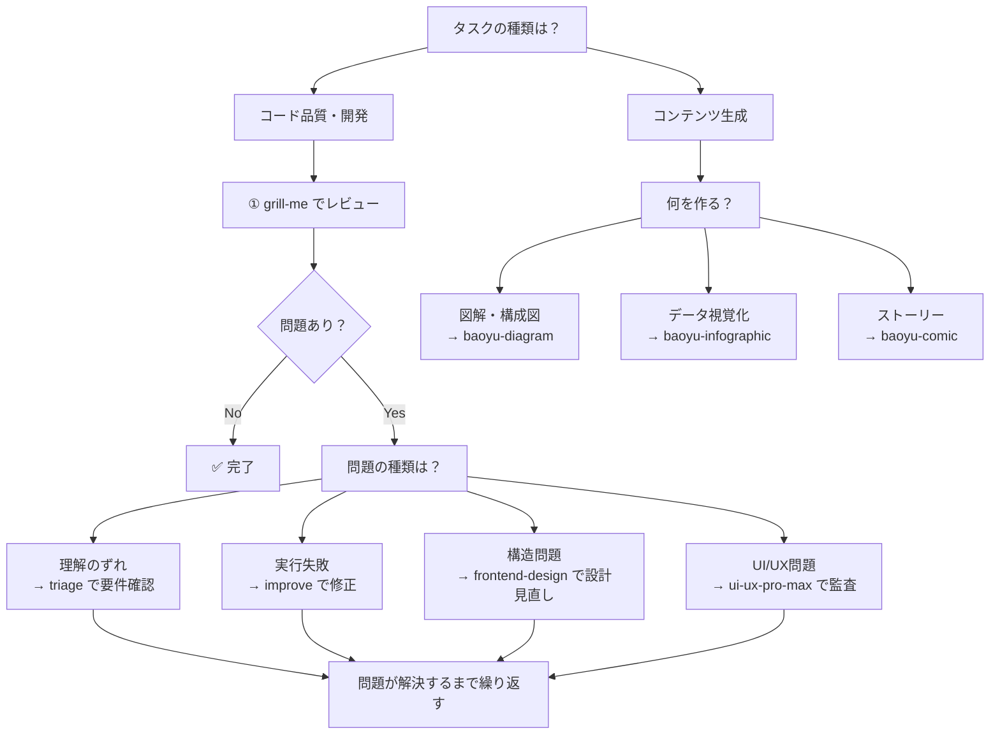

### 5.7.7 予防的活用

問題が発生する前にスキルを使うことで、予防的な品質向上が可能です：

| フェーズ | 使用スキル | 目的 |
|---------|-----------|------|
| 設計段階 | frontend-design | 適切なアーキテクチャを設計 |
| 実装段階 | grill-me | コード品質をリアルタイムにチェック |
| テスト段階 | improve | パフォーマンス問題を事前に発見 |
| レビュー段階 | grill-me + ui-ux-pro-max | 総合的な品質レビュー |
| 運用段階 | triage | Issue を効率的に管理 |
| コンテンツ段階 | baoyu-diagram / baoyu-infographic / baoyu-comic | 説明資料・学習コンテンツを視覚化 |

### 5.7.8 実践的な活用例

#### 5.7.8.1 シナリオ1: 新機能の開発

```
1. frontend-design で設計
   「商品検索機能のコンポーネント設計をして」

2. 生成されたコードを grill-me でレビュー
   「このコードをレビューして」

3. 問題があれば improve で改善
   「パフォーマンスを改善する提案をして」

4. UIを ui-ux-pro-max で監査
   「このUIコンポーネントのアクセシビリティをチェックして」

5. 運用開始後、triage で Issue 管理
   「このIssueの優先度を判定して」
```

#### 5.7.8.2 シナリオ2: 技術説明資料の作成

```
1. baoyu-diagram でアーキテクチャ図を生成
   「マイクロサービス構成を図解して」

2. baoyu-infographic でデータを視覚化
   「パフォーマンス改善の比較をインフォグラフィックにして」

3. baoyu-comic で学習コンテンツを作成
   「非同期処理の概念をコミック形式で説明して」
```

### 5.7.9 Part 5 で学んだ設計パターン総括

各スキルから共通して引き出せる設計の視点をまとめます：

| 設計パターン | 学べるスキル | 内容 |
|------------|------------|------|
| **重大度の明示** | grill-me | 問題の存在だけでなく「どれくらい深刻か」を出力に含める |
| **コンテキスト注入** | triage | スキル本体は汎用に保ち、文脈は外から注入する |
| **難易度×効果分類** | improve | 提案を列挙するだけでなく優先順位まで出力する |
| **LLM の得意技で出力** | baoyu-diagram | 画像 API でなくコード生成で図を作るアプローチ |
| **自動推薦ロジック** | baoyu-infographic | ユーザーに全選択肢を委ねず、入力から最適案を提案する |
| **プリセット設計** | baoyu-comic | 頻出ユースケースを事前設定として提供するエントリーポイント |

これらのパターンは、自分のスキルを設計するときにそのまま応用できます。

### 5.7.10 次のステップ

Part 5 の学習が完了しました。Part 6（コンテンツ生成）に進みましょう：

→ [Part 6: baoyu-skills エコシステム入門](../06-content-creation/01-baoyu-ecosystem.md)

# 6. コンテンツ生成スキル実践

## 6.1 6-1: baoyu-skills エコシステム入門

> **学習時間**: 15分 | **難易度**: ⭐⭐

### 6.1.1 概要

この Part 7 では、**JimLiu/baoyu-skills** を題材に、コンテンツ生成に特化したスキルセットの実践的な活用方法を学びます。これまでの Part 2〜5 で学んだスキル開発の知識を、実際のプロダクション品質のスキルセットを通じて応用します。

baoyu-skills は21,000+ Stars を集める人気リポジトリで、**コンテンツ生成**という特定ドメインに特化した20+のスキルを提供しています。

### 6.1.2 baoyu-skills の全体像

#### 6.1.2.1 3つのカテゴリ

baoyu-skills は以下の3カテゴリで構成されています：

```
baoyu-skills（21スキル）
├── Content Skills（7スキル）
│   ├── baoyu-cover-image     — 記事カバー画像生成
│   ├── baoyu-infographic     — インフォグラフィック生成
│   ├── baoyu-diagram         — SVG図形生成
│   ├── baoyu-slide-deck      — スライドデッキ生成
│   ├── baoyu-comic           — 知識マンガ生成
│   ├── baoyu-xhs-images      — SNS投稿画像生成
│   └── baoyu-article-illustrator — 記事挿絵生成
│
├── AI Generation Skills（3スキル）
│   ├── baoyu-image-gen       — 統合画像生成バックエンド
│   ├── baoyu-danger-gemini-web — Gemini Web 経由の画像生成
│   └── baoyu-danger-x-to-markdown — X(Twitter)投稿のMarkdown変換
│
└── Utility Skills（11スキル）
    ├── baoyu-translate       — 翻訳
    ├── baoyu-markdown-to-html — Markdown→HTML変換
    ├── baoyu-format-markdown — Markdown整形
    ├── baoyu-compress-image  — 画像圧縮
    ├── baoyu-url-to-markdown — URL→Markdown変換
    ├── baoyu-youtube-transcript — YouTube文字起こし
    ├── baoyu-wechat-summary  — WeChat記事要約
    ├── baoyu-post-to-x       — X(Twitter)投稿
    ├── baoyu-post-to-wechat  — WeChat投稿
    ├── baoyu-post-to-weibo   — Weibo投稿
    └── baoyu-electron-extract — Electronアプリ抽出
```

#### 6.1.2.2 インストール方法

```bash
# 推奨: npx skills add
npx skills add jimliu/baoyu-skills

# Claude Code プラグインとして
# Claude Code セッション内で:
/plugin marketplace add JimLiu/baoyu-skills
/plugin install baoyu-skills@baoyu-skills
```

> **💡 注意**: 21のスキル全てをインストールする必要はありません。必要なスキルだけを選んでインストールしましょう。

### 6.1.3 コンテンツ生成のワークフロー

baoyu-skills を使った典型的なコンテンツ生成ワークフローは以下の通りです：

```
記事を書く
    ↓
baoyu-cover-image でカバー画像を生成
    ↓
baoyu-diagram で図解を生成
    ↓
baoyu-infographic でインフォグラフィックを生成
    ↓
baoyu-slide-deck でプレゼン資料を生成
    ↓
baoyu-translate で多言語化
    ↓
baoyu-markdown-to-html でHTML出力
```

### 6.1.4 この Part の学習の流れ

| # | セクション | 内容 | 時間 |
|---|-----------|------|------|
| 6-1 | baoyu-skills エコシステム入門 | 全体像、インストール、3カテゴリ | 15分 |
| 6-2 | コンテンツ生成スキルを使いこなす | 主要スキルの実践的な使い方 | 20分 |
| 6-3 | AI画像生成バックエンドの選択 | 画像生成バックエンドの比較と使い分け | 15分 |
| 6-4 | 実プロジェクトでのスキル連携 | 図→インフォグラフィック→スライド→公開の自動化 | 20分 |
| 6-5 | カスタムスキル開発（baoyu流） | baoyuの設計パターンを真似た自前スキルの作り方 | 20分 |

### 6.1.5 前提知識

この Part を学習するには、以下の知識を前提とします：

- Part 2〜5 の内容を理解している
- Agent Skills の基本（SKILL.md の構造、スラッシュコマンド）を理解している
- Claude Code または Codex CLI が利用可能

### 6.1.6 3大フレームワークの比較

このチュートリアルで扱う3つのアプローチの比較です：

| 観点 | Superpowers | gstack | baoyu-skills |
|------|------------|--------|-------------|
| **作者** | Jesse Vincent | Garry Tan | Jim Liu |
| **提供形態** | **Plugin**（Claude Plugin Marketplace） | **スキルセット**（git clone） | **スキルセット**（Pluginとしても配布可） |
| **目的** | 開発プロセス方法論 | 仮想的エンジニアリングチーム | コンテンツ生成 |
| **スキル数** | 15 | 31 | 21 |
| **起動方法** | 自動起動 | 明示的スラッシュコマンド | 明示的スラッシュコマンド |
| **特徴** | HARD-GATE, TDD強制 | 役割分担, 実ブラウザQA | 5Dスタイル体系, SVG直書き |
| **主なユーザー** | 開発者全般 | スタートアップ創業者 | コンテンツクリエイター |
| **Stars** | 10,000+ | 109,000+ | 21,000+ |

### 6.1.7 baoyu-skills のアーキテクチャ

#### 6.1.7.1 全体構成（3層アーキテクチャ）

baoyu-skills は以下の3層アーキテクチャで設計されています：

```
┌──────────────────────────────────────────────┐
│              プラグイン層                      │
│  .claude-plugin/marketplace.json              │
│  全スキルを1つのプラグインとして公開             │
├──────────────────────────────────────────────┤
│              スキル層                          │
│  skills/baoyu-<name>/SKILL.md                 │
│  21の独立したスキル（自己完結型）               │
├──────────────────────────────────────────────┤
│              実行層                            │
│  scripts/main.ts（TypeScript / Bun）          │
│  各スキルの実行ロジック                         │
└──────────────────────────────────────────────┘
```

#### 6.1.7.2 スキルの自己完結性（Self-Containment）

baoyu-skills の最も重要な設計原則は **Skill Self-Containment**（スキルの自己完結性）です。

各スキルは独立して配布・実行できるように設計されており、以下のルールに従います：

| ルール | 内容 |
|-------|------|
| **外部参照禁止** | SKILL.md からリポジトリ外のファイルを参照しない |
| **インライン化** | 共有ルール（画像生成、ユーザー入力など）は各スキルに直接記述 |
| **独立実行** | スキルフォルダを他のプロジェクトにコピーしても動作する |
| **500行制限** | SKILL.md 本文は500行以内に抑え、詳細は `references/` に分割 |

```
✅ 良い例: SKILL.md 内に画像生成バックエンドの選択ルールを直接記述
❌ 悪い例: SKILL.md から ../../docs/image-generation-tools.md を参照
```

#### 6.1.7.3 インライン化ルール（必須セクションの自己完結）

baoyu-skills では、以下の2つのセクションは **SKILL.md に直接インライン記述**することが必須です（外部ファイル参照禁止）：

| 必須セクション | 内容 | 配置場所 |
|---------------|------|---------|
| **User Input Tools** | ユーザー入力受付時のツール選択ルール（AskUserQuestion 優先、フォールバック、バッチング） | SKILL.md 冒頭（intro直後） |
| **Image Generation Tools** | 画像生成時のバックエンド選択ルール（利用可能なツールの検出、プロンプトファイル保存の義務） | User Input Tools の直後 |

これにより、スキルフォルダごと他のプロジェクトにコピーしても、一切の外部参照なしで完全に動作します。

```markdown
<!-- SKILL.md 内に直接記述（インライン化） -->
## User Input Tools

When this skill prompts the user, follow this tool-selection rule (priority order):

1. **Prefer built-in user-input tools** exposed by the current agent runtime
2. **Fallback**: if no such tool exists, emit a numbered plain-text message
3. **Batching**: if the tool supports multiple questions per call, combine them

## Image Generation Tools

When this skill needs to render an image:

- **Use whatever image-generation tool or skill is available**
- **If multiple are available**, ask the user once which to use
- **Prompt file requirement**: write each prompt to a standalone file under `prompts/`
```

#### 6.1.7.4 Progressive Disclosure（段階的開示）

SKILL.md を500行以内に保つため、baoyu-skills は **Progressive Disclosure** パターンを採用しています：

```
skills/baoyu-example/
├── SKILL.md              # メイン指示（<500行）
├── references/
│   ├── styles.md         # 必要に応じて読み込む
│   ├── examples.md       # 必要に応じて読み込む
│   └── providers/        # プロバイダー固有の詳細
└── scripts/
    └── main.ts
```

SKILL.md からは1階層のみの参照でリンクします：
```markdown
**利用可能なスタイル**: [references/styles.md](references/styles.md) を参照
```

#### 6.1.7.5 EXTEND.md プリファレンスシステム

baoyu-skills のもう一つの重要な設計パターンが **EXTEND.md** によるユーザー設定管理です。各スキルは3段階の優先順位で設定ファイルを探索します：

| 優先度 | パス | スコープ |
|--------|------|---------|
| 1 | `.baoyu-skills/<skill-name>/EXTEND.md` | プロジェクト |
| 2 | `${XDG_CONFIG_HOME:-$HOME/.config}/baoyu-skills/<skill-name>/EXTEND.md` | XDG |
| 3 | `$HOME/.baoyu-skills/<skill-name>/EXTEND.md` | ユーザーホーム |

初回実行時に EXTEND.md が存在しない場合、スキルは**ブロッキング**状態となり、ユーザーに対話形式で設定を収集してから初めて処理を開始します。

```bash
# 探索順序（最初に見つかったものを使用）
test -f .baoyu-skills/baoyu-image-gen/EXTEND.md && echo "project"
test -f "${XDG_CONFIG_HOME:-$HOME/.config}/baoyu-skills/baoyu-image-gen/EXTEND.md" && echo "xdg"
test -f "$HOME/.baoyu-skills/baoyu-image-gen/EXTEND.md" && echo "user"
```

**設定例（baoyu-image-gen の場合）**:
```yaml
# .baoyu-skills/baoyu-image-gen/EXTEND.md
default_provider: google
default_quality: 2k
default_aspect_ratio: 16:9
default_model.google: gemini-3-pro-image
batch_worker_cap: 10
```

### 6.1.8 5D スタイル体系

baoyu-skills のコンテンツ生成スキルは、**5次元のスタイル体系**を持っています。これは特に baoyu-cover-image で顕著です：

| 次元 | 説明 | 選択肢 |
|------|------|--------|
| **Type**（タイプ） | ビジュアルの種類 | hero, conceptual, typography, metaphor, scene, minimal |
| **Palette**（パレット） | 配色 | warm, elegant, cool, dark, earth, vivid, pastel, mono, retro, duotone, macaron |
| **Rendering**（レンダリング） | 描画スタイル | flat-vector, hand-drawn, painterly, digital, pixel, chalk, screen-print |
| **Text**（テキスト） | テキスト量 | none, title-only, title-subtitle, text-rich |
| **Mood**（ムード） | 雰囲気 | subtle, balanced, bold |

この5D体系により、77通りの組み合わせ（11パレット × 7レンダリング）から最適なスタイルを選択できます。

#### 6.1.8.1 スキル間の設計パターン比較

baoyu-skills 内の各スキルは、共通の設計パターンを持ちながらも、独自の拡張を加えています：

| スキル | スタイル体系 | レイアウト体系 | 出力形式 |
|--------|------------|--------------|---------|
| baoyu-cover-image | 5D（Type×Palette×Rendering×Text×Mood） | アスペクト比指定 | PNG |
| baoyu-infographic | 21レイアウト × 17スタイル | 情報構造ベース | PNG |
| baoyu-slide-deck | 4D（Texture×Mood×Typography×Density） | スライド数指定 | PPTX + PDF |
| baoyu-comic | 5アート × 7トーン | パネルレイアウト | 画像シーケンス |
| baoyu-diagram | デザインシステム統一 | 5図タイプ | SVG（ダークモード対応） |
| baoyu-xhs-images | 12スタイル × 6レイアウト | 情報密度ベース | 画像カード |

### 6.1.9 クロスプラットフォーム対応

baoyu-skills は複数の AI エージェントで動作するよう設計されています：

| エージェント | 対応方法 |
|------------|---------|
| **Claude Code** | `.claude-plugin/marketplace.json` 経由のプラグイン |
| **OpenAI Codex CLI** | `npx skills add` でインストール |
| **Cursor** | スキルフォルダを直接配置 |
| **Claude Desktop** | ファイルベースのスキル読み込み |

#### 6.1.9.1 ランタイム検出パターン

baoyu-skills のスクリプトは、実行時にランタイムを自動検出します：

```bash
# 各スキルのスクリプト冒頭で使用されるパターン
if command -v bun &>/dev/null; then
  BUN_X="bun"
elif command -v npx &>/dev/null; then
  BUN_X="npx -y bun"
else
  echo "Error: install bun: brew install oven-sh/bun/bun"
  exit 1
fi

# 実行
${BUN_X} skills/<name>/scripts/main.ts [options]
```

### 6.1.10 画像生成バックエンドの抽象化

baoyu-skills の特筆すべき設計として、**画像生成バックエンドの抽象化**があります。コンテンツ生成スキルは実際の画像生成をバックエンドスキルに委譲します：

```
コンテンツスキル（例: baoyu-cover-image）
    ↓ 画像生成を依頼
画像生成バックエンド（複数選択可能）
    ├── baoyu-image-gen（OpenAI / Azure / Google / OpenRouter 等）
    ├── baoyu-danger-gemini-web（Gemini Web 経由）
    └── codex-imagegen（Codex CLI の画像生成機能）
```

各コンテンツスキルは「どのバックエンドを使うか」を気にせず、統一されたインターフェースで画像生成を依頼できます。バックエンドの選択は実行時に決定されます：

| 状況 | 動作 |
|------|------|
| バックエンドが1つだけ利用可能 | 自動的にそれを使用 |
| 複数のバックエンドが利用可能 | ユーザーに選択を確認 |
| バックエンドが利用不可 | ユーザーに設定方法を案内 |

### 6.1.11 baoyu-skills から学ぶ設計の教訓

#### 6.1.11.1 1. ドメイン特化の重要性

Superpowers（プラグイン）や gstack（スキルセット）が「開発プロセス全体」をカバーするのに対し、baoyu-skills は「コンテンツ生成」という特定ドメインに特化しています。これにより：

- 各スキルの役割が明確で、ユーザーが選びやすい
- スタイル体系などドメイン固有の設計を深堀りできる
- 競合するスキルが少なく、差別化しやすい

#### 6.1.11.2 2. スタイル体系の設計

baoyu-skills の最大の強みは、**体系化されたスタイル設計**です。単なる「画像を生成する」ではなく：

- 次元分解（Type, Palette, Rendering など）
- 組み合わせ可能性（77通りの組み合わせ）
- 視覚的なプレビュー（スクリーンショット一覧）

これにより、ユーザーは直感的にスタイルを選択できます。

#### 6.1.11.3 3. 自己完結型スキル

各スキルが独立して動作する設計は、以下のメリットをもたらします：

- 必要なスキルだけをインストールできる
- スキル単位でバージョン管理できる
- 他のプロジェクトに移植しやすい
- テストが容易

#### 6.1.11.4 4. 実行スクリプトの分離

SKILL.md（定義）と scripts/main.ts（実行）を分離することで：

- スキルの説明と実装が明確に分離される
- 複雑なロジックをスクリプトに委譲できる
- テストが書きやすい

> **💡 参考リンク**: [JimLiu/baoyu-skills](https://github.com/JimLiu/baoyu-skills) | [CLAUDE.md](https://github.com/JimLiu/baoyu-skills/blob/main/CLAUDE.md)

### 6.1.12 次のステップ

→ [6-2: コンテンツ生成スキルを使いこなす](02-content-skills-in-action.md)

## 6.2 6-2: コンテンツ生成スキルを使いこなす

> **学習時間**: 20分 | **難易度**: ⭐⭐⭐

### 6.2.1 概要

このセクションでは、baoyu-skills の主要なコンテンツ生成スキルを実際のユースケースに沿って使いこなす方法を学びます。各スキルの基本的な使い方は Part 5 で学びましたが、ここでは**実践的な組み合わせと応用**に焦点を当てます。

### 6.2.2 シナリオ: 技術記事の作成

ある技術記事を例に、baoyu-skills をフル活用する流れを見ていきます。

> **💡 実行方法について**: baoyu-skills の各スキルは、エージェントのランタイムに応じて呼び出し方が異なります。Claude Code ではスラッシュコマンド（`/baoyu-cover-image`）、Codex CLI では `npx skills run` 経由、また直接スクリプトを実行することもできます。以下の例では主にスラッシュコマンド形式で示します。

#### 6.2.2.1 ステップ1: カバー画像の生成（baoyu-cover-image）

記事の顔となるカバー画像を生成します。

```bash
# 記事の内容から自動生成（Claude Code）
/baoyu-cover-image articles/kubernetes-networking.md

# スタイルを指定して生成
/baoyu-cover-image articles/kubernetes-networking.md \
  --type conceptual \
  --palette cool \
  --rendering digital

# アスペクト比を指定（ブログの推奨サイズ）
/baoyu-cover-image articles/kubernetes-networking.md --aspect 2.35:1
```

**5Dスタイル体系の活用ポイント**:

| 次元 | 技術記事向けの推奨設定 |
|------|---------------------|
| Type | conceptual（概念図）または metaphor（比喩表現） |
| Palette | cool（クール）または dark（ダーク） |
| Rendering | digital（デジタル）または flat-vector（フラット） |
| Text | title-subtitle（タイトル+サブタイトル） |
| Mood | balanced（バランス）または bold（大胆） |

#### 6.2.2.2 ステップ2: 図解の生成（baoyu-diagram）

記事内で説明する概念を図解します。baoyu-diagram は画像生成APIを使わず、Claude が SVG コードを直接記述する点が特徴です。

```bash
# 記事の特定セクションから図を生成
/baoyu-diagram "Kubernetes networking: how pods communicate with each other"

# 図タイプを指定
/baoyu-diagram "Kubernetes networking architecture" --type structural

# 出力先を指定
/baoyu-diagram "Kubernetes networking architecture" \
  --type structural \
  --out images/k8s-networking-architecture.svg
```

**図タイプ選択のコツ**:

| 説明したい内容 | 推奨図タイプ |
|--------------|------------|
| 処理の流れ | flowchart |
| コンポーネント間通信 | sequence |
| システム構成 | structural |
| 概念の仕組み | illustrative |
| データモデル | class |

#### 6.2.2.3 ステップ3: インフォグラフィックの生成（baoyu-infographic）

記事の要点をまとめたインフォグラフィックを生成します。21のレイアウトと17のスタイルから自動推薦されます。

```bash
# 記事全体から自動推薦
/baoyu-infographic articles/kubernetes-networking.md

# 比較表として生成
/baoyu-infographic articles/kubernetes-networking.md \
  --layout comparison-table \
  --style technical-schematic

# 縦長で生成（SNS投稿用）
/baoyu-infographic articles/kubernetes-networking.md \
  --layout pyramid \
  --aspect portrait
```

#### 6.2.2.4 ステップ4: プレゼン資料の生成（baoyu-slide-deck）

記事を基にしたプレゼン資料を生成します。

```bash
# 記事からスライドを自動生成
/baoyu-slide-deck articles/kubernetes-networking.md

# スタイルと対象者を指定
/baoyu-slide-deck articles/kubernetes-networking.md \
  --style blueprint \
  --audience intermediate

# スライド数を指定
/baoyu-slide-deck articles/kubernetes-networking.md --slides 15
```

### 6.2.3 スキル間の連携パターン

#### 6.2.3.1 パターン1: 記事→図→インフォグラフィック

```
記事を書く
    ↓
baoyu-diagram で技術的な図解を生成
    ↓
baoyu-infographic で記事の要点を視覚化
    ↓
両方を記事に埋め込んで公開
```

#### 6.2.3.2 パターン2: 記事→カバー→スライド

```
記事を書く
    ↓
baoyu-cover-image でカバー画像を生成
    ↓
baoyu-slide-deck でプレゼン資料を生成
    ↓
カバー画像をスライドの表紙に設定
```

#### 6.2.3.3 パターン3: 記事→多言語化→公開

```
記事を書く
    ↓
baoyu-translate で英語/中国語に翻訳
    ↓
baoyu-cover-image で各言語版のカバー画像を生成
    ↓
baoyu-markdown-to-html でHTML出力
```

### 6.2.4 実践的なヒント

#### 6.2.4.1 1. スタイルの一貫性を保つ

複数のスキルを使う場合、スタイルを統一することでプロフェッショナルな印象になります：

```bash
# カバー画像とインフォグラフィックで同じパレットを使用
/baoyu-cover-image article.md --palette cool
/baoyu-infographic article.md --style technical-schematic
# → coolパレットとtechnical-schematicは相性が良い
```

#### 6.2.4.2 2. アスペクト比を統一する

ブログやSNSに合わせてアスペクト比を統一しましょう：

| プラットフォーム | 推奨アスペクト比 |
|----------------|----------------|
| ブログ（アイキャッチ） | 2.35:1 または 16:9 |
| Twitter/X | 16:9 |
| Instagram（フィード） | 1:1（スクエア） |
| Instagram（ストーリー） | 9:16（ポートレート） |
| LinkedIn | 1.91:1 |

#### 6.2.4.3 3. プロンプトを再利用する

生成されたプロンプトは `prompts/` ディレクトリに保存されるため、微調整や再生成が容易です：

```bash
# プロンプトを編集して再生成
# prompts/01-cover.md を編集
/baoyu-cover-image article.md --prompts-only
# → 編集後に --images-only で再生成
```

### 6.2.5 次のステップ

→ [6-3: AI画像生成バックエンドの選択](03-image-gen-backends.md)

## 6.3 6-3: AI画像生成バックエンドの選択

> **学習時間**: 15分 | **難易度**: ⭐⭐

### 6.3.1 概要

baoyu-skills のコンテンツ生成スキル（baoyu-cover-image, baoyu-infographic, baoyu-comic など）は、実際の画像生成を**バックエンドスキル**に委譲するアーキテクチャを採用しています。このセクションでは、利用可能な画像生成バックエンドの種類と、その選択基準を学びます。

### 6.3.2 画像生成バックエンドの種類

baoyu-skills では以下の3つの画像生成バックエンドが利用可能です：

| バックエンド | 必要APIキー | コスト | 品質 | 速度 |
|------------|-----------|-------|------|------|
| **baoyu-image-gen** | OpenAI / Azure / Google / OpenRouter / Replicate | 従量課金 | 高い | 普通 |
| **baoyu-danger-gemini-web** | 不要（ブラウザCookie） | 無料 | 高い | 速い |
| **codex-imagegen** | Codex CLI のサブスクリプション | サブスク内 | 高い | 普通 |

#### 6.3.2.1 baoyu-image-gen（推奨）

最も汎用的なバックエンドです。複数の画像生成APIを統一的に扱えます。

**対応プロバイダー**:

| プロバイダー | 設定方法 |
|------------|---------|
| **OpenAI**（DALL-E 3） | `OPENAI_API_KEY` 環境変数 |
| **Azure OpenAI** | `AZURE_OPENAI_API_KEY` + `AZURE_OPENAI_ENDPOINT` |
| **Google**（Gemini Imagen） | `GOOGLE_API_KEY` 環境変数 |
| **OpenRouter** | `OPENROUTER_API_KEY` 環境変数 |
| **DashScope**（Alibaba） | `DASHSCOPE_API_KEY` 環境変数 |
| **Replicate** | `REPLICATE_API_KEY` 環境変数 |

```bash
# 環境変数の設定例（OpenAI）
export OPENAI_API_KEY="sk-..."

# プロバイダーを指定して実行
/baoyu-cover-image article.md --provider openai
```

#### 6.3.2.2 baoyu-danger-gemini-web

Google Gemini の Web インターフェースを経由して画像生成を行います。**APIキー不要**で利用できるのが最大のメリットです。

**仕組み**:
1. Chrome ブラウザを起動（CDP = Chrome DevTools Protocol）
2. Gemini Web にログイン（初回のみ）
3. Web インターフェース経由で画像生成を実行

```bash
# 初回セットアップ（ログイン）
/baoyu-danger-gemini-web --login

# 画像生成
/baoyu-cover-image article.md --provider gemini-web
```

**注意点**:
- Chrome ブラウザが必要
- 初回のみログイン操作が必要
- 利用規約に従う必要がある

#### 6.3.2.3 codex-imagegen

OpenAI Codex CLI の画像生成機能をバックエンドとして利用します。Codex CLI のサブスクリプションがあれば、追加のAPIキーは不要です。

```bash
# Codex CLI バックエンドで実行
/baoyu-cover-image article.md --provider codex-cli
```

### 6.3.3 バックエンド選択の自動化

baoyu-skills は実行時に利用可能なバックエンドを自動検出します：

```
コンテンツスキルが画像生成を要求
    ↓
利用可能なバックエンドをチェック
    ↓
┌─ 1つだけ利用可能 → 自動的にそれを使用
├─ 複数利用可能 → ユーザーに選択を確認
└─ なし → ユーザーに設定方法を案内
```

#### 6.3.3.1 優先順位の設定

`EXTEND.md` に設定を記述することで、優先的に使用するバックエンドを指定できます：

```yaml
# EXTEND.md
preferred_image_backend: openai  # openai, azure, google, openrouter, replicate, gemini-web, codex-cli
```

### 6.3.4 バックエンドの比較と選び方

#### 6.3.4.1 コスト重視の場合

```
個人利用・学習目的
    ↓
baoyu-danger-gemini-web が最適
- APIキー不要
- 無料
- ただしChromeが必要
```

#### 6.3.4.2 品質重視の場合

```
プロダクション利用
    ↓
baoyu-image-gen（OpenAI DALL-E 3）が最適
- 最高品質の画像生成
- 安定したAPI
- 従量課金だが信頼性が高い
```

#### 6.3.4.3 既存サブスクリプションを活用する場合

```
Codex CLI ユーザー
    ↓
codex-imagegen が最適
- 追加費用なし
- Codex CLI のサブスクリプション内で完結
```

### 6.3.5 トラブルシューティング

| 問題 | 原因 | 解決策 |
|------|------|--------|
| APIキーエラー | 環境変数が未設定 | `export OPENAI_API_KEY="sk-..."` を実行 |
| Gemini Web ログインエラー | セッション切れ | `--login` で再ログイン |
| Chrome が見つからない | Chrome 未インストール | Chrome をインストール |
| レート制限 | APIの呼び出し制限 | 時間を空けて再試行 |
| 画像品質が低い | プロバイダーの制限 | 別のプロバイダーを試す |

### 6.3.6 次のステップ

→ [6-4: 実プロジェクトでのスキル連携](04-skill-pipeline.md)

## 6.4 6-4: 実プロジェクトでのスキル連携

> **学習時間**: 20分 | **難易度**: ⭐⭐⭐

### 6.4.1 概要

このセクションでは、baoyu-skills の複数スキルを連携させた**自動化パイプライン**を構築する方法を学びます。Part 6 で学んだスキル連携の概念を、実際のコンテンツ生成ワークフローに適用します。

### 6.4.2 パイプラインの設計

#### 6.4.2.1 全体アーキテクチャ

baoyu-skills を使ったコンテンツ生成パイプラインは以下のように設計できます：

```
                    ┌─────────────────┐
                    │  記事の作成      │
                    │  (Markdown)     │
                    └────────┬────────┘
                             │
              ┌──────────────┼──────────────┐
              │              │              │
              ▼              ▼              ▼
      ┌────────────┐ ┌────────────┐ ┌────────────┐
      │ カバー画像  │ │  図解生成   │ │ インフォ    │
      │ cover-image│ │ diagram    │ │ graphic    │
      └────────────┘ └────────────┘ └────────────┘
              │              │              │
              └──────────────┼──────────────┘
                             │
                             ▼
                    ┌─────────────────┐
                    │  スライド生成    │
                    │  slide-deck     │
                    └────────┬────────┘
                             │
                             ▼
                    ┌─────────────────┐
                    │  多言語化・公開   │
                    │  translate      │
                    │  markdown-to-html│
                    └─────────────────┘
```

### 6.4.3 実装例: ブログ記事生成パイプライン

#### 6.4.3.1 ステップ1: エージェントへの指示としてパイプラインを定義

baoyu-skills のパイプラインは、シェルスクリプトではなく**エージェントへの自然言語指示**として定義するのが実践的です。以下のような指示をエージェントに与えることで、パイプラインが実行されます：

```markdown
以下のパイプラインを実行してください：

1. articles/my-article.md から baoyu-cover-image でカバー画像を生成
   - type: conceptual, palette: cool, rendering: digital
   - 出力先: output/images/cover.png

2. 同じ記事から baoyu-diagram で図解を生成
   - type: structural
   - 出力先: output/images/diagram.svg

3. baoyu-infographic でインフォグラフィックを生成
   - layout: auto-recommend, style: technical-schematic
   - 出力先: output/images/infographic.png

4. baoyu-slide-deck でスライドを生成
   - style: blueprint, audience: intermediate
   - 出力先: output/slides/

5. baoyu-translate で英語版に翻訳
   - 出力先: output/translations/
```

#### 6.4.3.2 ステップ2: スクリプトベースのパイプライン（Bun）

より自動化したい場合は、baoyu-skills のスクリプトを直接呼び出す Bun スクリプトを作成します：

```typescript
// blog-pipeline.ts
import { $ } from "bun";

const article = process.argv[2];
const outputDir = "./output";

await $`mkdir -p ${outputDir}/images ${outputDir}/slides`;

console.log("=== Step 1: カバー画像生成 ===");
await $`bun run skills/baoyu-cover-image/scripts/main.ts ${article} \
  --type conceptual --palette cool \
  --out ${outputDir}/images/cover.png`;

console.log("=== Step 2: 図解生成 ===");
await $`bun run skills/baoyu-diagram/scripts/main.ts ${article} \
  --type structural \
  --out ${outputDir}/images/diagram.svg`;

console.log("=== Step 3: インフォグラフィック生成 ===");
await $`bun run skills/baoyu-infographic/scripts/main.ts ${article} \
  --style technical-schematic \
  --out ${outputDir}/images/infographic.png`;

console.log("=== Pipeline Complete ===");
```

#### 6.4.3.3 ステップ2: Claude Code のスキルとして定義

このパイプライン自体を1つのスキルとして定義することもできます：

````markdown
# SKILL.md

## 使用方法

```bash
/blog-pipeline path/to/article.md
```

## 処理フロー

1. baoyu-cover-image でカバー画像を生成
2. baoyu-diagram で図解を生成
3. baoyu-infographic でインフォグラフィックを生成
4. baoyu-slide-deck でスライドを生成
5. 全ての出力を `output/` ディレクトリに保存

````

### 6.4.4 応用パターン

#### 6.4.4.1 パターン1: CI/CD パイプラインへの統合

GitHub Actions で記事公開時に自動生成する例：

```yaml
# .github/workflows/generate-content.yml
name: Generate Content Assets

on:
  push:
    paths:
      - 'articles/**/*.md'

jobs:
  generate:
    runs-on: ubuntu-latest
    steps:
      - uses: actions/checkout@v4

      - name: Setup Bun
        uses: oven-sh/setup-bun@v1

      - name: Install baoyu-skills
        run: npx skills add jimliu/baoyu-skills

      - name: Generate cover images
        run: |
          for article in articles/*.md; do
            /baoyu-cover-image "$article" --quick
          done

      - name: Commit generated assets
        run: |
          git add images/
          git commit -m "Auto-generate content assets" || true
          git push
```

#### 6.4.4.2 パターン2: バッチ処理

複数の記事を一括処理する例：

```bash
#!/bin/bash
# batch-generate.sh

for article in articles/*.md; do
  name=$(basename "$article" .md)
  echo "Processing: $name"

  /baoyu-cover-image "$article" \
    --quick \
    --out "images/$name-cover.png"

  /baoyu-diagram "$article" \
    --type auto \
    --out "images/$name-diagram.svg"
done
```

#### 6.4.4.3 パターン3: スキル間のデータ連携

あるスキルの出力を別のスキルの入力として利用する例：

```bash
# 1. 図を生成
/baoyu-diagram "システムアーキテクチャ" \
  --type structural \
  --out images/architecture.svg

# 2. 図の説明文を生成
# （diagram の出力を infographic の入力に使う）
echo "# システムアーキテクチャの説明

## 主要コンポーネント
- Webサーバー: Nginx
- アプリケーション: Node.js
- データベース: PostgreSQL

## データフロー
1. クライアントからのリクエスト
2. Nginxがロードバランシング
3. Node.jsがビジネスロジックを処理
4. PostgreSQLにデータを保存" > /tmp/arch-desc.md

# 3. 説明からインフォグラフィックを生成
/baoyu-infographic /tmp/arch-desc.md \
  --layout layers-stack \
  --style technical-schematic
```

### 6.4.5 パイプライン設計のベストプラクティス

#### 6.4.5.1 1. エラーハンドリング

各ステップが失敗した場合のフォールバックを設計します：

```bash
# エラーハンドリング付きパイプライン
if /baoyu-cover-image article.md --quick; then
  echo "カバー画像生成成功"
else
  echo "カバー画像生成失敗、デフォルト画像を使用"
  cp templates/default-cover.png images/cover.png
fi
```

#### 6.4.5.2 2. キャッシュ戦略

同じ入力に対する再生成を避けるため、キャッシュを活用します：

```bash
# キャッシュチェック
CACHE_FILE=".cache/$(md5sum article.md | cut -d' ' -f1)"
if [ -f "$CACHE_FILE" ]; then
  echo "キャッシュから復元"
  cp "$CACHE_FILE" images/cover.png
else
  /baoyu-cover-image article.md --quick
  cp images/cover.png "$CACHE_FILE"
fi
```

#### 6.4.5.3 3. 並列実行

独立したステップは並列実行して高速化します：

```bash
# 並列実行（カバー画像と図解は独立）
/baoyu-cover-image article.md --quick &
/baoyu-diagram article.md --type auto &
wait  # 両方の完了を待つ

# スライド生成は上記の結果に依存
/baoyu-slide-deck article.md
```

### 6.4.6 次のステップ

→ [6-5: カスタムスキル開発（baoyu流）](05-custom-skill-development.md)

## 6.5 6-5: カスタムスキル開発（baoyu流）

> **学習時間**: 20分 | **難易度**: ⭐⭐⭐

### 6.5.1 概要

このセクションでは、baoyu-skills の設計パターンを参考に、**自前のコンテンツ生成スキル**を開発する方法を学びます。baoyu-skills から学んだ「自己完結型スキル」「スタイル体系」「バックエンド抽象化」などの設計原則を、自分のスキル開発に応用します。

### 6.5.2 baoyu流スキル設計の7原則

baoyu-skills の設計から抽出した7つの原則を、カスタムスキル開発に適用します：

| # | 原則 | 説明 |
|---|------|------|
| 1 | **自己完結性** | スキルは単体で動作し、外部参照をしない |
| 2 | **インライン化** | User Input Tools / Image Generation Tools は SKILL.md に直接記述 |
| 3 | **スタイル体系** | 出力のバリエーションを次元分解して定義する |
| 4 | **バックエンド抽象化** | 実行ロジックをバックエンドに委譲する |
| 5 | **EXTEND.md 設定** | ユーザー設定を外部ファイルで管理する |
| 6 | **プロンプト管理** | 生成プロンプトを保存・再利用可能にする |
| 7 | **クロスプラットフォーム** | 複数のAIエージェントで動作するようにする |

### 6.5.3 ステップ1: スキルの設計

#### 6.5.3.1 スキルの目的を定義する

まず、スキルの目的を明確にします：

```markdown
# スキル設計シート

## スキル名
baoyu-banner — ブログバナー画像生成スキル

## 目的
記事のタイトルとカテゴリから、ブログのヘッダー用バナー画像を生成する

## ターゲットユーザー
技術ブログを運営する開発者

## 入力
- 記事のタイトル（必須）
- 記事のカテゴリ（オプション）
- スタイル指定（オプション）

## 出力
- 1200×630px のバナー画像（PNG）
```

#### 6.5.3.2 スタイル体系を設計する

baoyu-cover-image の5Dスタイル体系を参考に、独自のスタイル体系を設計します：

```markdown
## スタイル体系

| 次元 | 説明 | 選択肢 |
|------|------|--------|
| Layout（レイアウト） | テキストと画像の配置 | centered, left-aligned, split, full-bleed |
| Palette（パレット） | 配色 | light, dark, brand, gradient |
| Accent（アクセント） | 強調色 | blue, green, orange, purple, red |
| Density（密度） | 情報量 | minimal, balanced, rich |
```

### 6.5.4 ステップ2: SKILL.md の作成

baoyu流の自己完結型 SKILL.md を作成します。以下のポイントに従ってください：

1. **frontmatter** は実際の baoyu-skills のフォーマットに準拠（`metadata.openclaw` を含む）
2. **User Input Tools** と **Image Generation Tools** は SKILL.md に直接インライン記述（外部参照禁止）
3. **EXTEND.md** による設定管理をサポート

````markdown
---
name: baoyu-banner
description: Generates blog banner images from article titles and categories. Use when user needs a header image for a blog post.
version: 1.0.0
metadata:
  openclaw:
    homepage: https://github.com/your-name/baoyu-banner
    requires:
      anyBins:
        - bun
        - npx
---

# baoyu-banner

Generate professional blog banner images from article titles and categories.

## User Input Tools

When this skill prompts the user, follow this tool-selection rule (priority order):

1. **Prefer built-in user-input tools** exposed by the current agent runtime
2. **Fallback**: if no such tool exists, emit a numbered plain-text message
3. **Batching**: if the tool supports multiple questions per call, combine them

## Image Generation Tools

When this skill needs to render an image:

- **Use whatever image-generation tool or skill is available**
- **If multiple are available**, ask the user once which to use
- **Prompt file requirement**: write each prompt to a standalone file under `prompts/`

## EXTEND.md Configuration

This skill supports user preferences via EXTEND.md. On first run, if no EXTEND.md is found, the skill will prompt the user interactively.

**Search order** (first found wins):
1. `.baoyu-skills/baoyu-banner/EXTEND.md` (project scope)
2. `$XDG_CONFIG_HOME/baoyu-skills/baoyu-banner/EXTEND.md` (user scope)

**Example EXTEND.md**:
```yaml
default_layout: centered
default_palette: brand
default_accent: blue
default_density: balanced
```

## Usage

```bash
/baoyu-banner "Getting Started with Kubernetes" --category tech
/baoyu-banner "Design Thinking Workshop" --layout split --palette light
```

## Style System

### Layout
- **centered**: Title centered with decorative background
- **left-aligned**: Title on the left, abstract graphic on the right
- **split**: Split layout with category indicator
- **full-bleed**: Full background image with overlaid text

### Palette
- **light**: Clean white background with subtle patterns
- **dark**: Dark background with vibrant accents
- **brand**: Uses brand colors from the project
- **gradient**: Smooth gradient backgrounds

### Accent
Choose from: blue, green, orange, purple, red

### Density
- **minimal**: Just the title, lots of whitespace
- **balanced**: Title + category + subtle decoration
- **rich**: Title + category + tags + decorative elements

## Output

The generated banner will be saved to the current directory as:
`banner-<title-slug>.png`
````

### 6.5.5 ステップ3: 実行スクリプトの作成

baoyu-skills のように、複雑なロジックはスクリプトに分離します：

```typescript
// scripts/main.ts
import { parseArgs } from "./args";
import { detectBackend } from "./backend";
import { generatePrompt } from "./prompt";

async function main() {
  // 1. 引数を解析
  const args = parseArgs(process.argv.slice(2));

  // 2. 利用可能な画像生成バックエンドを検出
  const backend = await detectBackend();
  if (!backend) {
    console.error("No image generation backend available.");
    console.error("Please set OPENAI_API_KEY or install baoyu-image-gen.");
    process.exit(1);
  }

  // 3. プロンプトを生成
  const prompt = generatePrompt({
    title: args.title,
    category: args.category,
    layout: args.layout,
    palette: args.palette,
    accent: args.accent,
    density: args.density,
  });

  // 4. 画像を生成
  const image = await backend.generate(prompt, {
    width: 1200,
    height: 630,
  });

  // 5. 保存
  const filename = `banner-${slugify(args.title)}.png`;
  await saveImage(image, filename);
  console.log(`Banner saved: ${filename}`);
}

main().catch(console.error);
```

### 6.5.6 ステップ4: スキルのテスト

baoyu-skills のテスト方法を参考に、スキルをテストします：

```bash
# 1. 基本的な動作確認
/baoyu-banner "Test Title"

# 2. 全てのスタイルの組み合わせをテスト
for layout in centered left-aligned split full-bleed; do
  for palette in light dark brand gradient; do
    /baoyu-banner "Test $layout $palette" \
      --layout $layout --palette $palette
  done
done

# 3. エッジケースのテスト
/baoyu-banner ""  # 空のタイトル → エラーハンドリング
/baoyu-banner "A"  # 短いタイトル
/baoyu-banner "A very long title that might overflow the banner design"  # 長いタイトル
```

### 6.5.7 ステップ5: スキルの公開

baoyu-skills のように、スキルを公開して他の人も使えるようにします：

#### 6.5.7.1 リポジトリ構成

```
baoyu-banner/
├── SKILL.md              # スキル定義
├── scripts/
│   ├── main.ts           # メイン実行スクリプト
│   ├── args.ts           # 引数パーサー
│   ├── backend.ts        # バックエンド検出
│   └── prompt.ts         # プロンプト生成
├── references/           # 参考資料
├── prompts/              # 生成プロンプトの保存先
├── CLAUDE.md             # Claude Code 用設定
├── package.json          # 依存関係
└── README.md             # リポジトリの説明
```

#### 6.5.7.2 公開チェックリスト

- [ ] SKILL.md に明確な説明と使用例が含まれている
- [ ] 適切なタグが設定されている
- [ ] ライセンスファイルが含まれている
- [ ] README.md にインストール方法が記載されている
- [ ] テスト済みである
- [ ] 複数のAIエージェントで動作確認済み

### 6.5.8 baoyu流 vs 標準的なスキル開発

| 観点 | 標準的なスキル開発 | baoyu流スキル開発 |
|------|------------------|-----------------|
| **SKILL.md** | プロンプトのみ | YAML front matter + 構造化された説明 |
| **実行ロジック** | SKILL.md 内に記述 | スクリプトに分離 |
| **スタイル体系** | 単純なオプション | 多次元に分解された体系 |
| **バックエンド** | 固定 | 抽象化され、選択可能 |
| **プロンプト管理** | なし | 保存・再利用可能 |
| **テスト** | 手動 | 体系的なテスト |

### 6.5.9 まとめ

baoyu-skills の設計パターンを学ぶことで、以下のスキルが身につきました：

1. **自己完結型スキル**の設計方法
2. **スタイル体系**の設計と次元分解
3. **バックエンド抽象化**による柔軟な実行
4. **プロンプト管理**による再現性の確保
5. **クロスプラットフォーム**対応の考慮

これらの原則を適用することで、高品質で保守性の高いスキルを開発できます。

### 6.5.10 次のステップ

→ [Part 8: 付録・リファレンス](../07-appendix/01-glossary.md)

---

> **💡 参考リンク**: [JimLiu/baoyu-skills](https://github.com/JimLiu/baoyu-skills) | [CLAUDE.md](https://github.com/JimLiu/baoyu-skills/blob/main/CLAUDE.md)

# 7. 発展・応用

## 7.1 7-1: 複数スキルの連携パイプライン

> **学習時間**: 15分 | **難易度**: ⭐⭐⭐

### 7.1.1 概要

複数のスキルを連携させることで、単一のスキルでは実現できない高度なワークフローを構築できます。このセクションでは、5つの実践スキルを組み合わせたパイプラインの設計と実装を学びます。

### 7.1.2 パイプラインの基本パターン

#### 7.1.2.1 シーケンシャルパターン（直列）

```
スキルA → スキルB → スキルC
```

前のスキルの出力を次のスキルの入力として使用します。

#### 7.1.2.2 パラレルパターン（並列）

```
      ┌→ スキルB
スキルA ┼→ スキルC
      └→ スキルD
```

1つの入力に対して複数のスキルを同時に実行します。

#### 7.1.2.3 条件分岐パターン

```
      ┌→ 条件A → スキルB
スキルA ┤
      └→ 条件B → スキルC
```

スキルの出力に応じて、次に実行するスキルを切り替えます。

### 7.1.3 実践パイプライン例

#### 7.1.3.1 パイプライン1: コード品質改善フロー

```
コード入力
    ↓
① grill-me（コードレビュー）
    ↓ 問題あり？
    ├── Yes → ② improve（改善提案）
    │           ↓
    │          ③ 改善コードを grill-me で再レビュー
    │           ↓
    └── No  → ④ 完了
```

**実装例**:
```
@grill-me 以下のコードをレビューして：
[コード]

→ 問題が検出された場合：
@improve 上記のレビュー結果を基に改善提案をして

→ 改善案を適用後、再度レビュー：
@grill-me 改善後のコードをレビューして：
[改善後コード]
```

#### 7.1.3.2 パイプライン2: 設計→実装→レビューフロー

```
要件
 ↓
① frontend-design（設計支援）
    ↓ 設計案
② 実装（人間 or AI）
    ↓ コード
③ grill-me（コードレビュー）
    ↓ レビュー結果
④ ui-ux-pro-max（UI/UX監査）
    ↓ 監査結果
⑤ 完了
```

**実装例**:
```
@frontend-design 
要件: 商品検索機能。React + TypeScript + Tailwind CSS
設計フォーカス: components, state

→ 設計案を基に実装後：
@grill-me 実装したコードをレビューして：
[実装コード]

→ レビュー通過後：
@ui-ux-pro-max 
フレームワーク: React
[UIコンポーネントコード]
```

#### 7.1.3.3 パイプライン3: Issue トリアージ→改善フロー

```
新規Issue
    ↓
① triage（Issue分析）
    ↓ 優先度判定
    ├── P0/P1 → ② 即時対応
    │            ↓
    │           ③ grill-me で修正コードレビュー
    │
    └── P2/P3 → ④ バックログに追加
                 ↓
                 ⑤ スプリント計画時に再評価
```

**実装例**:
```
@triage 
タイトル: 「ログインページで500エラー」
本文: [Issue詳細]

→ P0判定の場合：
@grill-me 修正コードをレビューして：
[修正コード]
```

### 7.1.4 パイプライン設計のベストプラクティス

#### 7.1.4.1 1. 各ステップの入出力を明確に
各スキルの出力が次のスキルの入力として適切か確認します。

#### 7.1.4.2 2. エラーハンドリングを組み込む
各ステップでエラーが発生した場合の代替パスを設計します。

#### 7.1.4.3 3. 段階的に構築する
最初はシンプルな2スキルの連携から始め、徐々に複雑化します。

#### 7.1.4.4 4. 結果を検証する
パイプライン全体の出力が期待通りかを定期的に検証します。

### 7.1.5 次のステップ

→ [7-2: 実プロジェクトへの組み込み](02-ci-cd-integration.md)

## 7.2 7-2: 実プロジェクトへの組み込み

> **学習時間**: 15分 | **難易度**: ⭐⭐⭐

### 7.2.1 概要

作成したスキルを実際のプロジェクトに組み込み、CI/CD パイプラインと連携する方法を学びます。品質ゲートとしてスキルを活用し、コード品質を自動的に維持する仕組みを構築します。

### 7.2.2 CI/CD パイプラインへの統合

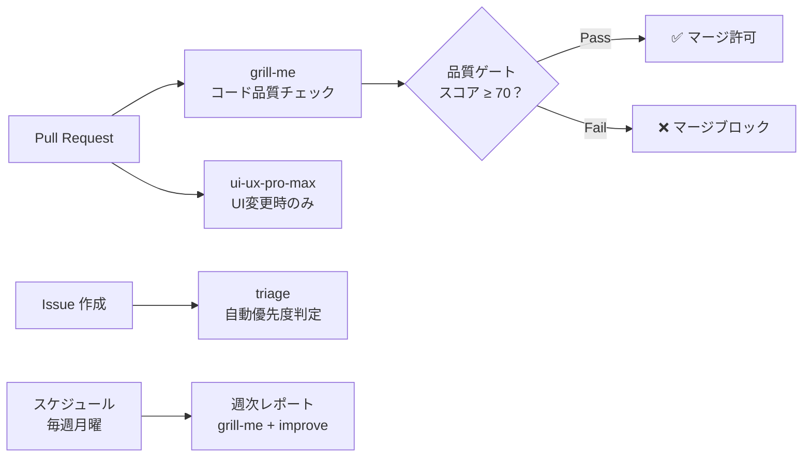

#### 7.2.2.1 GitHub Actions との連携

```yaml
# .github/workflows/skill-review.yml
name: Skill Code Review

on:
  pull_request:
    types: [opened, synchronize]

jobs:
  review:
    runs-on: ubuntu-latest
    steps:
      - uses: actions/checkout@v4

      - name: Run grill-me review
        uses: github/copilot-skills-action@v1
        with:
          skill: grill-me
          files: "src/**/*.{ts,tsx}"

      - name: Check quality gate
        run: |
          # 品質スコアが70未満の場合は失敗
          if [ "$SCORE" -lt 70 ]; then
            echo "Quality gate failed: score $SCORE < 70"
            exit 1
          fi
```

#### 7.2.2.2 品質ゲートの設定例

```yaml
# .github/skills-config/quality-gates.yml
quality_gates:
  - skill: grill-me
    threshold: 70  # 全体スコアの最低値
    categories:
      security: 80     # セキュリティは80以上必須
      performance: 60  # パフォーマンスは60以上

  - skill: ui-ux-pro-max
    threshold: 60
    categories:
      accessibility: 70  # アクセシビリティは70以上必須
```

### 7.2.3 実践的な統合例

#### 7.2.3.1 例1: PR 作成時の自動レビュー

```yaml
name: PR Quality Check

on:
  pull_request:
    paths:
      - 'src/**/*.tsx'
      - 'src/**/*.ts'

jobs:
  quality-check:
    runs-on: ubuntu-latest
    steps:
      - uses: actions/checkout@v4

      - name: Code Review
        run: |
          # 変更ファイルを抽出
          FILES=$(git diff --name-only origin/main...HEAD)

          # grill-me でレビュー
          for file in $FILES; do
            gh copilot run grill-me \
              --param code="$(cat $file)" \
              --param language="typescript" \
              --param framework="react"
          done

      - name: UI/UX Audit
        run: |
          # UIコンポーネントの変更を監査
          UI_FILES=$(echo "$FILES" | grep -E '\.(tsx|jsx)$')
          for file in $UI_FILES; do
            gh copilot run ui-ux-pro-max \
              --param component_code="$(cat $file)" \
              --param framework="react"
          done
```

#### 7.2.3.2 例2: 定期的なコード品質レポート

```yaml
name: Weekly Quality Report

on:
  schedule:
    - cron: '0 9 * * 1'  # 毎週月曜日

jobs:
  quality-report:
    runs-on: ubuntu-latest
    steps:
      - uses: actions/checkout@v4

      - name: Generate Quality Report
        run: |
          # 全ソースコードを分析
          gh copilot run grill-me \
            --param code="$(cat src/**/*.ts)" \
            --param max_issues=100

      - name: Create Issue
        uses: actions/github-script@v7
        with:
          script: |
            github.rest.issues.create({
              owner: context.repo.owner,
              repo: context.repo.repo,
              title: '週次コード品質レポート',
              body: reportBody
            })
```

### 7.2.4 統合パターン一覧

| パターン | トリガー | 使用スキル | 目的 |
|---------|---------|-----------|------|
| PRレビュー | pull_request | grill-me | コード品質の自動チェック |
| UI監査 | pull_request (UI変更時) | ui-ux-pro-max | UI/UX品質の維持 |
| Issueトリアージ | issues | triage | Issue管理の効率化 |
| 週次レポート | schedule | grill-me + improve | 品質傾向の把握 |
| リリース前チェック | release | 全スキル | リリース品質の保証 |

### 7.2.5 品質ゲートの設計指針

#### 7.2.5.1 1. 段階的な導入
最初は緩めの閾値から始め、チームの成熟度に応じて厳しくします。

#### 7.2.5.2 2. ブロッカーと警告の区別
- **ブロッカー**: マージをブロック（セキュリティ問題など）
- **警告**: 通知のみ（スタイルの改善提案など）

#### 7.2.5.3 3. 人間の判断を残す
自動チェックは補助であり、最終判断は人間が行います。

### 7.2.6 次のステップ

→ [7-3: スキル評価と改善サイクル](03-evaluation-cycle.md)

## 7.3 7-3: スキル評価と改善サイクル

> **学習時間**: 15分 | **難易度**: ⭐⭐⭐

### 7.3.1 概要

スキル自体の品質を評価し、継続的に改善するサイクルを構築する方法を学びます。スキルもソフトウェアと同様に、定期的な評価と改善が必要です。

### 7.3.2 スキル評価フレームワーク

#### 7.3.2.1 評価の4軸

| 軸 | 評価項目 | 測定方法 |
|----|---------|---------|
| 正確性 | 期待通りの出力が得られるか | テストケースの合格率 |
| 一貫性 | 同じ入力に対して同じ品質の出力か | 複数回実行の結果比較 |
| 網羅性 | エッジケースに対応できているか | テストカバレッジ |
| 実用性 | 実際の開発で役立つか | ユーザーフィードバック |

#### 7.3.2.2 評価プロセス

```
① テストケースの実行
    ↓
② 結果の収集と分析
    ↓
③ 問題点の特定
    ↓
④ 改善計画の策定
    ↓
⑤ スキルの更新
    ↓
⑥ 再テスト
```

### 7.3.3 テストケースの設計

#### 7.3.3.1 テストケーステンプレート

各スキルには以下のテストケースを用意します：

```markdown
## テストケース

### 正常系
| # | 入力 | 期待される出力 | 実際の結果 | 判定 |
|---|------|---------------|-----------|------|
| 1 | 適切なコード | 4軸のレビュー結果 | ✅ | Pass |
| 2 | シンプルなコード | 問題なしの結果 | ✅ | Pass |

### 異常系
| # | 入力 | 期待される出力 | 実際の結果 | 判定 |
|---|------|---------------|-----------|------|
| 1 | 空コード | エラーメッセージ | ✅ | Pass |
| 2 | 不正な形式 | 適切なエラー | ✅ | Pass |

### エッジケース
| # | 入力 | 期待される出力 | 実際の結果 | 判定 |
|---|------|---------------|-----------|------|
| 1 | 非常に長いコード | 最大件数に絞った結果 | ✅ | Pass |
| 2 | 特殊文字を含むコード | 適切に処理 | ✅ | Pass |
```

### 7.3.4 改善サイクルの実践

#### 7.3.4.1 ステップ1: 現状評価

```
現在の grill-me スキルの評価：
- 正確性: 85%（テスト合格率）
- 一貫性: 90%（出力のばらつき）
- 網羅性: 70%（エッジケース対応）
- 実用性: 80%（ユーザーフィードバック）
```

#### 7.3.4.2 ステップ2: 問題点の特定

```
問題点:
1. TypeScriptのジェネリクス型のレビューが弱い
2. パフォーマンス観点でfalse positiveが多い
3. エラーメッセージが抽象的
```

#### 7.3.4.3 ステップ3: 改善の実施

Skill Creator を使って改善します：

```
/grill-me スキルを改善して：
1. TypeScriptのジェネリクス型のレビュー精度を向上
2. パフォーマンス観点のfalse positiveを削減
3. エラーメッセージを具体的に
```

#### 7.3.4.4 ステップ4: 再評価

改善後に再度テストケースを実行し、効果を確認します。

### 7.3.5 スキルのバージョン管理

#### 7.3.5.1 Semantic Versioning

```
v1.2.3
  ↑ ↑ ↑
  │ │ └── パッチ: バグ修正、軽微な改善
  │ └──── マイナー: 機能追加、後方互換
  └────── メジャー: 破壊的変更
```

#### 7.3.5.2 バージョン管理の実践

```markdown
## CHANGELOG

### v1.1.0 (2026-06-13)
- Added: TypeScriptジェネリクス型のレビュー対応
- Fixed: パフォーマンス観点のfalse positive削減
- Changed: エラーメッセージをより具体的に

### v1.0.0 (2026-06-01)
- Initial release
```

### 7.3.6 設計の意図

#### 7.3.6.1 なぜ評価を4軸にするのか

正確性・一貫性・網羅性・実用性の4軸（スキルが正しく・安定して・広く・実際に役立つかを測る4つの評価観点）で評価する理由: 「テストが通れば良い」（正確性のみ）では、同じ入力に毎回違う結果が出る問題（一貫性の欠如）や、エッジケースに対応できない問題（網羅性の欠如）を見落とす。4 軸を揃えることで「リリース可能な品質」を多角的に判断できる。

**代替案との比較**:
- テスト合格率のみ: 計測しやすいが実用性（現場で使われるか）が見えない
- ユーザーフィードバックのみ: 定性的すぎて改善の優先度が判断しにくい

#### 7.3.6.2 なぜ Semantic Versioning を使うのか

Semantic Versioning（`vMajor.Minor.Patch` 形式のバージョン番号規則。メジャーは破壊的変更・マイナーは後方互換の機能追加・パッチはバグ修正を意味する）を使う理由: スキルを共有・配布するとき、利用者が「このバージョンに更新すると何が変わるか」を番号だけで判断できる。

### 7.3.7 継続的改善のベストプラクティス

#### 7.3.7.1 1. 定期的な評価
月1回の評価サイクルを設定し、スキルの品質を維持します。

#### 7.3.7.2 2. ユーザーフィードバックの収集
スキルを使っているチームメンバーから定期的にフィードバックを収集します。

#### 7.3.7.3 3. メトリクスの可視化
テスト合格率、ユーザー満足度などのメトリクスをダッシュボードで可視化します。

#### 7.3.7.4 4. 改善の優先順位付け
インパクトの大きい改善から着手します。

### 7.3.8 この設計を変えるとき

- **評価軸を変えるとき**: チームが「レスポンス速度の安定性」を重視する場合、実用性の代わりに「パフォーマンス」軸を追加してよい。
- **バージョン管理を省略するとき**: 個人利用・社内限定スキルではバージョン番号なしでもよい。ただし共有・配布を始めたら Semantic Versioning を後付けすること。

### 7.3.9 次のステップ

## 7.4 7-4: skill-creator 徹底解説 — 対話生成の仕組みと活用ノウハウ

> **学習時間**: 20分 | **難易度**: ⭐⭐⭐

### 7.4.1 概要

Claude Code にバンドルされている **skill-creator** は、単なる SKILL.md 生成ツールではなく、**スキル開発のライフサイクル全体をカバーする本格的なフレームワーク**です。このセクションでは、skill-creator の内部動作、効果的な使い方、そして生成したスキルを GitHub Copilot でも活用する方法を詳しく解説します。

### 7.4.2 skill-creator とは

skill-creator は [anthropics/skills](https://github.com/anthropics/skills/tree/main/skills/skill-creator) リポジトリで公開されている Claude Code 用のバンドルスキルです。以下の URL でソースコードを確認できます：

- **公式リポジトリ**: https://github.com/anthropics/skills/tree/main/skills/skill-creator
- **Claude Code ドキュメント**: https://code.claude.com/docs/en/skills

#### 7.4.2.1 なぜ skill-creator が重要なのか

スキルを「手書き」する場合、以下の課題があります：

| 課題 | 手書きの場合 | skill-creator の場合 |
|------|-------------|---------------------|
| 要件の整理 | 自分で考える必要がある | 対話で引き出してくれる |
| SKILL.md のフォーマット | 自分で調べて記述 | ベストプラクティスに従って自動生成 |
| テスト | 手動でテスト | 自動生成・並列実行 |
| 品質評価 | 主観的評価 | 定量的アサーション + 定性的レビュー |
| 改善サイクル | 手動で修正 | フィードバックベースの反復改善 |
| トリガー精度 | 手動調整 | 自動最適化 |

### 7.4.3 skill-creator の内部プロセス詳細

#### 7.4.3.1 フェーズ1: 意図のヒアリング

skill-creator はユーザーとの対話を通じて、以下の情報を引き出します：

```
Claude: どんなスキルを作りましょうか？
以下の点を教えてください：
1. このスキルに何をさせたいですか？
2. どのようなタイミングで発動すべきですか？
3. 出力形式の希望はありますか？
4. テストケースは必要ですか？
```

**効果的な回答のコツ**:

```markdown
# ❌ 曖昧な回答（スキルの質が低下）
コードをレビューするスキル

# ✅ 具体的な回答（高品質なスキルが生成される）
1. コードを可読性・パフォーマンス・セキュリティの3観点でレビューするスキル
2. プルリクエストのレビュー時や「このコードをレビューして」と言われたとき
3. JSON形式で、全体スコアと各観点のスコア、問題リストを含めて
4. はい、テストケースもお願いします
```

#### 7.4.3.2 フェーズ2: SKILL.md の生成

skill-creator は Agent Skills オープンスタンダードに従った SKILL.md を生成します。生成される SKILL.md は以下の構造を持ちます：

```markdown

# Code Review

## 概要
このスキルはコードを3つの観点でレビューし、JSON形式で結果を返します。

## 手順
1. レビュー対象のコードを分析する
2. 以下の観点で評価する：
   - 可読性: 命名、コメント、コード構造
   - パフォーマンス: 不要な処理、メモ化の機会
   - セキュリティ: インジェクション、認証の抜け
3. 各問題に重要度（critical/major/minor）を付ける
4. JSON形式で結果を出力する

## 出力形式
```json
{
  "summary": {
    "total_issues": 5,
    "overall_score": 72
  },
  "categories": {
    "readability": { "score": 80, "issues": [] },
    "performance": { "score": 65, "issues": [] },
    "security": { "score": 90, "issues": [] }
  }
}
```
```

#### 7.4.3.3 フェーズ3: テストケースの自動生成

skill-creator は 2〜3 個の現実的なテストプロンプトを自動生成します。テストケースは以下のように設計されます：

| テストケース | 目的 | 例 |
|------------|------|-----|
| 正常系1 | 基本的な機能の確認 | シンプルな関数のレビュー |
| 正常系2 | 異なるパターンの確認 | Reactコンポーネントのレビュー |
| エッジケース | 境界条件の確認 | セキュリティ問題を含むコードのレビュー |

#### 7.4.3.4 フェーズ4: 並列実行（with-skill vs baseline）

ここが skill-creator の最も強力な機能の一つです。**スキルあり（with-skill）とスキルなし（baseline）の両方を同時に実行**し、比較評価を行います：

```
Claude: 以下の3つのテストケースを実行します：
1. シンプルな関数のレビュー
2. Reactコンポーネントのレビュー
3. セキュリティ問題を含むコードのレビュー

with-skill と baseline（スキルなし）の両方を同時に実行します...
```

これにより、「スキルを使うことで本当に品質が向上しているか」を定量的に評価できます。

#### 7.4.3.5 フェーズ5: 評価とベンチマーク

実行結果はブラウザベースの評価ビューアで確認できます：

```
Claude: 結果をブラウザで開きました。
「Outputs」タブで各テストケースの出力を確認できます。
「Benchmark」タブで定量的な比較結果を確認できます。
```

評価ビューアでは以下の情報が確認できます：

- **Outputs タブ**: 各テストケースの実際の出力
- **Benchmark タブ**: with-skill と baseline の比較スコア
- **アサーション結果**: 定義されたアサーションの合格/不合格

#### 7.4.3.6 フェーズ6: 反復改善

評価結果に基づいて、ユーザーがフィードバックを提供し、skill-creator が SKILL.md を改善します：

```
あなた: セキュリティの観点がもう少し詳細だと良いです。
具体的な脆弱性パターン（XSS, CSRF, SQLインジェクション）を
チェックするようにしてください。

Claude: SKILL.md を更新しました。セキュリティ観点に
具体的な脆弱性パターンを追加しました。
再度テストを実行します...
```

このフィードバックループを繰り返すことで、スキルの品質を段階的に向上させます。

#### 7.4.3.7 フェーズ7: Description 最適化

スキルの自動読み込み精度を向上させるため、description の最適化を自動実行します：

```
あなた: description を最適化して
```

skill-creator は以下のプロセスで最適化を実行します：

1. **20個のトリガーテストクエリを生成**
   - 発動すべきケース: 8〜10個
   - 発動すべきでないケース: 8〜10個
2. **各クエリに対して description のマッチ精度をテスト**
3. **最も精度の高い description に自動更新**

#### 7.4.3.8 フェーズ8: パッケージング

完成したスキルを `.skill` ファイルとしてパッケージ化できます：

```
あなた: パッケージ化して
```

```bash
# skill-creator が以下のコマンドを実行
python -m scripts.package_skill .claude/skills/code-review/
# → code-review.skill が生成される
```

`.skill` ファイルはスキルの配布用フォーマットで、チームメンバーやコミュニティと共有する際に便利です。

### 7.4.4 skill-creator の全体フロー

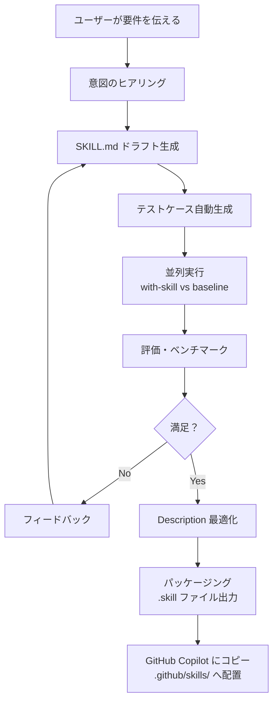

### 7.4.5 生成したスキルを GitHub Copilot でも使う

skill-creator は Claude Code 専用のツールですが、**生成された SKILL.md は Agent Skills オープンスタンダードに準拠している**ため、そのまま GitHub Copilot でも使用できます。

```bash
# 1. Claude Code でスキルを生成
claude
# /skill-creator を実行し、対話形式でスキルを作成

# 2. 生成された SKILL.md を確認
ls .claude/skills/code-review/SKILL.md

# 3. GitHub Copilot 用にコピー
mkdir -p .github/skills/code-review/
cp .claude/skills/code-review/SKILL.md .github/skills/code-review/SKILL.md
```


### 7.4.6 効果的な使い方のノウハウ

#### 7.4.6.1 1. 最初はシンプルに

最初から完璧なスキルを作ろうとせず、最小限の機能から始めましょう：

```
# 最初の依頼（シンプル）
コードレビュースキルを作成して

# 改善のフィードバック（段階的に拡張）
セキュリティ観点にXSSとCSRFのチェックを追加して
パフォーマンス観点にメモ化の提案を追加して
出力に全体スコアを含めて
```

#### 7.4.6.2 2. テストケースは現実的なものを

テストケースは実際の開発で遭遇するシナリオを選びましょう：

| 良いテストケース | 悪いテストケース |
|----------------|----------------|
| 実際のプロジェクトのコード | Hello World |
| 複数の言語・フレームワーク | 単一の簡単な例 |
| エッジケースを含む | 正常系のみ |

#### 7.4.6.3 3. description 最適化は必ず実行する

スキルの自動読み込み精度を最大化するため、必ず description 最適化を実行しましょう：

```
あなた: description を最適化して
```

#### 7.4.6.4 4. 反復改善を恐れない

1回の生成で完璧なスキルはできません。3〜5回の改善ループを想定しましょう：

```
1回目: 基本機能の実装
2回目: 観点の追加・調整
3回目: 出力形式の改善
4回目: description 最適化
5回目: 最終確認
```

#### 7.4.6.5 5. クロスプラットフォームを意識する

GitHub Copilot でも使う場合は、Claude Code 固有の機能に依存しない SKILL.md を心がけましょう：

| 機能 | Claude Code | GitHub Copilot |
|------|-------------|----------------|
| 動的コンテキスト注入 (`!`) | ✅ | ❌ |
| 呼び出し制御 (`invoke`) | ✅ | ❌ |
| ツール事前承認 | ✅ | ❌ |

### 7.4.7 トラブルシューティング

| 問題 | 原因 | 対策 |
|------|------|------|
| skill-creator が反応しない | Claude Code のバージョンが古い | `claude --version` で確認、最新にアップデート |
| テストケースが多すぎる | 最初から多くのケースを指定 | 2-3個から始めて、後で追加 |
| 評価ビューアが開かない | ブラウザがない環境 | `--static` フラグでHTMLファイル出力を依頼 |
| スキルが複雑すぎる | 一度に多くの機能を要求 | シンプルに作ってから段階的に拡張 |
| GitHub Copilot でスキルが認識されない | パスが間違っている | `.github/skills/<name>/SKILL.md` のパスを確認 |

### 7.4.8 まとめ

skill-creator は以下の理由から、スキル開発において非常に強力なツールです：

1. **対話形式**で要件を引き出し、ベストプラクティスに従った SKILL.md を自動生成
2. **テスト・評価・改善のサイクル**を自動化し、高品質なスキルを効率的に開発
3. **Description 最適化**により、スキルの自動読み込み精度を最大化
4. 生成された SKILL.md は **Agent Skills オープンスタンダード準拠**のため、GitHub Copilot でもそのまま使用可能

### 7.4.9 次のステップ

→ [7-1: 複数スキルの連携パイプライン](01-pipeline-integration.md)

# 8.1 8-1: サンプル文書 — 品質改善 施策検討

> **種別**: 参考資料 | **役割**: Part 8 のユースケース背景 / 変換サンプル入力

## 8.1.1 このファイルの位置づけ

このドキュメントは、Part 8「ドキュメントワークフロー自動化」の**ユースケース背景**として用意された実務文書のサンプルです。

以下の2つの役割を持ちます。

| 役割 | 使われ方 |
|------|---------|
| **ユースケース背景** | なぜ Office ↔ Markdown 変換が必要かを示す実例として、[8-2](02-office-to-markdown.md) / [8-3](03-markdown-to-office.md) で引用 |
| **変換サンプル** | Pandoc による Markdown → Word 変換の入力ファイルとして [8-3](03-markdown-to-office.md) の実習で使用 |

---

## 8.1.2 品質改善 施策検討

### 8.1.2.1 1. 背景

品質改善施策の進め方について、実施順序と前提を整理する。
効率化の観点も並行して検討し、品質と効率化を両立させる施策体系を構築する。

### 8.1.2.2 2. 現時点の方針案

- 品質改善はドキュメント体系を基盤として進める。
- ドキュメント体系は以下の3要素で構成する。
  - Layout: フォルダ・ファイルの配置
  - Template: 各文書の雛形
  - Guideline/Rule: 記述と運用の基準
- 優先順位は以下の順で進める。
  1. Layout
  2. Template
  3. Rule
- 上記に先行する前提整備として、変換ツールの整備を先行実施する。
  1. Office→Markdown 変換（MarkItDown）
  2. Markdown→Word/PDF 変換（Pandoc）
- 品質改善全体の施策順は以下が妥当。
  1. ドキュメント品質改善
  2. レビュー品質改善
  3. テスト品質改善
  4. 開発プロセス全体の品質改善
- 各施策に対し、**効率化の効果**を補足的に測定・記録する（Copilot 活用による作業工数削減の可視化）。

### 8.1.2.3 3. 進め方の意図

- 先に配置と正本を固定することで、参照先の揺れを防ぐ。
- 次に雛形を固定し、文書の粒度と抜け漏れを抑える。
- 最後に運用ルールを明文化し、レビュー/テスト/開発プロセスに横展開する。
- 各施策の完了基準として、**品質指標の改善**と**効率化指標の削減**の両方を定義する。

### 8.1.2.4 3.1 仕様書運用方針（Copilot 活用前提）

- Word/Excel 形式の受領仕様（IF 仕様を含む）は受領原本を正本として扱う。
- 受領仕様は、AI Agent Skill を活用して Markdown へ変換し、要約・比較・レビュー補助などの内部活用に用いる。
- 内部で新規作成する仕様・手順文書は Markdown を正本として管理する。
- 外部提出時は、提出先要件に応じて受領正本または Markdown 由来の提出物を使い分ける。
- 受領正本と Markdown 変換物で差異が出た場合は、受領正本を優先し、Markdown 側を更新する。
- 上記運用の前提として、以下のツール整備を必須とする。
  1. Word/Excel 形式→Markdown 形式の変換機能
  2. Markdown 形式→Word/Excel 形式の変換機能

#### 8.1.2.4.1 ツール・データフロー概要

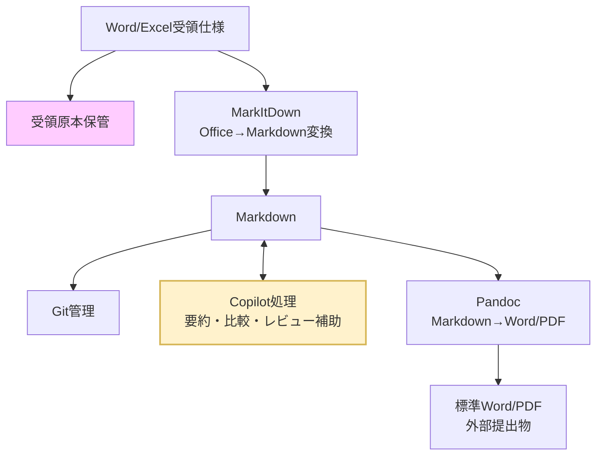

### 8.1.2.5 3.2 方針のメリット

- **正本の信頼性維持**: 受領仕様を正本として保持することで、対外契約・合意の根拠を維持できる。
- **活用性の向上**: 受領仕様を Markdown 化することで、検索・比較・要約・レビュー補助に活用しやすくなる。
- **Copilot 活用の最大化**: 要約、比較、レビュー補助、観点抽出を同一形式で実行できる。
- **提出作業の標準化**: 提出フォーマット変換を定型化し、体裁調整の手戻りを減らす。
- **監査性の向上**: 受領原本、変換結果、レビュー記録、提出物の対応関係を残しやすい。

### 8.1.2.6 3.3 実務ルール（最小運用）

1. **原本保全**: 受領した Word/Excel は編集せず保管し、受領仕様正本として明示する。
2. **正本定義**: 受領仕様は受領原本を正本とし、内部作成文書は Markdown を正本とする。
3. **変換手順**: 受領仕様の Office→Markdown 変換時は実行ログを保存する。
4. **変換後レビュー**: 見出し階層、表崩れ、IF 項目欠落、版数・改訂履歴を確認する。
5. **差異解消**: 受領正本と Markdown 変換物の差異は、受領正本を基準に Markdown を修正する。
6. **提出物生成**: 外部提出用 Word/Excel は提出要件に合わせ、受領正本または Markdown 由来の成果物を選定する。
7. **識別子運用**: IF 仕様の項目 ID（例: IF-001）を Markdown 上で維持し、受領物・提出物と突合可能にする。
8. **月次棚卸し**: 変換失敗事例とレビュー指摘を月次で集計し、ルールを更新する。
9. **ツール整備**: Office→Markdown、Markdown→Office の両変換ツールを整備し、担当者・実行手順・障害時の代替手順を定義する。

### 8.1.2.7 4. 関係図

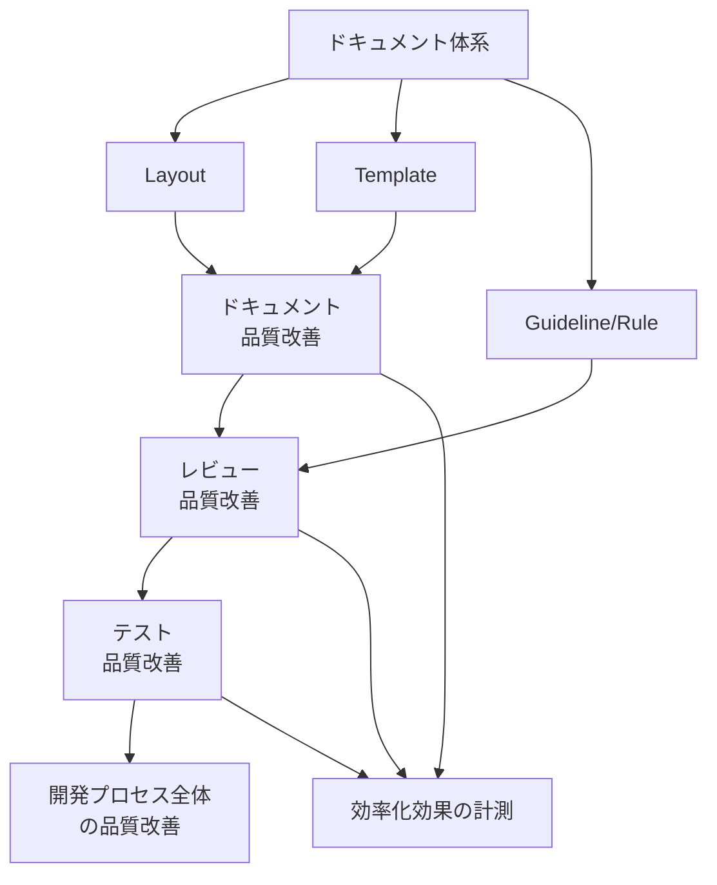

### 8.1.2.8 5. 実施順序

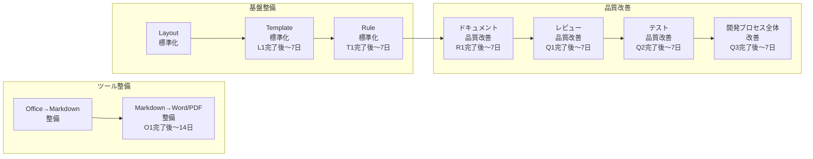

### 8.1.2.9 6. 各タスクの実施内容

#### 8.1.2.9.1 6.1 ドキュメント品質改善

**目的**: 正本と参照先を固定し、情報探索コストを下げながらドキュメント品質を高める。

**実施内容**:
- 正本ドキュメントの確定（重複文書の統合、参照元の一本化）
- 章立て・粒度の標準化（Template 適用）
- 主要文書の更新責任者の明確化

**指標**:

| 指標 | Before | After 目標 | 計測方法 |
|------|--------|-----------|---------|
| ドキュメント抜け漏れ件数 | 人手レビューで計上 | Copilot レビュー後の残存件数を削減 | レビュー時の指摘件数を記録 |
| 情報探索時間 | TBD | Before 比 30% 削減 | 作業ログから参照先調査時間を抽出 |
| テンプレート作成時間 | TBD | Before 比 40% 削減 | Copilot 活用前後の作業時間を比較 |

#### 8.1.2.9.2 6.2 レビュー品質改善

**目的**: レビュー観点の抜け漏れを減らし、検出率を上げながらレビュー準備工数を削減する。

**実施内容**:
- レビュー観点チェックリストの整備
- 変更種別ごとのレビュー必須項目の定義
- 指摘分類（仕様/実装/テスト/ドキュメント）の統一

**指標**:

| 指標 | Before | After 目標 | 計測方法 |
|------|--------|-----------|---------|
| レビュー検出漏れ件数 | TBD | Before 比削減 | 後工程での「レビュー見落とし」タグで計上 |
| レビュー所要時間 | TBD | Before 比 20% 削減 | 作業ログからレビュー時間を抽出 |

#### 8.1.2.9.3 6.3 テスト品質改善

**目的**: 重要機能の回帰防止とテスト設計の再現性向上を図る。

**実施内容**:
- リスクベースで対象機能を優先付け
- テスト観点・ケースの標準フォーマット化
- 不具合起点の回帰テスト追加運用

**指標**:

| 指標 | Before | After 目標 | 計測方法 |
|------|--------|-----------|---------|
| テストケース作成時間 | TBD | Before 比 30% 削減 | 作業ログから計測 |
| Copilot 補助後の観点追加数 | — | 人手比 20% 以上 | Copilot 出力と人手結果を照合 |

#### 8.1.2.9.4 6.4 開発プロセス全体の品質改善

**目的**: 施策を単発で終わらせず、継続改善サイクルを定着させる。

**実施内容**:
- KPI/Exit Criteria の定義と可視化
- 定例での課題棚卸しと優先度見直し
- 改善施策の実施結果レビュー（継続/中止/再設計の判断）

### 8.1.2.10 7. 未確定事項

- 初期適用範囲（全体一括 / パイロット対象）
- 各段階の完了条件（KPI・Exit Criteria）
- 推進体制（オーナー・レビュー責任者）

---

## 8.1.3 次のステップ

→ [8-2: Office → Markdown 変換スキル（MarkItDown）](02-office-to-markdown.md)

# 8.2 8-2: Office → Markdown 変換スキル（MarkItDown）

> **学習時間**: 30分 | **難易度**: ⭐⭐

## 8.2.1 概要

Word・Excel・PowerPoint・PDF などの Office ファイルを Markdown に変換するスキルを作成します。

### 8.2.1.1 なぜこのスキルが必要か

実務では、仕様書・設計書・議事録などを Word/Excel 形式で受け取ることが多くあります。しかし AI エージェント（GitHub Copilot・Claude Code）はテキストベースの Markdown を最も効率よく処理できます。

[品質改善 施策検討](01-quality-improvement-plan.md) はその典型的なユースケースを示しています：

> 「Word/Excel 形式の受領仕様（IF 仕様を含む）は受領原本を正本として扱う。受領仕様は、AI Agent Skill を活用して Markdown へ変換し、要約・比較・レビュー補助などの内部活用に用いる。」
>
> — 品質改善 施策検討, 3.1 仕様書運用方針

このスキルを使うと、エージェントが Office ファイルを受け取った時点で自動的に Markdown に変換し、後続の処理（要約・比較・レビュー）にそのまま渡せるようになります。

## 8.2.2 MarkItDown とは

**MarkItDown** は Microsoft が開発・公開している OSS の Python パッケージです。

- **リポジトリ**: [github.com/microsoft/markitdown](https://github.com/microsoft/markitdown)
- **対応形式**: Word (.docx), Excel (.xlsx), PowerPoint (.pptx), PDF, HTML, CSV, JSON, XML, EPUB, 画像（OCR）など
- **特徴**: 表・見出し・リストなど文書構造を保持したまま Markdown に変換する

### 8.2.2.1 環境のセットアップ

```bash
cd samples/document-workflow/office-to-markdown

# 仮想環境を作成して開発用依存を入れる
uv venv
uv sync --group dev
```

以後のコマンドはすべて `uv run python ...` 経由で実行します。方針 B（LLM ビジョン）を使う場合は、追加で `uv sync --extra mode-b` を実行します。

> **💡 注意**: `onnxruntime`（依存パッケージ）は Python 3.14 未対応です。Python 3.12 または 3.13 を使用してください。

### 8.2.2.2 基本的な使い方

```bash
# Word → Markdown
markitdown 仕様書.docx -o 仕様書.md

# Excel → Markdown（各シートが表として出力される）
markitdown データ一覧.xlsx -o データ一覧.md

# PDF → Markdown
markitdown 報告書.pdf -o 報告書.md
```

## 8.2.3 スキルの実装

`samples/document-workflow/office-to-markdown/` に完全な実装があります。サンプルは `uv` 管理を前提にしており、変換前に `markitdown` / `openai` / `LibreOffice` の有無を確認し、グラフ・画像の処理方針を必ず確認したうえで、変換後は `check_output.py` で検証します。

### 8.2.3.1 ファイル構成

```
samples/document-workflow/office-to-markdown/
├── SKILL.md          # スキル定義（エージェントへの指示）
├── pyproject.toml    # 依存関係（uv で管理）
├── .venv/            # 仮想環境（uv venv で生成）
├── scripts/
│   ├── office2md.py      # 変換スクリプト（メイン）
│   └── check_output.py   # 変換後の自動検証スクリプト
└── tests/
    └── test_check_output.py   # ユニットテスト（35件）
```

### 8.2.3.2 環境のセットアップ

```bash
cd samples/document-workflow/office-to-markdown

# Python 3.12 で仮想環境を作成
uv venv --python 3.12

# 依存関係をインストール
uv sync --group dev
```

### 8.2.3.3 3つの変換方針

スクリプトは `--mode` オプションで3つの方針を切り替えられます。

```mermaid
flowchart LR
    Input["Office ファイル\n.docx / .xlsx など"]

    A["方針 A（デフォルト）\n--mode a\nMarkItDown のみ\n高速・シンプル"]
    B["方針 B（LLM ビジョン）\n--mode b\nOpenAI vision で\n画像を説明文に変換"]
    C["方針 C（ZIP 抽出）\n--mode c\ndocx ZIP / LibreOffice で\n画像を PNG として抽出"]

    OutA["Markdown\n（画像はスタブ参照）"]
    OutB["Markdown\n（画像 → alt テキスト）"]
    OutC["Markdown\n（画像 → .png ファイル）"]

    Input --> A --> OutA
    Input --> B --> OutB
    Input --> C --> OutC
```

| 方針 | コマンド | 特徴 |
|------|---------|------|
| **A（デフォルト）** | `--mode a` | MarkItDown のみ。高速・シンプル。画像はスタブ参照 |
| **B（LLM ビジョン）** | `--mode b` | OpenAI vision でグラフを説明文に変換。API キー必要 |
| **C（ZIP 抽出）** | `--mode c` | docx ZIP / LibreOffice で画像を PNG として抽出 |

### 8.2.3.4 基本的な使い方

```bash
# 方針 A（テキスト・表のみ）
uv run python scripts/office2md.py 仕様書.docx -o 仕様書.md

# 方針 A + 埋め込み画像の自動抽出
uv run python scripts/office2md.py 仕様書.docx -o 仕様書.md --extract-images

# 方針 A + 画像抽出 + ImageMagick の自動インストール
uv run python scripts/office2md.py 仕様書.docx -o 仕様書.md --extract-images --auto-install

# 方針 B（LLM ビジョン）※ OPENAI_API_KEY 環境変数が必要
uv run python scripts/office2md.py 仕様書.docx -o 仕様書.md --mode b
```

### 8.2.3.5 変換後の自動検証

`check_output.py` は変換結果を自動的に検証し、問題を報告します。

```bash
uv run python scripts/check_output.py 仕様書.docx 仕様書.md
```

**チェック項目:**

| チェック | 内容 |
|---------|------|
| 文字数チェック | 元ファイルサイズと変換後文字数の比率で欠落を検出 |
| 見出し構造チェック | H1/H2/H3 の存在を確認 |
| テーブルチェック | Markdown テーブルの存在を確認 |
| 画像プレースホルダー | `` などの空参照を検出 |
| 埋め込み画像チェック | base64 埋め込みが残っていれば `--extract-images` を提案 |
| 識別子チェック | IF-001 等のパターン欠落を検出（IF 仕様書用） |
| 構造比較（.docx） | python-docx で見出し数・テーブル数を原本と比較 |

**出力例:**

```
============================================================
変換後チェックレポート
============================================================

✅ PASS  文字数チェック
   文字数は妥当です (元: 88,953 bytes, 出力: 84,007 文字)

✅ PASS  テーブルチェック
   テーブルを 2 件検出しました。

✅ PASS  埋め込み画像チェック
   base64 埋め込み画像はありません。

------------------------------------------------------------
結果: FAIL=0件  WARN=1件  PASS=5件
```

## 8.2.4 実習: サンプルファイルを変換してみる

### 8.2.4.1 Word 文書の変換（sample2020.docx）

```bash
cd samples/document-workflow/office-to-markdown

uv run python scripts/office2md.py \
  "../../docs/sample2020.docx" \
  -o "../../docs/sample2020.md" \
  --mode a \
  --extract-images \
  --images-dir "../../docs/sample2020_images"
```

**実行結果のポイント:**
- EMF 形式の埋め込み図（fig1）が docx ZIP から自動抽出される
- ImageMagick がインストール済みなら EMF → PNG に自動変換
- `--auto-install` を付けると ImageMagick を winget で自動インストール

### 8.2.4.2 Excel ファイルの変換（Financial Sample.xlsx）

```bash
uv run python scripts/office2md.py \
  "../../docs/Financial Sample.xlsx" \
  -o "../../docs/Financial Sample.md" \
  --mode a \
  --extract-images \
  --images-dir "../../docs/Financial Sample_images"
```

**実行結果のポイント:**
- シートのデータが Markdown テーブルとして出力される
- `xl/media/` に埋め込まれた画像（PNG/JPEG 等）を自動抽出し、Markdown 末尾に追記
- 画像ディレクトリ名のスペースはアンダースコアに自動置換（`Financial_Sample_images`）
- Markdown 内のパスは `\`（Windows）または `/`（macOS/Linux）でOS 対応

### 8.2.4.3 検証の実行

```bash
uv run python scripts/check_output.py \
  "../../docs/Financial Sample.xlsx" \
  "../../docs/Financial Sample.md"
```

## 8.2.5 限界: グラフ・画像の処理

| コンテンツ | 方針 A | 方針 B | 方針 C / `--extract-images` |
|-----------|--------|--------|---------------------------|
| テキスト・見出し | ✅ | ✅ | ✅ |
| 表（テーブル） | ✅ | ✅ | ✅ |
| Word 埋め込み画像（PNG/JPEG） | ⚠️ スタブ | ✅ 説明文 | ✅ PNG ファイルとして抽出 |
| Word 埋め込みグラフ（EMF） | ⚠️ スタブ | ✅ 説明文 | ✅ PNG に変換（ImageMagick 必要）|
| Excel シートデータ | ✅ テーブル | ✅ テーブル | ✅ テーブル |
| Excel 埋め込み画像 | ❌ 無視 | ❌ 無視 | ✅ `xl/media/` から抽出 |
| Excel グラフ | ❌ 無視 | ❌ 無視 | ⚠️ LibreOffice 必要 |

> **💡 EMF について**: MarkItDown が docx のグラフ画像に対して出力するのは実際の base64 データではなく `data:image/x-emf;base64...)` という短縮形スタブです。`--extract-images` はこのスタブを検出し、元の docx ZIP から実ファイルを抽出してマッピングします。

### 8.2.5.1 LLM ビジョンで alt テキストを生成する（方針 B）

MarkItDown は OpenAI の vision モデルと連携させると、画像を「読んで説明文を生成」できます。出力は**テキストの説明文**であり、PNG ファイルは生成されません。

```python
from markitdown import MarkItDown
from openai import OpenAI

client = OpenAI()  # OPENAI_API_KEY 環境変数から自動取得
md = MarkItDown(llm_client=client, llm_model="gpt-4o")
result = md.convert("仕様書.docx")
# → 画像が「この図は〇〇工程のフローを示している」のような説明文に変換される
```

## 8.2.6 発展: グラフを PNG として保持するパイプライン

```mermaid
flowchart TD
    Input["Office ファイル\n.docx / .xlsx"]

    MarkItDown["[1] MarkItDown\nテキスト・表・見出しの変換"]
    Stub["⚠️ 埋め込み画像スタブ\ndata:image/x-emf;base64..."]

    Extract["[2] --extract-images\ndocx: ZIP 抽出 / xlsx: xl/media 抽出"]
    ImageFile["画像ファイル\n.emf / .png"]

    ImageMagick["[3] ImageMagick\nEMF → PNG 変換\n--auto-install で自動取得可"]

    Output["最終 Markdown\n として実ファイル参照"]

    Input --> MarkItDown
    MarkItDown --> Stub
    Stub --> Extract
    Extract --> ImageFile
    ImageFile --> ImageMagick
    ImageMagick --> Output
```

### 8.2.6.1 実務での割り切り方

グラフ・画像が重要な文書の場合、完全自動化にこだわらず以下の運用が現実的です：

1. **受領原本（Office ファイル）を正本として保持**し、Markdown はテキスト処理専用と割り切る
2. **重要なグラフだけ手動でスクリーンショット**して `assets/` に保存し `` として追記
3. **グラフが多い文書はスキップ**し、PDF のまま添付資料として参照する

## 8.2.7 テストケース

| # | 入力 | 期待される結果 |
|---|------|--------------|
| 1 | 見出し付きの .docx | H1/H2/H3 が # / ## / ### に変換される |
| 2 | 表を含む .xlsx | Markdown テーブル形式で出力される |
| 3 | 複数シートの .xlsx | シートごとにセクションが分かれる |
| 4 | 画像付き .docx + `--extract-images` | ZIP から画像を抽出し PNG に変換 |
| 5 | 画像付き .xlsx + `--extract-images` | `xl/media/` から画像を抽出し末尾に追記 |
| 6 | 存在しないファイル | エラーメッセージとファイルパスの確認を促す |
| 7 | Python 3.14 以上 | `onnxruntime` 非対応のためエラー（3.12/3.13 を使用） |

## 8.2.8 実務上の注意点

- **受領原本の保全**: 変換元の Office ファイルは編集せず原本として保管する
- **PYTHONUTF8**: Windows で実行する際は `$env:PYTHONUTF8 = "1"` を設定する（絵文字の文字化け防止）
- **パス区切り**: Windows では Markdown の画像パスに `\` を使用（スクリプトが自動対応）
- **スペースを含むファイル名**: 画像ディレクトリ名のスペースは自動でアンダースコアに置換される

## 8.2.9 次のステップ

→ [8-2: Markdown → Office 変換スキル（Pandoc）](03-markdown-to-office.md)

# 8.3 8-3: Markdown → Office 変換スキル（Pandoc）

> **学習時間**: 30分 | **難易度**: ⭐⭐

## 8.3.1 概要

Markdown ファイルを Word (.docx) または PDF に変換するスキルを作成します。社内で Markdown を正本として管理している文書を、外部提出用の Office 形式に変換する際に使います。

### 8.3.1.1 なぜこのスキルが必要か

[品質改善 施策検討](01-quality-improvement-plan.md) で定義されたワークフローでは、社内文書の正本を Markdown で管理しながら、外部提出時だけ Word/PDF に変換します：

```
内部作成 Markdown（正本）
    ↓ Pandoc
標準 Word/PDF（外部提出用）
```

前章（7-1）の `office-to-markdown` スキルと組み合わせると、受領した Word を Markdown に変換して AI 処理し、結果を再度 Word に戻す完全な双方向ワークフローが完成します。

## 8.3.2 Pandoc とは

**Pandoc** はほぼあらゆる文書形式を相互変換できる OSS のユニバーサルドキュメントコンバーターです。

- **公式サイト**: [pandoc.org](https://pandoc.org)
- **主な変換先**: Word (.docx), PDF, HTML, LaTeX, EPUB など
- **特徴**: Word のスタイルテンプレート（`.docx`）を参照して体裁を統一できる

### 8.3.2.1 インストール

```bash
# Windows
winget install JohnMacFarlane.Pandoc

# macOS
brew install pandoc

# Linux (Debian/Ubuntu)
sudo apt-get install pandoc
```

PDF 出力には PDF エンジンが必要です（weasyprint 推奨）：

```bash
pip install weasyprint
```

### 8.3.2.2 基本的な使い方

```bash
# Markdown → Word
pandoc 文書.md -o 文書.docx

# Markdown → PDF
pandoc 文書.md -o 文書.pdf --pdf-engine=weasyprint

# 社内テンプレートを使って体裁を統一
pandoc 文書.md --reference-doc=company-template.docx -o 文書_提出用.docx
```

## 8.3.3 スキルの実装

`samples/document-workflow/markdown-to-office/SKILL.md` に完全な定義があります。

### 8.3.3.1 スキルの呼び出し方

GitHub Copilot の場合：

```
@markdown-to-office
ファイル: docs/08-document-workflow/01-quality-improvement-plan.md
出力形式: docx
テンプレート: templates/company-template.docx
```

Claude Code の場合：

```
/markdown-to-office ファイル=01-quality-improvement-plan.md 形式=docx
```

### 8.3.3.2 スキルが行うこと

0. ツールの存在確認（pandoc / weasyprint / wkhtmltopdf）
   - Pandoc 未インストールの場合はユーザー確認後にインストール
   - PDF エンジン（weasyprint / wkhtmltopdf）がなければ docx への代替を提案
1. 出力形式（docx / pdf）とテンプレートの有無を確認（DECISION-GATE）
2. Markdown の要素（見出し・表・コードブロック）を事前に確認
3. Pandoc コマンドを実行
4. 変換後にレビューチェックリストを確認（HARD-GATE）
   - 見出しスタイルの適用状況
   - 表の描画確認
   - コードブロックの可読性確認
5. 結果をユーザーに報告

## 8.3.4 実習: 01-quality-improvement-plan.md を Word に変換する

### 8.3.4.1 ステップ 1: Pandoc のインストール確認

```bash
pandoc --version
```

### 8.3.4.2 ステップ 2: サンプルファイルを変換

```bash
cd docs/08-document-workflow
pandoc 01-quality-improvement-plan.md -o quality-improvement-plan.docx
```

### 8.3.4.3 ステップ 3: テンプレートを使って体裁を統一する

```bash
# Pandoc のデフォルトテンプレートを取得
pandoc -o company-template.docx --print-default-data-file reference.docx
```

`company-template.docx` を Word で開き、フォント・スタイル・ヘッダー/フッターを会社規定に合わせて編集します。以後は `--reference-doc=company-template.docx` を指定するだけで体裁が統一されます。

```bash
pandoc 01-quality-improvement-plan.md \
  --reference-doc=../../templates/company-template.docx \
  -o quality-improvement-plan-final.docx
```

## 8.3.5 テストケース

| # | 入力 | 期待される結果 |
|---|------|--------------|
| 1 | 見出し付きの .md | H1/H2/H3 が Word の見出しスタイルに変換される |
| 2 | 表を含む .md | Word のテーブルとして描画される |
| 3 | テンプレート指定あり | テンプレートのスタイルが適用される |
| 4 | 存在しないファイル | エラーメッセージとファイルパスの確認を促す |
| 5 | Pandoc 未インストール | インストール手順を提案する |

## 8.3.6 変換フロー全体像（7-2 との組み合わせ）

前章（7-2）と合わせると、ドキュメントの変換フロー全体が完成します：

```mermaid
flowchart TD
    Source["📄 Word/Excel 受領仕様\n正本保管"]

    Skill1["office-to-markdown スキル\nMarkItDown + --extract-images"]

    MD["📝 Markdown\nGit 管理・AI 処理"]
    Images["🖼️ 画像ファイル\nimages/*.png"]
    AI["🤖 AI エージェント\n要約・比較・レビュー補助"]

    Skill2["markdown-to-office スキル\nPandoc"]

    Output["📤 提出用 Word / PDF"]

    Source --> Skill1
    Skill1 --> MD
    Skill1 --> Images
    Images --> MD
    MD <--> AI
    MD --> Skill2
    Skill2 --> Output
```

これは [品質改善 施策検討](01-quality-improvement-plan.md) のセクション 3.1「ツール・データフロー概要」で定義されたワークフローそのものです。

## 8.3.7 実務上の注意点

- **スペースを含むファイル名**: コマンドライン引数は必ずクォートで囲む（例: `"My Document.md"`）
- **PDF エンジン**: `weasyprint` の他に `xelatex`（日本語対応に `\usepackage{luatexja}` が必要）も使用可能
- **画像パス**: Pandoc は Markdown ファイルの相対パスで画像を解決するため、変換時のカレントディレクトリに注意

## 8.3.8 次のステップ

- [Part 7-1: パイプライン連携](../07-advanced/01-pipeline-integration.md) でこの2つのスキルをパイプラインに組み込む方法を学ぶ

# 9.1 GLOSSARY — 用語集

教材全体で使われる用語を洗い出し、用語種を付けて整理しました。

## 9.1.1 用語種の凡例

| 用語種 | 説明 |
|--------|------|
| ツール名 | AIエージェント・CLI・IDEなどの製品・ツール名 |
| スキル名 | SKILL.md として定義された個別スキルの名称 |
| コマンド | スラッシュコマンド・CLI コマンド・呼び出し構文 |
| ファイル/パス | ファイル名・拡張子・ディレクトリパス |
| 概念 | Agent Skills エコシステムの抽象的な概念 |
| フレームワーク | 開発方法論・スキルセットとしてのフレームワーク |
| 技術規格 | ファイルフォーマット・業界標準・プロトコル |
| 設計原則 | スキル設計・エージェント運用における原則 |
| 評価・品質 | スキルの評価・品質管理に関する概念 |

---

## 9.1.2 ツール名

| 用語 | 用語種 | 説明 | 参照 |
|------|--------|------|------|
| Claude Code | ツール名 | Anthropic が提供するAIコーディングエージェント（CLI） | docs/01-fundamentals/01-ecosystem-overview.md |
| GitHub Copilot | ツール名 | GitHub/Microsoft が提供するAIコーディングアシスタント | docs/01-fundamentals/01-ecosystem-overview.md |
| Copilot Editor | ツール名 | GitHub.com 上のチャットインターフェース（スキル検索に使用） | docs/03-discovery/01-find-skills.md |
| Find Skills | ツール名 | GitHub.com 上で公開スキルを検索・発見する機能 | docs/03-discovery/01-find-skills.md |
| skill.sh | ツール名 | ターミナル上でスキルをクロスプラットフォーム検索するCLIツール | docs/03-discovery/02-skill-sh-cli.md |
| gh CLI | ツール名 | GitHub 公式CLI。`gh skill` サブコマンドでスキル検索が可能 | docs/03-discovery/01-find-skills.md |
| VS Code | ツール名 | Microsoft の統合開発環境。統合ターミナル経由でCLIエージェントを利用可能 | docs/04-frameworks/01-superpowers.md |

---

## 9.1.3 スキル名 — バンドルスキル（Claude Code 標準搭載）

| 用語 | 用語種 | 説明 | 参照 |
|------|--------|------|------|
| skill-creator | スキル名 | スキル開発のライフサイクル全体をカバーするフレームワーク。Claude Code 標準バンドル | docs/02-skill-creation/02-skill-creator-hands-on.md |

---

## 9.1.4 スキル名 — Superpowers スキル群

| 用語 | 用語種 | 説明 | 参照 |
|------|--------|------|------|
| brainstorming | スキル名 | 実装前に要件・設計をソクラテス式対話で整理する。HARD-GATE で設計承認なしの実装を禁止 | docs/04-frameworks/01-superpowers.md |
| writing-plans | スキル名 | 合意した設計を 2〜5 分単位の小タスクに分割し、実装計画を作成する | docs/04-frameworks/01-superpowers.md |
| executing-plans | スキル名 | 実装計画をチェックポイントを挟みながらバッチ実行する | docs/04-frameworks/01-superpowers.md |
| subagent-driven-development | スキル名 | タスクごとにフレッシュなサブエージェントを起動して2段階レビューを実施する | docs/04-frameworks/01-superpowers.md |
| dispatching-parallel-agents | スキル名 | 複数のサブエージェントを並列で動作させる | docs/04-frameworks/01-superpowers.md |
| test-driven-development | スキル名 | RED→GREEN→REFACTOR のTDDサイクルを強制。テストより先に実装コードを書くことを禁止 | docs/04-frameworks/01-superpowers.md |
| systematic-debugging | スキル名 | バグを4フェーズ（根本原因調査・パターン分析・仮説検証・修正）で究明するデバッグスキル | docs/04-frameworks/01-superpowers.md |
| verification-before-completion | スキル名 | 「完了」宣言前に検証コマンドを実行し証拠を示すまで完了宣言を禁止する | docs/04-frameworks/01-superpowers.md |
| requesting-code-review | スキル名 | コードレビュー依頼前のチェックリストを自動実行。Critical な問題は進行をブロック | docs/04-frameworks/01-superpowers.md |
| receiving-code-review | スキル名 | レビュー指摘への対応を整理する | docs/04-frameworks/01-superpowers.md |
| using-git-worktrees | スキル名 | 独立した git worktree を作成し、クリーンな状態で開発を開始する | docs/04-frameworks/01-superpowers.md |
| finishing-a-development-branch | スキル名 | 作業終了時にテスト検証し、マージ/PR化/ブランチ維持/破棄を判断して worktree を後片付けする | docs/04-frameworks/01-superpowers.md |
| writing-skills | スキル名 | 独自スキルを正しく作るための設計・記述・テストを体系的に説明するガイド | docs/04-frameworks/01-superpowers.md |
| using-superpowers | スキル名 | Superpowers 自体の使い方を学ぶチュートリアルスキル | docs/04-frameworks/01-superpowers.md |

---

## 9.1.5 スキル名 — 実践スキル（本教材メインコンテンツ）

| 用語 | 用語種 | 説明 | 参照 |
|------|--------|------|------|
| grill-me | スキル名 | コードを「可読性・パフォーマンス・セキュリティ・保守性」の4軸でレビューする | docs/05-skills-in-practice/01-grill-me.md |
| triage | スキル名 | GitHub Issue を解析し、優先度（P0〜P3）の判定・カテゴリ分類・対応推奨事項を自動生成する | docs/05-skills-in-practice/02-triage-issue-analysis.md |
| improve | スキル名 | コードのパフォーマンス最適化・リファクタリング・モダナイゼーションの改善提案を行う | docs/05-skills-in-practice/03-improve.md |
| frontend-design | スキル名 | フロントエンドのコンポーネント分割・状態管理・データフローをガイドする設計支援スキル | docs/04-frameworks/04-frontend-design.md |
| ui-ux-pro-max | スキル名 | アクセシビリティ・視認性・操作性を多角的に監査する UI/UX 改善スキル | docs/04-frameworks/05-ui-ux-pro-max.md |
| baoyu-diagram | スキル名 | アーキテクチャ図・フロー図をSVGで生成する図解スキル（JimLiu/baoyu-skills） | docs/05-skills-in-practice/04-baoyu-diagram.md |
| baoyu-infographic | スキル名 | データや概念を 21レイアウト×17スタイル のインフォグラフィックで整理するスキル | docs/05-skills-in-practice/05-baoyu-infographic.md |
| baoyu-comic | スキル名 | 技術概念をコミック形式でわかりやすく伝えるコンテンツ制作スキル | docs/05-skills-in-practice/06-baoyu-comic.md |

---

## 9.1.6 スキル名 — gstack スキル群

| 用語 | 用語種 | 説明 | 参照 |
|------|--------|------|------|
| office-hours | スキル名 | YCオフィスアワー形式。6つの強制質問でプロダクトを再定義する gstack エントリーポイント | docs/04-frameworks/02-gstack-overview.md |
| plan-ceo-review | スキル名 | CEO視点で計画をレビュー。Expansion/Selective/Hold/Reduction の4モード | docs/04-frameworks/02-gstack-overview.md |
| plan-eng-review | スキル名 | EM（エンジニアリングマネージャー）視点で技術的実現可能性を確認する | docs/04-frameworks/02-gstack-overview.md |
| plan-design-review | スキル名 | デザイナー視点で計画をレビューする | docs/04-frameworks/02-gstack-overview.md |
| autoplan | スキル名 | 自動計画作成スキル | docs/04-frameworks/02-gstack-overview.md |
| design-shotgun | スキル名 | 4〜6種類のUIモックアップを生成してブラウザで比較できるようにする | docs/04-frameworks/02-gstack-overview.md |
| design-html | スキル名 | モックアップを本番品質のHTML（Pretextレイアウト）に変換する | docs/04-frameworks/02-gstack-overview.md |
| spec | スキル名 | 仕様書を生成するスキル | docs/04-frameworks/02-gstack-overview.md |
| review | スキル名 | CIでは見つからない本番環境で壊れるバグを発見するコードレビュースキル | docs/04-frameworks/02-gstack-overview.md |
| investigate | スキル名 | 問題の原因調査・デバッグを行うスキル | docs/04-frameworks/02-gstack-overview.md |
| codex | スキル名 | セカンドオピニオンを提供するスキル | docs/04-frameworks/02-gstack-overview.md |
| qa | スキル名 | 実際のブラウザを起動してアプリをテストし、バグ発見から回帰テスト生成まで行う | docs/04-frameworks/02-gstack-overview.md |
| browse | スキル名 | ブラウザを操作してWebアプリを検証するスキル | docs/04-frameworks/02-gstack-overview.md |
| benchmark | スキル名 | パフォーマンス計測を行うスキル | docs/04-frameworks/02-gstack-overview.md |
| cso | スキル名 | セキュリティ監査を行うスキル（Chief Security Officer 役） | docs/04-frameworks/02-gstack-overview.md |
| ship | スキル名 | 全チェックリスト確認後にマージを実行するリリーススキル | docs/04-frameworks/02-gstack-overview.md |
| land-and-deploy | スキル名 | マージからデプロイまでを担うスキル | docs/04-frameworks/02-gstack-overview.md |
| canary | スキル名 | カナリアリリースと本番監視を行うスキル | docs/04-frameworks/02-gstack-overview.md |
| retro | スキル名 | スプリント振り返りを行うスキル | docs/04-frameworks/02-gstack-overview.md |
| learn | スキル名 | ナレッジを蓄積するスキル | docs/04-frameworks/02-gstack-overview.md |
| document-release | スキル名 | リリースドキュメントを更新するスキル | docs/04-frameworks/02-gstack-overview.md |
| careful | スキル名 | 破壊的コマンドの前に警告を出すセーフティスキル | docs/04-frameworks/02-gstack-overview.md |
| freeze | スキル名 | 編集範囲を特定ディレクトリに制限するスキル | docs/04-frameworks/02-gstack-overview.md |
| guard | スキル名 | `/careful` と `/freeze` を同時有効化する複合セーフティスキル | docs/04-frameworks/02-gstack-overview.md |
| pair-agent | スキル名 | マルチエージェント連携を行うパワーツール | docs/04-frameworks/02-gstack-overview.md |

---

## 9.1.7 コマンド

| 用語 | 用語種 | 説明 | 参照 |
|------|--------|------|------|
| `/skill-creator` | コマンド | Claude Code でスキル生成フレームワークを起動するスラッシュコマンド | docs/02-skill-creation/02-skill-creator-hands-on.md |
| `/plugin install` | コマンド | Claude Code にプラグインをインストールするコマンド | docs/04-frameworks/01-superpowers.md |
| `/reload-plugins` | コマンド | Claude Code のプラグインをリロードするコマンド | docs/04-frameworks/01-superpowers.md |
| `/plugin list` | コマンド | インストール済みプラグインの一覧を表示するコマンド | docs/04-frameworks/01-superpowers.md |
| `gh skill` | コマンド | GitHub CLI でスキルを検索・操作するサブコマンド | docs/03-discovery/01-find-skills.md |
| `@skill-name` | コマンド | GitHub Copilot チャット上でスキルを明示的に呼び出す構文 | docs/04-frameworks/01-superpowers.md |
| `@copilot` | コマンド | GitHub Copilot Editor でのチャット宛先指定構文 | docs/03-discovery/01-find-skills.md |
| `!` (バング構文) | コマンド | SKILL.md 内でコマンドを実行し、その出力をインライン展開する動的コンテキスト注入構文（Claude Code 専用） | docs/02-skill-creation/03-skillmd-customization.md |

---

## 9.1.8 ファイル/パス

| 用語 | 用語種 | 説明 | 参照 |
|------|--------|------|------|
| SKILL.md | ファイル/パス | スキルの指示・手順・説明を記述するメインファイル。YAMLフロントマター＋Markdown本文の2部構成 | docs/02-skill-creation/01-what-are-agent-skills.md |
| `.claude/skills/<name>/SKILL.md` | ファイル/パス | Claude Code のプロジェクト用スキル配置パス | docs/02-skill-creation/01-what-are-agent-skills.md |
| `.github/skills/<name>/SKILL.md` | ファイル/パス | GitHub Copilot のプロジェクト用スキル配置パス | docs/02-skill-creation/01-what-are-agent-skills.md |
| `~/.claude/skills/<name>/SKILL.md` | ファイル/パス | Claude Code の個人用スキル配置パス（全プロジェクトに適用） | docs/02-skill-creation/01-what-are-agent-skills.md |
| `~/.copilot/skills/<name>/SKILL.md` | ファイル/パス | GitHub Copilot の個人用スキル配置パス | docs/02-skill-creation/01-what-are-agent-skills.md |
| `~/.claude/settings.json` | ファイル/パス | Claude Code の設定ファイル。`enabledPlugins` などを管理 | docs/04-frameworks/01-superpowers.md |
| `.skill` | ファイル/パス | スキルの配布用パッケージファイル形式。`skill-creator` の最終出力 | docs/07-advanced/04-skill-creator-deep-dive.md |
| CLAUDE.md | ファイル/パス | Claude Code のプロジェクト設定ファイル | docs/04-frameworks/02-gstack-overview.md |

---

## 9.1.9 概念

| 用語 | 用語種 | 説明 | 参照 |
|------|--------|------|------|
| Agent Skills | 概念 | AIエージェント（Claude Code・GitHub Copilot 等）に特定タスクを実行させるための指示書 | docs/02-skill-creation/01-what-are-agent-skills.md |
| Agent Skills オープンスタンダード | 概念 | 複数のAIツール間でスキルを共有するための共通フォーマット規格（agentskills.io） | docs/01-fundamentals/01-ecosystem-overview.md |
| バンドルスキル | 概念 | Claude Code に標準搭載されているスキル（`/skill-creator`、`/code-review` 等） | docs/02-skill-creation/01-what-are-agent-skills.md |
| 自動読み込み | 概念 | 会話の内容がスキルの `description` にマッチした場合にエージェントがスキルを自動的に読み込む機能 | docs/02-skill-creation/01-what-are-agent-skills.md |
| 明示的な呼び出し | 概念 | ユーザーが `/スキル名` でスキルを直接実行する操作 | docs/02-skill-creation/01-what-are-agent-skills.md |
| クロスプラットフォーム | 概念 | Claude Code と GitHub Copilot の両方で同じスキル（SKILL.md）が動作すること | docs/02-skill-creation/01-what-are-agent-skills.md |
| 動的コンテキスト注入 | 概念 | `!` 構文で SKILL.md 内にコマンド出力をインライン展開する機能（Claude Code 専用） | docs/02-skill-creation/03-skillmd-customization.md |
| 呼び出し制御（invoke） | 概念 | フロントマターの `invoke` フィールドでスキルを誰が呼び出せるかを制御する設定（`user` / `auto` / `both`） | docs/02-skill-creation/03-skillmd-customization.md |
| ツール事前承認（approved_tools） | 概念 | フロントマターの `approved_tools` フィールドで、スキルが使用するツールをユーザー確認不要とする設定 | docs/02-skill-creation/03-skillmd-customization.md |
| フロントマター | 概念 | SKILL.md の先頭にある `---` で囲まれた YAML 形式のメタデータ部分。`name`・`description`・`invoke` 等を記述 | docs/02-skill-creation/01-what-are-agent-skills.md |
| プラグイン | 概念 | エージェントに追加機能を提供する拡張モジュール。Superpowers は Claude Code のプラグインとして提供される | docs/04-frameworks/01-superpowers.md |
| Plugin Marketplace | 概念 | プラグインを配布・インストールするための公式ストア | docs/04-frameworks/01-superpowers.md |
| Worktree（git worktree） | 概念 | 同じリポジトリから独立した作業ディレクトリを複数作成できる Git の機能。Superpowers がクリーン開発環境の確保に利用 | docs/04-frameworks/01-superpowers.md |
| HARD-GATE | 概念 | Superpowers スキル内の強制ゲート。設計承認など特定条件を満たすまで次のアクション（コードを書くなど）を禁止する | docs/04-frameworks/01-superpowers.md |
| サブエージェント | 概念 | メインエージェントから起動される子エージェント。独立したコンテキストを持ち、親セッションの履歴を継承しない | docs/04-frameworks/01-superpowers.md |
| スキルパイプライン | 概念 | 複数のスキルを連携させたワークフロー。シーケンシャル・パラレル・条件分岐の3パターンがある | docs/07-advanced/01-pipeline-integration.md |
| シーケンシャルパターン | 概念 | スキルA→B→C と前のスキルの出力を次のスキルの入力に使う直列パイプライン | docs/07-advanced/01-pipeline-integration.md |
| パラレルパターン | 概念 | 1つの入力に対して複数のスキルを同時実行する並列パイプライン | docs/07-advanced/01-pipeline-integration.md |
| 条件分岐パターン | 概念 | スキルの出力に応じて次に実行するスキルを切り替えるパイプライン | docs/07-advanced/01-pipeline-integration.md |
| with-skill | 概念 | skill-creator の評価フェーズにおけるスキルあり実行。baseline と比較して品質向上を定量評価する | docs/07-advanced/04-skill-creator-deep-dive.md |
| baseline | 概念 | skill-creator の評価フェーズにおけるスキルなし実行。with-skill との比較対象 | docs/07-advanced/04-skill-creator-deep-dive.md |
| 評価ビューア | 概念 | skill-creator のベンチマーク結果をブラウザで確認する画面。Outputs タブと Benchmark タブを持つ | docs/07-advanced/04-skill-creator-deep-dive.md |
| トリガー精度 | 概念 | `description` がスキル自動読み込みを正確に判断できる度合い | docs/07-advanced/04-skill-creator-deep-dive.md |
| Description 最適化 | 概念 | 20個のトリガーテストクエリを使って、スキル自動読み込み精度を最大化するよう `description` を自動改善するプロセス | docs/07-advanced/04-skill-creator-deep-dive.md |
| 反復改善サイクル | 概念 | スキル作成→テスト実行→結果確認→改善のループ。3〜5回の繰り返しを想定する | docs/02-skill-creation/04-best-practices.md |
| 仮想チーム | 概念 | gstack が実現するAIによる役割分担体制。1人のAIに全役割を任せず、役割ごとに専門スキルを割り当てる | docs/04-frameworks/02-gstack-overview.md |
| スプリント | 概念 | gstack が想定する開発サイクル：Think→Plan→Build→Review→Test→Ship→Reflect | docs/04-frameworks/02-gstack-overview.md |
| フロントエンド開発の3つの課題 | 概念 | フロントエンドAIコード生成でよく起こる3つの課題（理解のずれ・実行失敗・構造の問題）を指す。概念層の出発点として参照される | docs/01-fundamentals/01-ecosystem-overview.md |
| 4層構造 | 概念 | 本教材の構成：発見層・作成層・概念層・実践層 | docs/01-fundamentals/01-ecosystem-overview.md |
| 発見層 | 概念 | Find Skills / gh skill / skill.sh でスキルを探し・見つけ・実行する層 | docs/01-fundamentals/01-ecosystem-overview.md |
| 作成層 | 概念 | Claude Code `/skill-creator` または手書き SKILL.md でスキルを作成する層 | docs/01-fundamentals/01-ecosystem-overview.md |
| 概念層 | 概念 | Superpowers / GStack / 前端大神問題を通じて理論・フレームワークを理解する層 | docs/01-fundamentals/01-ecosystem-overview.md |
| 実践層 | 概念 | grill-me / triage / improve / frontend-design / ui-ux-pro-max 等の実践スキルを使いこなす層 | docs/01-fundamentals/01-ecosystem-overview.md |
| 応用層 | 概念 | コンテンツ生成パイプライン・画像生成バックエンド・カスタムスキル開発の層 | docs/01-fundamentals/01-ecosystem-overview.md |
| CI（Continuous Integration） | 概念 | 継続的インテグレーション。コードをリポジトリに統合するたびに自動テスト・検証を実行する開発プラクティス | docs/05-skills-in-practice/01-grill-me.md |
| コンテキスト注入パターン | 概念 | スキル本体は汎用ロジックとして保ち、プロジェクト固有の文脈（コンテキスト）を呼び出し側から渡す設計パターン。1つのスキルを複数プロジェクトで再利用可能にする | docs/05-skills-in-practice/02-triage-issue-analysis.md |
| 難易度×効果マトリクス | 概念 | 改善案を「実装の難しさ」と「期待される効果」の2軸で分類する手法。improve スキルの `quick_wins` / `long_term` 分類の基礎 | docs/05-skills-in-practice/03-improve.md |
| トークン | 概念 | AI が一度に処理する文字・単語の単位。SKILL.md の読み込みコストはトークン数で計測される。フロントマターを分離することでトークン消費を最小化できる | docs/02-skill-creation/01-what-are-agent-skills.md |

---

## 9.1.10 フレームワーク

| 用語 | 用語種 | 説明 | 参照 |
|------|--------|------|------|
| Superpowers | フレームワーク | Jesse Vincent（Prime Radiant）が開発したコーディングエージェント向け開発方法論プラグイン。インストールだけでエージェントに「段取り」を習得させる | docs/04-frameworks/01-superpowers.md |
| gstack | フレームワーク | Garry Tan（Y Combinator）が開発した Claude Code 向けのオープンソーススキルセット。AIを「仮想エンジニアリングチーム」として運用する（23専門家ロール＋8パワーツール） | docs/04-frameworks/02-gstack-overview.md |
| TDD（Test-Driven Development） | フレームワーク | テスト駆動開発。テストを先に書いてから実装コードを書く開発手法 | docs/04-frameworks/01-superpowers.md |
| RED-GREEN-REFACTOR | フレームワーク | TDDの3フェーズサイクル。RED（失敗テストを書く）→GREEN（最小限のコードで通す）→REFACTOR（コードを整理する） | docs/04-frameworks/01-superpowers.md |

---

## 9.1.11 技術規格

| 用語 | 用語種 | 説明 | 参照 |
|------|--------|------|------|
| agentskills.io | 技術規格 | Agent Skills オープンスタンダードの公式サイト・規格の起点 | docs/02-skill-creation/01-what-are-agent-skills.md |
| YAML | 技術規格 | SKILL.md フロントマターに使用するデータ記述言語 | docs/02-skill-creation/01-what-are-agent-skills.md |
| Markdown | 技術規格 | SKILL.md 本文に使用するテキストマークアップ言語 | docs/02-skill-creation/01-what-are-agent-skills.md |
| JSON | 技術規格 | スキル出力フォーマットや設定ファイルに使用するデータ交換形式 | docs/02-skill-creation/02-skill-creator-hands-on.md |
| SVG | 技術規格 | baoyu-diagram が生成するスケーラブルベクターグラフィクス形式。コード生成で図を作るアプローチに使用 | docs/05-skills-in-practice/04-baoyu-diagram.md |
| WCAG | 技術規格 | Web Content Accessibility Guidelines。ui-ux-pro-max スキルのアクセシビリティチェック基準 | docs/05-skills-in-practice/07-problem-skill-mapping.md |
| P0〜P3 | 技術規格 | triage スキルの優先度分類。P0：即時対応 / P1：高優先 / P2：通常 / P3：低優先 | docs/05-skills-in-practice/02-triage-issue-analysis.md |
| Git submodule | 技術規格 | スキルリポジトリを別リポジトリのサブモジュールとして追加する Git の機能 | docs/03-discovery/01-find-skills.md |
| SLA（Service Level Agreement） | 技術規格 | サービスレベル合意書。応答時間・可用性などのサービス品質基準を定めた契約または内部規定 | docs/05-skills-in-practice/02-triage-issue-analysis.md |
| Semantic Versioning | 技術規格 | `vMajor.Minor.Patch` 形式のバージョン番号規則。メジャーは破壊的変更、マイナーは後方互換の機能追加、パッチはバグ修正を意味する | docs/07-advanced/03-evaluation-cycle.md |

---

## 9.1.12 設計原則

| 用語 | 用語種 | 説明 | 参照 |
|------|--------|------|------|
| 単一責任の原則 | 設計原則 | 1つのスキルは1つのことを得意とする設計。「コードレビュー＋テスト生成＋ドキュメント作成」を1スキルにまとめない | docs/02-skill-creation/04-best-practices.md |
| 段階的拡張 | 設計原則 | シンプルに作ってから必要に応じて機能を追加する。最初から完璧を目指さない | docs/02-skill-creation/04-best-practices.md |
| Evidence over claims | 設計原則 | 完了を宣言する前に必ず検証コマンドを実行して証拠を示す（Superpowers の哲学） | docs/04-frameworks/01-superpowers.md |
| Systematic over ad-hoc | 設計原則 | 当てずっぽうではなくプロセスに従う（Superpowers の哲学） | docs/04-frameworks/01-superpowers.md |
| Complexity reduction | 設計原則 | シンプルさを最優先する（Superpowers の哲学） | docs/04-frameworks/01-superpowers.md |
| 明確な契約 | 設計原則 | 利用者が「何を渡せば、何が返ってくるか」を一目で理解できるよう入出力を明確に定義する | docs/02-skill-creation/04-best-practices.md |
| プラットフォーム互換性 | 設計原則 | 可能な限り Claude Code と GitHub Copilot の両方で動作するよう設計し、プラットフォーム固有機能への過度な依存を避ける | docs/02-skill-creation/04-best-practices.md |

---

## 9.1.13 評価・品質

| 用語 | 用語種 | 説明 | 参照 |
|------|--------|------|------|
| 定量的アサーション | 評価・品質 | skill-creator の評価フェーズで使う、数値ベースの合格/不合格判定 | docs/07-advanced/04-skill-creator-deep-dive.md |
| 定性的レビュー | 評価・品質 | スキル評価フェーズで行う人間によるレビュー | docs/07-advanced/04-skill-creator-deep-dive.md |
| テストケース | 評価・品質 | スキルの動作を確認するための入力例。skill-creator は 2〜3 個を自動生成する | docs/07-advanced/04-skill-creator-deep-dive.md |
| エッジケース | 評価・品質 | 境界条件・例外条件のテストケース。通常の正常系とは別に設計する | docs/07-advanced/04-skill-creator-deep-dive.md |
| ベンチマーク | 評価・品質 | with-skill と baseline の比較評価。評価ビューアの Benchmark タブで確認できる | docs/07-advanced/04-skill-creator-deep-dive.md |
| トリガーテストクエリ | 評価・品質 | Description 最適化で使う 20 個のテスト入力（発動すべきケース 8〜10 件＋発動すべきでないケース 8〜10 件） | docs/07-advanced/04-skill-creator-deep-dive.md |
| 評価軸 | 評価・品質 | スキルの評価観点をグループ化した軸。grill-me では「可読性・パフォーマンス・セキュリティ・保守性」の4軸を使用 | docs/05-skills-in-practice/01-grill-me.md |
| quick_wins | 評価・品質 | improve スキルの出力分類。難易度が低く効果が高い改善案。すぐ着手できる改善として優先的に提示される | docs/05-skills-in-practice/03-improve.md |
