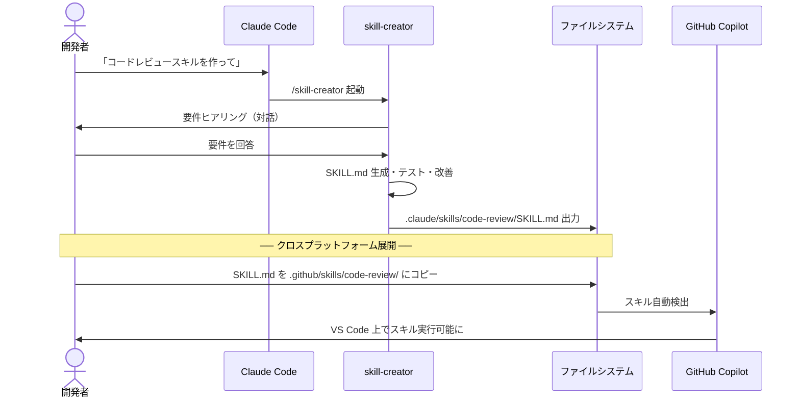
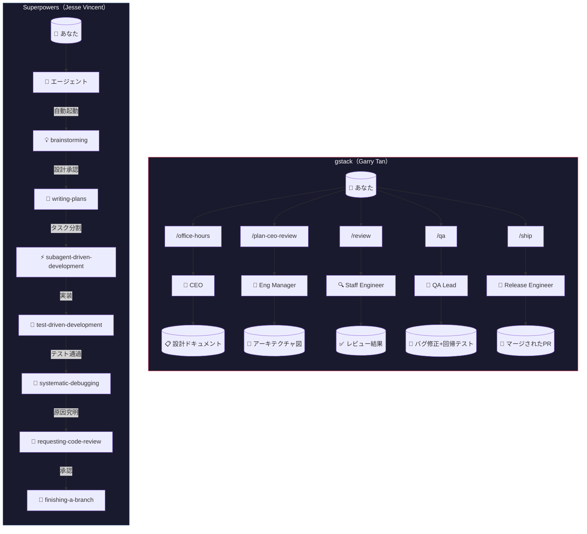
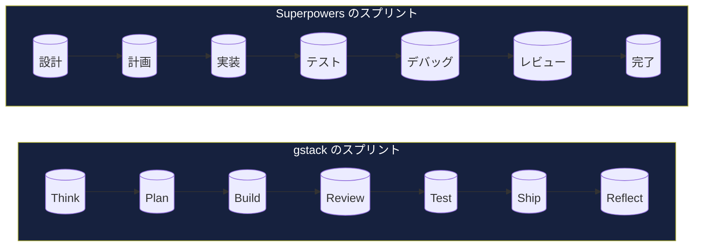
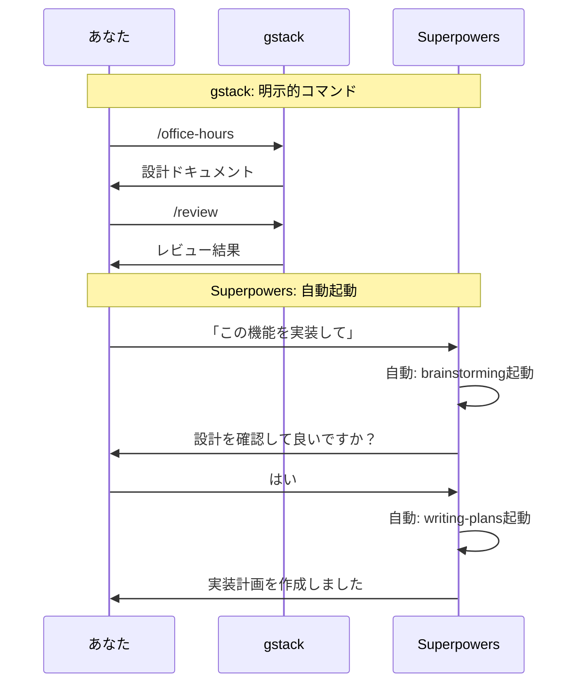
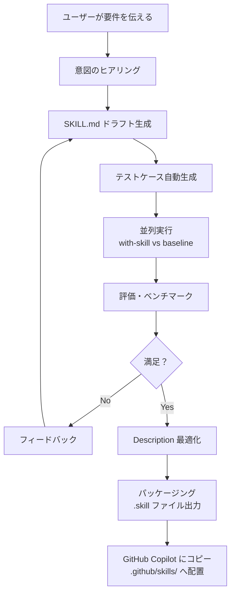

# Agent Skills in Practice

## スキルを作り、見つけ、活用する — Claude Code と GitHub Copilot で始める実践ガイド

この教材は、Agent Skills オープンスタンダード（`agentskills.io`）に基づき、Claude Code の `/skill-creator` と GitHub Copilot Agent Skills の両方でスキルを開発・活用する方法を学べる実践ガイドです。

---

**著者**: 杜 文吉  
**出版**: Duwenji Lab  
**バージョン**: 0.2.0  
**最終更新**: 2026年6月

---

## 本書の構成

| Part | タイトル | 学習時間 |
|------|---------|---------|
| Part 0 | 概要と環境準備 | 20分 |
| Part 1 | スキル作成入門 | 60分 |
| Part 2 | スキル発見と共有 | 60分 |
| Part 3 | 概念フレームワークと課題認識 | 80分 |
| Part 4 | 実践スキル実装編 | 180分 |
| Part 5 | コンテンツ生成スキル実践 | 90分 |
| Part 6 | 発展・応用 | 65分 |
| **合計** | | **8時間35分** |

---

> 💡 本書は実践チュートリアルです。各 Part を順番に進めることで、スキル開発の基礎から応用まで体系的に学べます。

# 0. 概要と環境準備

## 0.1 0-1: Agent Skills エコシステムの全体像

> **学習時間**: 10分 | **難易度**: ⭐

### 0.1.1 この教材の目的

このチュートリアルは、**Agent Skills オープンスタンダード**（`agentskills.io`）に基づくスキル開発を学ぶ学習教材です。**Claude Code**（Anthropic）と **GitHub Copilot**（GitHub/Microsoft）の両方で使えるスキルを、実践的に習得します。

#### 0.1.1.1 学習目標

- Agent Skills エコシステムの全体像を理解する
- 4層構造の各層の役割を説明できる
- Claude Code と GitHub Copilot のスキル対応の違いを説明できる
- このチュートリアルの学習の流れを把握する

### 0.1.2 4層構造

この教材は以下の4層で構成されています：

```
┌─────────────────────────────────────────┐
│           発見層                         │
│   Find Skills / gh skill / skill.sh     │
│   スキルを探し、見つけ、実行する           │
├─────────────────────────────────────────┤
│           作成層                         │
│   Claude Code /skill-creator            │
│   + 手書き SKILL.md                     │
│   対話形式または手書きでスキルを作成する    │
├─────────────────────────────────────────┤
│           概念層                         │
│   Superpowers / GStack / 前端大神問題    │
│   理論とフレームワークを理解する           │
├─────────────────────────────────────────┤
│           実践層                         │
│   grill-me / triage / improve           │
│   frontend-design / ui-ux-pro-max       │
│   実際のスキルを使いこなす               │
└─────────────────────────────────────────┘
```

#### 0.1.2.1 発見層（Find Skills / gh skill / skill.sh）

GitHub エコシステム上で公開されているスキルを検索・発見するための機能です。GitHub.com 上の Find Skills 機能、`gh skill` CLI コマンド、そして skill.sh を使って、必要なスキルを素早く見つけることができます。

#### 0.1.2.2 作成層（Claude Code /skill-creator + 手書き SKILL.md）

スキルを作成する方法は2つあります：

1. **Claude Code の `/skill-creator`**: 対話形式でスキルを生成。ベストプラクティスに従った SKILL.md を自動生成し、テスト・評価・改善のサイクルを提供します。
2. **手書き SKILL.md**: テキストエディタで直接 SKILL.md を作成。両プラットフォームで共通のフォーマットです。

#### 0.1.2.3 概念層（Superpowers / GStack / 前端大神問題）

スキルを効果的に活用するための理論的基盤です：

- **Superpowers**: Jesse Vincent 氏開発のコーディングエージェント向けプラグイン。開発プロセス全体の方法論を提供
- **GStack**: Generative AI Stack におけるスキルの位置づけ
- **前端大神の3問題**: AIコード生成における具体的な課題認識

#### 0.1.2.4 実践層（8つの実践スキル）

この教材のメインコンテンツです。フロントエンド開発に特化した8つの実践スキルを学びます：

| スキル | カテゴリ | 用途 |
|-------|---------|------|
| grill-me | 品質検証 | コードレビュー |
| triage | 優先順位付け | Issue分析 |
| improve | リファクタリング | コード改善 |
| frontend-design | アーキテクチャ | 設計支援 |
| ui-ux-pro-max | デザイン改善 | UI/UX最適化 |

### 0.1.3 2つのプラットフォーム比較

| 観点 | Claude Code (Anthropic) | GitHub Copilot (GitHub) |
|------|------------------------|------------------------|
| **スキル配置場所** | `.claude/skills/<name>/SKILL.md` | `.github/skills/<name>/SKILL.md` |
| **個人用スキル** | `~/.claude/skills/<name>/SKILL.md` | `~/.copilot/skills/<name>/SKILL.md` |
| **対話生成** | `/skill-creator`（バンドルスキル） | なし（手書きが基本） |
| **CLI検索** | なし（手動配置） | `gh skill` コマンド |
| **バンドルスキル** | `/code-review`, `/debug`, `/run` 等 | なし |
| **動的コンテキスト注入** | `!` コマンド構文で対応 | なし |
| **サブエージェント実行** | 対応 | 対応（一部） |

### 0.1.4 学習の流れ

```
Part 0 ─→ Part 1 ─→ Part 2 ─→ Part 3 ─→ Part 4 ─→ Part 5
概要     作成入門   発見      概念      実践⭐    応用
```

各 Part は基本的に独立していますが、Part 4（実践スキル）を最大限活用するには Part 1（スキル作成入門）を先に学ぶことを推奨します。

### 0.1.5 既存リポジトリとの差別化

| 観点 | github-copilot-skills-tutorial | 本教材 |
|------|-------------------------------|--------|
| フォーカス | Agent Skills 全般 | **クロスプラットフォーム**（Claude Code + Copilot） |
| スキル生成 | SKILL.md/JSONを手書き | **Claude Code `/skill-creator`** + 手書き |
| サンプルスキル | 汎用的 | **フロントエンド特化** |
| 問題認識 | なし | **前端大神3問題** からスタート |
| 概念フレームワーク | なし | **Superpowers / GStack** を解説 |

### 0.1.6 次のステップ

→ [0-2: 環境セットアップ](02-environment-setup.md) に進む

## 0.2 0-2: 環境セットアップ

> **学習時間**: 10分 | **難易度**: ⭐

### 0.2.1 前提条件

- **Claude Code ユーザー**: Anthropic アカウント + Claude Code がインストール済み
- **GitHub Copilot ユーザー**: GitHub アカウント（Copilot サブスクリプション付き）
- テキストエディタ（VS Code 推奨）
- （オプション）GitHub CLI（gh）がインストールされた環境

### 0.2.2 ステップ1: Claude Code のセットアップ

#### 0.2.2.1 Claude Code のインストール

```bash
# npm 経由でインストール
npm install -g @anthropic-ai/claude-code

# または Homebrew（macOS）
brew install claude-code
```

#### 0.2.2.2 スキルディレクトリの確認

Claude Code は自動的に以下のディレクトリからスキルを読み込みます：

| 種類 | パス | 適用範囲 |
|------|------|---------|
| 個人用 | `~/.claude/skills/<name>/SKILL.md` | 全プロジェクト |
| プロジェクト用 | `.claude/skills/<name>/SKILL.md` | そのプロジェクトのみ |

#### 0.2.2.3 動作確認

```bash
# Claude Code を起動
claude

# セッション内でバンドルスキルを確認
/help
```

### 0.2.3 ステップ2: GitHub Copilot のセットアップ

#### 0.2.3.1 スキルディレクトリの準備

GitHub Copilot では、リポジトリの `.github/skills/` ディレクトリにスキルを配置します：

```bash
# リポジトリのルートで実行
mkdir -p .github/skills/
```

#### 0.2.3.2 ディレクトリ構成例

```
.github/skills/
├── grill-me/
│   └── SKILL.md
├── triage/
│   └── SKILL.md
├── improve/
│   └── SKILL.md
├── frontend-design/
│   └── SKILL.md
└── ui-ux-pro-max/
    └── SKILL.md
```

#### 0.2.3.3 gh skill コマンドの確認

```bash
# GitHub CLI でスキル関連コマンドを確認
gh skill --help
```

### 0.2.4 ステップ3: 両方の環境で使える共通スキルを作成する

このチュートリアルのサンプルスキルは、**Claude Code と GitHub Copilot の両方で動作する**ように設計されています。SKILL.md のフォーマットは Agent Skills オープンスタンダードに準拠しており、配置場所を変えるだけで両方のプラットフォームで使用できます。

#### 0.2.4.1 Claude Code で使う場合

```bash
# プロジェクト用
cp samples/grill-me/SKILL.md .claude/skills/grill-me/SKILL.md

# または個人用
mkdir -p ~/.claude/skills/grill-me/
cp samples/grill-me/SKILL.md ~/.claude/skills/grill-me/SKILL.md
```

#### 0.2.4.2 GitHub Copilot で使う場合

```bash
mkdir -p .github/skills/grill-me/
cp samples/grill-me/SKILL.md .github/skills/grill-me/SKILL.md
```

### 0.2.5 トラブルシューティング

| 問題 | 原因 | 解決策 |
|------|------|--------|
| Claude Code が起動しない | インストール未完了 | `npm install -g @anthropic-ai/claude-code` を再実行 |
| スキルが認識されない | パスが間違っている | `.claude/skills/<name>/SKILL.md` のパスを確認 |
| Copilot がスキルを実行しない | スキル名が間違っている | `.github/skills/` のディレクトリ名とスキル名を確認 |
| gh skill が使えない | GitHub CLI 未インストール | `gh` コマンドが使えるか確認 |

### 0.2.6 参考リンク

- [Claude Code Skills ドキュメント](https://code.claude.com/docs/en/skills)
- [GitHub Copilot Agent Skills ドキュメント](https://docs.github.com/en/copilot/concepts/agents/about-agent-skills)
- [Agent Skills オープンスタンダード](https://agentskills.io)
- [agentskills/agentskills (GitHub)](https://github.com/agentskills/agentskills)
- [awesome-copilot（コミュニティスキル集）](https://github.com/github/awesome-copilot)

### 0.2.7 次のステップ

環境が整いました！次のセクションに進みましょう：

→ [1-1: Agent Skills とは](../01-skill-creation/01-what-are-agent-skills.md)

# 1. スキル作成入門

## 1.1 1-1: Agent Skills とは

> **学習時間**: 15分 | **難易度**: ⭐⭐

### 1.1.1 概要

**Agent Skills** は、AI エージェント（Claude Code、GitHub Copilot など）に特定のタスクを実行させるための指示書です。SKILL.md というファイルに手順やルールを記述し、エージェントが自動的に読み込んで実行します。

Agent Skills は **Agent Skills オープンスタンダード**（[agentskills.io](https://agentskills.io)）に基づく共通フォーマットで、複数の AI ツール間でスキルを共有できます。

### 1.1.2 スキルを作成する2つのアプローチ

#### 1.1.2.1 アプローチ1: skill-creator スキルによる対話生成（Claude Code）

Claude Code には **skill-creator** というバンドルスキルが標準搭載されています（[anthropics/skills](https://github.com/anthropics/skills/tree/main/skills/skill-creator)）。これはスキル作成のための本格的なフレームワークで、以下のプロセスを自動化します：

```mermaid
flowchart LR
    U[ユーザー] -->|「コードレビュースキルを作って」| CC[Claude Code]
    CC -->|skill-creator 対話生成| SKILL[SKILL.md 生成<br>.claude/skills/code-review/]
    SKILL -->|手動コピー| GH[SKILL.md 配置<br>.github/skills/code-review/]
    GH -->|自動読み込み| COPILOT[GitHub Copilot<br>VS Code で実行可能]

    style CC fill:#6B5B95,color:#fff,stroke:#333
    style COPILOT fill:#2DA44E,color:#fff,stroke:#333


**使い方**:
```bash
## 1.1 Claude Code を起動
claude

## 1.1 セッション内で skill-creator を呼び出す
/skill-creator

## 1.1 または自然言語で依頼
コードレビュースキルを作成して
```

skill-creator スキルは以下のような対話を開始します：

```
Claude: どんなスキルを作りましょうか？
以下の点を教えてください：
1. このスキルに何をさせたいですか？
2. どのようなタイミングで発動すべきですか？
3. 出力形式の希望はありますか？
4. テストケースは必要ですか？
```

#### skill-creator の内部プロセス

skill-creator は単なる SKILL.md 生成ツールではなく、**スキル開発のライフサイクル全体**をカバーします：

| フェーズ | 内容 |
|---------|------|
| **1. 意図のヒアリング** | ユーザーの要件を対話で引き出す |
| **2. SKILL.md 作成** | ベストプラクティスに従った SKILL.md を生成 |
| **3. テストケース作成** | 2-3個の現実的なテストプロンプトを生成 |
| **4. 並列実行** | with-skill / baseline の両方を同時実行 |
| **5. 評価** | 定量的アサーション + 定性的レビュー |
| **6. 反復改善** | フィードバックに基づいてスキルを改善 |
| **7. Description最適化** | トリガー精度を自動最適化 |
| **8. パッケージング** | `.skill` ファイルとして出力 |

> **補足**: skill-creator は Claude Code 専用のツールですが、**生成された SKILL.md は Agent Skills オープンスタンダードに準拠しているため、そのまま GitHub Copilot でも使用できます**。詳細は [1-2: skill-creator で最初のスキルを作る](02-skill-creator-hands-on.md) で学びます。

### アプローチ2: 手書き SKILL.md

テキストエディタで直接 SKILL.md を作成する方法です。両プラットフォーム（Claude Code / GitHub Copilot）で共通のフォーマットです。

```bash
## 1.1 スキルディレクトリを作成
mkdir -p .claude/skills/my-skill/

## 1.1 SKILL.md を作成
touch .claude/skills/my-skill/SKILL.md
```

## 2つのアプローチの比較

| 観点 | skill-creator（対話生成） | 手書き SKILL.md |
|------|--------------------------|----------------|
| 作成方法 | Claude Code に対話で指示 | テキストエディタで直接記述 |
| 学習曲線 | ほぼゼロ | YAML/Markdown の知識が必要 |
| テスト自動化 | 自動生成・並列実行 | 手動テスト |
| 評価・ベンチマーク | 内蔵（定量的+定性的） | なし |
| 反復改善 | 構造化されたループ | 手動 |
| Description最適化 | 自動（トリガー精度向上） | 手動調整 |
| 対応プラットフォーム | Claude Code のみ | Claude Code + GitHub Copilot |
| 適した用途 | 本格的なスキル開発 | シンプルなスキル、クロスプラットフォーム |

## SKILL.md の基本構造

SKILL.md は YAML フロントマターと Markdown 本文の2部構成です：

```markdown

## 1.1 スキル名

### 1.1.1 概要
このスキルが何をするかの説明。

### 1.1.2 手順
1. ステップ1
2. ステップ2
3. ステップ3

### 1.1.3 注意事項
- 注意点1
- 注意点2
```

### フロントマターの役割

`name` と `description` フィールドは特に重要です：

- **`name`**: スキルの識別子。ディレクトリ名と一致させる
- **`description`**: エージェントが「今の会話に関連するスキルかどうか」を判断するための説明文。具体的かつ検索性の高い記述が推奨される

### スキルのディレクトリ構造

```
my-skill/
├── SKILL.md           # メインの指示（必須）
├── scripts/           # 実行可能コード（任意）
├── references/        # 参照ドキュメント（任意）
└── assets/            # 出力用テンプレート等（任意）
```

## スキルの配置場所

| 種類 | Claude Code | GitHub Copilot | 適用範囲 |
|------|-------------|----------------|---------|
| 個人用 | `~/.claude/skills/<name>/SKILL.md` | `~/.copilot/skills/<name>/SKILL.md` | 全プロジェクト |
| プロジェクト用 | `.claude/skills/<name>/SKILL.md` | `.github/skills/<name>/SKILL.md` | そのプロジェクトのみ |
| プラグイン | `<plugin>/skills/<name>/SKILL.md` | なし | プラグイン有効時 |

## スキルが使われるタイミング

スキルは以下の2つの方法で使われます：

1. **自動読み込み**: 会話の内容がスキルの `description` にマッチした場合、エージェントが自動的にスキルを読み込む
2. **明示的な呼び出し**: `/スキル名` で直接スキルを実行

## 次のステップ

→ [1-2: skill-creator で最初のスキルを作る](02-skill-creator-hands-on.md)

## 1.2 1-2: skill-creator で最初のスキルを作る

> **学習時間**: 20分 | **難易度**: ⭐⭐

### 1.2.1 概要

このハンズオンでは、Claude Code にバンドルされている **skill-creator** スキルを使って、実際にスキルを作成します。skill-creator は [anthropics/skills](https://github.com/anthropics/skills/tree/main/skills/skill-creator) リポジトリで公開されている本格的なスキル開発フレームワークです。

### 1.2.2 ハンズオン: コードレビュースキルを作成する

#### 1.2.2.1 ステップ1: Claude Code を起動

```bash
# プロジェクトのルートで Claude Code を起動
cd your-project
claude
```

#### 1.2.2.2 ステップ2: skill-creator を呼び出す

Claude Code セッション内で以下のように入力します：

```
/skill-creator
```

または自然言語で直接依頼します：

```
コードレビュースキルを作成して
```

#### 1.2.2.3 ステップ3: skill-creator との対話

skill-creator が以下のような質問をしてくるので、順に回答します：

```
Claude: どんなスキルを作りましょうか？
以下の点を教えてください：
1. このスキルに何をさせたいですか？
2. どのようなタイミングで発動すべきですか？
3. 出力形式の希望はありますか？
4. テストケースは必要ですか？
```

**あなたの回答例**:
```
1. コードを可読性・パフォーマンス・セキュリティの3観点でレビューするスキル
2. プルリクエストのレビュー時や「このコードをレビューして」と言われたとき
3. JSON形式で、全体スコアと各観点のスコア、問題リストを含めて
4. はい、テストケースもお願いします
```

#### 1.2.2.4 ステップ4: SKILL.md の生成

skill-creator が SKILL.md のドラフトを生成します：

```
Claude: SKILL.md のドラフトを作成しました。
以下が生成された内容です：


# Code Review

## 概要
このスキルはコードを3つの観点でレビューし、JSON形式で結果を返します。

## 手順
1. レビュー対象のコードを分析する
2. 以下の観点で評価する：
   - 可読性: 命名、コメント、コード構造
   - パフォーマンス: 不要な処理、メモ化の機会
   - セキュリティ: インジェクション、認証の抜け
3. 各問題に重要度（critical/major/minor）を付ける
4. JSON形式で結果を出力する

## 出力形式
```json
{
  "summary": {
    "total_issues": 5,
    "overall_score": 72
  },
  "categories": {
    "readability": { "score": 80, "issues": [] },
    "performance": { "score": 65, "issues": [] },
    "security": { "score": 90, "issues": [] }
  }
}
```

この内容でよろしいですか？修正があれば教えてください。
```

#### 1.2.2.5 ステップ5: テストケースの実行

SKILL.md に問題がなければ、skill-creator がテストケースを生成し、並列実行します：

```
Claude: 以下の3つのテストケースを実行します：
1. シンプルな関数のレビュー
2. Reactコンポーネントのレビュー
3. セキュリティ問題を含むコードのレビュー

with-skill と baseline（スキルなし）の両方を同時に実行します...
```

実行が完了すると、評価ビューアがブラウザで開き、結果を確認できます：

```
Claude: 結果をブラウザで開きました。
「Outputs」タブで各テストケースの出力を確認できます。
「Benchmark」タブで定量的な比較結果を確認できます。
確認が終わったら教えてください。
```

#### 1.2.2.6 ステップ6: フィードバックと反復改善

結果を確認し、改善点があれば伝えます：

```
あなた: セキュリティの観点がもう少し詳細だと良いです。
具体的な脆弱性パターン（XSS, CSRF, SQLインジェクション）を
チェックするようにしてください。
```

skill-creator が SKILL.md を改善し、再度テストを実行します：

```
Claude: SKILL.md を更新しました。セキュリティ観点に
具体的な脆弱性パターンを追加しました。
再度テストを実行します...
```

このループを、満足する結果が得られるまで繰り返します。

#### 1.2.2.7 ステップ7: Description の最適化（オプション）

スキルが完成したら、Description の最適化を依頼できます：

```
あなた: description を最適化して
```

skill-creator が20個のトリガーテストクエリ（発動すべきケース8-10個 + 発動すべきでないケース8-10個）を生成し、自動最適化を実行します。

#### 1.2.2.8 ステップ8: パッケージング

最終的に、スキルを `.skill` ファイルとしてパッケージ化できます：

```
あなた: パッケージ化して
```

```bash
# skill-creator が以下のコマンドを実行
python -m scripts.package_skill .claude/skills/code-review/
# → code-review.skill が生成される
```

### 1.2.3 skill-creator の活用範囲

| 目的 | 使うコマンド |
|------|------------|
| コードレビュースキルを作成する | `/skill-creator` |
| Issue分析スキルを作成する | `/skill-creator` |
| 既存のスキルを改善する | `/skill-creator` |
| スキルのトリガー精度を最適化する | `/skill-creator` |

### 1.2.4 よくある失敗と対策

| 失敗パターン | 原因 | 対策 |
|------------|------|------|
| skill-creator が反応しない | Claude Code のバージョンが古い | `claude --version` で確認、最新にアップデート |
| テストケースが多すぎる | 最初から多くのケースを指定 | 2-3個から始めて、後で追加 |
| 評価ビューアが開かない | ブラウザがない環境 | `--static` フラグでHTMLファイル出力を依頼 |
| スキルが複雑すぎる | 一度に多くの機能を要求 | シンプルに作ってから段階的に拡張 |

#### 1.2.4.1 ステップ9: 生成したスキルを GitHub Copilot でも使う

skill-creator で生成した SKILL.md は **Agent Skills オープンスタンダード**に準拠しているため、そのまま GitHub Copilot でも使用できます。以下の手順でコピーするだけです：

```bash
# 1. Claude Code 用に生成されたスキルを確認
ls .claude/skills/code-review/SKILL.md

# 2. GitHub Copilot 用のディレクトリを作成
mkdir -p .github/skills/code-review/

# 3. SKILL.md をコピー
cp .claude/skills/code-review/SKILL.md .github/skills/code-review/SKILL.md
```

以下のシーケンス図が、Claude Code での対話生成から GitHub Copilot での利用までの全体像を示しています：



> **ポイント**: skill-creator は Claude Code 専用のツールですが、**生成された SKILL.md は両プラットフォームで互換性があります**。Claude Code の対話生成力を活かしてスキルを作り、生成物を GitHub Copilot にコピーするのが最も効率的なワークフローです。

### 1.2.5 次のステップ

→ [1-3: SKILL.md のカスタマイズと最適化](03-skillmd-customization.md)


## 1.3 1-3: SKILL.md のカスタマイズと最適化

> **学習時間**: 15分 | **難易度**: ⭐⭐

### 1.3.1 概要

Claude Code の `/skill-creator` で生成した SKILL.md は、そのまま使用することも、手動で編集してカスタマイズすることもできます。このセクションでは、SKILL.md の構造を理解し、効果的にカスタマイズする方法を学びます。

### 1.3.2 SKILL.md の詳細構造

SKILL.md は YAML フロントマターと Markdown 本文の2部構成です：

```markdown

# スキル名

## 概要
このスキルが何をするかの説明。

## 手順
1. ステップ1
2. ステップ2
3. ステップ3

## 注意事項
- 注意点1
- 注意点2
```

#### 1.3.2.1 フロントマターの詳細

| フィールド | 必須 | 説明 |
|-----------|------|------|
| `description` | 推奨 | スキルの説明。エージェントが自動読み込みの判断に使用 |
| `name` | 任意 | 表示名（指定しない場合はディレクトリ名） |
| `tags` | 任意 | 検索用タグの配列 |

#### 1.3.2.2 description の書き方

`description` はスキルの自動読み込みに直接影響します：

```yaml
# ❌ 悪い例（曖昧すぎる）
description: コードを分析します

# ✅ 良い例（具体的）
description: コードを可読性・パフォーマンス・セキュリティの3観点でレビューし、JSON形式で結果を返します

# ✅ さらに良い例（利用シーンが明確）
description: プルリクエストのコード変更をレビューし、可読性・パフォーマンス・セキュリティの観点から問題を検出します
```

### 1.3.3 カスタマイズの実践

#### 1.3.3.1 1. 動的コンテキスト注入（Claude Code のみ）

Claude Code では、`!` 構文を使って動的にコンテキストを注入できます：

```markdown

# Summarize Changes

## コンテキスト
現在の変更内容：
!`git diff HEAD`

## 手順
1. 上記の差分を分析する
2. 以下の観点でリスクを評価する：
   - セキュリティへの影響
   - パフォーマンスへの影響
   - 後方互換性
3. 結果を Markdown 形式で出力する
```

`!` 構文を使うと、Claude Code が SKILL.md を読み込む前にコマンドを実行し、その出力をインライン展開します。これにより、常に最新のコンテキストでスキルが動作します。

#### 1.3.3.2 2. サポートファイルの追加

スキルディレクトリには SKILL.md 以外のファイルも配置できます：

```
my-skill/
├── SKILL.md           # メインの指示（必須）
├── instructions.md    # 追加の指示（任意）
├── template.md        # 出力テンプレート（任意）
├── examples/          # 使用例（任意）
│   ├── example1.js
│   └── example2.js
└── config.json        # 設定ファイル（任意）
```

#### 1.3.3.3 3. 呼び出し制御の設定

フロントマターで、誰がスキルを呼び出せるかを制御できます：

```yaml
```

| 値 | 動作 |
|----|------|
| `user` | ユーザーが `/スキル名` で明示的に呼び出した場合のみ実行 |
| `auto` | Claude が自動的に判断して実行（ユーザーは直接呼び出せない） |
| `both` | 両方可能（デフォルト） |

#### 1.3.3.4 4. ツールの事前承認

Claude Code では、スキルが使用するツールを事前承認できます：

```yaml
---
description: ファイルを読み書きするスキル
approved_tools:
  - Read
  - Write
  - Edit
---
```

事前承認されたツールは、実行時にユーザーの確認を求められません。

### 1.3.4 プラットフォーム間の互換性

| 機能 | Claude Code | GitHub Copilot |
|------|-------------|----------------|
| 基本 SKILL.md | ✅ 対応 | ✅ 対応 |
| description | ✅ 対応 | ✅ 対応 |
| 動的コンテキスト注入 (`!`) | ✅ 対応 | ❌ 非対応 |
| 呼び出し制御 (`invoke`) | ✅ 対応 | ❌ 非対応 |
| ツール事前承認 | ✅ 対応 | ❌ 非対応 |
| サポートファイル | ✅ 対応 | ✅ 対応 |

クロスプラットフォームで使う場合は、Claude Code 固有の機能（動的コンテキスト注入、呼び出し制御など）に依存しない SKILL.md を書きましょう。

### 1.3.5 カスタマイズのベストプラクティス

#### 1.3.5.1 ✅ 推奨

- **具体的な description を書く**: 自動読み込みの精度が向上
- **シンプルに始める**: 最小限の手順からスタート
- **段階的に拡張**: 必要に応じて機能を追加
- **使用例を含める**: 利用者が使い方を理解しやすい

#### 1.3.5.2 ❌ 非推奨

- **過度に複雑な手順**: シンプルさを保つ
- **曖昧な表現**: 「適切に」「必要に応じて」などの不明確な表現
- **プラットフォーム固有機能への過度な依存**: クロスプラットフォーム互換性を考慮

### 1.3.6 次のステップ

→ [1-4: スキル作成のベストプラクティス](04-best-practices.md)

## 1.4 1-4: スキル作成のベストプラクティス

> **学習時間**: 10分 | **難易度**: ⭐⭐

### 1.4.1 概要

効果的なスキルを作成するためのベストプラクティスを紹介します。プロンプト設計から反復改善サイクル、品質評価までをカバーします。

### 1.4.2 効果的な SKILL.md の設計

#### 1.4.2.1 基本の型

```markdown

# [スキル名]

## 概要
このスキルが何をするか、どのような場面で使うかを簡潔に説明。

## 手順
1. ステップ1
2. ステップ2
3. ステップ3

## 出力形式
期待される出力の説明。

## 注意事項
- 注意点1
- 注意点2
```

#### 1.4.2.2 良い SKILL.md と悪い SKILL.md

```markdown
# ✅ 良い例

# Code Review

## 手順
1. 変更されたコードを分析する
2. 以下の観点で評価する：
   - 可読性: 命名、コメント、コード構造
   - パフォーマンス: 不要な処理、メモ化の機会
   - セキュリティ: インジェクション、認証の抜け
3. 各問題に重要度（critical/major/minor）を付ける
4. JSON形式で結果を出力する
```

```markdown
# ❌ 悪い例

# Code Review

コードをレビューして結果を返してください。
適切に判断して出力してください。
```

### 1.4.3 反復改善サイクル

スキルは一度作って終わりではなく、使うたびに改善していくものです：

```
① 初期作成 ─→ ② テスト実行 ─→ ③ 結果確認 ─→ ④ 改善
    ↑                                            │
    └────────────────────────────────────────────┘
```

#### 1.4.3.1 改善のパターン

**手順の追加**
```markdown
# 改善前
## 手順
1. コードを分析する

# 改善後
## 手順
1. コードを分析する
2. 可読性・パフォーマンス・セキュリティの3観点で評価する
3. 各問題に重要度を付ける
```

**description の最適化**
```yaml
# 改善前（自動読み込みされにくい）
description: コードレビュー

# 改善後（自動読み込みされやすい）
description: プルリクエストのコード変更をレビューし、可読性・パフォーマンス・セキュリティの観点から問題を検出します
```

### 1.4.4 スキル品質評価チェックリスト

#### 1.4.4.1 基本品質チェック

- [ ] スキルの目的が明確か
- [ ] description が具体的で検索性が高いか
- [ ] 手順が具体的で実行可能か
- [ ] 出力形式が明確に指定されているか
- [ ] 使用例が記載されているか

#### 1.4.4.2 実用品質チェック

- [ ] 実際のユースケースで期待通り動作するか
- [ ] エッジケースで適切に動作するか
- [ ] 出力結果が一貫しているか
- [ ] 他のスキルと組み合わせて使えるか
- [ ] クロスプラットフォームで動作するか

### 1.4.5 スキル設計の原則

#### 1.4.5.1 1. 単一責任の原則
1つのスキルは1つのことを得意とするように設計します。

```
✅ 良い: 「コードレビュースキル」
❌ 悪い: 「コードレビュー + テスト生成 + ドキュメント作成スキル」
```

#### 1.4.5.2 2. 明確な契約
入力と出力の契約を明確に定義します。利用者が「何を渡せば、何が返ってくるか」を一目で理解できるように。

#### 1.4.5.3 3. エラーに強い設計
空入力、不正な入力、予期しない入力に対して適切に振る舞うようにします。

#### 1.4.5.4 4. 段階的拡張
シンプルに作ってから、必要に応じて機能を追加します。最初から完璧を目指さない。

#### 1.4.5.5 5. プラットフォーム互換性
可能な限り、Claude Code と GitHub Copilot の両方で動作するように設計します。プラットフォーム固有の機能（動的コンテキスト注入など）は、どうしても必要な場合のみ使用します。

### 1.4.6 次のステップ

Part 1 の学習が完了しました。次の Part に進みましょう：

→ [Part 2: スキル発見と共有](../02-discovery/01-find-skills.md)

# 2. スキル発見と共有

## 2.1 2-1: Find Skills でスキルを探す

> **学習時間**: 15分 | **難易度**: ⭐⭐

> 💡 **環境セットアップは不要です** — Find Skills は GitHub.com 上の機能のため、ブラウザと GitHub アカウント（Copilot サブスクリプション付き）があればすぐに使えます。見つけたスキルをインポートして使う場合は、事前に [0-2: 環境セットアップ](../00-fundamentals/02-environment-setup.md) を済ませておくとスムーズです。

### 2.1.1 概要

**Find Skills** は、GitHub.com 上で公開されているスキルを検索・発見するための機能です。他の開発者が作成したスキルを探したり、自分のスキルを公開して共有したりできます。

### 2.1.2 Find Skills の使い方

#### 2.1.2.1 GitHub.com での検索

1. [GitHub.com](https://github.com) にログイン
2. Copilot Editor を開く（GitHub.com 上のチャットインターフェース）
3. チャット入力欄に以下のように入力してスキルを検索：

> `@copilot コードレビューのスキルを探して`

または、より具体的に：

> `@copilot Reactのアクセシビリティチェックスキルを探して`

#### 2.1.2.2 検索結果の見方

Find Skills は以下の情報を表示します：

- スキル名と説明
- タグ（カテゴリ）
- 作者（公開元）
- 評価・使用統計
- 最終更新日

### 2.1.3 スキルの選び方

#### 2.1.3.1 評価基準

| 基準 | 確認ポイント |
|------|------------|
| 目的の一致 | 自分のユースケースに合致しているか |
| 品質 | 説明が明確で、使用例が充実しているか |
| メンテナンス | 最終更新日が新しいか |
| 人気 | 使用されている実績があるか |
| 互換性 | 自分の技術スタックと合っているか |

#### 2.1.3.2 選定フロー

```
① 検索 ─→ ② 候補をリストアップ ─→ ③ 説明を確認
                                        ↓
⑥ 採用 or カスタマイズ ←── ⑤ テスト実行 ←── ④ SKILL.md を確認
```

### 2.1.4 スキルのインポート方法

見つけたスキルを自分のリポジトリに取り込むには：

#### 2.1.4.1 方法1: 手動コピー

1. スキルの SKILL.md の内容をコピー
2. 自分のリポジトリの `.github/skills/<スキル名>/SKILL.md` にペースト
3. 必要に応じてカスタマイズ

#### 2.1.4.2 方法2: GitHub のフォーク

1. スキルが含まれるリポジトリをフォーク
2. 必要なスキルのみを自分のリポジトリにコピー

#### 2.1.4.3 方法3: submodule として追加

```bash
git submodule add https://github.com/username/skills-repo.git .github/skills/
```

### 2.1.5 スキルの公開

自分のスキルを公開するには：

1. スキルを `.github/skills/` に配置したリポジトリを作成
2. リポジトリを公開（Public）
3. Find Skills が自動的にインデックス

#### 2.1.5.1 公開のベストプラクティス

- **明確な説明**: スキルの目的と使い方を簡潔に
- **適切なタグ**: 検索されやすいタグを設定
- **使用例**: 具体的な使用例を複数記載
- **バージョン管理**: CHANGELOG で更新履歴を管理

### 2.1.6 次のステップ

→ [2-2: skill.sh によるCLI検索](02-skill-sh-cli.md)

## 2.2 2-2: skill.sh によるCLI検索

> **学習時間**: 15分 | **難易度**: ⭐⭐

### 2.2.1 概要

**skill.sh** は、コマンドラインからスキルを検索・実行するためのツールです。GitHub CLI（gh）と連携して動作し、ターミナルから直接スキルを操作できます。

### 2.2.2 前提条件

- GitHub CLI（gh）がインストールされている
- `gh` で GitHub アカウントにログイン済み
- Copilot サブスクリプションが有効

### 2.2.3 インストール

```bash
# GitHub CLI のインストール確認
gh --version

# skill.sh のダウンロード
curl -O https://raw.githubusercontent.com/github-copilot/skill.sh/main/skill.sh
chmod +x skill.sh
```

### 2.2.4 基本的な使い方

#### 2.2.4.1 スキルの検索

```bash
# キーワードで検索
./skill.sh search code-review

# タグでフィルタリング
./skill.sh search --tag frontend

# 詳細表示
./skill.sh search --verbose accessibility
```

#### 2.2.4.2 スキルの実行

```bash
# スキルを直接実行
./skill.sh run code-review --input "コードをここに"

# パラメータを指定して実行
./skill.sh run code-review \
  --param code="function add(a,b) { return a+b; }" \
  --param language="javascript"
```

#### 2.2.4.3 スキル情報の表示

```bash
# スキルの詳細情報を表示
./skill.sh info code-review

# スキルのパラメータ一覧
./skill.sh params code-review
```

### 2.2.5 主なコマンド一覧

| コマンド | 説明 | 使用例 |
|---------|------|--------|
| `search` | スキルを検索 | `skill.sh search code-review` |
| `run` | スキルを実行 | `skill.sh run <スキル名>` |
| `info` | スキル詳細を表示 | `skill.sh info <スキル名>` |
| `params` | パラメータ一覧 | `skill.sh params <スキル名>` |
| `list` | 利用可能なスキル一覧 | `skill.sh list` |
| `install` | スキルをインストール | `skill.sh install <URL>` |

### 2.2.6 実践例

#### 2.2.6.1 コードレビューの自動化

```bash
# 変更されたファイルをレビュー
git diff --name-only HEAD~1 | while read file; do
  ./skill.sh run code-review \
    --param code="$(cat $file)" \
    --param language="typescript"
done
```

#### 2.2.6.2 Issue の一括トリアージ

```bash
# 未トリアージの Issue を一括処理
gh issue list --label "needs-triage" --json number,title,body \
  | jq -c '.[]' \
  | while read issue; do
    ./skill.sh run triage \
      --param issue_title="$(echo $issue | jq -r '.title')" \
      --param issue_body="$(echo $issue | jq -r '.body')"
  done
```

### 2.2.7 トラブルシューティング

| 問題 | 原因 | 解決策 |
|------|------|--------|
| `gh` が見つからない | GitHub CLI 未インストール | `winget install GitHub.cli` または `brew install gh` |
| 認証エラー | ログインしていない | `gh auth login` を実行 |
| スキルが見つからない | スキル名が間違っている | `skill.sh search` で正しい名前を確認 |
| 実行権限エラー | パーミッション不足 | `chmod +x skill.sh` を実行 |

### 2.2.8 次のステップ

→ [2-3: スキルの共有とチーム展開](03-sharing-team-deployment.md)

## 2.3 2-3: スキルの共有とチーム展開

> **学習時間**: 15分 | **難易度**: ⭐⭐

### 2.3.1 概要

作成したスキルをチームで共有・展開する方法を学びます。Personal Skills、shared-copilot-skills、Git submodule の3つの戦略を状況に応じて使い分けることで、効率的なスキル管理が可能になります。

### 2.3.2 3つの共有戦略

| 戦略 | 適用範囲 | 難易度 | 推奨シーン |
|------|---------|--------|-----------|
| Personal Skills | 個人 | ⭐ | 個人利用、実験 |
| shared-copilot-skills | チーム | ⭐⭐ | チーム内共有 |
| Git submodule | 組織全体 | ⭐⭐⭐ | 組織全体での標準化 |

### 2.3.3 戦略1: Personal Skills

個人の開発環境でスキルを管理する最もシンプルな方法です。

#### 2.3.3.1 設定方法

```bash
# Windows
mkdir -p %USERPROFILE%\.copilot\skills\
copy SKILL.md %USERPROFILE%\.copilot\skills\my-skill\

# macOS / Linux
mkdir -p ~/.copilot/skills/
cp SKILL.md ~/.copilot/skills/my-skill/
```

#### 2.3.3.2 メリット・デメリット

- ✅ 設定が最も簡単
- ✅ 個人の実験に最適
- ❌ チーム共有不可
- ❌ バックアップが必要

### 2.3.4 戦略2: shared-copilot-skills

チームで共有するスキルリポジトリを作成し、全メンバーが参照できるようにします。

#### 2.3.4.1 リポジトリ構成例

```
shared-copilot-skills/
├── README.md
├── skills/
│   ├── grill-me/
│   │   └── SKILL.md
│   ├── triage/
│   │   └── SKILL.md
│   └── improve/
│       └── SKILL.md
└── CONTRIBUTING.md
```

#### 2.3.4.2 セットアップ手順

1. 共有リポジトリを作成
2. スキルを `skills/` ディレクトリに配置
3. チームメンバーにリポジトリのアクセス権を付与
4. 各メンバーが Personal Skills として参照設定

#### 2.3.4.3 運用ルール例

```markdown
## スキル追加フロー
1. Issue でスキル提案
2. チームレビュー
3. PR 作成
4. 承認後マージ
5. チームメンバーに通知

## バージョン管理
- スキルは Semantic Versioning に従う
- CHANGELOG に変更履歴を記載
- 破壊的変更はメジャーバージョンアップ
```

### 2.3.5 戦略3: Git submodule

組織全体でスキルを標準化する場合に有効です。

#### 2.3.5.1 セットアップ

```bash
# スキルリポジトリを submodule として追加
git submodule add https://github.com/org/shared-copilot-skills.git .github/skills/

# 特定のバージョンで固定
cd .github/skills/
git checkout v1.2.0
cd ../..

# 変更をコミット
git add .gitmodules .github/skills/
git commit -m "Add shared skills submodule (v1.2.0)"
```

#### 2.3.5.2 更新手順

```bash
# 最新版に更新
git submodule update --remote .github/skills/

# 特定のバージョンに更新
cd .github/skills/
git fetch --tags
git checkout v2.0.0
cd ../..
git add .github/skills/
git commit -m "Update shared skills to v2.0.0"
```

### 2.3.6 戦略の選び方

```
個人で使いたい？
├── Yes → Personal Skills
└── No → チームで使いたい？
         ├── 小規模チーム（〜10人）→ shared-copilot-skills
         └── 大規模組織 → Git submodule
```

### 2.3.7 次のステップ

→ [Part 3: 概念フレームワーク](../03-frameworks/01-superpowers.md)

## 2.4 2-4: baoyu-skills で学ぶ実践的スキル発見

> **学習時間**: 15分 | **難易度**: ⭐⭐

### 2.4.1 概要

ここまで Find Skills や skill.sh の使い方を学びました。このセクションでは、**実際に GitHub 上で公開されている人気スキルリポジトリ**を題材に、スキル発見の実践練習を行います。

題材とするのは **JimLiu/baoyu-skills**（21,000+ Stars）です。このリポジトリは21のスキルを3カテゴリで提供しており、スキル発見・評価・選択の良い教材となります。

### 2.4.2 baoyu-skills とは

**baoyu-skills** は、Jim Liu 氏が開発した AI エージェント（Claude Code, Codex 等）向けのスキル集です。

| 項目 | 内容 |
|------|------|
| **リポジトリ** | [github.com/JimLiu/baoyu-skills](https://github.com/JimLiu/baoyu-skills) |
| **スター数** | 21,000+ |
| **スキル数** | 21 |
| **言語** | TypeScript（Bun ランタイム） |
| **ライセンス** | MIT-0 |
| **インストール** | `npx skills add jimliu/baoyu-skills` |

#### 2.4.2.1 3つのカテゴリ

baoyu-skills は以下の3カテゴリで構成されています：

| カテゴリ | 説明 | スキル数 |
|---------|------|---------|
| **Content Skills** | コンテンツ生成・公開（画像、スライド、漫画、図表、SNS投稿） | 7 |
| **AI Generation Skills** | AI 生成バックエンド（画像生成、Web経由生成） | 3 |
| **Utility Skills** | コンテンツ処理（変換、圧縮、翻訳、公開） | 11+ |

### 2.4.3 実践: baoyu-skills を探索する

#### 2.4.3.1 ステップ1: リポジトリを調査する

まずはリポジトリの全体像を把握しましょう。GitHub 上で以下の情報を確認します：

1. **README.md** — リポジトリの説明、インストール方法、全スキル一覧
2. **スキル構成** — `skills/` ディレクトリに各スキルが配置されている
3. **スキル定義** — 各スキルフォルダ内の `SKILL.md` がスキルの実体

```bash
# GitHub CLI でリポジトリ情報を確認
gh repo view JimLiu/baoyu-skills

# スキル一覧を取得
gh api repos/JimLiu/baoyu-skills/contents/skills --jq '.[].name'
```

#### 2.4.3.2 ステップ2: スキルを評価する

スキルを選ぶ際の評価基準を、baoyu-skills を例に確認します：

| 評価基準 | baoyu-skills での確認ポイント |
|---------|---------------------------|
| **目的の一致** | 自分のユースケースに合うカテゴリがあるか |
| **品質** | 各スキルの説明が明確で、使用例が充実しているか |
| **メンテナンス** | 最終更新日が新しいか、CHANGELOG が整備されているか |
| **人気** | 21,000+ Stars は信頼性の指標 |
| **互換性** | Claude Code / Codex / Cursor など複数エージェント対応 |

#### 2.4.3.3 ステップ3: スキルをインストールする

baoyu-skills は複数の方法でインストールできます：

```bash
# 方法1: npx skills add（推奨）
npx skills add jimliu/baoyu-skills

# 方法2: Claude Code プラグインとして
# Claude Code セッション内で以下を実行
/plugin marketplace add JimLiu/baoyu-skills
/plugin install baoyu-skills@baoyu-skills

# 方法3: エージェントに直接依頼
# 「Please install Skills from github.com/JimLiu/baoyu-skills」
```

#### 2.4.3.4 ステップ4: スキルを選定する

21ものスキルがある場合、**全てをインストールする必要はありません**。必要なスキルだけを選びましょう。

**ユースケース別おすすめスキル**:

| 目的 | おすすめスキル |
|------|--------------|
| 技術記事に図解を入れたい | baoyu-diagram, baoyu-infographic |
| ブログのカバー画像を作りたい | baoyu-cover-image |
| プレゼン資料を作りたい | baoyu-slide-deck |
| 知識を漫画で伝えたい | baoyu-comic |
| SNS 投稿用画像を作りたい | baoyu-xhs-images |
| 記事を翻訳したい | baoyu-translate |
| Markdown を HTML に変換したい | baoyu-markdown-to-html |

### 2.4.4 baoyu-skills の設計パターン

baoyu-skills の各スキルは、以下の共通パターンで設計されています。これはスキル開発の参考にもなります：

```
skills/baoyu-<name>/
├── SKILL.md          # スキル定義（YAML front matter + 説明）
├── scripts/          # 実行スクリプト（TypeScript / Bun）
├── references/       # 参考資料
└── prompts/          # プロンプトテンプレート
```

#### 2.4.4.1 SKILL.md の構造例

baoyu-skills の SKILL.md は以下のような frontmatter 構造です：

```yaml
---
name: baoyu-diagram
description: Generates publication-ready SVG diagrams from source material. Use when user asks to create diagrams, flowcharts, architecture diagrams, or visual explanations.
version: 1.0.0
metadata:
  openclaw:
    homepage: https://github.com/JimLiu/baoyu-skills#baoyu-diagram
    requires:
      anyBins:
        - bun
        - npx
---
```

**各フィールドのルール**:
- `name`: 64文字以内、小文字英数字とハイフンのみ、`baoyu-` プレフィックス必須
- `description`: 1024文字以内、三人称で記述（"Generates..." / "Use when..."）
- `version`: semver 形式
- `metadata.openclaw.requires.anyBins`: スクリプト実行に必要なランタイム

### 2.4.5 学びのポイント

baoyu-skills を題材にすることで、以下のスキル発見の実践が身につきます：

1. **README の読み解き方** — リポジトリの説明から必要なスキルを見極める
2. **スキルの評価基準** — Stars 数だけでなく、メンテナンス状況や品質も確認する
3. **部分的な導入** — 全てをインストールせず、必要なスキルだけを選ぶ判断力
4. **設計パターンの学習** — 優れたスキルリポジトリから設計パターンを学ぶ

### 2.4.6 次のステップ

→ [Part 3: 概念フレームワークと課題認識](../03-frameworks/01-superpowers-overview.md)

---

> **💡 参考リンク**: [JimLiu/baoyu-skills](https://github.com/JimLiu/baoyu-skills) | [npx skills](https://www.npmjs.com/package/skills)

# 3. 概念フレームワークと課題認識

## 3.1 3-1: Superpowers — コーディングエージェントの開発方法論

> **学習時間**: 20分 | **難易度**: ⭐⭐

### 3.1.1 概要

**Superpowers** は、Jesse Vincent 氏（Prime Radiant）が開発した**コーディングエージェント向けのプラグイン**です。

- **リポジトリ**: [github.com/obra/superpowers](https://github.com/obra/superpowers)
- **公式 README**: "Superpowers is a complete software development methodology for your coding agents, built on top of a set of composable skills and some initial instructions that make sure your agent uses them."

AI コーディングエージェントに「考えてから書く」という**開発プロセス全体の方法論**を自動注入します。通常、エージェントは指示を受けると即座にコードを書き始めますが、Superpowers を導入すると以下のようなフローが自動的に動作します：

- 何を作るのか、要件と設計をまず確認する
- バグが出たら、いきなり直さずに原因を究明する
- 「できました」と言う前に、本当に動作しているか検証する
- 大きな実装は小さなタスクに分割し、順番に進める

### 3.1.2 用語の説明

Superpowers を理解する上で重要な用語を説明します：

| 用語 | 説明 |
|------|------|
| **Plugin（プラグイン）** | エージェントに追加機能を提供する拡張モジュール。Superpowers 自体がプラグインとして提供され、インストールすることでエージェントに開発方法論を追加する。 |
| **Plugin Marketplace（プラグインマーケットプレイス）** | プラグインを配布・インストールするための公式ストア。Claude Code には Anthropic 公式のマーケットプレイスがあり、`/plugin install` コマンドでインストールできる。 |
| **Skill（スキル）** | エージェントに特定の手順・作業フローを覚えさせるための定義ファイル（SKILL.md）。Superpowers は複数のスキルを組み合わせて構成されている。 |
| **Subagent（サブエージェント）** | メインのエージェントから起動される子エージェント。独立したコンテキストを持ち、親セッションの履歴を継承せずにタスクを実行する。 |
| **HARD-GATE** | Superpowers のスキル内に定義された強制ゲート。特定の条件（例：設計承認）を満たすまで、次のアクション（例：コードを書く）を禁止する仕組み。 |
| **Worktree（git worktree）** | Git の機能で、同じリポジトリから独立した作業ディレクトリを複数作成できる。Superpowers はこれを利用して、クリーンな状態で開発を開始する。 |

### 3.1.3 対応エージェントとインストール方法

Superpowers は特定のエージェントに依存せず、複数のコーディングエージェントに対応しています：

| エージェント | インストール方法 |
|------------|----------------|
| **Claude Code** | `/plugin install superpowers@claude-plugins-official` |
| **Codex CLI** | `/plugins` → `superpowers` を検索 |
| **Codex App** | サイドバーの Plugins からインストール |
| **Factory Droid** | `droid plugin marketplace add https://github.com/obra/superpowers` |
| **Gemini CLI** | `gemini extensions install https://github.com/obra/superpowers` |
| **OpenCode** | `.opencode/INSTALL.md` の手順に従う |
| **Cursor** | `/add-plugin superpowers` |
| **GitHub Copilot CLI** | `copilot plugin install superpowers@superpowers-marketplace` |

### 3.1.4 実際の使い方

#### 3.1.4.1 Claude Code での使い方

Claude Code（ターミナル上の CLI エージェント）で Superpowers を使う手順です。

**1. インストール**

```bash
# Claude Code を起動
claude

# Claude Code のセッション内で以下のコマンドを実行
/plugin install superpowers@claude-plugins-official

# プラグインをリロード
/reload-plugins
```

インストール後、`~/.claude/settings.json` の `enabledPlugins` に自動追記されます：

```json
{
  "enabledPlugins": {
    "superpowers@claude-plugins-official": true
  }
}
```

**2. 基本的な使い方**

インストール後は特別な操作は不要です。普段通りに Claude Code に指示を出すだけで、Superpowers のスキルが自動的に起動します：

```bash
# 例1: 機能追加を依頼 → brainstorming が自動起動
claude "このプロジェクトにユーザー認証機能を追加して"

# 例2: バグ修正を依頼 → systematic-debugging が自動起動
claude "ログインボタンをクリックしても何も起きないバグを直して"

# 例3: 明示的にスキルを呼び出す場合
/brainstorming "検索機能の設計について相談したい"
```

**3. 動作イメージ**

```
$ claude "TODOアプリにタグ付け機能を追加して"

[Superpowers] brainstorming が起動しました...
Claude: 「タグ付け機能について質問です。タグはユーザーが自由に入力できますか？それとも事前定義されたタグから選択しますか？」
あなた: 「自由入力でお願いします」
Claude: 「わかりました。では以下の設計案はいかがでしょうか？（複数案を提示）」
あなた: 「案2で進めてください」

[Superpowers] writing-plans が起動しました...
Claude: 「実装計画を作成しました。以下の5つのタスクに分割します...」

[Superpowers] subagent-driven-development が起動しました...
Claude: 「タスク1をサブエージェントに委譲します...」
```

#### 3.1.4.2 VS Code + GitHub Copilot での使い方

VS Code 上の GitHub Copilot で Superpowers を使う場合、対応しているのは **GitHub Copilot CLI**（ターミナル上の CLI モード）のみです。VS Code のチャット画面（`Ctrl+I` や `@Copilot`）では直接動作しません。

**1. GitHub Copilot CLI のインストール**

```bash
# GitHub Copilot CLI をインストール（VS Code とは別に CLI ツールが必要）
npm install -g @githubnext/github-copilot-cli

# 認証設定
github-copilot-cli auth
```

**2. Superpowers プラグインのインストール**

```bash
# GitHub Copilot CLI に Superpowers マーケットプレイスを登録
copilot plugin marketplace add obra/superpowers-marketplace

# Superpowers をインストール
copilot plugin install superpowers@superpowers-marketplace
```

**3. GitHub Copilot CLI で使用**

```bash
# GitHub Copilot CLI を起動
copilot

# 通常通り指示を出す（Superpowers が自動起動）
"このプロジェクトにテストを追加して"
```

**4. VS Code 上の GitHub Copilot との違い**

| 環境 | Superpowers の対応 |
|------|------------------|
| **GitHub Copilot CLI**（ターミナル） | ✅ 対応。プラグインとしてインストール可能 |
| **VS Code Copilot チャット**（`Ctrl+I`） | ❌ 非対応。プラグイン機構がない |
| **VS Code Copilot エージェントモード**（`Ctrl+Shift+I`） | ❌ 非対応。プラグイン機構がない |

> 💡 **補足**: VS Code 上の GitHub Copilot では Superpowers プラグインは動作しませんが、本チュートリアルで学ぶ **Agent Skills（`.github/skills/` に配置する SKILL.md）** は VS Code 上でも `@skill-name` で呼び出せます。Superpowers の設計思想を参考に、Copilot 用のスキルを自作することが本チュートリアルの目的です。

#### 3.1.4.3 インストールの確認方法

Superpowers が正しくインストールされたか確認するには、以下のコマンドを実行します：

```bash
# Claude Code の場合
/plugin list
# → 一覧に superpowers@claude-plugins-official が表示されれば成功

# GitHub Copilot CLI の場合
copilot plugin list
# → 一覧に superpowers@superpowers-marketplace が表示されれば成功
```

### 3.1.5 基本ワークフロー

Superpowers は以下の一連の流れで動作します：

```
① brainstorming
   ユーザーのアイデアを設計に昇華する
   ↓ 設計承認後
② using-git-worktrees
   独立したワークツリーを作成し、クリーンな状態を確保
   ↓
③ writing-plans
   設計を 2-5 分単位のタスクに分割した実装計画を作成
   ↓
④ subagent-driven-development / executing-plans
   タスクごとにサブエージェントを起動して並行実行
   ↓
⑤ test-driven-development
   RED-GREEN-REFACTOR の TDD サイクルを徹底
   ↓
⑥ requesting-code-review
   タスク完了ごとにコードレビューを実施
   ↓
⑦ finishing-a-development-branch
   全タスク完了後、マージ/PR/破棄を判断
```

### 3.1.6 スキル一覧

Superpowers に含まれるスキルは以下の通りです：

#### 3.1.6.1 設計・計画

- **brainstorming** — 実装前に要件と設計を整理する。ソクラテス式の対話を通じてアイデアを洗練し、複数の実現方法を比較検討した上でユーザーの承認を得る。**HARD-GATE** により、設計承認なしに実装コードを書くことを禁止する。
- **writing-plans** — 合意した設計を 2-5 分単位の小さなタスクに分割。各タスクには変更ファイルのパス、コード内容、確認方法を含める。

#### 3.1.6.2 実装

- **executing-plans** — 実装計画をチェックポイントを挟みながらバッチ実行する。人間の確認を挟みながら進める。
- **subagent-driven-development** — タスクごとに**フレッシュなサブエージェント**を起動し、2段階レビュー（仕様準拠 → コード品質）を実施。サブエージェントは親セッションの履歴を継承せず、必要な情報だけを正確に注入する。これにより、エージェントが数時間単位で自律的に作業を継続できる。
- **dispatching-parallel-agents** — 複数のサブエージェントを並列で動作させる。

#### 3.1.6.3 テスト

- **test-driven-development** — RED（失敗テストを書く）→ GREEN（最小限のコードで通す）→ REFACTOR のサイクルを強制。テストより先に実装コードを書くことを禁止する。テストのアンチパターン集も含まれる。

#### 3.1.6.4 デバッグ

- **systematic-debugging** — バグ遭遇時に4フェーズで原因究明を進める：
  1. **根本原因の調査**: エラーメッセージの精読、再現条件の特定、最近の変更の確認
  2. **パターン分析**: 類似問題の有無、共通原因の確認
  3. **仮説の立案と検証**: 検証可能な仮説を立てて確認
  4. **修正の実装**: 根本原因に対する修正のみを行う

  **Core principle:** 「原因究明が終わるまで修正に手を出してはいけない。対症療法は失敗である。」

- **verification-before-completion** — 「完了した」と宣言する前に検証コマンドを実行し、証拠を示すまで完了宣言を禁止する。「主張するなら必ず証拠を示せ」。

#### 3.1.6.5 コードレビュー

- **requesting-code-review** — コードレビューを依頼する前のチェックリストを自動実行。Critical な問題は進行をブロックする。
- **receiving-code-review** — レビュー指摘への対応を整理する。

#### 3.1.6.6 Git 運用

- **using-git-worktrees** — 独立した git worktree を作成し、クリーンな状態で開発を開始。既存のブランチに影響を与えず、プロジェクトのセットアップとテストのベースライン確認を自動実行する。
- **finishing-a-development-branch** — 作業終了時にテストを検証し、マージ/PR化/ブランチ維持/破棄の判断を行い、worktree を後片付けする。

#### 3.1.6.7 メタ

- **writing-skills** — 独自スキルを正しく作るためのガイド。設計手順、記述方法、テスト手順を体系的に説明。
- **using-superpowers** — Superpowers 自体の使い方を学ぶチュートリアルスキル。

### 3.1.7 哲学

Superpowers は以下の原則に基づいて設計されています：

| 原則 | 内容 |
|------|------|
| **Test-Driven Development** | 常にテストを先に書く |
| **Systematic over ad-hoc** | 当てずっぽうではなくプロセスに従う |
| **Complexity reduction** | シンプルさを最優先する |
| **Evidence over claims** | 完了を宣言する前に検証する |

### 3.1.8 自動起動の仕組み

Superpowers の最大の特徴は、スキルが**状況に応じて自動的に起動する**点です。

```
「この機能を実装して」
    ↓ 自動
brainstorming が起動 → 設計を確認
    ↓ 承認後
writing-plans が起動 → タスク分割
    ↓
subagent-driven-development が自動実行
```

明示的に `/brainstorming` のようにスラッシュコマンドで呼び出すことも可能ですが、基本的にはエージェントが自律的に判断して適切なスキルを起動します。毎回指示しなくても、エージェントが段取りを踏んでくれる設計です。

### 3.1.9 GitHub Copilot Skills との関係

Superpowers の「スキル」は、GitHub Copilot の Agent Skills と概念的には似ていますが、以下の違いがあります：

| 観点 | Superpowers | GitHub Copilot Skills |
|------|------------|----------------------|
| **目的** | 開発プロセス全体の方法論 | 特定タスクの能力拡張 |
| **起動方法** | 状況に応じて**自動起動** | ユーザーが**明示的に呼び出す**（`@skill-name`） |
| **カバー範囲** | 設計→実装→テスト→デバッグ→レビュー→git運用 | コードレビュー、Issue分析、改善提案など |
| **設定場所** | プラグインとしてインストール | `.github/skills/` に SKILL.md を配置 |

両者は「スキルによってエージェントに能力を追加する」という点で共通しており、Superpowers の**設計原則（1スキル1能力、明確な入出力、段階的拡張、組み合わせ可能性）** は、GitHub Copilot のスキル開発にも応用できます。

### 3.1.10 このチュートリアルでの位置づけ

本チュートリアルは GitHub Copilot の Agent Skills に焦点を当てていますが、Superpowers は以下の点で参考になります：

1. **スキル設計のベストプラクティス** — 各スキルの SKILL.md は、高品質なスキル定義の実例として学びがある
2. **開発プロセスの自動化思想** — エージェントに「考えさせる」プロセス設計は、Copilot のスキル作成にも応用可能
3. **スキル間の連携パイプライン** — 複数スキルをチェーンさせる設計は、本チュートリアルの Part 5（パイプライン連携）の参考になる

> 📖 参考: [obra/superpowers README](https://github.com/obra/superpowers) | [Release Announcement](https://blog.fsck.com/2025/10/09/superpowers/) | [Claude Plugin Marketplace](https://claude.com/plugins/superpowers)

### 3.1.11 次のステップ

→ [3-2: gstack: Garry Tan の Claude Code スキルセット](02-gstack-overview.md)

## 3.2 3-2: gstack — Garry Tan の Claude Code スキルセット

> **学習時間**: 15分 | **難易度**: ⭐⭐

### 3.2.1 概要

**gstack** は、Y Combinator の President & CEO である **Garry Tan** が開発した、Claude Code 向けの**オープンソーススキルセット**です。

- **リポジトリ**: [github.com/garrytan/gstack](https://github.com/garrytan/gstack)
- **ライセンス**: MIT
- **スター数**: 109,000+（2026年6月時点）
- **構成**: 23の専門家ロールスキル + 8のパワーツール

gstack は Claude Code を「1人のコーディングアシスタント」から「**仮想的なエンジニアリングチーム**」に変えます。CEO、エンジニアリングマネージャー、デザイナー、QAリード、セキュリティオフィサー、リリースエンジニア — それぞれの役割をスキルとして定義し、スラッシュコマンドで呼び出せるようにしたものです。

> 「私は2013年12月以来、おそらく一行もコードをタイプしていない。これは極めて大きな変化だ」 — Andrej Karpathy（OpenAI共同創業者）

### 3.2.2 背景：単一AIアシスタント問題

従来のAIコーディングツールには「**単一AIアシスタント問題**」がありました。1つのAIエージェントに全てを任せると：

| 問題 | 内容 |
|------|------|
| **役割の混在** | CEOの判断、エンジニアの実装、QAの検証を同じAIがやる |
| **コンテキストの欠落** | 設計の意図を確認せずにコードを書き始める |
| **品質のばらつき** | コードレビューやセキュリティ監査が行われない |
| **属人性** | 個人のプロンプト術に依存し、チームで共有できない |

gstack はこの問題を**役割分担**で解決します。各スキルが特定の役割（CEO、EM、QA、Release Manager など）を担い、スプリントの流れに沿って連携します。

### 3.2.3 Garry Tan の実績

Garry Tan は YC の CEO としてフルタイムで働きながら、gstack を使って以下の成果を上げています：

| 指標 | 数値 |
|------|------|
| **期間** | 60日間 |
| **出荷したプロダクションサービス** | 3 |
| **出荷した機能** | 40+ |
| **論理コード生産量（2013年比）** | **810倍** |
| **2026年の貢献数** | 1,237（2026年4月時点） |
| **総コード行数** | 600K+ 行 |
| **テストカバレッジ向上** | 35% |

> 「LOC（コード行数）批判は、AIで行数が水増しされるという点では間違っていない。しかし、インフレ調整後の生産性が落ちているという点では間違っている。私は**大幅に**生産性が上がっている。」 — Garry Tan

### 3.2.4 スプリントの流れ

gstack はスプリントの流れに沿って設計されています：

```
Think → Plan → Build → Review → Test → Ship → Reflect
```

各スキルは前のスキルの出力を次のスキルが読み取る形で連携します。`/office-hours` が設計ドキュメントを書き、`/plan-ceo-review` がそれを読み、`/review` がバグを検出し、`/ship` が修正を確認します。

### 3.2.5 全スキル一覧（概要）

gstack は **23の専門家ロールスキル + 8のパワーツール** で構成されています。スプリントの流れに沿って以下のフェーズに分類されます：

| フェーズ | 主要スキル | 役割 |
|---------|-----------|------|
| **Think** | `/office-hours` | YC オフィスアワー — 6つの強制質問でプロダクトを再定義 |
| **Plan** | `/plan-ceo-review`, `/plan-eng-review`, `/plan-design-review`, `/autoplan` | CEO/EM/デザイナーによる多層レビュー |
| **Build** | `/design-shotgun`, `/design-html`, `/spec` | モックアップ生成→本番HTML変換 |
| **Review** | `/review`, `/investigate`, `/codex` | スタッフエンジニアレビュー、デバッグ、セカンドオピニオン |
| **Test** | `/qa`, `/browse`, `/benchmark`, `/cso` | 実ブラウザQA、パフォーマンス計測、セキュリティ監査 |
| **Ship** | `/ship`, `/land-and-deploy`, `/canary` | マージ→デプロイ→本番監視 |
| **Reflect** | `/retro`, `/learn`, `/document-release` | 振り返り、ナレッジ蓄積、ドキュメント更新 |

**パワーツール**: `/careful`（破壊的コマンド警告）, `/freeze`（編集ロック）, `/guard`（両方）, `/pair-agent`（マルチエージェント連携）

**iOS スキル**（v1.43.0.0+）: `/ios-qa`, `/ios-fix`, `/ios-design-review`, `/ios-clean`

> 各スキルの詳細は [github.com/garrytan/gstack](https://github.com/garrytan/gstack) を参照してください。

### 3.2.6 主要スキルの詳細

#### 3.2.6.1 `/office-hours` — YC オフィスアワー

gstack のエントリーポイント。コードを書く前に「何を作るべきか」を問い直します。

```
あなた: 毎日のカレンダーブリーフィングアプリを作りたい
Claude: 「『毎日のブリーフィングアプリ』と言いましたが、
        実際にあなたが説明したのはパーソナルチーフオブスタッフAIです」
        [5つの隠れた要件を抽出]
        [4つの前提にチャレンジ]
        [3つの実装アプローチを工数見積もり付きで提案]
        → 設計ドキュメントを自動生成
```

#### 3.2.6.2 `/plan-ceo-review` — CEO レビュー

プロダクトの視点から計画をレビュー。4つのモードがあります：

| モード | 説明 |
|--------|------|
| **Expansion** | 「もっと大きく考えよう」— リクエストの裏にある10xプロダクトを探す |
| **Selective Expansion** | 特定の部分だけ拡張 |
| **Hold Scope** | 現状のスコープを維持 |
| **Reduction** | 「これは本当に必要か？」— 削れるものを特定 |

#### 3.2.6.3 `/review` — コードレビュー

CIでは見つからない本番環境で壊れるバグを発見します。自動修正可能な問題は自動で修正し、判断が必要なものはフラグを立てます。

#### 3.2.6.4 `/qa` — QA テスト

実際のブラウザを起動してアプリをテストします。バグを見つけると：
1. アトミックコミットで修正
2. 回帰テストを自動生成
3. 修正を再検証

#### 3.2.6.5 `/careful` / `/freeze` / `/guard` — セーフティ

| コマンド | 機能 |
|---------|------|
| `be careful` | 破壊的コマンドの前に警告 |
| `/freeze` | 編集を1ディレクトリに制限 |
| `/guard` | 両方を同時有効化 |

#### 3.2.6.6 `/design-shotgun` → `/design-html` — デザインパイプライン

```
あなたのアイデア
    ↓
/design-shotgun: 4-6種類のモックアップを生成 → ブラウザで比較
    ↓ フィードバック
/design-shotgun: 改善版を再生成（味覚記憶が学習）
    ↓ 承認
/design-html: 本番品質のHTMLに変換（Pretextレイアウト）
```

### 3.2.7 インストール方法

#### 3.2.7.1 30秒クイックスタート

Claude Code を開いて以下のコマンドを実行するだけです：

```bash
git clone --single-branch --depth 1 \
  https://github.com/garrytan/gstack.git \
  ~/.claude/skills/gstack \
  && cd ~/.claude/skills/gstack \
  && ./setup
```

**必要条件**: Claude Code, Git, Bun v1.0+, Node.js（Windowsのみ）

#### 3.2.7.2 チームモード（推奨）

リポジトリ内で以下のコマンドを実行すると、チーム全員が自動的にgstackを使えるようになります：

```bash
(cd ~/.claude/skills/gstack && ./setup --team) \
  && ~/.claude/skills/gstack/bin/gstack-team-init required \
  && git add .claude/ CLAUDE.md \
  && git commit -m "require gstack for AI-assisted work"
```

#### 3.2.7.3 VS Code での利用について

gstack は **Claude Code（ターミナル上のCLI）** を主ターゲットとして設計されています。VS Code 上の環境では、以下のように**使える場所と使えない場所**があります：

```
┌─────────────────────────────────────────────────┐
│                  VS Code                         │
│                                                  │
│  ┌───────────────────┐  ┌───────────────────┐   │
│  │ チャット画面       │  │ 統合ターミナル     │   │
│  │ (Ctrl+I)          │  │                    │   │
│  │                   │  │  $ claude          │   │
│  │  ❌ gstack非対応   │  │  ───────────────  │   │
│  │                   │  │  Claude Code起動    │   │
│  │  @skill-name      │  │  ↓                 │   │
│  │  (Copilot Skills) │  │  /office-hours ✅  │   │
│  │  は使える          │  │  /plan-ceo ✅     │   │
│  └───────────────────┘  │  /review ✅        │   │
│                          │  /qa ✅            │   │
│                          │  /ship ✅          │   │
│                          └───────────────────┘   │
│                                                  │
│  ┌───────────────────┐  ┌───────────────────┐   │
│  │ エージェントモード  │  │ サイドパネル      │   │
│  │ (Ctrl+Shift+I)    │  │ (@Copilot)        │   │
│  │  ❌ gstack非対応   │  │  ❌ gstack非対応   │   │
│  └───────────────────┘  └───────────────────┘   │
└─────────────────────────────────────────────────┘
```

| 環境 | gstack の対応 |
|------|-------------|
| **VS Code 統合ターミナル + Claude Code CLI** | ✅ 対応。ターミナル上で `claude` を起動して使用 |
| **VS Code 統合ターミナル + Cursor CLI** | ✅ 対応。`--host cursor` でインストール |
| **VS Code 統合ターミナル + Codex CLI** | ✅ 対応。`--host codex` でインストール |
| **VS Code Copilot チャット**（`Ctrl+I`） | ❌ 非対応。プラグイン機構がない |
| **VS Code Copilot エージェントモード**（`Ctrl+Shift+I`） | ❌ 非対応 |
| **VS Code サイドパネル**（`@Copilot`） | ❌ 非対応 |

> 💡 **ポイント**: VS Code 上で gstack を使うには、**統合ターミナル**（`` Ctrl+` ``）で Claude Code や Codex CLI を起動し、そのセッション内で gstack のスラッシュコマンドを使用します。VS Code のチャット画面では動作しませんが、ターミナル上の CLI エージェントであれば問題なく利用できます。

#### 3.2.7.4 マルチエージェント対応

gstack は Claude Code だけでなく、10種類のAIコーディングエージェントに対応しています：

| エージェント | フラグ |
|------------|--------|
| OpenAI Codex CLI | `--host codex` |
| OpenCode | `--host opencode` |
| Cursor | `--host cursor` |
| Factory Droid | `--host factory` |
| Slate | `--host slate` |
| Kiro | `--host kiro` |
| Hermes | `--host hermes` |
| GBrain (mod) | `--host gbrain` |

### 3.2.8 Superpowers との比較

gstack と Superpowers（3-1で学んだJesse Vincentの開発方法論）は、どちらも「スキルによってAIエージェントを強化する」という点で共通しますが、アプローチが異なります。

#### 3.2.8.1 アプローチの違い（概念図）



#### 3.2.8.2 スプリントの流れの比較



#### 3.2.8.3 起動方式の違い



#### 3.2.8.4 比較表

| 観点 | gstack（Garry Tan） | Superpowers（Jesse Vincent） |
|------|-------------------|------------------------------|
| **目的** | 個人がチームのように出荷する | 開発プロセス全体の方法論を注入する |
| **提供形態** | OSSスキルセット（git clone） | Claude Plugin Marketplace |
| **起動方法** | **明示的**（スラッシュコマンド） | **自動的**（状況に応じて自律起動） |
| **役割モデル** | CEO/EM/QA/Release Managerなど**役割ベース** | brainstorming/writing-plansなど**プロセスベース** |
| **スキル数** | 23 specialists + 8 power tools | 15スキル |
| **カバー範囲** | 設計→実装→レビュー→QA→セキュリティ→デプロイ→振り返り | 設計→実装→テスト→デバッグ→レビュー→Git運用 |
| **特徴** | 役割分担による品質担保、実ブラウザQA、セキュリティ監査 | HARD-GATEによる強制、サブエージェント駆動、TDD強制 |
| **対応エージェント** | Claude Code含む10種類 | Claude Code含む8種類 |
| **ライセンス** | MIT | MIT |

両者は排他的ではなく、**併用も可能**です。Superpowers の「考えてから書く」プロセス設計思想は、gstack の各スキル定義にも応用できます。

### 3.2.9 gstack が示すスキル設計の教訓

#### 3.2.9.1 1. 役割分担の重要性

1つのAIに全てを任せるのではなく、**役割ごとにスキルを分離**することで、各タスクに最適なプロンプトとコンテキストを提供できます。

#### 3.2.9.2 2. スプリントの流れに沿った設計

Think → Plan → Build → Review → Test → Ship → Reflect という自然な開発フローに沿ってスキルを配置することで、**何をすべきかが明確**になります。

#### 3.2.9.3 3. 防護機構の組み込み

`/careful`（破壊的コマンドの警告）、`/freeze`（編集範囲の制限）、`/guard`（両方）といった**セーフティネット**を標準装備することで、AIの暴走を防ぎます。

#### 3.2.9.4 4. 実環境での検証

`/browse` や `/qa` による**実際のブラウザ操作**での検証は、AIが生成したコードが実際に動くことを保証します。

#### 3.2.9.5 5. オープンソースによる進化

MITライセンスで公開され、誰でもフォークして自分用にカスタマイズできます。コミュニティによる改善が継続的に行われています。

### 3.2.10 次のステップ

→ [3-3a: frontend-design — フロントエンド設計支援スキル](03-3a-frontend-design.md)
→ [3-3b: ui-ux-pro-max — UI/UX最適化スキル](03-3b-ui-ux-pro-max.md)

## 3.3 3-3a: frontend-design — フロントエンド設計支援スキル（Anthropic 公式）

> **学習時間**: 15分 | **難易度**: ⭐⭐

### 3.3.1 概要

**frontend-design** は、Anthropic が公式に提供するフロントエンド設計支援スキルです。コンポーネント分割、状態管理戦略、データフロー設計、レンダリング最適化の4つの観点から、要件に最適なアーキテクチャ設計案を提案します。

このスキルは GitHub Copilot の Agent Skills（`.github/skills/` に配置する SKILL.md）として動作し、`@frontend-design` で呼び出せます。

### 3.3.2 特徴

| 項目 | 内容 |
|------|------|
| **提供元** | Anthropic（公式） |
| **動作環境** | GitHub Copilot（VS Code チャット / エージェントモード） |
| **呼び出し方** | `@frontend-design` |
| **スキル種別** | アーキテクチャ設計支援 |
| **設計観点** | コンポーネント分割 / 状態管理 / データフロー / レンダリング最適化 |

### 3.3.3 詳細説明

#### 3.3.3.1 4つの設計観点

frontend-design は以下の4観点から総合的に設計を支援します：

| 観点 | 説明 | 出力例 |
|------|------|--------|
| **コンポーネント分割** | 関心の分離に基づいた適切なコンポーネント構成 | Container/Presentational パターン、責務の明確化 |
| **状態管理戦略** | プロジェクト規模に適した状態管理の選定と設計 | Zustand + React Query、Store 設計、アクション定義 |
| **データフロー設計** | 単方向データフローを基本としたデータの流れの設計 | ユーザー入力 → Container → Custom Hook → API → Store → 再レンダリング |
| **レンダリング最適化** | パフォーマンスを考慮したレンダリング戦略 | React.memo、仮想スクロール、入力デバウンス |

#### 3.3.3.2 入力パラメータ

| パラメータ | 型 | 必須 | 説明 |
|-----------|------|------|------|
| `requirements` | string | ✅ | 機能要件の説明 |
| `tech_stack` | string | ✅ | 技術スタック（React, Vue, TypeScript 等） |
| `current_architecture` | string | ❌ | 現在のアーキテクチャ説明 |
| `constraints` | string[] | ❌ | 制約条件（パフォーマンス目標、バンドルサイズ等） |
| `design_focus` | string | ❌ | 設計フォーカス（components / state / data-flow / rendering / all） |
| `include_diagram` | boolean | ❌ | コンポーネント図を含めるか（デフォルト: false） |

#### 3.3.3.3 出力スキーマ

```json
{
  "architecture_overview": {
    "pattern": "Container/Presentational + Custom Hooks",
    "rationale": "関心の分離とテスト容易性を両立するため"
  },
  "component_tree": {
    "root": "App",
    "children": [
      {
        "name": "SearchContainer",
        "type": "container",
        "children": ["SearchForm", "SearchResults", "SearchPagination"],
        "responsibility": "検索状態の管理と子コンポーネントへのデータ受け渡し"
      }
    ]
  },
  "state_management": {
    "strategy": "Zustand + React Query",
    "stores": [
      {
        "name": "searchStore",
        "state": ["query", "filters", "results", "loading", "error"],
        "actions": ["search", "setFilters", "clearResults"]
      }
    ],
    "server_state": {
      "tool": "React Query",
      "queries": ["searchResults", "suggestions"],
      "mutations": ["saveSearch", "deleteSearch"]
    }
  },
  "data_flow": {
    "direction": "unidirectional",
    "description": "ユーザー入力 → Container → Custom Hook → API → Store → 再レンダリング"
  },
  "optimization_recommendations": [
    {
      "area": "rendering",
      "suggestion": "SearchResults に React.memo + virtual scrolling を適用",
      "expected_impact": "リストレンダリングのパフォーマンスが約5倍向上"
    }
  ]
}
```

### 3.3.4 使い方

> **注意**: frontend-design は Anthropic 公式提供のスキルです。Skill Creator で生成する必要はなく、GitHub Copilot にプリインストールされています。

#### 3.3.4.1 1. 呼び出し方

VS Code の Copilot チャット（エージェントモード）で以下のように入力するだけで利用できます：

```
@frontend-design 
要件: 商品検索機能。ユーザーがキーワードを入力すると、
リアルタイムで候補表示、確定後に検索結果一覧を表示。
フィルター（カテゴリ、価格帯）とページネーション付き。
技術スタック: React + TypeScript + Tailwind CSS
```

#### 3.3.4.2 2. 設計フォーカスの絞り込み

状況に応じて設計フォーカスを変更できます：


```
# 状態管理だけ知りたい場合
@frontend-design design_focus=state
要件: ...

# コンポーネント構成だけ知りたい場合
@frontend-design design_focus=components
要件: ...
```

### 3.3.5 次のステップ


→ [3-3b: ui-ux-pro-max — UI/UX最適化スキル](03-3b-ui-ux-pro-max.md) で、設計したUIの品質を監査する方法を学ぶ
→ [3-4: 問題 × スキル解決マッピング](04-problem-skill-mapping.md) で、全スキルの関係性を整理する

## 3.4 3-3b: ui-ux-pro-max — UI/UX最適化スキル（コミュニティ）

> **学習時間**: 15分 | **難易度**: ⭐⭐

### 3.4.1 概要

**ui-ux-pro-max** は、コミュニティ（nextlevelbuilder）が開発したUI/UX最適化スキルです。UIコンポーネントやページをアクセシビリティ（WCAG 2.1）、レスポンシブデザイン、ユーザビリティ、ビジュアルデザインの4観点で監査し、改善提案を行います。

このスキルは GitHub Copilot の Agent Skills として動作し、`@ui-ux-pro-max` で呼び出せます。

### 3.4.2 特徴

| 項目 | 内容 |
|------|------|
| **提供元** | nextlevelbuilder（コミュニティ） |
| **動作環境** | GitHub Copilot（VS Code チャット / エージェントモード） |
| **呼び出し方** | `@ui-ux-pro-max` |
| **スキル種別** | UI/UX 監査・改善提案 |
| **監査観点** | アクセシビリティ / レスポンシブデザイン / ユーザビリティ / ビジュアルデザイン |

### 3.4.3 詳細説明

#### 3.4.3.1 4つの監査観点

ui-ux-pro-max は以下の4観点からUI/UXを総合的に監査します：

| 観点 | 説明 | チェック内容 |
|------|------|-------------|
| **アクセシビリティ** | WCAG 2.1 に基づくアクセシビリティ監査 | alt属性、コントラスト比、キーボード操作、aria属性 |
| **レスポンシブデザイン** | 複数ビューポートでの表示品質確認 | レイアウト崩れ、ナビゲーション、タッチターゲットサイズ |
| **ユーザビリティ** | ユーザー体験の観点からの評価 | フィードバック不足、エラーハンドリング、直感性 |
| **ビジュアルデザイン** | 視覚的な品質と一貫性のチェック | タイポグラフィ、カラースキーム、スペーシング、一貫性 |

#### 3.4.3.2 入力パラメータ

| パラメータ | 型 | 必須 | 説明 |
|-----------|------|------|------|
| `component_code` | string | ✅ | 監査対象のUIコンポーネントコード |
| `framework` | string | ✅ | 使用フレームワーク（React, Vue, Angular 等） |
| `audit_focus` | string[] | ❌ | 監査フォーカス（accessibility / responsive / usability / visual / all） |
| `wcag_level` | string | ❌ | WCAG準拠レベル（A / AA / AAA、デフォルト: AA） |
| `viewport_sizes` | string[] | ❌ | テストするビューポートサイズ一覧 |
| `include_remediation` | boolean | ❌ | 修正コード例を含めるか（デフォルト: true） |

#### 3.4.3.3 出力スキーマ

```json
{
  "summary": {
    "total_issues": 8,
    "critical": 2,
    "major": 3,
    "minor": 3,
    "overall_ux_score": 65
  },
  "categories": {
    "accessibility": {
      "score": 45,
      "wcag_compliance": "AA",
      "issues": [
        {
          "id": "A11Y-1",
          "wcag_criteria": "1.1.1",
          "severity": "critical",
          "element": "",
          "message": "画像にalt属性がありません",
          "remediation": ""
        }
      ]
    },
    "responsive": {
      "score": 70,
      "issues": [
        {
          "id": "RSP-1",
          "severity": "major",
          "viewport": "375px",
          "message": "ナビゲーションメニューが画面からはみ出している",
          "remediation": "ハンバーガーメニューの導入を推奨"
        }
      ]
    },
    "usability": {
      "score": 75,
      "issues": []
    },
    "visual": {
      "score": 80,
      "issues": []
    }
  },
  "quick_wins": [
    "A11Y-1: alt属性の追加（5分）",
    "RSP-1: ハンバーガーメニュー化（30分）"
  ]
}
```

出力は各観点のスコア（0-100）と、発見された問題の一覧で構成されます。各問題には **severity（critical / major / minor）** と **remediation（修正例）** が含まれ、優先順位をつけて改善を進められます。

### 3.4.4 使い方

#### 3.4.4.1 1. 呼び出し方

VS Code の Copilot チャット（エージェントモード）で以下のように入力するだけで利用できます：


```
@ui-ux-pro-max 
フレームワーク: React

function Header() {
  return (
    <header style={{background: '#333', color: 'white'}}>
      
      <nav>
        <a href="/">Home</a>
        <a href="/about">About</a>
        <a href="/contact">Contact</a>
      </nav>
      <button onClick={() => alert('menu')}>☰</button>
    </header>
  );
}
```

#### 3.4.4.2 2. 監査レベルの変更


プロジェクトの要件に応じて監査レベルを変更できます：

```
# AAAレベルで厳格チェック
@ui-ux-pro-max wcag_level=AAA
[コード]

# レスポンシブだけチェック
@ui-ux-pro-max audit_focus=["responsive"]
[コード]
```

### 3.4.5 次のステップ


→ [3-4: 問題 × スキル解決マッピング](04-problem-skill-mapping.md) で、全スキルの関係性を整理する
→ [Part 4: 実践スキル実装編](../04-skills-in-practice/05-ui-ux-pro-max.md) で、実際にスキルを作成して動かす

## 3.5 3-4: 問題 × スキル解決マッピング

> **学習時間**: 15分 | **難易度**: ⭐⭐

### 3.5.1 概要

生成AIコード生成の問題を、このチュートリアルで学ぶ5つのスキルでどのように解決するかを整理します。問題とスキルの対応関係を理解することで、適切なスキルを適切な場面で使えるようになります。

### 3.5.2 問題 × スキル解決マトリックス

| 問題 | 該当スキル | 解決アプローチ |
|------|-----------|--------------|
| 理解のずれ | **grill-me**, **triage** | コードレビューで意図との一致を確認、Issue分析で要件を明確化 |
| 実行失敗 | **grill-me**, **improve** | コードレビューでバグを発見、改善提案で修正 |
| 構造の問題 | **frontend-design**, **improve** | 設計支援でアーキテクチャを改善、リファクタリング提案 |

### 3.5.3 詳細マッピング

#### 3.5.3.1 問題1: 理解のずれ → grill-me + triage

```
問題: AIが生成したコードが意図とずれている
    ↓
grill-me: コードレビューで意図との一致を確認
  - 可読性レビューで命名やコメントをチェック
  - 仕様とコードの乖離を検出
    ↓
triage: Issue 分析で要件を明確化
  - Issue の内容を分析して要件を整理
  - 不足している情報を特定
```

#### 3.5.3.2 問題2: 実行失敗 → grill-me + improve

```
問題: AIが生成したコードが実行時にエラー
    ↓
grill-me: コードレビューで潜在的なバグを発見
  - セキュリティレビューで脆弱性をチェック
  - パフォーマンスレビューで非効率を検出
    ↓
improve: 改善提案でコードを修正
  - エラーハンドリングの追加
  - エッジケースへの対応
```

#### 3.5.3.3 問題3: 構造の問題 → frontend-design + improve

```
問題: 長期的に保守困難なコード
    ↓
frontend-design: アーキテクチャ設計を支援
  - 適切なコンポーネント分割
  - 状態管理戦略の設計
  - データフローの最適化
    ↓
improve: リファクタリングを提案
  - コードのモジュール化
  - 設計パターンの適用
```

### 3.5.4 スキル選択フローチャート

```
コードを生成したら？
    ↓
① grill-me でレビュー
    ↓
問題あり？ ──Yes──→ ② 問題の種類は？
    ↓ No                    ↓
    ↓              理解のずれ → triage で要件確認
    ↓              実行失敗 → improve で修正
    ↓              構造問題 → frontend-design で設計見直し
    ↓
③ 問題が解決するまで①〜②を繰り返す
```

### 3.5.5 予防的活用

問題が発生する前にスキルを使うことで、予防的な品質向上が可能です：

| フェーズ | 使用スキル | 目的 |
|---------|-----------|------|
| 設計段階 | frontend-design | 適切なアーキテクチャを設計 |
| 実装段階 | grill-me | コード品質をリアルタイムにチェック |
| テスト段階 | improve | パフォーマンス問題を事前に発見 |
| レビュー段階 | grill-me + ui-ux-pro-max | 総合的な品質レビュー |
| 運用段階 | triage | Issue を効率的に管理 |

### 3.5.6 実践的な活用例

#### 3.5.6.1 シナリオ: 新機能の開発

```
1. frontend-design で設計
   「商品検索機能のコンポーネント設計をして」

2. 生成されたコードを grill-me でレビュー
   「このコードをレビューして」

3. 問題があれば improve で改善
   「パフォーマンスを改善する提案をして」

4. UIを ui-ux-pro-max で監査
   「このUIコンポーネントのアクセシビリティをチェックして」

5. 運用開始後、triage で Issue 管理
   「このIssueの優先度を判定して」
```

### 3.5.7 次のステップ

Part 3 の学習が完了しました。メインコンテンツの Part 4 に進みましょう：

→ [Part 4: 実践スキル実装編](../04-skills-in-practice/01-grill-me.md)

## 3.6 3-5: baoyu-skills のアーキテクチャ分析

> **学習時間**: 20分 | **難易度**: ⭐⭐

### 3.6.1 概要

ここまで Superpowers（Jesse Vincent）と gstack（Garry Tan）という2つの代表的なフレームワークを学びました。このセクションでは、**JimLiu/baoyu-skills** のアーキテクチャを分析し、21,000+ Stars を集めるスキル設計のベストプラクティスを学びます。

baoyu-skills は「コンテンツ生成」に特化したスキルセットであり、Superpowers（開発プロセス自動化プラグイン）や gstack（役割分担スキルセット）とは異なるアプローチを取っています。

### 3.6.2 3大フレームワークの比較

まず、このチュートリアルで扱う3つのアプローチを比較します：

| 観点 | Superpowers | gstack | baoyu-skills |
|------|------------|--------|-------------|
| **作者** | Jesse Vincent | Garry Tan | Jim Liu |
| **提供形態** | **Plugin**（Claude Plugin Marketplace） | **スキルセット**（git clone） | **スキルセット**（Pluginとしても配布可） |
| **目的** | 開発プロセス方法論 | 仮想的エンジニアリングチーム | コンテンツ生成 |
| **スキル数** | 15 | 31 | 21 |
| **起動方法** | 自動起動 | 明示的スラッシュコマンド | 明示的スラッシュコマンド |
| **特徴** | HARD-GATE, TDD強制 | 役割分担, 実ブラウザQA | 5Dスタイル体系, SVG直書き |
| **主なユーザー** | 開発者全般 | スタートアップ創業者 | コンテンツクリエイター |
| **Stars** | 10,000+ | 109,000+ | 21,000+ |

### 3.6.3 baoyu-skills のアーキテクチャ

#### 3.6.3.1 全体構成

baoyu-skills は以下の3層アーキテクチャで設計されています：

```
┌──────────────────────────────────────────────┐
│              プラグイン層                      │
│  .claude-plugin/marketplace.json              │
│  全スキルを1つのプラグインとして公開             │
├──────────────────────────────────────────────┤
│              スキル層                          │
│  skills/baoyu-<name>/SKILL.md                 │
│  21の独立したスキル（自己完結型）               │
├──────────────────────────────────────────────┤
│              実行層                            │
│  scripts/main.ts（TypeScript / Bun）          │
│  各スキルの実行ロジック                         │
└──────────────────────────────────────────────┘
```

#### 3.6.3.2 スキルの自己完結性（Self-Containment）

baoyu-skills の最も重要な設計原則は **Skill Self-Containment**（スキルの自己完結性）です。

各スキルは独立して配布・実行できるように設計されており、以下のルールに従います：

| ルール | 内容 |
|-------|------|
| **外部参照禁止** | SKILL.md からリポジトリ外のファイルを参照しない |
| **インライン化** | 共有ルール（画像生成、ユーザー入力など）は各スキルに直接記述 |
| **独立実行** | スキルフォルダを他のプロジェクトにコピーしても動作する |
| **500行制限** | SKILL.md 本文は500行以内に抑え、詳細は `references/` に分割 |

```
✅ 良い例: SKILL.md 内に画像生成バックエンドの選択ルールを直接記述
❌ 悪い例: SKILL.md から ../../docs/image-generation-tools.md を参照
```

#### 3.6.3.3 インライン化ルール（必須セクションの自己完結）

baoyu-skills では、以下の2つのセクションは **SKILL.md に直接インライン記述**することが必須です（外部ファイル参照禁止）：

| 必須セクション | 内容 | 配置場所 |
|---------------|------|---------|
| **User Input Tools** | ユーザー入力受付時のツール選択ルール（AskUserQuestion 優先、フォールバック、バッチング） | SKILL.md 冒頭（intro直後） |
| **Image Generation Tools** | 画像生成時のバックエンド選択ルール（利用可能なツールの検出、プロンプトファイル保存の義務） | User Input Tools の直後 |

これにより、スキルフォルダごと他のプロジェクトにコピーしても、一切の外部参照なしで完全に動作します。

```markdown
<!-- SKILL.md 内に直接記述（インライン化） -->
## User Input Tools

When this skill prompts the user, follow this tool-selection rule (priority order):

1. **Prefer built-in user-input tools** exposed by the current agent runtime
2. **Fallback**: if no such tool exists, emit a numbered plain-text message
3. **Batching**: if the tool supports multiple questions per call, combine them

## Image Generation Tools

When this skill needs to render an image:

- **Use whatever image-generation tool or skill is available**
- **If multiple are available**, ask the user once which to use
- **Prompt file requirement**: write each prompt to a standalone file under `prompts/`
```

#### 3.6.3.4 Progressive Disclosure（段階的開示）

SKILL.md を500行以内に保つため、baoyu-skills は **Progressive Disclosure** パターンを採用しています：

```
skills/baoyu-example/
├── SKILL.md              # メイン指示（<500行）
├── references/
│   ├── styles.md         # 必要に応じて読み込む
│   ├── examples.md       # 必要に応じて読み込む
│   └── providers/        # プロバイダー固有の詳細
└── scripts/
    └── main.ts
```

SKILL.md からは1階層のみの参照でリンクします：
```markdown
**利用可能なスタイル**: [references/styles.md](references/styles.md) を参照
```

#### 3.6.3.5 EXTEND.md プリファレンスシステム

baoyu-skills のもう一つの重要な設計パターンが **EXTEND.md** によるユーザー設定管理です。各スキルは3段階の優先順位で設定ファイルを探索します：

| 優先度 | パス | スコープ |
|--------|------|---------|
| 1 | `.baoyu-skills/<skill-name>/EXTEND.md` | プロジェクト |
| 2 | `${XDG_CONFIG_HOME:-$HOME/.config}/baoyu-skills/<skill-name>/EXTEND.md` | XDG |
| 3 | `$HOME/.baoyu-skills/<skill-name>/EXTEND.md` | ユーザーホーム |

初回実行時に EXTEND.md が存在しない場合、スキルは**ブロッキング**状態となり、ユーザーに対話形式で設定を収集してから初めて処理を開始します。

```bash
# 探索順序（最初に見つかったものを使用）
test -f .baoyu-skills/baoyu-image-gen/EXTEND.md && echo "project"
test -f "${XDG_CONFIG_HOME:-$HOME/.config}/baoyu-skills/baoyu-image-gen/EXTEND.md" && echo "xdg"
test -f "$HOME/.baoyu-skills/baoyu-image-gen/EXTEND.md" && echo "user"
```

**設定例（baoyu-image-gen の場合）**:
```yaml
# .baoyu-skills/baoyu-image-gen/EXTEND.md
default_provider: google
default_quality: 2k
default_aspect_ratio: 16:9
default_model.google: gemini-3-pro-image
batch_worker_cap: 10
```

#### 3.6.3.6 5D スタイル体系

baoyu-skills のコンテンツ生成スキルは、**5次元のスタイル体系**を持っています。これは特に baoyu-cover-image で顕著です：

| 次元 | 説明 | 選択肢 |
|------|------|--------|
| **Type**（タイプ） | ビジュアルの種類 | hero, conceptual, typography, metaphor, scene, minimal |
| **Palette**（パレット） | 配色 | warm, elegant, cool, dark, earth, vivid, pastel, mono, retro, duotone, macaron |
| **Rendering**（レンダリング） | 描画スタイル | flat-vector, hand-drawn, painterly, digital, pixel, chalk, screen-print |
| **Text**（テキスト） | テキスト量 | none, title-only, title-subtitle, text-rich |
| **Mood**（ムード） | 雰囲気 | subtle, balanced, bold |

この5D体系により、77通りの組み合わせ（11パレット × 7レンダリング）から最適なスタイルを選択できます。

#### 3.6.3.7 スキル間の設計パターン比較

baoyu-skills 内の各スキルは、共通の設計パターンを持ちながらも、独自の拡張を加えています：

| スキル | スタイル体系 | レイアウト体系 | 出力形式 |
|--------|------------|--------------|---------|
| baoyu-cover-image | 5D（Type×Palette×Rendering×Text×Mood） | アスペクト比指定 | PNG |
| baoyu-infographic | 21レイアウト × 17スタイル | 情報構造ベース | PNG |
| baoyu-slide-deck | 4D（Texture×Mood×Typography×Density） | スライド数指定 | PPTX + PDF |
| baoyu-comic | 5アート × 7トーン | パネルレイアウト | 画像シーケンス |
| baoyu-diagram | デザインシステム統一 | 5図タイプ | SVG（ダークモード対応） |
| baoyu-xhs-images | 12スタイル × 6レイアウト | 情報密度ベース | 画像カード |

### 3.6.4 クロスプラットフォーム対応

baoyu-skills は複数の AI エージェントで動作するよう設計されています：

| エージェント | 対応方法 |
|------------|---------|
| **Claude Code** | `.claude-plugin/marketplace.json` 経由のプラグイン |
| **OpenAI Codex CLI** | `npx skills add` でインストール |
| **Cursor** | スキルフォルダを直接配置 |
| **Claude Desktop** | ファイルベースのスキル読み込み |

#### 3.6.4.1 ランタイム検出パターン

baoyu-skills のスクリプトは、実行時にランタイムを自動検出します：

```bash
# 各スキルのスクリプト冒頭で使用されるパターン
if command -v bun &>/dev/null; then
  BUN_X="bun"
elif command -v npx &>/dev/null; then
  BUN_X="npx -y bun"
else
  echo "Error: install bun: brew install oven-sh/bun/bun"
  exit 1
fi

# 実行
${BUN_X} skills/<name>/scripts/main.ts [options]
```

### 3.6.5 画像生成バックエンドの抽象化

baoyu-skills の特筆すべき設計として、**画像生成バックエンドの抽象化**があります。コンテンツ生成スキルは実際の画像生成をバックエンドスキルに委譲します：

```
コンテンツスキル（例: baoyu-cover-image）
    ↓ 画像生成を依頼
画像生成バックエンド（複数選択可能）
    ├── baoyu-image-gen（OpenAI / Azure / Google / OpenRouter 等）
    ├── baoyu-danger-gemini-web（Gemini Web 経由）
    └── codex-imagegen（Codex CLI の画像生成機能）
```

各コンテンツスキルは「どのバックエンドを使うか」を気にせず、統一されたインターフェースで画像生成を依頼できます。バックエンドの選択は実行時に決定されます：

| 状況 | 動作 |
|------|------|
| バックエンドが1つだけ利用可能 | 自動的にそれを使用 |
| 複数のバックエンドが利用可能 | ユーザーに選択を確認 |
| バックエンドが利用不可 | ユーザーに設定方法を案内 |

### 3.6.6 baoyu-skills から学ぶ設計の教訓

#### 3.6.6.1 1. ドメイン特化の重要性

Superpowers（プラグイン）や gstack（スキルセット）が「開発プロセス全体」をカバーするのに対し、baoyu-skills は「コンテンツ生成」という特定ドメインに特化しています。これにより：

- 各スキルの役割が明確で、ユーザーが選びやすい
- スタイル体系などドメイン固有の設計を深堀りできる
- 競合するスキルが少なく、差別化しやすい

#### 3.6.6.2 2. スタイル体系の設計

baoyu-skills の最大の強みは、**体系化されたスタイル設計**です。単なる「画像を生成する」ではなく：

- 次元分解（Type, Palette, Rendering など）
- 組み合わせ可能性（77通りの組み合わせ）
- 視覚的なプレビュー（スクリーンショット一覧）

これにより、ユーザーは直感的にスタイルを選択できます。

#### 3.6.6.3 3. 自己完結型スキル

各スキルが独立して動作する設計は、以下のメリットをもたらします：

- 必要なスキルだけをインストールできる
- スキル単位でバージョン管理できる
- 他のプロジェクトに移植しやすい
- テストが容易

#### 3.6.6.4 4. 実行スクリプトの分離

SKILL.md（定義）と scripts/main.ts（実行）を分離することで：

- スキルの説明と実装が明確に分離される
- 複雑なロジックをスクリプトに委譲できる
- テストが書きやすい

### 3.6.7 次のステップ

→ [3-4: 問題 × スキル解決マッピング](04-problem-skill-mapping.md)

---

> **💡 参考リンク**: [JimLiu/baoyu-skills](https://github.com/JimLiu/baoyu-skills) | [CLAUDE.md](https://github.com/JimLiu/baoyu-skills/blob/main/CLAUDE.md)

# 4. 実践スキル実装編

## 4.1 4-1: grill-me — コードレビュースキル

> **学習時間**: 25分 | **難易度**: ⭐⭐⭐ | **カテゴリ**: 品質検証

### 4.1.1 概要

**grill-me** は、コードの品質を「可読性」「パフォーマンス」「セキュリティ」「保守性」の4軸で徹底レビューするスキルです。PR レビュー前のセルフチェックや、チームのコードレビュー基準の統一に活用できます。

フロントエンド（React/TypeScript）に最適化されていますが、汎用的にも使用可能です。

### 4.1.2 学習目標

- Skill Creator を使ってコードレビュースキルを生成できる
- 4軸のレビュー観点を理解し、カスタマイズできる
- 出力スキーマを解析し、必要な情報を抽出できる

### 4.1.3 利用シーン

| シーン | 説明 |
|-------|------|
| PR レビュー前のセルフチェック | 自分のコードを事前にレビューして品質を高める |
| コード品質の統一基準 | チーム全体で同じ基準でコードレビューを実施 |
| 教育ツール | ジュニア開発者にコードレビューの観点を教える |
| レガシーコードの品質評価 | 既存コードの品質を数値化して改善計画を立てる |

### 4.1.4 SKILL.md 完全定義

`samples/grill-me/SKILL.md` に完全な定義があります。以下は主要部分の抜粋です：

```yaml
---
id: grill-me
name: コードレビュー（grill-me）
description: コードの品質を「可読性」「パフォーマンス」「セキュリティ」「保守性」の4軸で徹底レビューします
tags:
  - code-review
  - quality
  - frontend
  - best-practices
---
```

#### 4.1.4.1 入力パラメータ

| パラメータ | 型 | 必須 | デフォルト | 説明 |
|-----------|------|------|-----------|------|
| `code` | string | ✅ | — | レビュー対象のコード |
| `language` | string | ✅ | — | プログラミング言語 |
| `framework` | string | ❌ | — | フレームワーク |
| `focus_areas` | string[] | ❌ | 全4観点 | フォーカスする観点 |
| `max_issues` | number | ❌ | 10 | 最大報告数 |
| `include_fixes` | boolean | ❌ | true | 修正案を含めるか |

#### 4.1.4.2 出力スキーマ

```json
{
  "summary": {
    "total_issues": 5,
    "critical": 1,
    "major": 2,
    "minor": 2,
    "overall_score": 72
  },
  "categories": {
    "readability": { "score": 80, "issues": [...] },
    "performance": { "score": 65, "issues": [...] },
    "security": { "score": 90, "issues": [...] },
    "maintainability": { "score": 55, "issues": [...] }
  },
  "issues": [
    {
      "id": "R1",
      "category": "readability",
      "severity": "major",
      "line": 42,
      "message": "関数が長すぎます（120行）",
      "suggestion": "handleSubmit を3つの関数に分割"
    }
  ],
  "positive_feedback": ["エラーハンドリングが適切です"]
}
```

### 4.1.5 実践ハンズオン

#### 4.1.5.1 ステップ1: Skill Creator でスキルを生成

GitHub Copilot Editor で以下のプロンプトを入力します：

```
@copilot grill-me スキルを作成して。
コードレビューを「可読性」「パフォーマンス」「セキュリティ」「保守性」の4軸で行い、
優先度付きの改善案を提示するスキル。
出力はJSON形式で、全体スコアとカテゴリ別スコアを含めて。
```

#### 4.1.5.2 ステップ2: 生成結果を確認

`.github/skills/grill-me/SKILL.md` に生成されたファイルを確認します。必要に応じて以下のカスタマイズを行います：

- レビュー観点の追加/削除
- 出力形式の調整
- デフォルト値の変更

#### 4.1.5.3 ステップ3: テスト実行

以下のコードでテスト実行します：

```
@grill-me 以下のReactコンポーネントをレビューして：

function UserList() {
  const [users, setUsers] = useState([]);
  useEffect(() => {
    fetch('/api/users').then(r => r.json()).then(setUsers);
  });
  return <ul>{users.map(u => <li>{u.name}</li>)}</ul>;
}
```

#### 4.1.5.4 期待される結果

- **可読性**: コンポーネント名は適切、JSX はシンプル
- **パフォーマンス**: `useEffect` に依存配列がない → 無限ループの可能性を指摘
- **セキュリティ**: `u.name` のXSS対策がない → `dangerouslySetInnerHTML` の確認を促す
- **保守性**: ローディング状態やエラー状態のハンドリングがない

### 4.1.6 カスタマイズ例

#### 4.1.6.1 レビュー観点の追加

フロントエンド特化の観点を追加する場合：

```
@copilot grill-me に「アクセシビリティ」と「テスト容易性」の
2つの観点を追加して。各観点の評価基準も定義して。
```

#### 4.1.6.2 出力形式の変更

簡略化した出力が必要な場合：

```
@copilot grill-me の出力を、全体スコアとクリティカルな問題のみに
絞った簡略版に変更して。
```

### 4.1.7 テストケース

| # | テスト内容 | 入力 | 期待結果 |
|---|-----------|------|---------|
| 1 | 空コード | code="" | エラーメッセージを返す |
| 2 | 適切なReactコンポーネント | 上記ハンズオンコード | 4軸のレビュー結果 + スコア |
| 3 | セキュリティフォーカス | focus_areas=["security"] | セキュリティ観点のみ |
| 4 | 修正案なし | include_fixes=false | 問題点のみ、修正案なし |
| 5 | 長大なコード | 500行以上のコード | 最大10件に絞った結果 |

### 4.1.8 次のステップ

- [triage: Issue分析スキル](02-triage-issue-analysis.md) に進む
- [improve: コード改善スキル](03-improve.md) で grill-me の結果を基に改善を自動化
- SKILL.md を `.github/skills/grill-me/` に配置して実際のプロジェクトで使用

## 4.2 4-2: triage — Issue分析スキル

> **学習時間**: 25分 | **難易度**: ⭐⭐⭐ | **カテゴリ**: 優先順位付け

### 4.2.1 概要

**triage** は、GitHub Issue の内容を解析し、優先度（P0〜P3）の判定、カテゴリ分類、影響範囲の特定、対応推奨事項を自動生成するスキルです。プロジェクト管理の効率化とトリアージの標準化を実現します。

### 4.2.2 学習目標

- Skill Creator を使って Issue 分析スキルを生成できる
- 優先度判定ロジックを理解し、カスタマイズできる
- 出力結果をプロジェクト管理に活用できる

### 4.2.3 利用シーン

| シーン | 説明 |
|-------|------|
| 新規 Issue の自動トリアージ | 作成された Issue を自動的に分類・優先度付け |
| バックログ整理 | 既存 Issue の優先度を再評価して整理 |
| スプリント計画 | スプリント前に Issue を分析して計画を最適化 |
| プロジェクト健全性チェック | Issue の傾向を分析してプロジェクトの健全性を評価 |

### 4.2.4 SKILL.md 完全定義

`samples/triage/SKILL.md` に完全な定義があります。

#### 4.2.4.1 入力パラメータ

| パラメータ | 型 | 必須 | デフォルト | 説明 |
|-----------|------|------|-----------|------|
| `issue_title` | string | ✅ | — | Issue のタイトル |
| `issue_body` | string | ✅ | — | Issue の本文（Markdown形式） |
| `labels` | string[] | ❌ | — | 既存のラベル一覧 |
| `project_context` | string | ❌ | — | プロジェクトのコンテキスト情報 |
| `include_recommendation` | boolean | ❌ | true | 対応推奨事項を含めるか |

#### 4.2.4.2 出力スキーマ

```json
{
  "priority": {
    "level": "P1",
    "rationale": "ユーザー認証に関する問題で、ログイン不能の可能性があるため"
  },
  "category": {
    "primary": "bug",
    "secondary": ["authentication", "security"],
    "confidence": 0.92
  },
  "impact": {
    "scope": "全ユーザー",
    "severity": "high",
    "urgency": "high"
  },
  "effort_estimate": {
    "level": "medium",
    "story_points": 5,
    "rationale": "認証フローの修正が必要"
  },
  "recommendation": {
    "action": "即時対応推奨",
    "suggested_assignee": "frontend-team",
    "suggested_sprint": "current",
    "next_steps": [
      "影響範囲の特定",
      "修正案の作成",
      "コードレビュー"
    ]
  }
}
```

### 4.2.5 実践ハンズオン

#### 4.2.5.1 ステップ1: Skill Creator でスキルを生成

```
@copilot triage スキルを作成して。
GitHub Issue を分析して優先度（P0〜P3）とカテゴリを自動判定し、
影響範囲と対応推奨事項を提示するスキル。
```

#### 4.2.5.2 ステップ2: テスト実行

以下の Issue 内容でテスト：

```
@triage 
タイトル: 「ログインページで500エラーが発生する」
本文: 本番環境でログインページにアクセスすると
Internal Server Error が発生します。
エラーログには「TypeError: Cannot read properties of null」と記録されています。
再現率は100%で、全ユーザーに影響します。
```

#### 4.2.5.3 期待される結果

- **優先度**: P0（クリティカル）
- **カテゴリ**: bug / authentication
- **影響範囲**: 全ユーザー、高 severity
- **推奨**: 即時対応、ホットフィックス推奨

### 4.2.6 優先度判定基準のカスタマイズ

プロジェクトに合わせて優先度判定ロジックをカスタマイズできます：

```
@copilot triage の優先度判定基準を以下のように変更して：
- P0: セキュリティ脆弱性または全ユーザーに影響する障害
- P1: 主要機能の障害または多数ユーザーに影響
- P2: マイナー機能の障害または一部ユーザーに影響
- P3: 機能リクエスト、改善提案、ドキュメント更新
```

### 4.2.7 テストケース

| # | テスト内容 | 期待結果 |
|---|-----------|---------|
| 1 | 空の Issue | エラーメッセージを返す |
| 2 | 重大なバグ報告（P0相当） | P0判定 + 即時対応推奨 |
| 3 | 機能リクエスト（P3相当） | P3判定 + 次スプリント以降 |
| 4 | ラベル情報あり | 既存ラベルを考慮した分類 |
| 5 | 質問/議論系 Issue | 該当カテゴリ + 低優先度 |

### 4.2.8 次のステップ

- [improve: コード改善スキル](03-improve.md) でトリアージ結果を基に改善
- [Part 5-1: パイプライン連携](../06-advanced/01-pipeline-integration.md) で triage → assign の自動化

## 4.3 4-3: improve — コード改善スキル

> **学習時間**: 25分 | **難易度**: ⭐⭐⭐ | **カテゴリ**: リファクタリング

### 4.3.1 概要

**improve** は、既存のコードを分析し、パフォーマンス最適化、リファクタリング、モダナイゼーションの観点から改善提案を行うスキルです。各提案には難易度と期待効果の評価が付与され、優先順位付けが可能です。

### 4.3.2 学習目標

- Skill Creator を使ってコード改善スキルを生成できる
- パフォーマンス最適化の提案を理解し、適用できる
- 制約条件を考慮した改善提案を引き出せる

### 4.3.3 利用シーン

| シーン | 説明 |
|-------|------|
| レガシーコードのモダナイゼーション | 古いコードを最新のベストプラクティスに更新 |
| パフォーマンスボトルネックの特定 | 処理が遅い箇所を特定し、改善案を提示 |
| 技術負債の返済計画 | コードベース全体の改善点を洗い出し、優先順位付け |
| コードレビューの補完 | レビューでは見つけにくいパフォーマンス問題を発見 |

### 4.3.4 SKILL.md 完全定義

`samples/improve/SKILL.md` に完全な定義があります。

#### 4.3.4.1 入力パラメータ

| パラメータ | 型 | 必須 | デフォルト | 説明 |
|-----------|------|------|-----------|------|
| `code` | string | ✅ | — | 改善対象のコード |
| `language` | string | ✅ | — | プログラミング言語 |
| `improvement_type` | string | ❌ | "all" | 改善タイプ（performance / refactoring / modernization / all） |
| `max_suggestions` | number | ❌ | 5 | 最大提案数 |
| `include_code_examples` | boolean | ❌ | true | 改善後のコード例を含めるか |
| `constraints` | string[] | ❌ | — | 制約条件 |

#### 4.3.4.2 出力スキーマ

```json
{
  "summary": {
    "total_suggestions": 5,
    "estimated_effort_hours": 8,
    "overall_improvement_potential": "high"
  },
  "suggestions": [
    {
      "id": "OPT-1",
      "type": "performance",
      "title": "メモ化による再レンダリング最適化",
      "difficulty": "easy",
      "impact": "high",
      "location": { "file": "src/components/UserList.tsx", "line": 15 },
      "current_code": "const UserList = ({ users }) => { ... }",
      "improved_code": "const UserList = React.memo(({ users }) => { ... })",
      "rationale": "users が変更されていない場合の不要な再レンダリングを防止",
      "estimated_improvement": "レンダリング回数が約60%削減"
    }
  ],
  "quick_wins": ["OPT-1", "REF-2"],
  "long_term": ["MOD-3"]
}
```

### 4.3.5 実践ハンズオン

#### 4.3.5.1 ステップ1: Skill Creator でスキルを生成

```
@copilot improve スキルを作成して。
既存コードを分析し、パフォーマンス最適化・リファクタリング・モダナイゼーションの
改善提案を行うスキル。各提案に難易度と効果の評価を付けて。
```

#### 4.3.5.2 ステップ2: テスト実行

以下のコードでテスト：

```
@improve 
言語: TypeScript/React

function SearchResults({ query, data }) {
  const [results, setResults] = useState([]);
  useEffect(() => {
    if (data) {
      const filtered = data.filter(item => 
        item.name.includes(query) || item.description.includes(query)
      );
      setResults(filtered);
    }
  }, [query, data]);
  return <div>{results.map(r => <SearchCard item={r} />)}</div>;
}
```

#### 4.3.5.3 期待される結果

- **パフォーマンス**: `useMemo` でフィルタリング処理をメモ化、`React.memo` で `SearchCard` をラップ
- **リファクタリング**: フィルタリングロジックをカスタムフックに分離
- **クイックウィン**: `React.memo` の追加（難易度: easy, 効果: high）

### 4.3.6 制約条件を使った高度な活用

実際のプロジェクトでは様々な制約があります。制約を指定することで、現実的な改善提案を得られます：

```
@improve 
言語: JavaScript
制約条件: ["IE11対応", "bundle size < 200KB", "jQueryからの移行途中"]

[既存コード]
```

### 4.3.7 テストケース

| # | テスト内容 | 期待結果 |
|---|-----------|---------|
| 1 | 空コード | エラーメッセージを返す |
| 2 | パフォーマンス問題を含むコード | メモ化や不要レンダリングの改善提案 |
| 3 | improvement_type=refactoring のみ | リファクタリング提案のみ |
| 4 | 制約条件あり（IE11対応） | 制約を考慮した提案 |
| 5 | 最適化済みのコード | 改善点なしの結果 |

### 4.3.8 次のステップ

- [frontend-design: 設計支援スキル](04-frontend-design.md) でアーキテクチャレベルからの改善
- [Part 5-1: パイプライン連携](../06-advanced/01-pipeline-integration.md) で grill-me → improve の連携

## 4.4 4-4: frontend-design — フロントエンド設計支援スキル

> **学習時間**: 25分 | **難易度**: ⭐⭐⭐ | **カテゴリ**: アーキテクチャ

### 4.4.1 概要

**frontend-design** は、フロントエンドアプリケーションのアーキテクチャ設計を支援するスキルです。コンポーネント分割、状態管理戦略、データフロー設計、レンダリング最適化の観点から、要件に最適な設計案を提案します。

### 4.4.2 学習目標

- Skill Creator を使って設計支援スキルを生成できる
- コンポーネント設計のベストプラクティスを理解する
- 状態管理戦略を要件に合わせて選択できる

### 4.4.3 利用シーン

| シーン | 説明 |
|-------|------|
| 新規機能のアーキテクチャ設計 | 要件から最適なコンポーネント構成を導出 |
| 既存コンポーネントのリファクタリング | 肥大化したコンポーネントの分割計画 |
| 状態管理ライブラリの選定 | プロジェクト規模に適した状態管理戦略の提案 |
| パフォーマンス改善の設計見直し | レンダリング最適化のための設計変更 |

### 4.4.4 SKILL.md 完全定義

`samples/frontend-design/SKILL.md` に完全な定義があります。

#### 4.4.4.1 入力パラメータ

| パラメータ | 型 | 必須 | デフォルト | 説明 |
|-----------|------|------|-----------|------|
| `requirements` | string | ✅ | — | 機能要件の説明 |
| `tech_stack` | string | ✅ | — | 技術スタック |
| `current_architecture` | string | ❌ | — | 現在のアーキテクチャ説明 |
| `constraints` | string[] | ❌ | — | 制約条件 |
| `design_focus` | string | ❌ | "all" | 設計フォーカス |
| `include_diagram` | boolean | ❌ | false | コンポーネント図を含めるか |

#### 4.4.4.2 出力スキーマ

```json
{
  "architecture_overview": {
    "pattern": "Container/Presentational + Custom Hooks",
    "rationale": "関心の分離とテスト容易性を両立するため"
  },
  "component_tree": {
    "root": "App",
    "children": [
      {
        "name": "SearchContainer",
        "type": "container",
        "children": ["SearchForm", "SearchResults", "SearchPagination"],
        "responsibility": "検索状態の管理と子コンポーネントへのデータ受け渡し"
      }
    ]
  },
  "state_management": {
    "strategy": "Zustand + React Query",
    "stores": [
      {
        "name": "searchStore",
        "state": ["query", "filters", "results", "loading", "error"],
        "actions": ["search", "setFilters", "clearResults"]
      }
    ],
    "server_state": {
      "tool": "React Query",
      "queries": ["searchResults", "suggestions"],
      "mutations": ["saveSearch", "deleteSearch"]
    }
  },
  "data_flow": {
    "direction": "unidirectional",
    "description": "ユーザー入力 → Container → Custom Hook → API → Store → 再レンダリング"
  },
  "optimization_recommendations": [
    {
      "area": "rendering",
      "suggestion": "SearchResults に React.memo + virtual scrolling を適用",
      "expected_impact": "リストレンダリングのパフォーマンスが約5倍向上"
    }
  ]
}
```

### 4.4.5 実践ハンズオン

#### 4.4.5.1 ステップ1: Skill Creator でスキルを生成

```
@copilot frontend-design スキルを作成して。
フロントエンドのアーキテクチャ設計を支援するスキル。
コンポーネント分割、状態管理、データフロー、レンダリング最適化の
観点から設計案を提案する。
```

#### 4.4.5.2 ステップ2: テスト実行

以下の要件でテスト：

```
@frontend-design 
要件: 商品検索機能。ユーザーがキーワードを入力すると、
リアルタイムで候補表示、確定後に検索結果一覧を表示。
フィルター（カテゴリ、価格帯）とページネーション付き。
技術スタック: React + TypeScript + Tailwind CSS
```

#### 4.4.5.3 期待される結果

- **アーキテクチャ**: Container/Presentational パターン
- **コンポーネント分割**: SearchContainer, SearchForm, SearchSuggestions, SearchResults, SearchPagination, FilterPanel
- **状態管理**: React Query（サーバー状態）+ Zustand（UI状態）
- **最適化**: 検索結果の仮想スクロール、入力のデバウンス

### 4.4.6 設計フォーカスの使い分け

状況に応じて設計フォーカスを変更することで、必要な情報に絞った設計案を得られます：

```
# 状態管理だけ知りたい場合
@frontend-design design_focus=state
要件: ...

# コンポーネント構成だけ知りたい場合
@frontend-design design_focus=components
要件: ...
```

### 4.4.7 テストケース

| # | テスト内容 | 期待結果 |
|---|-----------|---------|
| 1 | 空の要件 | エラーメッセージを返す |
| 2 | シンプルなフォーム要件 | 適切なコンポーネント分割案 |
| 3 | 複雑な状態管理が必要な要件 | 状態管理戦略を含む設計案 |
| 4 | パフォーマンス制約あり | 制約を考慮した最適化提案 |
| 5 | design_focus=components のみ | コンポーネント設計のみ |

### 4.4.8 次のステップ

- [ui-ux-pro-max: UI/UX最適化スキル](05-ui-ux-pro-max.md) で設計したUIの品質を監査
- [Part 5-1: パイプライン連携](../06-advanced/01-pipeline-integration.md) で frontend-design → ui-ux-pro-max の連携

## 4.5 4-5: ui-ux-pro-max — UI/UX最適化スキル

> **学習時間**: 25分 | **難易度**: ⭐⭐⭐ | **カテゴリ**: デザイン改善

### 4.5.1 概要

**ui-ux-pro-max** は、UIコンポーネントやページをアクセシビリティ（WCAG 2.1）、レスポンシブデザイン、ユーザビリティ、ビジュアルデザインの4観点で監査し、改善提案を行うスキルです。フロントエンドの品質をユーザー体験の観点から総合的に向上させます。

### 4.5.2 学習目標

- Skill Creator を使ってUI/UX監査スキルを生成できる
- WCAG 2.1 の主要な達成基準を理解する
- レスポンシブデザインの問題を特定できる

### 4.5.3 利用シーン

| シーン | 説明 |
|-------|------|
| リリース前のUI品質監査 | 本番リリース前にUIの品質を総合チェック |
| アクセシビリティ対応 | WCAG 2.1 AA 準拠のための網羅的チェック |
| レスポンシブデザイン確認 | 複数ビューポートでの表示品質を確認 |
| デザインシステムの一貫性チェック | コンポーネント間のデザインの一貫性を確認 |

### 4.5.4 SKILL.md 完全定義

`samples/ui-ux-pro-max/SKILL.md` に完全な定義があります。

#### 4.5.4.1 入力パラメータ

| パラメータ | 型 | 必須 | デフォルト | 説明 |
|-----------|------|------|-----------|------|
| `component_code` | string | ✅ | — | 監査対象のUIコンポーネントコード |
| `framework` | string | ✅ | — | 使用フレームワーク |
| `audit_focus` | string[] | ❌ | 全4観点 | 監査フォーカス |
| `wcag_level` | string | ❌ | "AA" | WCAG準拠レベル |
| `viewport_sizes` | string[] | ❌ | — | テストするビューポートサイズ |
| `include_remediation` | boolean | ❌ | true | 修正コード例を含めるか |

#### 4.5.4.2 出力スキーマ

```json
{
  "summary": {
    "total_issues": 8,
    "critical": 2,
    "major": 3,
    "minor": 3,
    "overall_ux_score": 65
  },
  "categories": {
    "accessibility": {
      "score": 45,
      "wcag_compliance": "AA",
      "issues": [
        {
          "id": "A11Y-1",
          "wcag_criteria": "1.1.1",
          "severity": "critical",
          "element": "",
          "message": "画像にalt属性がありません",
          "remediation": ""
        }
      ]
    },
    "responsive": {
      "score": 70,
      "issues": [
        {
          "id": "RSP-1",
          "severity": "major",
          "viewport": "375px",
          "message": "ナビゲーションメニューが画面からはみ出している",
          "remediation": "ハンバーガーメニューの導入を推奨"
        }
      ]
    },
    "usability": { "score": 75, "issues": [] },
    "visual": { "score": 80, "issues": [] }
  },
  "quick_wins": [
    "A11Y-1: alt属性の追加（5分）",
    "RSP-1: ハンバーガーメニュー化（30分）"
  ]
}
```

### 4.5.5 実践ハンズオン

#### 4.5.5.1 ステップ1: Skill Creator でスキルを生成

```
@copilot ui-ux-pro-max スキルを作成して。
UIコンポーネントをアクセシビリティ（WCAG 2.1 AA）、
レスポンシブデザイン、ユーザビリティ、ビジュアルデザインの
4観点で監査し、改善提案を行うスキル。
```

#### 4.5.5.2 ステップ2: テスト実行

以下のコードでテスト：

```
@ui-ux-pro-max 
フレームワーク: React

function Header() {
  return (
    <header style={{background: '#333', color: 'white'}}>
      
      <nav>
        <a href="/">Home</a>
        <a href="/about">About</a>
        <a href="/contact">Contact</a>
      </nav>
      <button onClick={() => alert('menu')}>☰</button>
    </header>
  );
}
```

#### 4.5.5.3 期待される結果

- **アクセシビリティ**: `` に alt 属性がない（WCAG 1.1.1 違反）、ナビゲーションに `aria-label` がない
- **レスポンシブ**: 固定値のスタイル、ハンバーガーメニューの欠如
- **ユーザビリティ**: `alert()` の使用はモーダルに置き換え推奨
- **ビジュアル**: コントラスト比は良好

### 4.5.6 WCAGレベルの変更

プロジェクトの要件に応じて監査レベルを変更できます：

```
# AAAレベルで厳格チェック
@ui-ux-pro-max wcag_level=AAA
[コード]

# Aレベルで最低限チェック
@ui-ux-pro-max wcag_level=A
[コード]
```

### 4.5.7 テストケース

| # | テスト内容 | 期待結果 |
|---|-----------|---------|
| 1 | 空のコード | エラーメッセージを返す |
| 2 | アクセシビリティ問題を含むコード | alt属性欠如やコントラスト比の問題を指摘 |
| 3 | audit_focus=["responsive"] のみ | レスポンシブ関連のみの結果 |
| 4 | wcag_level=AAA を指定 | AAAレベルでの厳格なチェック結果 |
| 5 | アクセシビリティ完璧なコード | アクセシビリティスコア100 |

### 4.5.8 次のステップ

- [Part 5-1: パイプライン連携](../06-advanced/01-pipeline-integration.md) で全スキルの連携パイプラインを構築
- [Part 5-3: 評価サイクル](../06-advanced/03-evaluation-cycle.md) でスキル自体の品質評価

## 4.6 4-6: baoyu-diagram — SVG図形生成スキル

> **学習時間**: 25分 | **難易度**: ⭐⭐⭐ | **カテゴリ**: コンテンツ生成

### 4.6.1 概要

**baoyu-diagram** は、ソース素材から SVG 図形を生成するスキルです。フローチャート、シーケンス図、アーキテクチャ図、概念図、クラス図の5タイプをサポートし、ダークモード対応の自己完結型 SVG を出力します。

このスキルの特徴は、**LLM の画像生成モデルを使わずに、Claude が SVG コードを直接記述する**点です。これにより、デザインシステムに従った一貫性のある図形を生成できます。

### 4.6.2 学習目標

- baoyu-diagram の5つの図タイプを理解する
- SVG 直書きによる図形生成の仕組みを学ぶ
- ダークモード対応の実装方法を理解する
- 図タイプの自動選択ロジックを学ぶ

### 4.6.3 利用シーン

| シーン | 説明 |
|-------|------|
| 技術記事の図解 | JWT認証フロー、Kubernetesアーキテクチャなどを図示 |
| ドキュメント作成 | API仕様書のシーケンス図、クラス図を自動生成 |
| プレゼン資料 | 概念図やアーキテクチャ図をスライドに埋め込み |
| 設計レビュー | システム構成を可視化してレビュー |

### 4.6.4 5つの図タイプ

baoyu-diagram は以下の5タイプの図をサポートしています：

| タイプ | 説明 | トリガーとなるキーワード |
|-------|------|------------------------|
| **flowchart** | ステップを順に追うプロセス図 | walk through, steps, process, lifecycle, workflow, state machine |
| **sequence** | コンポーネント間の通信順序 | protocol, handshake, auth flow, OAuth, TCP, request/response |
| **structural** | 内部構造や構成の階層図 | architecture, components, topology, layout, what's inside |
| **illustrative** | メカニズムの直感的な説明図 | how does X work, explain X, intuition for, why does X do Y |
| **class** | 型と関係性のUML図 | class diagram, UML, inheritance, interface, schema |

#### 4.6.4.1 自動タイプ選択

入力内容を分析し、最適な図タイプを自動提案します：

```bash
# 自動選択（推奨）
/baoyu-diagram "how JWT authentication works"

# タイプを指定
/baoyu-diagram "Kubernetes architecture" --type structural
/baoyu-diagram "OAuth 2.0 flow" --type sequence

# ファイルから読み込み
/baoyu-diagram path/to/article.md
```

### 4.6.5 SVG 直書きの仕組み

baoyu-diagram の核心は、**Claude が SVG コードを手計算のレイアウト計算とともに直接記述する**点です。

#### 4.6.5.1 デザインシステム

全ての図は統一されたデザインシステムに従います：

```svg
<svg xmlns="http://www.w3.org/2000/svg" viewBox="0 0 800 600">
  <style>
    /* 統一されたスタイル定義 */
    .node { fill: #f0f4ff; stroke: #4a6cf7; stroke-width: 2; rx: 8; }
    .arrow { stroke: #666; stroke-width: 1.5; fill: none; marker-end: url(#arrowhead); }
    .label { font-family: system-ui; font-size: 13px; fill: #333; text-anchor: middle; }

    /* ダークモード対応 */
    @media (prefers-color-scheme: dark) {
      .node { fill: #1a1a2e; stroke: #6b8cff; }
      .label { fill: #e0e0e0; }
      .arrow { stroke: #999; }
    }
  </style>
  <!-- 図の内容 -->
</svg>
```

#### 4.6.5.2 ダークモード対応

生成される SVG は `@media (prefers-color-scheme: dark)` メディアクエリを埋め込んでおり、ユーザーのシステム設定に応じて自動的にライト/ダークモードを切り替えます。これにより、1つの SVG ファイルをどこに埋め込んでも適切に表示されます。

### 4.6.6 使用例

#### 4.6.6.1 基本的な使い方

```bash
# トピックを指定して生成
/baoyu-diagram "how JWT authentication works"

# 言語指定
/baoyu-diagram "Kubernetesアーキテクチャ" --lang ja

# 出力先指定
/baoyu-diagram "build pipeline" --out docs/build-pipeline.svg
```

#### 4.6.6.2 オプション一覧

| オプション | 説明 |
|-----------|------|
| `--type <name>` | 図タイプを指定（flowchart, sequence, structural, illustrative, class, auto） |
| `--lang <code>` | 出力言語（en, zh, ja, ...） |
| `--out <path>` | 出力ファイルパス |

### 4.6.7 実装のポイント

#### 4.6.7.1 レイアウト計算

Claude は SVG を生成する際、以下のレイアウト計算を手動で行います：

1. **ノード配置**: 各要素の位置とサイズを計算
2. **エッジルーティング**: ノード間のパスを計算（曲線、直線、直交線）
3. **テキスト配置**: ラベルの位置と改行を計算
4. **階層レイアウト**: ツリー構造の自動配置

#### 4.6.7.2 自己完結型 SVG

生成される SVG は以下の特徴を持ちます：

- 外部依存ゼロ（フォントは system-ui を使用）
- 埋め込みスタイル（`<style>` タグ内に全てのスタイル定義）
- ダークモード自動対応
- レスポンシブ（viewBox によるスケーリング）

### 4.6.8 学びのポイント

baoyu-diagram から学べるスキル設計のポイント：

1. **LLM のコード生成能力を活用**: 画像生成APIに頼らず、コード生成で図を作るアプローチ
2. **デザインシステムの統一**: 全図形で一貫したスタイルを適用
3. **自動タイプ選択**: 入力内容から最適な出力形式を判断するロジック
4. **ダークモード対応**: メディアクエリによる環境適応

### 4.6.9 次のステップ

→ [4-7: baoyu-infographic — インフォグラフィック生成スキル](07-baoyu-infographic.md)

---

> **💡 参考リンク**: [baoyu-diagram](https://github.com/JimLiu/baoyu-skills/tree/main/skills/baoyu-diagram)

## 4.7 4-7: baoyu-infographic — インフォグラフィック生成スキル

> **学習時間**: 25分 | **難易度**: ⭐⭐⭐ | **カテゴリ**: コンテンツ生成

### 4.7.1 概要

**baoyu-infographic** は、ソース素材からプロフェッショナルなインフォグラフィックを生成するスキルです。21のレイアウトタイプと17のビジュアルスタイルを組み合わせ、コンテンツに最適な情報デザインを自動提案します。

このスキルの最大の特徴は、**コンテンツを分析して最適なレイアウト×スタイルの組み合わせを自動推薦する**点です。ユーザーは細かいデザイン知識がなくても、高品質なインフォグラフィックを生成できます。

### 4.7.2 学習目標

- 21のレイアウトタイプとその用途を理解する
- 17のビジュアルスタイルの特徴を学ぶ
- コンテンツに応じた自動推薦ロジックを理解する
- アスペクト比や言語指定などのオプションを使いこなす

### 4.7.3 利用シーン

| シーン | 説明 |
|-------|------|
| ブログ記事のアイキャッチ | 記事の内容を視覚的に要約 |
| プレゼン資料の補足 | データや概念をインフォグラフィックで表現 |
| SNS 投稿 | 情報を凝縮したビジュアルコンテンツ |
| 社内資料 | 複雑な情報をわかりやすく可視化 |

### 4.7.4 21のレイアウトタイプ

baoyu-infographic は情報構造に応じて21のレイアウトを提供します：

| レイアウト | 最適な用途 |
|-----------|----------|
| **bridge** | 問題-解決、ギャップを埋める |
| **circular-flow** | サイクル、繰り返しプロセス |
| **comparison-table** | 多要素比較 |
| **do-dont** | 正しい方法 vs 間違った方法 |
| **equation** | 数式の分解、インプット-アウトプット |
| **feature-list** | 製品機能、箇条書き |
| **fishbone** | 根本原因分析 |
| **funnel** | 変換プロセス、フィルタリング |
| **grid-cards** | 複数トピックの概要 |
| **iceberg** | 表面 vs 隠れた側面 |
| **journey-path** | カスタマージャーニー、マイルストーン |
| **layers-stack** | テクノロジースタック、階層 |
| **mind-map** | ブレインストーミング、アイデアマッピング |
| **nested-circles** | 影響範囲、スコープ |
| **priority-quadrants** | アイゼンハワーマトリックス、2x2 |
| **pyramid** | 階層、マズローの欲求段階説 |
| **scale-balance** | メリット vs デメリット、比較考量 |
| **timeline-horizontal** | 歴史、時系列イベント |
| **tree-hierarchy** | 組織図、分類学 |
| **venn** | 重複する概念 |

### 4.7.5 17のビジュアルスタイル

| スタイル | 説明 |
|---------|------|
| **craft-handmade**（デフォルト） | 手描きイラスト、ペーパークラフト風 |
| **claymation** | 3Dクレイフィギュア、遊び心のあるストップモーション風 |
| **kawaii** | 日本の可愛い系、大きな目、パステルカラー |
| **storybook-watercolor** | 柔らかい絵の具のイラスト、幻想的 |
| **chalkboard** | 黒板にカラフルなチョーク |
| **cyberpunk-neon** | 暗背景にネオン光、未来的 |
| **bold-graphic** | コミック風、ハーフトーンドット、高コントラスト |
| **aged-academia** | ヴィンテージサイエンス、セピアスケッチ |
| **corporate-memphis** | フラットベクター人物、鮮やかな塗りつぶし |
| **technical-schematic** | ブループリント、アイソメトリック3D、エンジニアリング |
| **origami** | 折り紙風、幾何学的 |
| **pixel-art** | レトロ8ビット、ノスタルジックゲーム風 |
| **ui-wireframe** | グレースケールのボックス、インターフェースモックアップ |
| **subway-map** | 交通路線図、カラーライン |
| **ikea-manual** | ミニマルな線画、組み立て説明書風 |
| **knolling** | 整理されたフラットレイ、真上からの視点 |
| **lego-brick** | ブロック構築、遊び心 |

### 4.7.6 使用例

#### 4.7.6.1 基本的な使い方

```bash
# 自動推薦（コンテンツを分析して最適な組み合わせを提案）
/baoyu-infographic path/to/content.md

# レイアウトを指定
/baoyu-infographic path/to/content.md --layout pyramid

# スタイルを指定
/baoyu-infographic path/to/content.md --style technical-schematic

# 両方を指定
/baoyu-infographic path/to/content.md --layout funnel --style corporate-memphis

# アスペクト比を指定
/baoyu-infographic path/to/content.md --aspect portrait
/baoyu-infographic path/to/content.md --aspect 3:4
```

#### 4.7.6.2 オプション一覧

| オプション | 説明 |
|-----------|------|
| `--layout <name>` | 情報レイアウト（21種類） |
| `--style <name>` | ビジュアルスタイル（17種類、デフォルト: craft-handmade） |
| `--aspect <ratio>` | アスペクト比（landscape: 16:9, portrait: 9:16, square: 1:1, カスタム例: 3:4） |
| `--lang <code>` | 出力言語（en, zh, ja, etc.） |

### 4.7.7 自動推薦の仕組み

baoyu-infographic は入力コンテンツを分析し、以下のロジックで最適な組み合わせを推薦します：

```
入力コンテンツ
    ↓
① コンテンツ分析
   - 情報の種類（比較、階層、フロー、リスト etc.）
   - データ量（項目数、テキスト量）
   - トーン（フォーマル、カジュアル、教育的）
    ↓
② レイアウト推薦
   - 情報構造に最適なレイアウトを1〜3案提案
   - 各案の理由を説明
    ↓
③ スタイル推薦
   - コンテンツのトーンに合うスタイルを提案
   - レイアウトとの相性を考慮
    ↓
④ ユーザー確認
   - 推薦結果を表示
   - ユーザーが承認 or カスタマイズ
```

### 4.7.8 実装のポイント

#### 4.7.8.1 レイアウト×スタイルの組み合わせ

21レイアウト × 17スタイル = 357通りの組み合わせから最適なものを選択します。ただし、全ての組み合わせが有効とは限らず、以下のルールでフィルタリングされます：

- **情報密度の一致**: レイアウトの情報量とスタイルの表現力がマッチしているか
- **トーンの一貫性**: フォーマルな内容にカジュアルすぎるスタイルは避ける
- **可読性の確保**: スタイルが情報の読み取りを妨げないか

#### 4.7.8.2 プロンプト管理

生成された画像のプロンプトは、`prompts/` ディレクトリに保存されます：

```
prompts/
├── 01-layout-recommendation.md
├── 02-style-selection.md
└── 03-image-generation.md
```

これにより、再生成や微調整が容易になります。

### 4.7.9 学びのポイント

baoyu-infographic から学べるスキル設計のポイント：

1. **レイアウトとスタイルの分離**: 情報構造（レイアウト）と見た目（スタイル）を独立して設計
2. **自動推薦ロジック**: ユーザーの入力を分析して最適な選択肢を提案するUX
3. **豊富なバリエーション**: 357通りの組み合わせで多様なニーズに対応
4. **プロンプトの保存**: 再現性を確保するためのプロンプト管理

### 4.7.10 次のステップ

→ [4-8: baoyu-comic — 知識マンガ生成スキル](08-baoyu-comic.md)

---

> **💡 参考リンク**: [baoyu-infographic](https://github.com/JimLiu/baoyu-skills/tree/main/skills/baoyu-infographic)

## 4.8 4-8: baoyu-comic — 知識マンガ生成スキル

> **学習時間**: 25分 | **難易度**: ⭐⭐⭐ | **カテゴリ**: コンテンツ生成

### 4.8.1 概要

**baoyu-comic** は、ソース素材から教育的な知識マンガを生成するスキルです。5つのアートスタイルと7つのトーンを組み合わせ、詳細なパネルレイアウトと順次画像生成により、ストーリー性のある漫画を自動生成します。

このスキルの特徴は、**単なる画像生成ではなく、ストーリーテリングとしての漫画制作**を自動化する点です。パネル分割、コマ割り、吹き出し配置、ストーリー展開を一貫して生成します。

### 4.8.2 学習目標

- 5つのアートスタイルと7つのトーンの特徴を理解する
- パネルレイアウトの種類と使い分けを学ぶ
- プリセットスタイル（ohmsha, wuxia, shoujo）の特殊ルールを理解する
- 知識コンテンツの漫画化プロセスを学ぶ

### 4.8.3 利用シーン

| シーン | 説明 |
|-------|------|
| 技術解説の漫画化 | 複雑な概念をストーリーで伝える |
| 歴史教育 | 偉人の物語を漫画で描く |
| 製品チュートリアル | 使い方を漫画で説明 |
| 社内教育資料 | 研修コンテンツを漫画化 |

### 4.8.4 5つのアートスタイル

| アートスタイル | 説明 |
|--------------|------|
| **ligne-claire**（デフォルト） | 均一な線、フラットな色彩、ヨーロッパ漫画の伝統（タンタン、Logicomix） |
| **manga** | 大きな目、漫画的な表現、感情表現豊か |
| **realistic** | デジタルペインティング、写実的なプロポーション、洗練された |
| **ink-brush** | 中国の筆遣い、墨絵の効果 |
| **chalk** | 黒板風の美学、手描きの温かみ |

### 4.8.5 7つのトーン

| トーン | 説明 |
|-------|------|
| **neutral**（デフォルト） | バランスの取れた、理性的、教育的 |
| **warm** | ノスタルジック、個人的、心地よい |
| **dramatic** | ハイコントラスト、強烈、力強い |
| **romantic** | 柔らかい、美しい、装飾的要素 |
| **energetic** | 明るい、ダイナミック、エキサイティング |
| **vintage** | 歴史的、古びた、時代の信憑性 |

### 4.8.6 パネルレイアウト

baoyu-comic は6種類のパネルレイアウトをサポートしています：

| レイアウト | 説明 | 最適な用途 |
|-----------|------|----------|
| **standard**（デフォルト） | 標準的なコマ割り | 一般的なストーリー |
| **cinematic** | 映画的なワイド画面 | 迫力のあるシーン |
| **dense** | 情報量の多いコマ割り | 説明が多い場面 |
| **splash** | 見開きの大ゴマ | 重要な見せ場 |
| **mixed** | バラエティに富んだ構成 | 変化をつけたい場合 |
| **webtoon** | 縦スクロール形式 | スマホ表示向け |

### 4.8.7 プリセットスタイル

特定の用途向けに、アート×トーンの組み合わせをプリセットとして提供しています：

| プリセット | アート | トーン | 特殊ルール |
|-----------|-------|-------|-----------|
| **ohmsha** | ink-brush | vintage | オーム社の科学漫画風、白黒+1色、解説パネル必須 |
| **wuxia** | ink-brush | dramatic | 武侠漫画風、縦書き吹き出し、アクションシーン重視 |
| **shoujo** | manga | romantic | 少女漫画風、キラキラエフェクト、大きな目 |

### 4.8.8 使用例

#### 4.8.8.1 基本的な使い方

```bash
# 自動選択（アート×トーンを自動提案）
/baoyu-comic posts/turing-story/source.md

# アートスタイルとトーンを指定
/baoyu-comic posts/turing-story/source.md --art manga --tone warm
/baoyu-comic posts/turing-story/source.md --art ink-brush --tone dramatic

# プリセットを使用
/baoyu-comic posts/turing-story/source.md --style ohmsha
/baoyu-comic posts/turing-story/source.md --style wuxia

# レイアウトとアスペクト比を指定
/baoyu-comic posts/turing-story/source.md --layout cinematic --aspect 16:9

# 直接入力
/baoyu-comic "The story of Alan Turing and the birth of computer science"
```

#### 4.8.8.2 オプション一覧

| オプション | 値 |
|-----------|-----|
| `--art` | `ligne-claire`（デフォルト）, `manga`, `realistic`, `ink-brush`, `chalk` |
| `--tone` | `neutral`（デフォルト）, `warm`, `dramatic`, `romantic`, `energetic`, `vintage`, `action` |
| `--style` | `ohmsha`, `wuxia`, `shoujo`（プリセット） |
| `--layout` | `standard`（デフォルト）, `cinematic`, `dense`, `splash`, `mixed`, `webtoon` |
| `--aspect` | `3:4`（デフォルト, 縦長）, `4:3`（横長）, `16:9`（ワイド） |
| `--lang` | `auto`（デフォルト）, `zh`, `en`, `ja`, etc. |

### 4.8.9 漫画生成のプロセス

baoyu-comic は以下のプロセスで漫画を生成します：

```
① コンテンツ分析
   ソース素材を読み込み、ストーリーの構造を分析
   主要な登場人物、イベント、教訓を抽出
    ↓
② ストーリーボード作成
   パネル分割、各コマの内容を設計
   セリフとナレーションの配分を決定
    ↓
③ スタイル設定
   アートスタイル、トーン、レイアウトを確定
    ↓
④ 順次画像生成
   各パネルを順番に生成（ストーリーの一貫性を維持）
    ↓
⑤ 結合・出力
   全パネルを結合し、完成した漫画として出力
```

### 4.8.10 実装のポイント

#### 4.8.10.1 ストーリーの一貫性維持

baoyu-comic は全パネルを一度に生成するのではなく、**順次生成**することでストーリーの一貫性を維持します：

- 前のパネルの内容を次のパネル生成時に参照
- キャラクターデザインの一貫性を保つ
- 時間経過や場所の変化を適切に表現

#### 4.8.10.2 教育的要素の組み込み

知識マンガとして、以下の教育的要素を自動的に組み込みます：

- **解説パネル**: 複雑な概念を説明する専用パネル
- **用語の強調**: 重要な用語を視覚的に強調
- **比較・対比**: 概念の違いを視覚的に表現
- **タイムライン**: 時系列の出来事を整理

### 4.8.11 学びのポイント

baoyu-comic から学べるスキル設計のポイント：

1. **マルチモーダル出力**: テキスト→画像の変換だけでなく、ストーリー構造も生成
2. **プリセット設計**: 特定のユースケース向けに事前設定された組み合わせ
3. **順次生成**: 一貫性を保つための段階的な生成プロセス
4. **教育的設計**: エンターテイメントと教育のバランス

### 4.8.12 次のステップ

→ [Part 5: 発展・応用](../06-advanced/01-pipeline-integration.md)

---

> **💡 参考リンク**: [baoyu-comic](https://github.com/JimLiu/baoyu-skills/tree/main/skills/baoyu-comic)

# 5. コンテンツ生成スキル実践

## 5.1 6-1: baoyu-skills エコシステム入門

> **学習時間**: 15分 | **難易度**: ⭐⭐

### 5.1.1 概要

この Part 6 では、**JimLiu/baoyu-skills** を題材に、コンテンツ生成に特化したスキルセットの実践的な活用方法を学びます。これまでの Part 1〜5 で学んだスキル開発の知識を、実際のプロダクション品質のスキルセットを通じて応用します。

baoyu-skills は21,000+ Stars を集める人気リポジトリで、**コンテンツ生成**という特定ドメインに特化した20+のスキルを提供しています。

### 5.1.2 baoyu-skills の全体像

#### 5.1.2.1 3つのカテゴリ

baoyu-skills は以下の3カテゴリで構成されています：

```
baoyu-skills（21スキル）
├── Content Skills（7スキル）
│   ├── baoyu-cover-image     — 記事カバー画像生成
│   ├── baoyu-infographic     — インフォグラフィック生成
│   ├── baoyu-diagram         — SVG図形生成
│   ├── baoyu-slide-deck      — スライドデッキ生成
│   ├── baoyu-comic           — 知識マンガ生成
│   ├── baoyu-xhs-images      — SNS投稿画像生成
│   └── baoyu-article-illustrator — 記事挿絵生成
│
├── AI Generation Skills（3スキル）
│   ├── baoyu-image-gen       — 統合画像生成バックエンド
│   ├── baoyu-danger-gemini-web — Gemini Web 経由の画像生成
│   └── baoyu-danger-x-to-markdown — X(Twitter)投稿のMarkdown変換
│
└── Utility Skills（11スキル）
    ├── baoyu-translate       — 翻訳
    ├── baoyu-markdown-to-html — Markdown→HTML変換
    ├── baoyu-format-markdown — Markdown整形
    ├── baoyu-compress-image  — 画像圧縮
    ├── baoyu-url-to-markdown — URL→Markdown変換
    ├── baoyu-youtube-transcript — YouTube文字起こし
    ├── baoyu-wechat-summary  — WeChat記事要約
    ├── baoyu-post-to-x       — X(Twitter)投稿
    ├── baoyu-post-to-wechat  — WeChat投稿
    ├── baoyu-post-to-weibo   — Weibo投稿
    └── baoyu-electron-extract — Electronアプリ抽出
```

#### 5.1.2.2 インストール方法

```bash
# 推奨: npx skills add
npx skills add jimliu/baoyu-skills

# Claude Code プラグインとして
# Claude Code セッション内で:
/plugin marketplace add JimLiu/baoyu-skills
/plugin install baoyu-skills@baoyu-skills
```

> **💡 注意**: 21のスキル全てをインストールする必要はありません。必要なスキルだけを選んでインストールしましょう。

### 5.1.3 コンテンツ生成のワークフロー

baoyu-skills を使った典型的なコンテンツ生成ワークフローは以下の通りです：

```
記事を書く
    ↓
baoyu-cover-image でカバー画像を生成
    ↓
baoyu-diagram で図解を生成
    ↓
baoyu-infographic でインフォグラフィックを生成
    ↓
baoyu-slide-deck でプレゼン資料を生成
    ↓
baoyu-translate で多言語化
    ↓
baoyu-markdown-to-html でHTML出力
```

### 5.1.4 この Part の学習の流れ

| # | セクション | 内容 | 時間 |
|---|-----------|------|------|
| 6-1 | baoyu-skills エコシステム入門 | 全体像、インストール、3カテゴリ | 15分 |
| 6-2 | コンテンツ生成スキルを使いこなす | 主要スキルの実践的な使い方 | 20分 |
| 6-3 | AI画像生成バックエンドの選択 | 画像生成バックエンドの比較と使い分け | 15分 |
| 6-4 | 実プロジェクトでのスキル連携 | 図→インフォグラフィック→スライド→公開の自動化 | 20分 |
| 6-5 | カスタムスキル開発（baoyu流） | baoyuの設計パターンを真似た自前スキルの作り方 | 20分 |

### 5.1.5 前提知識

この Part を学習するには、以下の知識を前提とします：

- Part 1〜5 の内容を理解している
- Agent Skills の基本（SKILL.md の構造、スラッシュコマンド）を理解している
- Claude Code または Codex CLI が利用可能

### 5.1.6 次のステップ

→ [6-2: コンテンツ生成スキルを使いこなす](02-content-skills-in-action.md)

## 5.2 6-2: コンテンツ生成スキルを使いこなす

> **学習時間**: 20分 | **難易度**: ⭐⭐⭐

### 5.2.1 概要

このセクションでは、baoyu-skills の主要なコンテンツ生成スキルを実際のユースケースに沿って使いこなす方法を学びます。各スキルの基本的な使い方は Part 4 で学びましたが、ここでは**実践的な組み合わせと応用**に焦点を当てます。

### 5.2.2 シナリオ: 技術記事の作成

ある技術記事を例に、baoyu-skills をフル活用する流れを見ていきます。

> **💡 実行方法について**: baoyu-skills の各スキルは、エージェントのランタイムに応じて呼び出し方が異なります。Claude Code ではスラッシュコマンド（`/baoyu-cover-image`）、Codex CLI では `npx skills run` 経由、また直接スクリプトを実行することもできます。以下の例では主にスラッシュコマンド形式で示します。

#### 5.2.2.1 ステップ1: カバー画像の生成（baoyu-cover-image）

記事の顔となるカバー画像を生成します。

```bash
# 記事の内容から自動生成（Claude Code）
/baoyu-cover-image articles/kubernetes-networking.md

# スタイルを指定して生成
/baoyu-cover-image articles/kubernetes-networking.md \
  --type conceptual \
  --palette cool \
  --rendering digital

# アスペクト比を指定（ブログの推奨サイズ）
/baoyu-cover-image articles/kubernetes-networking.md --aspect 2.35:1
```

**5Dスタイル体系の活用ポイント**:

| 次元 | 技術記事向けの推奨設定 |
|------|---------------------|
| Type | conceptual（概念図）または metaphor（比喩表現） |
| Palette | cool（クール）または dark（ダーク） |
| Rendering | digital（デジタル）または flat-vector（フラット） |
| Text | title-subtitle（タイトル+サブタイトル） |
| Mood | balanced（バランス）または bold（大胆） |

#### 5.2.2.2 ステップ2: 図解の生成（baoyu-diagram）

記事内で説明する概念を図解します。baoyu-diagram は画像生成APIを使わず、Claude が SVG コードを直接記述する点が特徴です。

```bash
# 記事の特定セクションから図を生成
/baoyu-diagram "Kubernetes networking: how pods communicate with each other"

# 図タイプを指定
/baoyu-diagram "Kubernetes networking architecture" --type structural

# 出力先を指定
/baoyu-diagram "Kubernetes networking architecture" \
  --type structural \
  --out images/k8s-networking-architecture.svg
```

**図タイプ選択のコツ**:

| 説明したい内容 | 推奨図タイプ |
|--------------|------------|
| 処理の流れ | flowchart |
| コンポーネント間通信 | sequence |
| システム構成 | structural |
| 概念の仕組み | illustrative |
| データモデル | class |

#### 5.2.2.3 ステップ3: インフォグラフィックの生成（baoyu-infographic）

記事の要点をまとめたインフォグラフィックを生成します。21のレイアウトと17のスタイルから自動推薦されます。

```bash
# 記事全体から自動推薦
/baoyu-infographic articles/kubernetes-networking.md

# 比較表として生成
/baoyu-infographic articles/kubernetes-networking.md \
  --layout comparison-table \
  --style technical-schematic

# 縦長で生成（SNS投稿用）
/baoyu-infographic articles/kubernetes-networking.md \
  --layout pyramid \
  --aspect portrait
```

#### 5.2.2.4 ステップ4: プレゼン資料の生成（baoyu-slide-deck）

記事を基にしたプレゼン資料を生成します。

```bash
# 記事からスライドを自動生成
/baoyu-slide-deck articles/kubernetes-networking.md

# スタイルと対象者を指定
/baoyu-slide-deck articles/kubernetes-networking.md \
  --style blueprint \
  --audience intermediate

# スライド数を指定
/baoyu-slide-deck articles/kubernetes-networking.md --slides 15
```

### 5.2.3 スキル間の連携パターン

#### 5.2.3.1 パターン1: 記事→図→インフォグラフィック

```
記事を書く
    ↓
baoyu-diagram で技術的な図解を生成
    ↓
baoyu-infographic で記事の要点を視覚化
    ↓
両方を記事に埋め込んで公開
```

#### 5.2.3.2 パターン2: 記事→カバー→スライド

```
記事を書く
    ↓
baoyu-cover-image でカバー画像を生成
    ↓
baoyu-slide-deck でプレゼン資料を生成
    ↓
カバー画像をスライドの表紙に設定
```

#### 5.2.3.3 パターン3: 記事→多言語化→公開

```
記事を書く
    ↓
baoyu-translate で英語/中国語に翻訳
    ↓
baoyu-cover-image で各言語版のカバー画像を生成
    ↓
baoyu-markdown-to-html でHTML出力
```

### 5.2.4 実践的なヒント

#### 5.2.4.1 1. スタイルの一貫性を保つ

複数のスキルを使う場合、スタイルを統一することでプロフェッショナルな印象になります：

```bash
# カバー画像とインフォグラフィックで同じパレットを使用
/baoyu-cover-image article.md --palette cool
/baoyu-infographic article.md --style technical-schematic
# → coolパレットとtechnical-schematicは相性が良い
```

#### 5.2.4.2 2. アスペクト比を統一する

ブログやSNSに合わせてアスペクト比を統一しましょう：

| プラットフォーム | 推奨アスペクト比 |
|----------------|----------------|
| ブログ（アイキャッチ） | 2.35:1 または 16:9 |
| Twitter/X | 16:9 |
| Instagram（フィード） | 1:1（スクエア） |
| Instagram（ストーリー） | 9:16（ポートレート） |
| LinkedIn | 1.91:1 |

#### 5.2.4.3 3. プロンプトを再利用する

生成されたプロンプトは `prompts/` ディレクトリに保存されるため、微調整や再生成が容易です：

```bash
# プロンプトを編集して再生成
# prompts/01-cover.md を編集
/baoyu-cover-image article.md --prompts-only
# → 編集後に --images-only で再生成
```

### 5.2.5 次のステップ

→ [6-3: AI画像生成バックエンドの選択](03-image-gen-backends.md)

## 5.3 6-3: AI画像生成バックエンドの選択

> **学習時間**: 15分 | **難易度**: ⭐⭐

### 5.3.1 概要

baoyu-skills のコンテンツ生成スキル（baoyu-cover-image, baoyu-infographic, baoyu-comic など）は、実際の画像生成を**バックエンドスキル**に委譲するアーキテクチャを採用しています。このセクションでは、利用可能な画像生成バックエンドの種類と、その選択基準を学びます。

### 5.3.2 画像生成バックエンドの種類

baoyu-skills では以下の3つの画像生成バックエンドが利用可能です：

| バックエンド | 必要APIキー | コスト | 品質 | 速度 |
|------------|-----------|-------|------|------|
| **baoyu-image-gen** | OpenAI / Azure / Google / OpenRouter / Replicate | 従量課金 | 高い | 普通 |
| **baoyu-danger-gemini-web** | 不要（ブラウザCookie） | 無料 | 高い | 速い |
| **codex-imagegen** | Codex CLI のサブスクリプション | サブスク内 | 高い | 普通 |

#### 5.3.2.1 baoyu-image-gen（推奨）

最も汎用的なバックエンドです。複数の画像生成APIを統一的に扱えます。

**対応プロバイダー**:

| プロバイダー | 設定方法 |
|------------|---------|
| **OpenAI**（DALL-E 3） | `OPENAI_API_KEY` 環境変数 |
| **Azure OpenAI** | `AZURE_OPENAI_API_KEY` + `AZURE_OPENAI_ENDPOINT` |
| **Google**（Gemini Imagen） | `GOOGLE_API_KEY` 環境変数 |
| **OpenRouter** | `OPENROUTER_API_KEY` 環境変数 |
| **DashScope**（Alibaba） | `DASHSCOPE_API_KEY` 環境変数 |
| **Replicate** | `REPLICATE_API_KEY` 環境変数 |

```bash
# 環境変数の設定例（OpenAI）
export OPENAI_API_KEY="sk-..."

# プロバイダーを指定して実行
/baoyu-cover-image article.md --provider openai
```

#### 5.3.2.2 baoyu-danger-gemini-web

Google Gemini の Web インターフェースを経由して画像生成を行います。**APIキー不要**で利用できるのが最大のメリットです。

**仕組み**:
1. Chrome ブラウザを起動（CDP = Chrome DevTools Protocol）
2. Gemini Web にログイン（初回のみ）
3. Web インターフェース経由で画像生成を実行

```bash
# 初回セットアップ（ログイン）
/baoyu-danger-gemini-web --login

# 画像生成
/baoyu-cover-image article.md --provider gemini-web
```

**注意点**:
- Chrome ブラウザが必要
- 初回のみログイン操作が必要
- 利用規約に従う必要がある

#### 5.3.2.3 codex-imagegen

OpenAI Codex CLI の画像生成機能をバックエンドとして利用します。Codex CLI のサブスクリプションがあれば、追加のAPIキーは不要です。

```bash
# Codex CLI バックエンドで実行
/baoyu-cover-image article.md --provider codex-cli
```

### 5.3.3 バックエンド選択の自動化

baoyu-skills は実行時に利用可能なバックエンドを自動検出します：

```
コンテンツスキルが画像生成を要求
    ↓
利用可能なバックエンドをチェック
    ↓
┌─ 1つだけ利用可能 → 自動的にそれを使用
├─ 複数利用可能 → ユーザーに選択を確認
└─ なし → ユーザーに設定方法を案内
```

#### 5.3.3.1 優先順位の設定

`EXTEND.md` に設定を記述することで、優先的に使用するバックエンドを指定できます：

```yaml
# EXTEND.md
preferred_image_backend: openai  # openai, azure, google, openrouter, replicate, gemini-web, codex-cli
```

### 5.3.4 バックエンドの比較と選び方

#### 5.3.4.1 コスト重視の場合

```
個人利用・学習目的
    ↓
baoyu-danger-gemini-web が最適
- APIキー不要
- 無料
- ただしChromeが必要
```

#### 5.3.4.2 品質重視の場合

```
プロダクション利用
    ↓
baoyu-image-gen（OpenAI DALL-E 3）が最適
- 最高品質の画像生成
- 安定したAPI
- 従量課金だが信頼性が高い
```

#### 5.3.4.3 既存サブスクリプションを活用する場合

```
Codex CLI ユーザー
    ↓
codex-imagegen が最適
- 追加費用なし
- Codex CLI のサブスクリプション内で完結
```

### 5.3.5 トラブルシューティング

| 問題 | 原因 | 解決策 |
|------|------|--------|
| APIキーエラー | 環境変数が未設定 | `export OPENAI_API_KEY="sk-..."` を実行 |
| Gemini Web ログインエラー | セッション切れ | `--login` で再ログイン |
| Chrome が見つからない | Chrome 未インストール | Chrome をインストール |
| レート制限 | APIの呼び出し制限 | 時間を空けて再試行 |
| 画像品質が低い | プロバイダーの制限 | 別のプロバイダーを試す |

### 5.3.6 次のステップ

→ [6-4: 実プロジェクトでのスキル連携](04-skill-pipeline.md)

## 5.4 6-4: 実プロジェクトでのスキル連携

> **学習時間**: 20分 | **難易度**: ⭐⭐⭐

### 5.4.1 概要

このセクションでは、baoyu-skills の複数スキルを連携させた**自動化パイプライン**を構築する方法を学びます。Part 5 で学んだスキル連携の概念を、実際のコンテンツ生成ワークフローに適用します。

### 5.4.2 パイプラインの設計

#### 5.4.2.1 全体アーキテクチャ

baoyu-skills を使ったコンテンツ生成パイプラインは以下のように設計できます：

```
                    ┌─────────────────┐
                    │  記事の作成      │
                    │  (Markdown)     │
                    └────────┬────────┘
                             │
              ┌──────────────┼──────────────┐
              │              │              │
              ▼              ▼              ▼
      ┌────────────┐ ┌────────────┐ ┌────────────┐
      │ カバー画像  │ │  図解生成   │ │ インフォ    │
      │ cover-image│ │ diagram    │ │ graphic    │
      └────────────┘ └────────────┘ └────────────┘
              │              │              │
              └──────────────┼──────────────┘
                             │
                             ▼
                    ┌─────────────────┐
                    │  スライド生成    │
                    │  slide-deck     │
                    └────────┬────────┘
                             │
                             ▼
                    ┌─────────────────┐
                    │  多言語化・公開   │
                    │  translate      │
                    │  markdown-to-html│
                    └─────────────────┘
```

### 5.4.3 実装例: ブログ記事生成パイプライン

#### 5.4.3.1 ステップ1: エージェントへの指示としてパイプラインを定義

baoyu-skills のパイプラインは、シェルスクリプトではなく**エージェントへの自然言語指示**として定義するのが実践的です。以下のような指示をエージェントに与えることで、パイプラインが実行されます：

```markdown
以下のパイプラインを実行してください：

1. articles/my-article.md から baoyu-cover-image でカバー画像を生成
   - type: conceptual, palette: cool, rendering: digital
   - 出力先: output/images/cover.png

2. 同じ記事から baoyu-diagram で図解を生成
   - type: structural
   - 出力先: output/images/diagram.svg

3. baoyu-infographic でインフォグラフィックを生成
   - layout: auto-recommend, style: technical-schematic
   - 出力先: output/images/infographic.png

4. baoyu-slide-deck でスライドを生成
   - style: blueprint, audience: intermediate
   - 出力先: output/slides/

5. baoyu-translate で英語版に翻訳
   - 出力先: output/translations/
```

#### 5.4.3.2 ステップ2: スクリプトベースのパイプライン（Bun）

より自動化したい場合は、baoyu-skills のスクリプトを直接呼び出す Bun スクリプトを作成します：

```typescript
// blog-pipeline.ts
import { $ } from "bun";

const article = process.argv[2];
const outputDir = "./output";

await $`mkdir -p ${outputDir}/images ${outputDir}/slides`;

console.log("=== Step 1: カバー画像生成 ===");
await $`bun run skills/baoyu-cover-image/scripts/main.ts ${article} \
  --type conceptual --palette cool \
  --out ${outputDir}/images/cover.png`;

console.log("=== Step 2: 図解生成 ===");
await $`bun run skills/baoyu-diagram/scripts/main.ts ${article} \
  --type structural \
  --out ${outputDir}/images/diagram.svg`;

console.log("=== Step 3: インフォグラフィック生成 ===");
await $`bun run skills/baoyu-infographic/scripts/main.ts ${article} \
  --style technical-schematic \
  --out ${outputDir}/images/infographic.png`;

console.log("=== Pipeline Complete ===");
```

#### 5.4.3.3 ステップ2: Claude Code のスキルとして定義

このパイプライン自体を1つのスキルとして定義することもできます：

```yaml
# SKILL.md

## 使用方法

```bash
/blog-pipeline path/to/article.md
```

## 処理フロー

1. baoyu-cover-image でカバー画像を生成
2. baoyu-diagram で図解を生成
3. baoyu-infographic でインフォグラフィックを生成
4. baoyu-slide-deck でスライドを生成
5. 全ての出力を `output/` ディレクトリに保存
```

### 5.4.4 応用パターン

#### 5.4.4.1 パターン1: CI/CD パイプラインへの統合

GitHub Actions で記事公開時に自動生成する例：

```yaml
# .github/workflows/generate-content.yml
name: Generate Content Assets

on:
  push:
    paths:
      - 'articles/**/*.md'

jobs:
  generate:
    runs-on: ubuntu-latest
    steps:
      - uses: actions/checkout@v4

      - name: Setup Bun
        uses: oven-sh/setup-bun@v1

      - name: Install baoyu-skills
        run: npx skills add jimliu/baoyu-skills

      - name: Generate cover images
        run: |
          for article in articles/*.md; do
            /baoyu-cover-image "$article" --quick
          done

      - name: Commit generated assets
        run: |
          git add images/
          git commit -m "Auto-generate content assets" || true
          git push
```

#### 5.4.4.2 パターン2: バッチ処理

複数の記事を一括処理する例：

```bash
#!/bin/bash
# batch-generate.sh

for article in articles/*.md; do
  name=$(basename "$article" .md)
  echo "Processing: $name"

  /baoyu-cover-image "$article" \
    --quick \
    --out "images/$name-cover.png"

  /baoyu-diagram "$article" \
    --type auto \
    --out "images/$name-diagram.svg"
done
```

#### 5.4.4.3 パターン3: スキル間のデータ連携

あるスキルの出力を別のスキルの入力として利用する例：

```bash
# 1. 図を生成
/baoyu-diagram "システムアーキテクチャ" \
  --type structural \
  --out images/architecture.svg

# 2. 図の説明文を生成
# （diagram の出力を infographic の入力に使う）
echo "# システムアーキテクチャの説明

## 主要コンポーネント
- Webサーバー: Nginx
- アプリケーション: Node.js
- データベース: PostgreSQL

## データフロー
1. クライアントからのリクエスト
2. Nginxがロードバランシング
3. Node.jsがビジネスロジックを処理
4. PostgreSQLにデータを保存" > /tmp/arch-desc.md

# 3. 説明からインフォグラフィックを生成
/baoyu-infographic /tmp/arch-desc.md \
  --layout layers-stack \
  --style technical-schematic
```

### 5.4.5 パイプライン設計のベストプラクティス

#### 5.4.5.1 1. エラーハンドリング

各ステップが失敗した場合のフォールバックを設計します：

```bash
# エラーハンドリング付きパイプライン
if /baoyu-cover-image article.md --quick; then
  echo "カバー画像生成成功"
else
  echo "カバー画像生成失敗、デフォルト画像を使用"
  cp templates/default-cover.png images/cover.png
fi
```

#### 5.4.5.2 2. キャッシュ戦略

同じ入力に対する再生成を避けるため、キャッシュを活用します：

```bash
# キャッシュチェック
CACHE_FILE=".cache/$(md5sum article.md | cut -d' ' -f1)"
if [ -f "$CACHE_FILE" ]; then
  echo "キャッシュから復元"
  cp "$CACHE_FILE" images/cover.png
else
  /baoyu-cover-image article.md --quick
  cp images/cover.png "$CACHE_FILE"
fi
```

#### 5.4.5.3 3. 並列実行

独立したステップは並列実行して高速化します：

```bash
# 並列実行（カバー画像と図解は独立）
/baoyu-cover-image article.md --quick &
/baoyu-diagram article.md --type auto &
wait  # 両方の完了を待つ

# スライド生成は上記の結果に依存
/baoyu-slide-deck article.md
```

### 5.4.6 次のステップ

→ [6-5: カスタムスキル開発（baoyu流）](05-custom-skill-development.md)

## 5.5 6-5: カスタムスキル開発（baoyu流）

> **学習時間**: 20分 | **難易度**: ⭐⭐⭐

### 5.5.1 概要

このセクションでは、baoyu-skills の設計パターンを参考に、**自前のコンテンツ生成スキル**を開発する方法を学びます。baoyu-skills から学んだ「自己完結型スキル」「スタイル体系」「バックエンド抽象化」などの設計原則を、自分のスキル開発に応用します。

### 5.5.2 baoyu流スキル設計の7原則

baoyu-skills の設計から抽出した7つの原則を、カスタムスキル開発に適用します：

| # | 原則 | 説明 |
|---|------|------|
| 1 | **自己完結性** | スキルは単体で動作し、外部参照をしない |
| 2 | **インライン化** | User Input Tools / Image Generation Tools は SKILL.md に直接記述 |
| 3 | **スタイル体系** | 出力のバリエーションを次元分解して定義する |
| 4 | **バックエンド抽象化** | 実行ロジックをバックエンドに委譲する |
| 5 | **EXTEND.md 設定** | ユーザー設定を外部ファイルで管理する |
| 6 | **プロンプト管理** | 生成プロンプトを保存・再利用可能にする |
| 7 | **クロスプラットフォーム** | 複数のAIエージェントで動作するようにする |

### 5.5.3 ステップ1: スキルの設計

#### 5.5.3.1 スキルの目的を定義する

まず、スキルの目的を明確にします：

```markdown
# スキル設計シート

## スキル名
baoyu-banner — ブログバナー画像生成スキル

## 目的
記事のタイトルとカテゴリから、ブログのヘッダー用バナー画像を生成する

## ターゲットユーザー
技術ブログを運営する開発者

## 入力
- 記事のタイトル（必須）
- 記事のカテゴリ（オプション）
- スタイル指定（オプション）

## 出力
- 1200×630px のバナー画像（PNG）
```

#### 5.5.3.2 スタイル体系を設計する

baoyu-cover-image の5Dスタイル体系を参考に、独自のスタイル体系を設計します：

```markdown
## スタイル体系

| 次元 | 説明 | 選択肢 |
|------|------|--------|
| Layout（レイアウト） | テキストと画像の配置 | centered, left-aligned, split, full-bleed |
| Palette（パレット） | 配色 | light, dark, brand, gradient |
| Accent（アクセント） | 強調色 | blue, green, orange, purple, red |
| Density（密度） | 情報量 | minimal, balanced, rich |
```

### 5.5.4 ステップ2: SKILL.md の作成

baoyu流の自己完結型 SKILL.md を作成します。以下のポイントに従ってください：

1. **frontmatter** は実際の baoyu-skills のフォーマットに準拠（`metadata.openclaw` を含む）
2. **User Input Tools** と **Image Generation Tools** は SKILL.md に直接インライン記述（外部参照禁止）
3. **EXTEND.md** による設定管理をサポート

```yaml
---
name: baoyu-banner
description: Generates blog banner images from article titles and categories. Use when user needs a header image for a blog post.
version: 1.0.0
metadata:
  openclaw:
    homepage: https://github.com/your-name/baoyu-banner
    requires:
      anyBins:
        - bun
        - npx
---

# baoyu-banner

Generate professional blog banner images from article titles and categories.

## User Input Tools

When this skill prompts the user, follow this tool-selection rule (priority order):

1. **Prefer built-in user-input tools** exposed by the current agent runtime
2. **Fallback**: if no such tool exists, emit a numbered plain-text message
3. **Batching**: if the tool supports multiple questions per call, combine them

## Image Generation Tools

When this skill needs to render an image:

- **Use whatever image-generation tool or skill is available**
- **If multiple are available**, ask the user once which to use
- **Prompt file requirement**: write each prompt to a standalone file under `prompts/`

## EXTEND.md Configuration

This skill supports user preferences via EXTEND.md. On first run, if no EXTEND.md is found, the skill will prompt the user interactively.

**Search order** (first found wins):
1. `.baoyu-skills/baoyu-banner/EXTEND.md` (project scope)
2. `$XDG_CONFIG_HOME/baoyu-skills/baoyu-banner/EXTEND.md` (user scope)

**Example EXTEND.md**:
```yaml
default_layout: centered
default_palette: brand
default_accent: blue
default_density: balanced
```

## Usage

```bash
/baoyu-banner "Getting Started with Kubernetes" --category tech
/baoyu-banner "Design Thinking Workshop" --layout split --palette light
```

## Style System

### Layout
- **centered**: Title centered with decorative background
- **left-aligned**: Title on the left, abstract graphic on the right
- **split**: Split layout with category indicator
- **full-bleed**: Full background image with overlaid text

### Palette
- **light**: Clean white background with subtle patterns
- **dark**: Dark background with vibrant accents
- **brand**: Uses brand colors from the project
- **gradient**: Smooth gradient backgrounds

### Accent
Choose from: blue, green, orange, purple, red

### Density
- **minimal**: Just the title, lots of whitespace
- **balanced**: Title + category + subtle decoration
- **rich**: Title + category + tags + decorative elements

## Output

The generated banner will be saved to the current directory as:
`banner-<title-slug>.png`
```

### 5.5.5 ステップ3: 実行スクリプトの作成

baoyu-skills のように、複雑なロジックはスクリプトに分離します：

```typescript
// scripts/main.ts
import { parseArgs } from "./args";
import { detectBackend } from "./backend";
import { generatePrompt } from "./prompt";

async function main() {
  // 1. 引数を解析
  const args = parseArgs(process.argv.slice(2));

  // 2. 利用可能な画像生成バックエンドを検出
  const backend = await detectBackend();
  if (!backend) {
    console.error("No image generation backend available.");
    console.error("Please set OPENAI_API_KEY or install baoyu-image-gen.");
    process.exit(1);
  }

  // 3. プロンプトを生成
  const prompt = generatePrompt({
    title: args.title,
    category: args.category,
    layout: args.layout,
    palette: args.palette,
    accent: args.accent,
    density: args.density,
  });

  // 4. 画像を生成
  const image = await backend.generate(prompt, {
    width: 1200,
    height: 630,
  });

  // 5. 保存
  const filename = `banner-${slugify(args.title)}.png`;
  await saveImage(image, filename);
  console.log(`Banner saved: ${filename}`);
}

main().catch(console.error);
```

### 5.5.6 ステップ4: スキルのテスト

baoyu-skills のテスト方法を参考に、スキルをテストします：

```bash
# 1. 基本的な動作確認
/baoyu-banner "Test Title"

# 2. 全てのスタイルの組み合わせをテスト
for layout in centered left-aligned split full-bleed; do
  for palette in light dark brand gradient; do
    /baoyu-banner "Test $layout $palette" \
      --layout $layout --palette $palette
  done
done

# 3. エッジケースのテスト
/baoyu-banner ""  # 空のタイトル → エラーハンドリング
/baoyu-banner "A"  # 短いタイトル
/baoyu-banner "A very long title that might overflow the banner design"  # 長いタイトル
```

### 5.5.7 ステップ5: スキルの公開

baoyu-skills のように、スキルを公開して他の人も使えるようにします：

#### 5.5.7.1 リポジトリ構成

```
baoyu-banner/
├── SKILL.md              # スキル定義
├── scripts/
│   ├── main.ts           # メイン実行スクリプト
│   ├── args.ts           # 引数パーサー
│   ├── backend.ts        # バックエンド検出
│   └── prompt.ts         # プロンプト生成
├── references/           # 参考資料
├── prompts/              # 生成プロンプトの保存先
├── CLAUDE.md             # Claude Code 用設定
├── package.json          # 依存関係
└── README.md             # リポジトリの説明
```

#### 5.5.7.2 公開チェックリスト

- [ ] SKILL.md に明確な説明と使用例が含まれている
- [ ] 適切なタグが設定されている
- [ ] ライセンスファイルが含まれている
- [ ] README.md にインストール方法が記載されている
- [ ] テスト済みである
- [ ] 複数のAIエージェントで動作確認済み

### 5.5.8 baoyu流 vs 標準的なスキル開発

| 観点 | 標準的なスキル開発 | baoyu流スキル開発 |
|------|------------------|-----------------|
| **SKILL.md** | プロンプトのみ | YAML front matter + 構造化された説明 |
| **実行ロジック** | SKILL.md 内に記述 | スクリプトに分離 |
| **スタイル体系** | 単純なオプション | 多次元に分解された体系 |
| **バックエンド** | 固定 | 抽象化され、選択可能 |
| **プロンプト管理** | なし | 保存・再利用可能 |
| **テスト** | 手動 | 体系的なテスト |

### 5.5.9 まとめ

baoyu-skills の設計パターンを学ぶことで、以下のスキルが身につきました：

1. **自己完結型スキル**の設計方法
2. **スタイル体系**の設計と次元分解
3. **バックエンド抽象化**による柔軟な実行
4. **プロンプト管理**による再現性の確保
5. **クロスプラットフォーム**対応の考慮

これらの原則を適用することで、高品質で保守性の高いスキルを開発できます。

### 5.5.10 次のステップ

→ [Part 7: 付録・リファレンス](../07-appendix/01-glossary.md)

---

> **💡 参考リンク**: [JimLiu/baoyu-skills](https://github.com/JimLiu/baoyu-skills) | [CLAUDE.md](https://github.com/JimLiu/baoyu-skills/blob/main/CLAUDE.md)

# 6. 発展・応用

## 6.1 5-1: 複数スキルの連携パイプライン

> **学習時間**: 15分 | **難易度**: ⭐⭐⭐

### 6.1.1 概要

複数のスキルを連携させることで、単一のスキルでは実現できない高度なワークフローを構築できます。このセクションでは、5つの実践スキルを組み合わせたパイプラインの設計と実装を学びます。

### 6.1.2 パイプラインの基本パターン

#### 6.1.2.1 シーケンシャルパターン（直列）

```
スキルA → スキルB → スキルC
```

前のスキルの出力を次のスキルの入力として使用します。

#### 6.1.2.2 パラレルパターン（並列）

```
      ┌→ スキルB
スキルA ┼→ スキルC
      └→ スキルD
```

1つの入力に対して複数のスキルを同時に実行します。

#### 6.1.2.3 条件分岐パターン

```
      ┌→ 条件A → スキルB
スキルA ┤
      └→ 条件B → スキルC
```

スキルの出力に応じて、次に実行するスキルを切り替えます。

### 6.1.3 実践パイプライン例

#### 6.1.3.1 パイプライン1: コード品質改善フロー

```
コード入力
    ↓
① grill-me（コードレビュー）
    ↓ 問題あり？
    ├── Yes → ② improve（改善提案）
    │           ↓
    │          ③ 改善コードを grill-me で再レビュー
    │           ↓
    └── No  → ④ 完了
```

**実装例**:
```
@grill-me 以下のコードをレビューして：
[コード]

→ 問題が検出された場合：
@improve 上記のレビュー結果を基に改善提案をして

→ 改善案を適用後、再度レビュー：
@grill-me 改善後のコードをレビューして：
[改善後コード]
```

#### 6.1.3.2 パイプライン2: 設計→実装→レビューフロー

```
要件
 ↓
① frontend-design（設計支援）
    ↓ 設計案
② 実装（人間 or AI）
    ↓ コード
③ grill-me（コードレビュー）
    ↓ レビュー結果
④ ui-ux-pro-max（UI/UX監査）
    ↓ 監査結果
⑤ 完了
```

**実装例**:
```
@frontend-design 
要件: 商品検索機能。React + TypeScript + Tailwind CSS
設計フォーカス: components, state

→ 設計案を基に実装後：
@grill-me 実装したコードをレビューして：
[実装コード]

→ レビュー通過後：
@ui-ux-pro-max 
フレームワーク: React
[UIコンポーネントコード]
```

#### 6.1.3.3 パイプライン3: Issue トリアージ→改善フロー

```
新規Issue
    ↓
① triage（Issue分析）
    ↓ 優先度判定
    ├── P0/P1 → ② 即時対応
    │            ↓
    │           ③ grill-me で修正コードレビュー
    │
    └── P2/P3 → ④ バックログに追加
                 ↓
                 ⑤ スプリント計画時に再評価
```

**実装例**:
```
@triage 
タイトル: 「ログインページで500エラー」
本文: [Issue詳細]

→ P0判定の場合：
@grill-me 修正コードをレビューして：
[修正コード]
```

### 6.1.4 パイプライン設計のベストプラクティス

#### 6.1.4.1 1. 各ステップの入出力を明確に
各スキルの出力が次のスキルの入力として適切か確認します。

#### 6.1.4.2 2. エラーハンドリングを組み込む
各ステップでエラーが発生した場合の代替パスを設計します。

#### 6.1.4.3 3. 段階的に構築する
最初はシンプルな2スキルの連携から始め、徐々に複雑化します。

#### 6.1.4.4 4. 結果を検証する
パイプライン全体の出力が期待通りかを定期的に検証します。

### 6.1.5 次のステップ

→ [5-2: 実プロジェクトへの組み込み](02-ci-cd-integration.md)

## 6.2 5-2: 実プロジェクトへの組み込み

> **学習時間**: 15分 | **難易度**: ⭐⭐⭐

### 6.2.1 概要

作成したスキルを実際のプロジェクトに組み込み、CI/CD パイプラインと連携する方法を学びます。品質ゲートとしてスキルを活用し、コード品質を自動的に維持する仕組みを構築します。

### 6.2.2 CI/CD パイプラインへの統合

#### 6.2.2.1 GitHub Actions との連携

```yaml
# .github/workflows/skill-review.yml
name: Skill Code Review

on:
  pull_request:
    types: [opened, synchronize]

jobs:
  review:
    runs-on: ubuntu-latest
    steps:
      - uses: actions/checkout@v4

      - name: Run grill-me review
        uses: github/copilot-skills-action@v1
        with:
          skill: grill-me
          files: "src/**/*.{ts,tsx}"

      - name: Check quality gate
        run: |
          # 品質スコアが70未満の場合は失敗
          if [ "$SCORE" -lt 70 ]; then
            echo "Quality gate failed: score $SCORE < 70"
            exit 1
          fi
```

#### 6.2.2.2 品質ゲートの設定例

```yaml
# .github/skills-config/quality-gates.yml
quality_gates:
  - skill: grill-me
    threshold: 70  # 全体スコアの最低値
    categories:
      security: 80     # セキュリティは80以上必須
      performance: 60  # パフォーマンスは60以上

  - skill: ui-ux-pro-max
    threshold: 60
    categories:
      accessibility: 70  # アクセシビリティは70以上必須
```

### 6.2.3 実践的な統合例

#### 6.2.3.1 例1: PR 作成時の自動レビュー

```yaml
name: PR Quality Check

on:
  pull_request:
    paths:
      - 'src/**/*.tsx'
      - 'src/**/*.ts'

jobs:
  quality-check:
    runs-on: ubuntu-latest
    steps:
      - uses: actions/checkout@v4

      - name: Code Review
        run: |
          # 変更ファイルを抽出
          FILES=$(git diff --name-only origin/main...HEAD)

          # grill-me でレビュー
          for file in $FILES; do
            gh copilot run grill-me \
              --param code="$(cat $file)" \
              --param language="typescript" \
              --param framework="react"
          done

      - name: UI/UX Audit
        run: |
          # UIコンポーネントの変更を監査
          UI_FILES=$(echo "$FILES" | grep -E '\.(tsx|jsx)$')
          for file in $UI_FILES; do
            gh copilot run ui-ux-pro-max \
              --param component_code="$(cat $file)" \
              --param framework="react"
          done
```

#### 6.2.3.2 例2: 定期的なコード品質レポート

```yaml
name: Weekly Quality Report

on:
  schedule:
    - cron: '0 9 * * 1'  # 毎週月曜日

jobs:
  quality-report:
    runs-on: ubuntu-latest
    steps:
      - uses: actions/checkout@v4

      - name: Generate Quality Report
        run: |
          # 全ソースコードを分析
          gh copilot run grill-me \
            --param code="$(cat src/**/*.ts)" \
            --param max_issues=100

      - name: Create Issue
        uses: actions/github-script@v7
        with:
          script: |
            github.rest.issues.create({
              owner: context.repo.owner,
              repo: context.repo.repo,
              title: '週次コード品質レポート',
              body: reportBody
            })
```

### 6.2.4 統合パターン一覧

| パターン | トリガー | 使用スキル | 目的 |
|---------|---------|-----------|------|
| PRレビュー | pull_request | grill-me | コード品質の自動チェック |
| UI監査 | pull_request (UI変更時) | ui-ux-pro-max | UI/UX品質の維持 |
| Issueトリアージ | issues | triage | Issue管理の効率化 |
| 週次レポート | schedule | grill-me + improve | 品質傾向の把握 |
| リリース前チェック | release | 全スキル | リリース品質の保証 |

### 6.2.5 品質ゲートの設計指針

#### 6.2.5.1 1. 段階的な導入
最初は緩めの閾値から始め、チームの成熟度に応じて厳しくします。

#### 6.2.5.2 2. ブロッカーと警告の区別
- **ブロッカー**: マージをブロック（セキュリティ問題など）
- **警告**: 通知のみ（スタイルの改善提案など）

#### 6.2.5.3 3. 人間の判断を残す
自動チェックは補助であり、最終判断は人間が行います。

### 6.2.6 次のステップ

→ [5-3: スキル評価と改善サイクル](03-evaluation-cycle.md)

## 6.3 5-3: スキル評価と改善サイクル

> **学習時間**: 15分 | **難易度**: ⭐⭐⭐

### 6.3.1 概要

スキル自体の品質を評価し、継続的に改善するサイクルを構築する方法を学びます。スキルもソフトウェアと同様に、定期的な評価と改善が必要です。

### 6.3.2 スキル評価フレームワーク

#### 6.3.2.1 評価の4軸

| 軸 | 評価項目 | 測定方法 |
|----|---------|---------|
| 正確性 | 期待通りの出力が得られるか | テストケースの合格率 |
| 一貫性 | 同じ入力に対して同じ品質の出力か | 複数回実行の結果比較 |
| 網羅性 | エッジケースに対応できているか | テストカバレッジ |
| 実用性 | 実際の開発で役立つか | ユーザーフィードバック |

#### 6.3.2.2 評価プロセス

```
① テストケースの実行
    ↓
② 結果の収集と分析
    ↓
③ 問題点の特定
    ↓
④ 改善計画の策定
    ↓
⑤ スキルの更新
    ↓
⑥ 再テスト
```

### 6.3.3 テストケースの設計

#### 6.3.3.1 テストケーステンプレート

各スキルには以下のテストケースを用意します：

```markdown
## テストケース

### 正常系
| # | 入力 | 期待される出力 | 実際の結果 | 判定 |
|---|------|---------------|-----------|------|
| 1 | 適切なコード | 4軸のレビュー結果 | ✅ | Pass |
| 2 | シンプルなコード | 問題なしの結果 | ✅ | Pass |

### 異常系
| # | 入力 | 期待される出力 | 実際の結果 | 判定 |
|---|------|---------------|-----------|------|
| 1 | 空コード | エラーメッセージ | ✅ | Pass |
| 2 | 不正な形式 | 適切なエラー | ✅ | Pass |

### エッジケース
| # | 入力 | 期待される出力 | 実際の結果 | 判定 |
|---|------|---------------|-----------|------|
| 1 | 非常に長いコード | 最大件数に絞った結果 | ✅ | Pass |
| 2 | 特殊文字を含むコード | 適切に処理 | ✅ | Pass |
```

### 6.3.4 改善サイクルの実践

#### 6.3.4.1 ステップ1: 現状評価

```
現在の grill-me スキルの評価：
- 正確性: 85%（テスト合格率）
- 一貫性: 90%（出力のばらつき）
- 網羅性: 70%（エッジケース対応）
- 実用性: 80%（ユーザーフィードバック）
```

#### 6.3.4.2 ステップ2: 問題点の特定

```
問題点:
1. TypeScriptのジェネリクス型のレビューが弱い
2. パフォーマンス観点でfalse positiveが多い
3. エラーメッセージが抽象的
```

#### 6.3.4.3 ステップ3: 改善の実施

Skill Creator を使って改善します：

```
@copilot grill-me スキルを改善して：
1. TypeScriptのジェネリクス型のレビュー精度を向上
2. パフォーマンス観点のfalse positiveを削減
3. エラーメッセージを具体的に
```

#### 6.3.4.4 ステップ4: 再評価

改善後に再度テストケースを実行し、効果を確認します。

### 6.3.5 スキルのバージョン管理

#### 6.3.5.1 Semantic Versioning

```
v1.2.3
  ↑ ↑ ↑
  │ │ └── パッチ: バグ修正、軽微な改善
  │ └──── マイナー: 機能追加、後方互換
  └────── メジャー: 破壊的変更
```

#### 6.3.5.2 バージョン管理の実践

```markdown
## CHANGELOG

### v1.1.0 (2026-06-13)
- Added: TypeScriptジェネリクス型のレビュー対応
- Fixed: パフォーマンス観点のfalse positive削減
- Changed: エラーメッセージをより具体的に

### v1.0.0 (2026-06-01)
- Initial release
```

### 6.3.6 継続的改善のベストプラクティス

#### 6.3.6.1 1. 定期的な評価
月1回の評価サイクルを設定し、スキルの品質を維持します。

#### 6.3.6.2 2. ユーザーフィードバックの収集
スキルを使っているチームメンバーから定期的にフィードバックを収集します。

#### 6.3.6.3 3. メトリクスの可視化
テスト合格率、ユーザー満足度などのメトリクスをダッシュボードで可視化します。

#### 6.3.6.4 4. 改善の優先順位付け
インパクトの大きい改善から着手します。

### 6.3.7 まとめ

このチュートリアルでは、以下のことを学びました：

1. **Skill Creator** を使って対話形式でスキルを作成する方法
2. **4層構造**（発見層・作成層・概念層・実践層）の理解
3. **5つの実践スキル**（grill-me, triage, improve, frontend-design, ui-ux-pro-max）の実装と活用
4. **前端大神3問題** の認識とスキルによる解決
5. **Superpowers（obra/superpowers）/ GStack** の概念フレームワーク
6. **スキルの共有・展開** 戦略
7. **パイプライン連携** と **CI/CD統合**
8. **スキル評価と改善サイクル**

これらの知識を活用して、あなた自身のスキルを作成し、開発効率を向上させてください。

## 6.4 5-4: skill-creator 徹底解説 — 対話生成の仕組みと活用ノウハウ

> **学習時間**: 20分 | **難易度**: ⭐⭐⭐

### 6.4.1 概要

Claude Code にバンドルされている **skill-creator** は、単なる SKILL.md 生成ツールではなく、**スキル開発のライフサイクル全体をカバーする本格的なフレームワーク**です。このセクションでは、skill-creator の内部動作、効果的な使い方、そして生成したスキルを GitHub Copilot でも活用する方法を詳しく解説します。

### 6.4.2 skill-creator とは

skill-creator は [anthropics/skills](https://github.com/anthropics/skills/tree/main/skills/skill-creator) リポジトリで公開されている Claude Code 用のバンドルスキルです。以下の URL でソースコードを確認できます：

- **公式リポジトリ**: https://github.com/anthropics/skills/tree/main/skills/skill-creator
- **Claude Code ドキュメント**: https://code.claude.com/docs/en/skills

#### 6.4.2.1 なぜ skill-creator が重要なのか

スキルを「手書き」する場合、以下の課題があります：

| 課題 | 手書きの場合 | skill-creator の場合 |
|------|-------------|---------------------|
| 要件の整理 | 自分で考える必要がある | 対話で引き出してくれる |
| SKILL.md のフォーマット | 自分で調べて記述 | ベストプラクティスに従って自動生成 |
| テスト | 手動でテスト | 自動生成・並列実行 |
| 品質評価 | 主観的評価 | 定量的アサーション + 定性的レビュー |
| 改善サイクル | 手動で修正 | フィードバックベースの反復改善 |
| トリガー精度 | 手動調整 | 自動最適化 |

### 6.4.3 skill-creator の内部プロセス詳細

#### 6.4.3.1 フェーズ1: 意図のヒアリング

skill-creator はユーザーとの対話を通じて、以下の情報を引き出します：

```
Claude: どんなスキルを作りましょうか？
以下の点を教えてください：
1. このスキルに何をさせたいですか？
2. どのようなタイミングで発動すべきですか？
3. 出力形式の希望はありますか？
4. テストケースは必要ですか？
```

**効果的な回答のコツ**:

```markdown
# ❌ 曖昧な回答（スキルの質が低下）
コードをレビューするスキル

# ✅ 具体的な回答（高品質なスキルが生成される）
1. コードを可読性・パフォーマンス・セキュリティの3観点でレビューするスキル
2. プルリクエストのレビュー時や「このコードをレビューして」と言われたとき
3. JSON形式で、全体スコアと各観点のスコア、問題リストを含めて
4. はい、テストケースもお願いします
```

#### 6.4.3.2 フェーズ2: SKILL.md の生成

skill-creator は Agent Skills オープンスタンダードに従った SKILL.md を生成します。生成される SKILL.md は以下の構造を持ちます：

```markdown

# Code Review

## 概要
このスキルはコードを3つの観点でレビューし、JSON形式で結果を返します。

## 手順
1. レビュー対象のコードを分析する
2. 以下の観点で評価する：
   - 可読性: 命名、コメント、コード構造
   - パフォーマンス: 不要な処理、メモ化の機会
   - セキュリティ: インジェクション、認証の抜け
3. 各問題に重要度（critical/major/minor）を付ける
4. JSON形式で結果を出力する

## 出力形式
```json
{
  "summary": {
    "total_issues": 5,
    "overall_score": 72
  },
  "categories": {
    "readability": { "score": 80, "issues": [] },
    "performance": { "score": 65, "issues": [] },
    "security": { "score": 90, "issues": [] }
  }
}
```
```

#### 6.4.3.3 フェーズ3: テストケースの自動生成

skill-creator は 2〜3 個の現実的なテストプロンプトを自動生成します。テストケースは以下のように設計されます：

| テストケース | 目的 | 例 |
|------------|------|-----|
| 正常系1 | 基本的な機能の確認 | シンプルな関数のレビュー |
| 正常系2 | 異なるパターンの確認 | Reactコンポーネントのレビュー |
| エッジケース | 境界条件の確認 | セキュリティ問題を含むコードのレビュー |

#### 6.4.3.4 フェーズ4: 並列実行（with-skill vs baseline）

ここが skill-creator の最も強力な機能の一つです。**スキルあり（with-skill）とスキルなし（baseline）の両方を同時に実行**し、比較評価を行います：

```
Claude: 以下の3つのテストケースを実行します：
1. シンプルな関数のレビュー
2. Reactコンポーネントのレビュー
3. セキュリティ問題を含むコードのレビュー

with-skill と baseline（スキルなし）の両方を同時に実行します...
```

これにより、「スキルを使うことで本当に品質が向上しているか」を定量的に評価できます。

#### 6.4.3.5 フェーズ5: 評価とベンチマーク

実行結果はブラウザベースの評価ビューアで確認できます：

```
Claude: 結果をブラウザで開きました。
「Outputs」タブで各テストケースの出力を確認できます。
「Benchmark」タブで定量的な比較結果を確認できます。
```

評価ビューアでは以下の情報が確認できます：

- **Outputs タブ**: 各テストケースの実際の出力
- **Benchmark タブ**: with-skill と baseline の比較スコア
- **アサーション結果**: 定義されたアサーションの合格/不合格

#### 6.4.3.6 フェーズ6: 反復改善

評価結果に基づいて、ユーザーがフィードバックを提供し、skill-creator が SKILL.md を改善します：

```
あなた: セキュリティの観点がもう少し詳細だと良いです。
具体的な脆弱性パターン（XSS, CSRF, SQLインジェクション）を
チェックするようにしてください。

Claude: SKILL.md を更新しました。セキュリティ観点に
具体的な脆弱性パターンを追加しました。
再度テストを実行します...
```

このフィードバックループを繰り返すことで、スキルの品質を段階的に向上させます。

#### 6.4.3.7 フェーズ7: Description 最適化

スキルの自動読み込み精度を向上させるため、description の最適化を自動実行します：

```
あなた: description を最適化して
```

skill-creator は以下のプロセスで最適化を実行します：

1. **20個のトリガーテストクエリを生成**
   - 発動すべきケース: 8〜10個
   - 発動すべきでないケース: 8〜10個
2. **各クエリに対して description のマッチ精度をテスト**
3. **最も精度の高い description に自動更新**

#### 6.4.3.8 フェーズ8: パッケージング

完成したスキルを `.skill` ファイルとしてパッケージ化できます：

```
あなた: パッケージ化して
```

```bash
# skill-creator が以下のコマンドを実行
python -m scripts.package_skill .claude/skills/code-review/
# → code-review.skill が生成される
```

`.skill` ファイルはスキルの配布用フォーマットで、チームメンバーやコミュニティと共有する際に便利です。

### 6.4.4 skill-creator の全体フロー



### 6.4.5 生成したスキルを GitHub Copilot でも使う

skill-creator は Claude Code 専用のツールですが、**生成された SKILL.md は Agent Skills オープンスタンダードに準拠している**ため、そのまま GitHub Copilot でも使用できます。

```bash
# 1. Claude Code でスキルを生成
claude
# /skill-creator を実行し、対話形式でスキルを作成

# 2. 生成された SKILL.md を確認
ls .claude/skills/code-review/SKILL.md

# 3. GitHub Copilot 用にコピー
mkdir -p .github/skills/code-review/
cp .claude/skills/code-review/SKILL.md .github/skills/code-review/SKILL.md
```


### 6.4.6 効果的な使い方のノウハウ

#### 6.4.6.1 1. 最初はシンプルに

最初から完璧なスキルを作ろうとせず、最小限の機能から始めましょう：

```
# 最初の依頼（シンプル）
コードレビュースキルを作成して

# 改善のフィードバック（段階的に拡張）
セキュリティ観点にXSSとCSRFのチェックを追加して
パフォーマンス観点にメモ化の提案を追加して
出力に全体スコアを含めて
```

#### 6.4.6.2 2. テストケースは現実的なものを

テストケースは実際の開発で遭遇するシナリオを選びましょう：

| 良いテストケース | 悪いテストケース |
|----------------|----------------|
| 実際のプロジェクトのコード | Hello World |
| 複数の言語・フレームワーク | 単一の簡単な例 |
| エッジケースを含む | 正常系のみ |

#### 6.4.6.3 3. description 最適化は必ず実行する

スキルの自動読み込み精度を最大化するため、必ず description 最適化を実行しましょう：

```
あなた: description を最適化して
```

#### 6.4.6.4 4. 反復改善を恐れない

1回の生成で完璧なスキルはできません。3〜5回の改善ループを想定しましょう：

```
1回目: 基本機能の実装
2回目: 観点の追加・調整
3回目: 出力形式の改善
4回目: description 最適化
5回目: 最終確認
```

#### 6.4.6.5 5. クロスプラットフォームを意識する

GitHub Copilot でも使う場合は、Claude Code 固有の機能に依存しない SKILL.md を心がけましょう：

| 機能 | Claude Code | GitHub Copilot |
|------|-------------|----------------|
| 動的コンテキスト注入 (`!`) | ✅ | ❌ |
| 呼び出し制御 (`invoke`) | ✅ | ❌ |
| ツール事前承認 | ✅ | ❌ |

### 6.4.7 トラブルシューティング

| 問題 | 原因 | 対策 |
|------|------|------|
| skill-creator が反応しない | Claude Code のバージョンが古い | `claude --version` で確認、最新にアップデート |
| テストケースが多すぎる | 最初から多くのケースを指定 | 2-3個から始めて、後で追加 |
| 評価ビューアが開かない | ブラウザがない環境 | `--static` フラグでHTMLファイル出力を依頼 |
| スキルが複雑すぎる | 一度に多くの機能を要求 | シンプルに作ってから段階的に拡張 |
| GitHub Copilot でスキルが認識されない | パスが間違っている | `.github/skills/<name>/SKILL.md` のパスを確認 |

### 6.4.8 まとめ

skill-creator は以下の理由から、スキル開発において非常に強力なツールです：

1. **対話形式**で要件を引き出し、ベストプラクティスに従った SKILL.md を自動生成
2. **テスト・評価・改善のサイクル**を自動化し、高品質なスキルを効率的に開発
3. **Description 最適化**により、スキルの自動読み込み精度を最大化
4. 生成された SKILL.md は **Agent Skills オープンスタンダード準拠**のため、GitHub Copilot でもそのまま使用可能

### 6.4.9 次のステップ

→ [5-1: 複数スキルの連携パイプライン](01-pipeline-integration.md)
