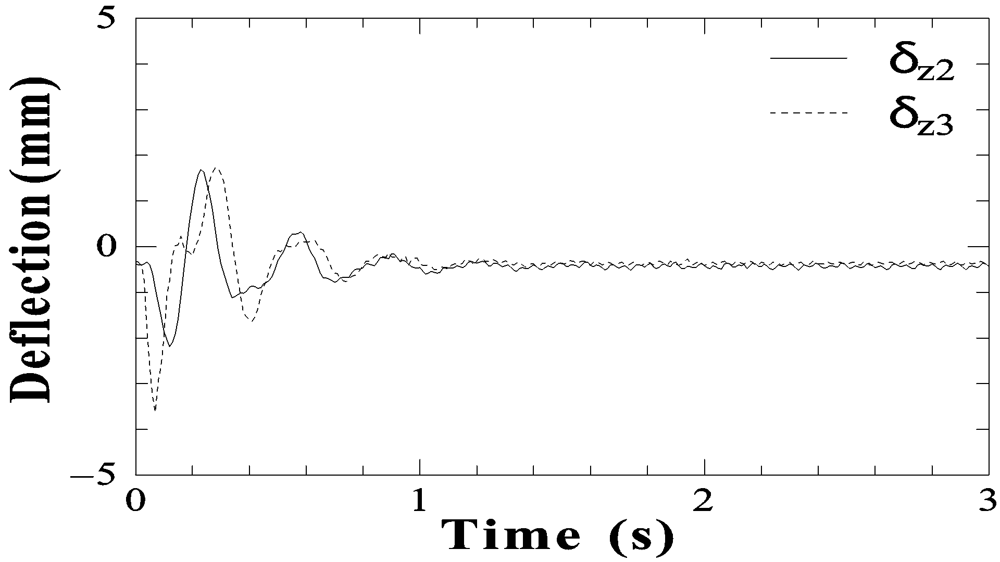

1. 論文原稿の執筆

第11回横幹連合コンファレンス

2020.10.8-9　統計数理研究所

**Abstract－** This document describes information for authors such as paper submission and the style of manuscript. PDF or WORD manuscripts are acceptable. The manuscripts should be sent to the session organizer. This document is a template file for a paper, although it is not necessary to strictly follow this format.

**Index terms－** Paper submission, style of manuscript, transdisciplinary studies, converging technology

Fig. 1: A sample figure.

第11回横幹連合コンファレンスサンプル原稿

○横幹　太郎（横幹大学）　横幹　花子（横幹大学）

**The Sample of Manuscript for 10th Transdisciplinary Federation of Science and Technology Conference**

\* T. Okan (Okan University), H. Okan (Okan University)

第11回横幹連合コンファレンスでは，論文原稿をPDFファイルでご用意いただき，各講演者から横幹連合のウェブサイトに直接アップロードしていただきます． 提出期限は，横幹コンファレンスホームページ1)でご確認ください．使用言語は日本語または英語です．

1. テンプレートファイルのダウンロード

第11回横幹連合コンファレンスのホームページ1) からテンプレートファイルをダウンロードすることが可能です．pLaTeX2.09またはpLaTeX2eを使用される場合は，conf2020.styとsample2020.texとfig1.psの3つのファイルをダウンロードしてください．sample2020.texはpLaTeX2eとpLaTeX2.09のどちらでもコンパイルすることができます．pLaTeXの場合は，ご使用の環境に応じて適切な漢字コード（Shift JISかEUC）のファイルをご利用ください．Microsoft Wordを使用される場合は，sample2020.docxをダウンロードし，原稿を作成してください．それ以外のワードプロセッサをご使用の方は，sample20120.pdfをダウンロードし，原稿の体裁がなるべくサンプルと近くなるよう原稿を作成ください．

1. 原稿の体裁

原稿はA4判で，ページ数の上限は原則8ページです．偶数ページ，奇数ページのいずれも可能です．お送りいただくファイルサイズがおよそ3MBを越える場合には学会事務局にご相談ください．

* 1. 全体の体裁

A4用紙の（US Letterは不可），縦250 mm，横170 mmの枠内に収まるようにしてください．余白は，上20 mm，下27 mm，左20 mm，右20 mmとします．活字の大きさは，日本語タイトル16ポイント，著者名，英文タイトルと著者名12ポイント，章タイトル11ポイント，節タイトル10ポイント，本文の活字10ポイントを目安としてください．原稿は，

* 和文講演題目
* 和文著者名（登壇者に○印）と著者所属
* 英文講演題目
* 英文著者名（登壇者に\*印）と英文著者所属
* 英文アブストラクト（150ワード程度まで）
* Index terms（英語）最大５つ
* 本文，参考文献

の順に書いてください．Index termsまでを1段組，本文・参考文献を2段組にしてください．ページ番号やフッタは記入しないでください．

* 1. 図と表

図と表は，Fig. 1，Table 1のように番号を振り，Fig. 1に示すとおり，図説，図中の説明文は，文字の大きさに配慮し英文で記入してください．本文で引用する場合はFig. 1とTable 1としてください．PDF原稿を作成する際，図の画質が落ちないよう注意してください．Microsoft Wordなどで原稿を作成する際，画像を貼る場合は画質の良い（圧縮率の低い）画像を用いるか，圧縮されていない画像フォーマットを用いてください．JPEG画像を貼るのは避けてください．

* 1. 参考文献の引用

文献の引用は本文中に1) のように書き，本文の最後にまとめて記述します．次のフォーマットを推奨します．

(a) 雑誌論文の場合1)

番号) 著者, 論文題目, 雑誌名, 巻（太字）-号, 始ページ/終ページ （年）

(b) 単行本の場合2)

番号) 著者, 書名, 始ページ/終ページ, 発行所, （発行年）

1. まとめ

最後にまとめとして，この論文で主張したいこと，論じていることを述べてください．読者にわかりやすく記述してくださいますようお願い申し上げます．

参考文献

1. https://www.trafst.jp/conf2020/
2. 横幹太郎, 横幹花子, 第11回横幹連合コンファレンスサンプル原稿, 第11回横幹連合コンファレンス予稿集, 1/4 (2020)