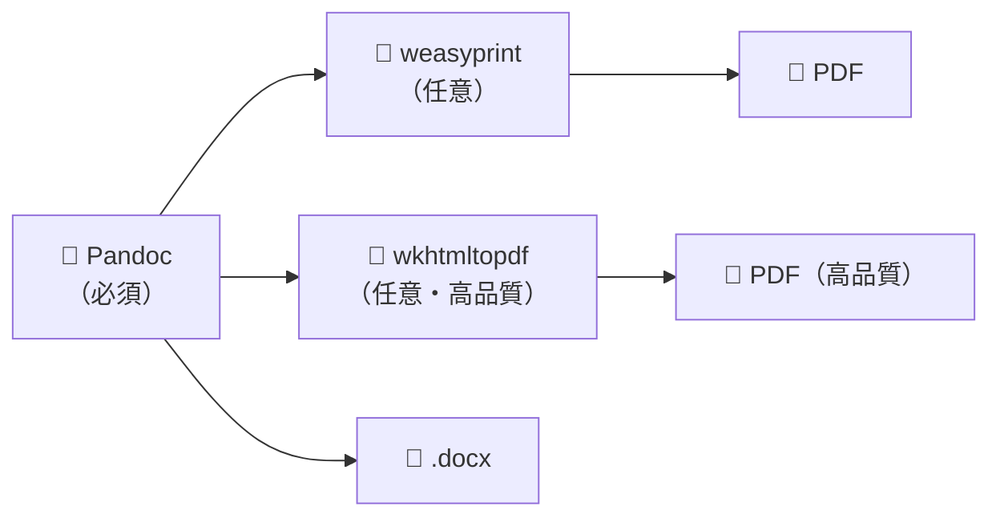
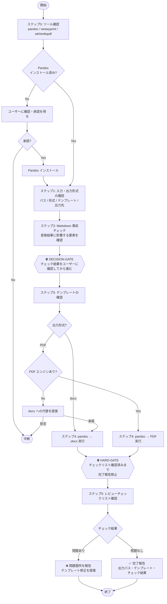

# Markdown → Office 変換

## 概要

Pandoc を使って Markdown ファイルを Word (.docx) または PDF に変換するスキル。変換前に入力内容の事前チェックを行い、変換後はレビューチェックリストで出力を確認してからユーザーに報告する。

## いつ使うか

**使う場合:**
- `.md` ファイルを Word (.docx) や PDF に変換したい
- 社内作成の Markdown 文書を外部提出用 Office 形式に変換したい
- テンプレートを使って書式を整えた Word 文書を作成したい

**使わない場合:**
- すでに Word / PDF 形式の場合（変換不要）
- Markdown を直接閲覧・編集する場合（変換不要）
- Office → Markdown 方向の変換が目的の場合（office-to-markdown スキルを使う）

## ツール構成



| インストール済みツール | 利用可能な出力形式 |
|----------------------|-----------------|
| Pandoc のみ | docx のみ |
| Pandoc + weasyprint | docx, PDF |
| Pandoc + wkhtmltopdf | docx, PDF（高品質） |

## ワークフロー



## 手順

### ステップ 0: ツール存在確認

変換を開始する前に、以下のコマンドで必要なツールがインストールされているか確認する。

> **Note:** 以下は Bash (Git Bash / WSL / macOS / Linux) コマンドです。PowerShell で手動実行する場合は `/dev/null` を `$null`、`2>&1` を `2>&1` のまま維持しつつ `>` の前後に注意してください。

```bash
# Pandoc（必須）
pandoc --version > /dev/null 2>&1 \
  && echo "✅ Pandoc: OK" \
  || echo "❌ Pandoc: 未インストール"

# weasyprint（PDF 出力が必要な場合）
python -c "import weasyprint; print('✅ weasyprint: OK')" 2>/dev/null \
  || echo "❌ weasyprint: 未インストール（PDF 出力で必要）"

# wkhtmltopdf（高品質 PDF の場合）
wkhtmltopdf --version > /dev/null 2>&1 \
  && echo "✅ wkhtmltopdf: OK" \
  || echo "❌ wkhtmltopdf: 未インストール（高品質 PDF 出力で必要）"
```

Pandoc が未インストールの場合はユーザーに確認し、承認を得てからインストールする：

```bash
# Windows
winget install JohnMacFarlane.Pandoc

# macOS
brew install pandoc

# Linux (Debian/Ubuntu)
sudo apt-get install pandoc
```

### ステップ 1: 入力と出力形式の確認

ユーザーから受け取った情報を確認する：

- 入力 Markdown ファイルのパス
- 出力形式（`docx` または `pdf`）
- スタイルテンプレート（社内テンプレート `.docx` の指定があれば使用）
- 出力先ディレクトリ（指定がなければ入力ファイルと同じ場所）

### ステップ 2: Markdown の事前チェック

<DECISION-GATE>
変換前に入力 Markdown を確認し、Pandoc が正しく処理できない可能性のある要素をユーザーに報告する。
確認を取らずに変換を開始してはならない。
</DECISION-GATE>

以下の要素が含まれる場合は変換結果への影響をユーザーに事前に伝える：

| Markdown の要素 | Word/PDF での変換結果 |
|----------------|---------------------|
| コードブロック (` ``` `) | 等幅フォントのテキストブロックになる（テンプレート依存） |
| Mermaid / DOT 図 | **変換されない**。画像に変換済みの場合のみ埋め込み可能 |
| 画像参照 `` | 参照先ファイルが存在する場合のみ埋め込まれる |
| 数式 (`$...$`) | LaTeX 環境がない場合はプレーンテキストになる |
| 日本語テキスト | フォント設定によっては文字化けの可能性あり（テンプレートで対応） |

### ステップ 3: テンプレートの確認

社内テンプレート（`.docx`）が指定されていない場合、以下を提案する：

```bash
# Pandoc のデフォルトテンプレートを取得して社内スタイルに編集
pandoc -o company-template.docx --print-default-data-file reference.docx
# → company-template.docx を Word で開いてフォント・スタイル・ヘッダー/フッターを編集後、
#   次回から --reference-doc=company-template.docx として使用する
```

テンプレートなしで変換すると Pandoc のデフォルトスタイルが適用されることをユーザーに伝える。

### ステップ 4: 変換実行

**Word (.docx) の場合：**

```bash
# テンプレートなし
pandoc <入力.md> -o <出力.docx>

# 社内テンプレートあり（推奨）
pandoc <入力.md> --reference-doc=<テンプレート.docx> -o <出力.docx>

# 例
pandoc "品質改善 施策検討.md" --reference-doc=company-template.docx -o "品質改善 施策検討_提出用.docx"
```

**PDF の場合：**

```bash
# weasyprint を使用
pandoc <入力.md> -o <出力.pdf> --pdf-engine=weasyprint

# wkhtmltopdf を使用（より高品質）
pandoc <入力.md> -o <出力.pdf> --pdf-engine=wkhtmltopdf

# 例
pandoc "品質改善 施策検討.md" -o "品質改善 施策検討_提出用.pdf" --pdf-engine=weasyprint
```

### ステップ 5: 変換後のレビューチェックリスト

<HARD-GATE>
変換が完了しても、以下のチェックリストを確認してユーザーに報告するまで
「変換完了」とユーザーに報告してはならない。
</HARD-GATE>

変換が完了したら以下を確認してユーザーに報告する：

- [ ] 見出しのスタイルが正しく適用されているか（見出し1/2/3）
- [ ] 表が正しく描画されているか（列の幅・罫線）
- [ ] 箇条書き・番号付きリストが崩れていないか
- [ ] コードブロックが可読な形式で出力されているか
- [ ] 画像が正しく埋め込まれているか
- [ ] 日本語テキストが文字化けしていないか
- [ ] ページ番号・ヘッダー/フッターが要件通りか（テンプレート依存）

| 結果 | 対応 |
|------|------|
| **問題あり** | 問題箇所を具体的に指摘し、テンプレートの修正または Markdown の修正を提案する |
| **問題なし** | 変換完了を報告し、出力ファイルのパス・使用したテンプレート・チェック結果を伝える。提出先の要件（フォント・余白・ページ設定等）がある場合はテンプレート調整が必要なことも案内する |

## よくある間違い

| 間違い | 正しい対応 |
|--------|-----------|
| ツール確認を省略して変換を試みる | ステップ0を必ず実行し、利用可能な出力形式を特定してから進む |
| 事前チェックなしに変換を開始する | DECISION-GATE を必ず通過し、変換結果に影響する要素をユーザーに確認してから実行する |
| Mermaid / DOT 図をそのまま変換する | 変換前にユーザーへ影響を伝え、画像として事前変換するよう促す |
| チェックリストを確認せずに完了報告する | HARD-GATE を必ず通過し、チェックリスト結果を確認してから報告する |
| テンプレートなしで変換してデフォルトスタイルを返す | テンプレートの有無を必ずユーザーに確認し、未指定の場合はデフォルト適用である旨を伝える |
| PDF エンジンがないまま PDF 変換を実行しようとする | ステップ0で PDF エンジンの存在を確認し、ない場合は docx への代替を提案する |

## エラー時の対応

| エラー | 対応 |
|--------|------|
| ファイルが見つからない | パスを確認してユーザーに再入力を求める |
| Pandoc 未インストール | インストール手順を OS ごとに提示し、ユーザーの確認を得てから実行する |
| PDF エンジン未インストール（weasyprint） | `pip install weasyprint` を提案する。それも難しければ docx への変換を代替として提案する |
| PDF エンジン未インストール（wkhtmltopdf） | OS に応じたインストール方法（Windows: `winget install wkhtmltopdf`、macOS: `brew install wkhtmltopdf`、Linux: `apt-get install wkhtmltopdf`）を提案する。難しければ weasyprint または docx 変換を代替として提案する |
| 画像参照が壊れている | 参照先ファイルのパスを確認し、ユーザーに修正を求める |
| 日本語文字化け | テンプレートのフォント設定（游ゴシック・Noto Sans CJK 等）を確認するよう伝える |
| 出力ファイルが開けない | Word のバージョン互換性を確認し、必要に応じて `.doc` 形式での再変換を提案する |
