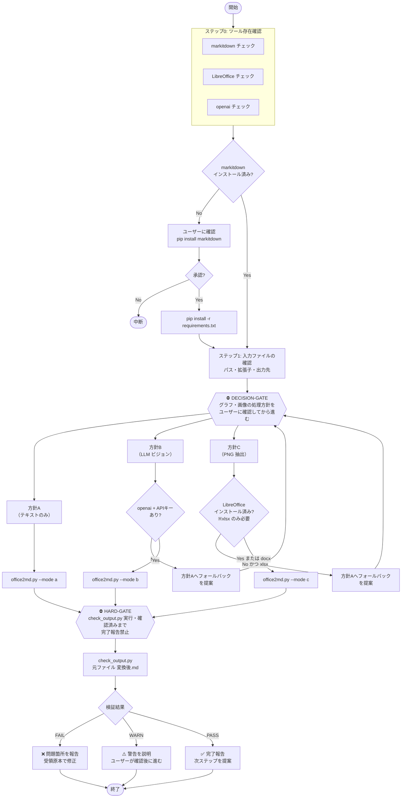

# Office → Markdown 変換

`scripts/office2md.py` を使って Word・Excel・PowerPoint・PDF などの Office ファイルを Markdown テキストに変換します。変換後は `scripts/check_output.py` で自動検証を実行し、結果をユーザーに報告します。

## ワークフロー



## ファイル構成

```
office-to-markdown/
  SKILL.md                    ← このファイル
  pyproject.toml              ← 依存パッケージ定義（uv で管理）
  .venv/                      ← 仮想環境（uv venv で生成、Git 管理外）
  scripts/
    office2md.py              ← 変換スクリプト（方針 A/B/C に対応）
    check_output.py           ← 変換後の自動検証スクリプト
    requirements.txt          ← pip 用の参照（uv 未使用環境向け）
  tests/
    test_check_output.py      ← 検証スクリプトのユニットテスト
```

## 手順

### ステップ 0: ツール存在確認

変換を開始する前に、以下のコマンドで必要なツールがインストールされているか確認する。

```bash
# markitdown（必須）
python -c "import markitdown; print('✅ markitdown: OK')" 2>/dev/null \
  || echo "❌ markitdown: 未インストール"

# LibreOffice（方針C で xlsx を処理する場合のみ必要）
libreoffice --version > /dev/null 2>&1 \
  && echo "✅ LibreOffice: OK" \
  || echo "❌ LibreOffice: 未インストール（方針C/xlsx で必要）"

# openai パッケージ（方針B で必要）
python -c "import openai; print('✅ openai package: OK')" 2>/dev/null \
  || echo "❌ openai: 未インストール（方針B で必要）"

# OPENAI_API_KEY 環境変数（方針B で必要）
python -c "
import os
key = os.environ.get('OPENAI_API_KEY', '')
if key:
    print(f'✅ OPENAI_API_KEY: 設定済み (sk-...{key[-4:]})')
else:
    print('❌ OPENAI_API_KEY: 未設定（方針B で必要）')
    print('   Windows:     \$env:OPENAI_API_KEY = \"sk-...\"')
    print('   macOS/Linux: export OPENAI_API_KEY=sk-...')
"
```

確認結果に基づいて、利用可能な方針をユーザーに伝える：

| 状態 | 利用可能な方針 |
|------|--------------|
| markitdown のみ OK | A のみ |
| markitdown + openai + OPENAI_API_KEY OK | A, B |
| markitdown + LibreOffice OK | A, C（xlsx 含む） |
| すべて OK | A, B, C |

markitdown が未インストールの場合はユーザーに確認し、承認を得てから仮想環境ごとセットアップする：

```bash
# 仮想環境の作成と依存パッケージのインストール（初回のみ）
uv venv --python 3.12
uv sync --group dev

# 以後はすべて uv run 経由で実行する（venv のアクティベート不要）
uv run python scripts/office2md.py --help
uv run pytest tests/ -v
```

方針 B（LLM ビジョン）を使う場合は `openai` を追加インストールする：

```bash
uv sync --extra mode-b
```

### ステップ 1: 入力の確認

ユーザーから受け取った情報を確認する：

- 入力ファイルのパスと拡張子
- 出力先（省略時は入力ファイルと同じ場所に `<元ファイル名>.md` を生成）

対応フォーマット: `.docx` `.xlsx` `.pptx` `.pdf` `.html` `.csv` `.json` `.xml` `.epub`

### ステップ 2: 処理方針の確認

<DECISION-GATE>
変換を実行する前に、ファイル内にグラフや画像が含まれる可能性をユーザーに伝え、
処理方針（A / B / C）を必ず確認する。
ステップ0の確認結果を踏まえ、利用可能な方針のみ提示する。
確認なしに変換を開始してはならない。
</DECISION-GATE>

| 方針 | 内容 | 追加要件 |
|------|------|---------|
| **A（デフォルト）** | テキスト・表のみ変換。グラフは空プレースホルダーになる。テキスト処理（要約・比較・レビュー）が目的であればこれで十分。 | なし |
| **B** | LLM ビジョンで画像を説明文（alt テキスト）に変換。PNG ファイルは生成されない。 | openai + API キー |
| **C** | 画像を PNG として抽出し `` として Markdown に埋め込む。Word は ZIP 抽出、Excel は LibreOffice でレンダリング。 | LibreOffice（xlsx の場合） |

方針 B/C を選択したが必要ツールがない場合は、方針 A へのフォールバックを提案して再確認する。

### ステップ 3: 変換実行

```bash
# 方針 A（テキストのみ）
python scripts/office2md.py <入力ファイル>
python scripts/office2md.py <入力ファイル> -o <出力.md>

# 方針 B（LLM ビジョン）
python scripts/office2md.py <入力ファイル> --mode b

# 方針 C（PNG 抽出）
python scripts/office2md.py <入力ファイル> --mode c --images-dir assets/images
```

### ステップ 4: 自動検証

<HARD-GATE>
変換が完了しても、check_output.py を実行して検証レポートを確認するまで
「変換完了」とユーザーに報告してはならない。
</HARD-GATE>

```bash
python scripts/check_output.py <元ファイル> <変換後.md>
```

| チェック項目 | 検出できる問題 |
|-------------|--------------|
| 文字数チェック | 元ファイルに対して出力が極端に短い場合を検出 |
| 見出し構造チェック | 見出し（#, ##, ###）が1件もない場合を警告 |
| テーブルチェック | テーブルが1件もない場合を警告 |
| 画像プレースホルダーチェック | 空の `` の件数を報告（方針 B/C への変更を提案） |
| 識別子チェック | IF-001 等の識別子パターンの有無を確認 |
| 見出し数比較（.docx のみ） | 元ファイルと変換後の見出し数を比較し、70% 未満なら FAIL |
| テーブル数比較（.docx のみ） | 元ファイルと変換後のテーブル数を比較 |

### ステップ 5: 検証結果の報告

| 結果 | 対応 |
|------|------|
| **FAIL が 1 件以上** | 問題箇所を具体的に指摘し、受領原本を正本として Markdown の修正を促す |
| **WARN のみ** | 警告の内容を説明し、問題なければそのまま進めてよいかユーザーに確認する |
| **すべて PASS** | 変換完了を報告し、次のステップ（要約・比較・レビュー等）を提案する |

## エラー時の対応

| エラー | 対応 |
|--------|------|
| ファイルが見つからない | パスを確認してユーザーに再入力を求める |
| 対応していない形式 | 対応フォーマット一覧を提示する |
| `markitdown` 未インストール | ユーザーの承認を得て `pip install -r scripts/requirements.txt` を実行する |
| `libreoffice` 未インストール | 方針 C（xlsx）の場合のみ。方針 A へのフォールバックを提案する |
| `OPENAI_API_KEY` 未設定 | 方針 B の場合のみ。設定方法（`export OPENAI_API_KEY=sk-...` / `$env:OPENAI_API_KEY="sk-..."`）を案内し、方針 A へのフォールバックも提案する |
| check_output.py が FAIL を返す | 受領原本を確認するようユーザーに伝え、Markdown を修正する |
