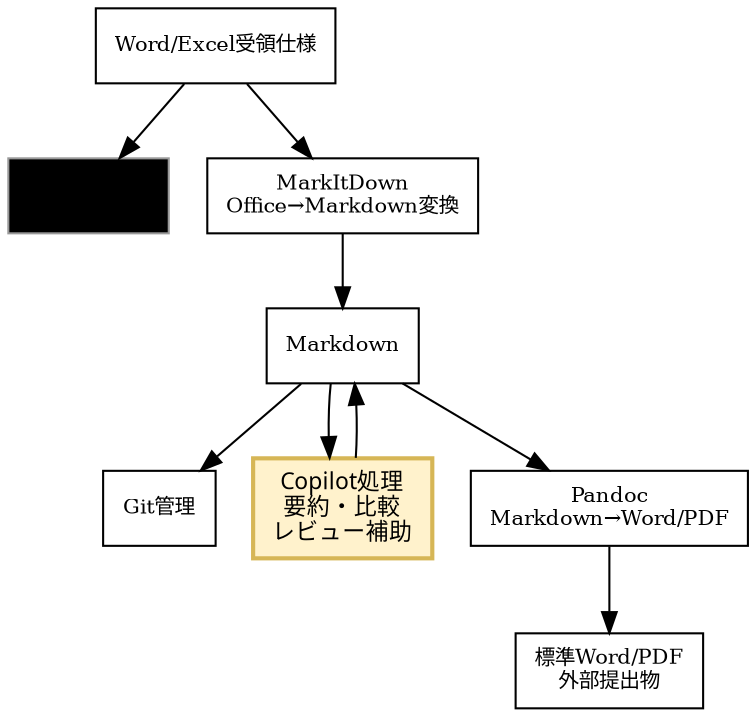
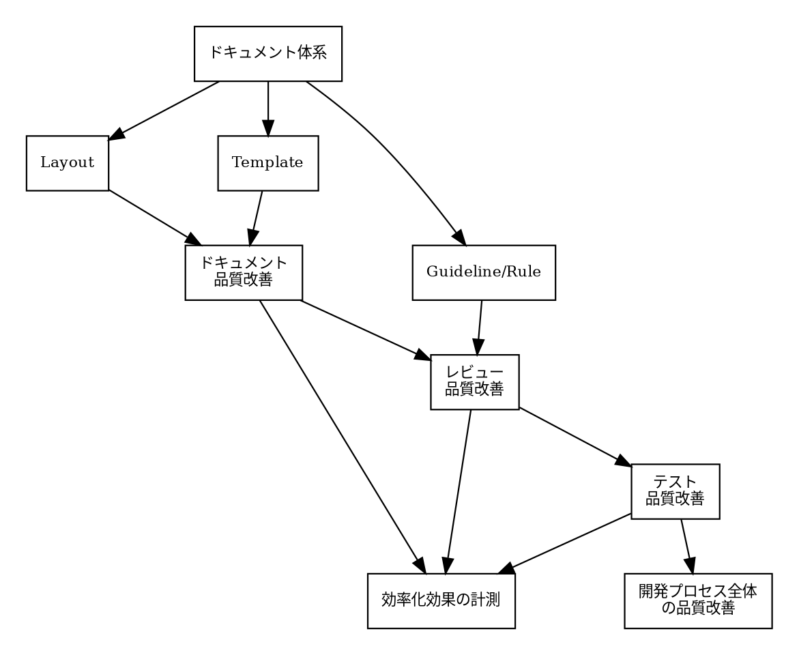
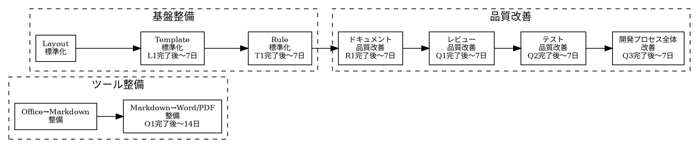

# 品質改善 施策検討

## 1. 背景

品質改善施策の進め方について、実施順序と前提を整理する。
効率化の観点も並行して検討し、品質と効率化を両立させる施策体系を構築する。

## 2. 現時点の方針案

- 品質改善はドキュメント体系を基盤として進める。
- ドキュメント体系は以下の3要素で構成する。
  - Layout: フォルダ・ファイルの配置
  - Template: 各文書の雛形
  - Guideline/Rule: 記述と運用の基準
- 優先順位は以下の順で進める。
  1. Layout
  2. Template
  3. Rule
- 上記に先行する前提整備として、変換ツールの整備を先行実施する。
  1. Office→Markdown 変換（MarkItDown）
  2. Markdown→Word/PDF 変換（Pandoc）
- 品質改善全体の施策順は以下が妥当。
  1. ドキュメント品質改善
  2. レビュー品質改善
  3. テスト品質改善
  4. 開発プロセス全体の品質改善
- 各施策に対し、**効率化の効果**を補足的に測定・記録する（Copilot活用による作業工数削減の可視化）。

## 3. 進め方の意図

- 先に配置と正本を固定することで、参照先の揺れを防ぐ。
- 次に雛形を固定し、文書の粒度と抜け漏れを抑える。
- 最後に運用ルールを明文化し、レビュー/テスト/開発プロセスに横展開する。
- 各施策の完了基準として、**品質指標の改善**と**効率化指標の削減**の両方を定義する。

## 3.1 仕様書運用方針（Copilot活用前提）

- Word/Excel形式の受領仕様（IF仕様を含む）は受領原本を正本として扱う。
- 受領仕様は、AI Agent Skillを活用してMarkdownへ変換し、要約・比較・レビュー補助などの内部活用に用いる。
- 内部で新規作成する仕様・手順文書はMarkdownを正本として管理する。
- 外部提出時は、提出先要件に応じて受領正本またはMarkdown由来の提出物を使い分ける。
- 受領正本とMarkdown変換物で差異が出た場合は、受領正本を優先し、Markdown側を更新する。
- 上記運用の前提として、以下のツール整備を必須とする。
  1. Word/Excel形式→Markdown形式の変換機能
  2. Markdown形式→Word/Excel形式の変換機能

### ツール・データフロー概要

## 3.2 方針のメリット

- 正本の信頼性維持: 受領仕様を正本として保持することで、対外契約・合意の根拠を維持できる。
- 活用性の向上: 受領仕様をMarkdown化することで、検索・比較・要約・レビュー補助に活用しやすくなる。
- 受領仕様の再利用性向上: Word/Excel受領物を内部で再利用しやすい構造に変換できる。
- Copilot活用の最大化: 要約、比較、レビュー補助、観点抽出を同一形式で実行できる。
- 提出作業の標準化: 提出フォーマット変換を定型化し、体裁調整の手戻りを減らす。
- 監査性の向上: 受領原本、変換結果、レビュー記録、提出物の対応関係を残しやすい。

## 3.3 実務ルール（最小運用）

1. 原本保全: 受領したWord/Excelは編集せず保管し、受領仕様正本として明示する。
2. 正本定義: 受領仕様は受領原本を正本とし、内部作成文書はMarkdownを正本とする。
3. 変換手順: 受領仕様のOffice→Markdown変換時は実行ログを保存する。
4. 変換後レビュー: 見出し階層、表崩れ、IF項目欠落、版数・改訂履歴を確認する。
5. 差異解消: 受領正本とMarkdown変換物の差異は、受領正本を基準にMarkdownを修正する。
6. 提出物生成: 外部提出用Word/Excelは提出要件に合わせ、受領正本またはMarkdown由来の成果物を選定する。
7. 識別子運用: IF仕様の項目ID（例: IF-001）をMarkdown上で維持し、受領物・提出物と突合可能にする。
8. 月次棚卸し: 変換失敗事例とレビュー指摘を月次で集計し、ルールを更新する。
9. ツール整備: Office→Markdown、Markdown→Officeの両変換ツールを整備し、担当者・実行手順・障害時の代替手順を定義する。
   （Office→Markdown: MarkItDown、Markdown→Word/PDF: Pandoc を想定）

## 4. 関係図（Graphviz DOT）

## 5. 実施順序

ツール整備（変更）と基盤整備は同時に開始し、進捗をそろえて後続フェーズへ接続する。

## 6. 各タスクの実施内容（案）

### 6.1 ドキュメント品質改善

#### 目的

正本と参照先を固定し、情報探索コストを下げながらドキュメント品質を高める。

#### 実施内容

- 正本ドキュメントの確定（重複文書の統合、参照元の一本化）
- 章立て・粒度の標準化（Template適用）
- 主要文書の更新責任者の明確化
- 参照先の一本化による情報探索時間削減

#### 成果物

- 正本一覧（どの文書が正本かを明記）
- 主要文書のTemplate適用版
- 文書別オーナー一覧

#### Copilot活用ポイント

- **テンプレート初稿生成:** 既存構造を渡してCopilotに草案生成を依頼
  - 効率化効果: テンプレート作成時間の削減
- **レビュー補助:** 既存ドキュメントをCopilotに渡し、抜け漏れ・曖昧表現を指摘
  - 効率化効果: 人手レビュー時間の削減

#### 指標

| 指標                     | Before             | After目標                         | 計測方法                         |
| ------------------------ | ------------------ | --------------------------------- | -------------------------------- |
| ドキュメント抜け漏れ件数 | 人手レビューで計上 | Copilotレビュー後の残存件数を削減 | レビュー時の指摘件数を記録       |
| 情報探索時間             | TBD（初回計測）    | Before比 30% 削減                 | 作業ログから参照先調査時間を抽出 |
| テンプレート作成時間     | TBD（初回計測）    | Before比 40% 削減                 | Copilot活用前後の作業時間を比較  |

---

### 6.2 レビュー品質改善

#### 目的

レビュー観点の抜け漏れを減らし、検出率を上げながらレビュー準備工数を削減する。

#### 実施内容

- レビュー観点チェックリストの整備
- 変更種別ごとのレビュー必須項目の定義
- 指摘分類（仕様/実装/テスト/ドキュメント）の統一
- チェックリストによるレビュー準備工数の削減

#### 成果物

- レビューチェックリスト
- 指摘分類ルール
- 月次の指摘傾向サマリ

#### Copilot活用ポイント

- **観点補完補助:** チェックリスト整備後、レビュー対象の差分をCopilotに渡し、見落としがちな観点を補完
  - 効率化効果: 観点洗い出し時間の削減
  - （現時点ではスコープ外。チェックリスト整備完了後に導入を検討）

#### 指標

| 指標                 | Before          | After目標         | 計測方法                                                       |
| -------------------- | --------------- | ----------------- | -------------------------------------------------------------- |
| レビュー検出漏れ件数 | TBD（初回計測） | Before比削減      | 後工程での不具合起票時に「レビュー見落とし」タグを付与して計上 |
| レビュー所要時間     | TBD（初回計測） | Before比 20% 削減 | 作業ログからレビュー時間を抽出                                 |
| レビュー準備工数     | TBD（初回計測） | Before比 15% 削減 | チェックリスト適用前後で計測                                   |

---

### 6.3 テスト品質改善

#### 目的

重要機能の回帰防止とテスト設計の再現性向上を図りながら、テスト観点・ケース作成の工数を削減する。

#### 実施内容

- リスクベースで対象機能を優先付け
- テスト観点・ケースの標準フォーマット化
- 不具合起点の回帰テスト追加運用
- Copilot活用による観点洗い出し・ケース作成の効率化

#### 成果物

- 優先対象機能リスト
- テスト観点テンプレート
- 回帰テスト追加履歴

#### Copilot活用ポイント

- **観点洗い出し補助:** 仕様・実装をCopilotに渡し、テスト観点を列挙
  - 効率化効果: 観点洗い出し時間の削減
- **テストケース初稿生成:** 観点一覧から具体的なテストケースへの展開をCopilotに依頼
  - 効率化効果: テストケース作成時間の短縮

#### 指標

| 指標                                | Before          | After目標                 | 計測方法                    |
| ----------------------------------- | --------------- | ------------------------- | --------------------------- |
| 人手で列挙したテスト観点数          | TBD（初回計測） | 基準値として記録          | テスト設計時に観点数を記録  |
| Copilot補助後の観点数・人手との差分 | —              | 人手比 20% 以上の観点追加 | Copilot出力と人手結果を照合 |
| テストケース作成時間                | TBD（初回計測） | Before比 30% 削減         | 作業ログから計測            |

---

### 6.4 開発プロセス全体の品質改善

#### 目的

施策を単発で終わらせず、継続改善サイクルを定着させる。

#### 実施内容

- KPI/Exit Criteriaの定義と可視化
- 定例での課題棚卸しと優先度見直し
- 改善施策の実施結果レビュー（継続/中止/再設計の判断）
- 品質と効率化の指標を定例で共有・トレンド分析

#### 成果物

- 品質KPIダッシュボード定義
- 改善施策レビュー記録
- 次期改善ロードマップ

#### 指標

| 指標       | Before          | After目標          | 計測方法                             |
| ---------- | --------------- | ------------------ | ------------------------------------ |
| 施策完了率 | TBD（初回計測） | 80% 以上           | 月次レビュー時に進捗を計上           |
| KPI達成度  | TBD（初回計測） | 各施策の目標値達成 | 各セクション（6.1～6.3）の指標で計測 |

---

## 8. 課題バックログ運用（後工程対応ルール）

- 方針: 各工程で見つかった課題は、その場で取りこぼさず一覧化し、優先順位を付けて後工程で計画対応する。
- 最小運用フロー:

  1. 課題起票: 発見時に課題ID、発見工程、概要、影響範囲を記録する。
  2. 初期分類: 種別（仕様/実装/テスト/運用/文書）と緊急度を付与する。
  3. 優先順位付け: 影響度（Impact）× 緊急度（Urgency）で High/Mid/Low を決める。
  4. 対応割当: どの工程で対応するか（当工程/次工程/保留）を決め、担当者と期限を設定する。
  5. 定例見直し: 週次またはスプリント単位で優先度を再評価する。
- 優先度判定の目安:

  - High: 品質事故や運用停止につながる可能性が高い。次工程開始前に対処。
  - Mid: 品質低下の蓄積リスクがある。次工程内で計画対処。
  - Low: 影響が局所的。バックログに残し、定期棚卸しで再評価。

## 9. 未確定事項

- 初期適用範囲（全体一括 / パイロット対象）
- 各段階の完了条件（KPI・Exit Criteria）
- 推進体制（オーナー・レビュー責任者）

